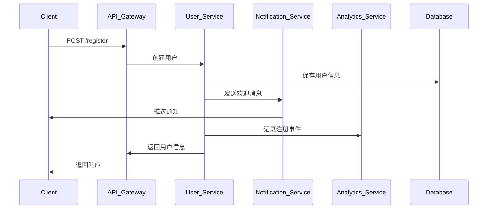
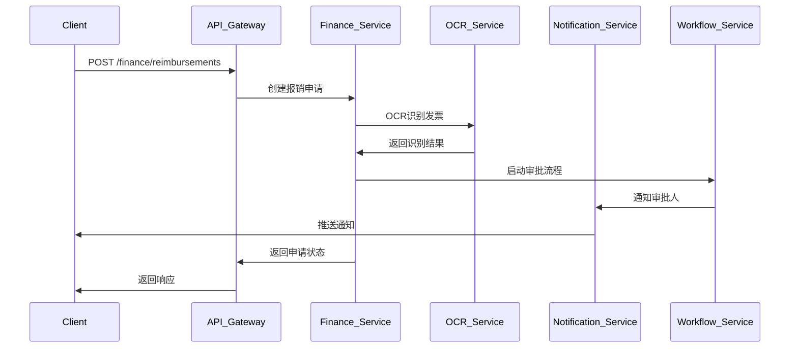

# API端点和服务边界设计文档

## 🎯 服务边界定义

### 核心业务服务 (Core Business Services)

#### 1. 用户管理服务 (User Management Service)
**职责**: 处理用户注册、认证、权限管理
**边界**:
- 用户账户生命周期管理
- 身份认证和授权
- 角色权限分配
- 用户画像管理

**API端点设计**:
```javascript
// 基础路径: /api/v1/users
{
  // 认证相关
  "POST   /auth/login":           "用户登录",
  "POST   /auth/logout":          "用户登出",
  "POST   /auth/refresh":         "刷新Token",
  "POST   /auth/register":        "用户注册",

  // 用户管理
  "GET    /":                     "获取用户列表",
  "GET    /:id":                  "获取用户详情",
  "PUT    /:id":                  "更新用户信息",
  "DELETE /:id":                  "删除用户",
  "POST   /:id/avatar":           "上传用户头像",

  // 权限管理
  "GET    /:id/permissions":      "获取用户权限",
  "PUT    /:id/permissions":      "更新用户权限",
  "POST   /:id/roles":            "分配角色",

  // 画像管理
  "GET    /:id/profile":          "获取用户画像",
  "PUT    /:id/profile":          "更新用户画像"
}
```

#### 2. 村庄管理服务 (Village Management Service)
**职责**: 村庄信息管理、地理位置服务
**边界**:
- 村庄基础信息维护
- 地理位置数据管理
- 村庄统计数据
- 村务公开信息

**API端点设计**:
```javascript
// 基础路径: /api/v1/villages
{
  // 村庄基础管理
  "GET    /":                     "获取村庄列表",
  "POST   /":                     "创建村庄",
  "GET    /:id":                  "获取村庄详情",
  "PUT    /:id":                  "更新村庄信息",
  "DELETE /:id":                  "删除村庄",

  // 地理信息
  "GET    /:id/map":              "获取村庄地图",
  "PUT    /:id/boundary":         "更新村庄边界",
  "GET    /:id/locations":        "获取村庄内位置点",
  "POST   /:id/locations":        "添加位置点",

  // 统计数据
  "GET    /:id/statistics":       "获取村庄统计",
  "GET    /:id/demographics":     "获取人口统计",

  // 村务公开
  "GET    /:id/announcements":    "获取村务公告",
  "POST   /:id/announcements":    "发布公告",
  "PUT    /:id/announcements/:aid": "更新公告"
}
```

#### 3. 家庭管理服务 (Household Management Service)
**职责**: "一户一码"系统、家庭关系管理
**边界**:
- 家庭档案管理
- 一户一码生成和管理
- 家庭成员关系追踪
- 家庭标签管理

**API端点设计**:
```javascript
// 基础路径: /api/v1/households
{
  // 家庭基础管理
  "GET    /":                     "获取家庭列表",
  "POST   /":                     "创建家庭",
  "GET    /:id":                  "获取家庭详情",
  "PUT    /:id":                  "更新家庭信息",
  "DELETE /:id":                  "删除家庭",

  // 一户一码系统
  "GET    /:id/qrcode":           "获取家庭二维码",
  "POST   /:id/qrcode/refresh":   "刷新二维码",
  "GET    /qrcode/:code":         "通过二维码获取家庭信息",
  "POST   /qrcode/scan":          "扫描二维码记录",

  // 家庭成员
  "GET    /:id/members":          "获取家庭成员",
  "POST   /:id/members":          "添加家庭成员",
  "PUT    /:id/members/:mid":     "更新成员信息",
  "DELETE /:id/members/:mid":     "移除家庭成员",

  // 家庭关系
  "GET    /:id/relationships":    "获取家庭关系图",
  "POST   /:id/relationships":    "添加家庭关系",
  "PUT    /:id/relationships/:rid": "更新家庭关系",

  // 家庭标签
  "GET    /:id/tags":             "获取家庭标签",
  "POST   /:id/tags":             "添加家庭标签",
  "DELETE /:id/tags/:tid":        "删除家庭标签"
}
```

#### 4. 财务管理服务 (Finance Management Service)
**职责**: 财务收支管理、预算控制、审计
**边界**:
- 财务交易记录
- 预算编制和执行
- 报销审批流程
- 财务报表生成

**API端点设计**:
```javascript
// 基础路径: /api/v1/finance
{
  // 交易管理
  "GET    /transactions":         "获取交易记录",
  "POST   /transactions":         "创建交易记录",
  "GET    /transactions/:id":     "获取交易详情",
  "PUT    /transactions/:id":     "更新交易记录",
  "DELETE /transactions/:id":     "删除交易记录",

  // 预算管理
  "GET    /budgets":              "获取预算列表",
  "POST   /budgets":              "创建预算",
  "GET    /budgets/:id":          "获取预算详情",
  "PUT    /budgets/:id":          "更新预算",
  "POST   /budgets/:id/execute":  "执行预算",

  // 报销审批
  "GET    /reimbursements":       "获取报销申请",
  "POST   /reimbursements":       "提交报销申请",
  "PUT    /reimbursements/:id/approve": "审批报销",
  "PUT    /reimbursements/:id/reject": "驳回报销",

  // 发票管理
  "POST   /invoices/ocr":         "OCR识别发票",
  "GET    /invoices":             "获取发票列表",
  "POST   /invoices":             "录入发票",
  "PUT    /invoices/:id":         "更新发票信息",

  // 财务报表
  "GET    /reports/monthly":      "月度财务报表",
  "GET    /reports/quarterly":    "季度财务报表",
  "GET    /reports/yearly":       "年度财务报表",
  "GET    /reports/summary":      "财务汇总报表"
}
```

#### 5. 应急管理服务 (Emergency Management Service)
**职责**: 应急事件处理、广播通知
**边界**:
- 应急事件上报和处理
- 紧急广播系统
- 应急资源管理
- 应急响应协调

**API端点设计**:
```javascript
// 基础路径: /api/v1/emergency
{
  // 应急事件
  "GET    /events":               "获取应急事件列表",
  "POST   /events":               "上报应急事件",
  "GET    /events/:id":           "获取事件详情",
  "PUT    /events/:id":           "更新事件状态",
  "POST   /events/:id/respond":   "响应应急事件",

  // 紧急广播
  "GET    /broadcasts":           "获取广播列表",
  "POST   /broadcasts":           "发送紧急广播",
  "GET    /broadcasts/:id":       "获取广播详情",
  "PUT    /broadcasts/:id/status": "更新广播状态",

  // 应急资源
  "GET    /resources":            "获取应急资源",
  "POST   /resources":            "添加应急资源",
  "PUT    /resources/:id":        "更新资源状态",
  "GET    /resources/map":        "获取资源分布地图",

  // 应急响应
  "GET    /responses":            "获取响应记录",
  "POST   /events/:id/responses": "提交响应方案",
  "PUT    /responses/:id":        "更新响应状态",

  // 应急联系人
  "GET    /contacts":             "获取应急联系人",
  "POST   /contacts":             "添加应急联系人",
  "PUT    /contacts/:id":         "更新联系人信息"
}
```

#### 6. 农业生产服务 (Agriculture Service)
**职责**: 农产品管理、生产记录、供需对接
**边界**:
- 农产品信息管理
- 农业生产记录
- 供需信息发布
- 农业技术咨询

**API端点设计**:
```javascript
// 基础路径: /api/v1/agriculture
{
  // 农产品管理
  "GET    /products":             "获取农产品列表",
  "POST   /products":             "添加农产品",
  "GET    /products/:id":         "获取产品详情",
  "PUT    /products/:id":         "更新产品信息",
  "DELETE /products/:id":         "删除产品",

  // 生产记录
  "GET    /records":              "获取生产记录",
  "POST   /records":              "添加生产记录",
  "GET    /records/:id":          "获取记录详情",
  "PUT    /records/:id":          "更新生产记录",

  // 供需信息
  "GET    /supply":               "获取供应信息",
  "POST   /supply":               "发布供应信息",
  "GET    /demand":               "获取需求信息",
  "POST   /demand":               "发布需求信息",
  "PUT    /supply/:id/match":     "供需匹配",

  // 农技咨询
  "GET    /consultations":        "获取咨询列表",
  "POST   /consultations":        "提交咨询",
  "GET    /consultations/:id":    "获取咨询详情",
  "POST   /consultations/:id/answer": "回答咨询",

  // 订单管理
  "GET    /orders":               "获取订单列表",
  "POST   /orders":               "创建订单",
  "GET    /orders/:id":           "获取订单详情",
  "PUT    /orders/:id/status":    "更新订单状态"
}
```

### 平台支撑服务 (Platform Services)

#### 7. 通知服务 (Notification Service)
**职责**: 消息推送、通知管理
**边界**:
- 多渠道消息推送
- 通知模板管理
- 推送规则配置
- 消息历史记录

**API端点设计**:
```javascript
// 基础路径: /api/v1/notifications
{
  // 消息推送
  "POST   /send":                 "发送通知",
  "POST   /broadcast":            "广播消息",
  "POST   /schedule":             "定时推送",

  // 模板管理
  "GET    /templates":            "获取通知模板",
  "POST   /templates":            "创建通知模板",
  "PUT    /templates/:id":        "更新模板",

  // 推送记录
  "GET    /history":              "获取推送历史",
  "GET    /history/:id":          "获取推送详情",
  "GET    /history/:id/stats":    "获取推送统计",

  // 用户设置
  "GET    /settings":             "获取通知设置",
  "PUT    /settings":             "更新通知设置"
}
```

#### 8. 文件存储服务 (File Storage Service)
**职责**: 文件上传、存储、访问控制
**边界**:
- 文件上传下载
- 图片处理
- 文件权限控制
- 存储空间管理

**API端点设计**:
```javascript
// 基础路径: /api/v1/files
{
  // 文件操作
  "POST   /upload":               "上传文件",
  "GET    /:id":                  "下载文件",
  "DELETE /:id":                  "删除文件",
  "PUT    /:id":                  "更新文件信息",

  // 图片处理
  "POST   /image/resize":         "调整图片大小",
  "POST   /image/crop":           "裁剪图片",
  "POST   /image/watermark":      "添加水印",

  // 文件管理
  "GET    /":                     "获取文件列表",
  "GET    /folders":              "获取文件夹列表",
  "POST   /folders":              "创建文件夹",

  // 权限管理
  "GET    /:id/permissions":      "获取文件权限",
  "PUT    /:id/permissions":      "设置文件权限",
  "POST   /:id/share":            "分享文件"
}
```

#### 9. 实时计算服务 (Real-time Computing Service)
**职责**: 实时数据处理、流式计算
**边界**:
- 实时数据流处理
- 流式计算任务
- 实时指标计算
- 事件驱动处理

**API端点设计**:
```javascript
// 基础路径: /api/v1/realtime
{
  // 流处理
  "POST   /streams/create":       "创建数据流",
  "GET    /streams":              "获取数据流列表",
  "DELETE /streams/:id":          "删除数据流",

  // 实时计算
  "POST   /jobs/create":          "创建计算任务",
  "GET    /jobs":                 "获取任务列表",
  "PUT    /jobs/:id/start":       "启动任务",
  "PUT    /jobs/:id/stop":        "停止任务",

  // 指标查询
  "GET    /metrics":              "获取实时指标",
  "GET    /metrics/:name":        "获取特定指标",
  "POST   /metrics/subscribe":    "订阅指标变化",

  // 事件处理
  "POST   /events":               "发布事件",
  "GET    /events":               "获取事件流",
  "POST   /events/:id/process":   "处理事件"
}
```

#### 10. AI智能服务 (AI Intelligence Service)
**职责**: AI功能集成、智能分析
**边界**:
- 语音识别处理
- 人脸识别服务
- OCR文字识别
- 智能推荐算法

**API端点设计**:
```javascript
// 基础路径: /api/v1/ai
{
  // 语音识别
  "POST   /speech/recognize":     "语音识别",
  "POST   /speech/synthesize":    "语音合成",
  "GET    /speech/dialects":      "获取支持的方言",

  // 人脸识别
  "POST   /face/register":        "注册人脸",
  "POST   /face/verify":          "人脸验证",
  "POST   /face/detect":          "人脸检测",
  "DELETE /face/:id":             "删除人脸数据",

  // OCR识别
  "POST   /ocr/recognize":        "OCR文字识别",
  "POST   /ocr/invoice":          "发票OCR识别",
  "POST   /ocr/idcard":           "身份证OCR识别",

  // 智能推荐
  "GET    /recommendations":      "获取推荐列表",
  "POST   /recommendations/feedback": "推荐反馈",
  "GET    /recommendations/:type": "按类型获取推荐",

  // 智能分析
  "POST   /analyze/finance":      "财务智能分析",
  "POST   /analyze/agriculture":  "农业数据分析",
  "POST   /analyze/policy":       "政策匹配分析"
}
```

## 🔗 服务间通信设计

### 同步通信模式
```javascript
// 服务间调用示例
class ServiceClient {
  constructor(serviceName) {
    this.serviceName = serviceName;
    this.baseUrl = process.env[`SERVICE_${serviceName.toUpperCase()}_URL`];
  }

  async request(endpoint, options = {}) {
    const url = `${this.baseUrl}${endpoint}`;
    const response = await fetch(url, {
      ...options,
      headers: {
        'Content-Type': 'application/json',
        'X-Service-Auth': process.env.SERVICE_AUTH_TOKEN,
        ...options.headers
      }
    });

    if (!response.ok) {
      throw new Error(`Service ${this.serviceName} error: ${response.status}`);
    }

    return response.json();
  }
}

// 使用示例
const userService = new ServiceClient('user');
const userInfo = await userService.request('/api/v1/users/123');
```

### 异步通信模式
```javascript
// 事件发布订阅
const eventBus = {
  publish: async (event, data) => {
    await redis.publish('events', JSON.stringify({
      event,
      data,
      timestamp: new Date().toISOString(),
      source: process.env.SERVICE_NAME
    }));
  },

  subscribe: (event, handler) => {
    redis.subscribe('events', (message) => {
      const { event: eventName, data } = JSON.parse(message);
      if (eventName === event) {
        handler(data);
      }
    });
  }
};

// 事件定义
const Events = {
  USER_REGISTERED: 'user.registered',
  HOUSEHOLD_CREATED: 'household.created',
  FINANCE_TRANSACTION: 'finance.transaction.created',
  EMERGENCY_EVENT: 'emergency.event.created',
  AGRICULTURE_ORDER: 'agriculture.order.created'
};
```

## 📊 数据流设计

### 典型业务流程

#### 用户注册流程


#### 财务报销流程


## 🛡️ API安全设计

### 认证授权
```javascript
// JWT Token结构
{
  "header": {
    "alg": "HS256",
    "typ": "JWT"
  },
  "payload": {
    "sub": "user_id",
    "role": "village_admin",
    "permissions": ["user.read", "finance.write"],
    "villageId": "village_123",
    "iat": 1516239022,
    "exp": 1516242622
  }
}
```

### 权限控制矩阵
| 资源 | 村民 | 村委 | 财务 | 系统管理员 |
|------|------|------|------|------------|
| 用户信息 | 自己 | 全村 | 全村 | 全部 |
| 家庭信息 | 自己 | 全村 | 相关 | 全部 |
| 财务数据 | 无 | 查看 | 全部 | 全部 |
| 应急事件 | 查看 | 管理 | 相关 | 全部 |
| 系统配置 | 无 | 无 | 无 | 全部 |

## 📈 性能指标

### API性能目标
- **响应时间**: P95 < 200ms, P99 < 500ms
- **吞吐量**: 1000 QPS
- **可用性**: 99.9%
- **错误率**: < 0.1%

### 监控指标
```javascript
const performanceMetrics = {
  // 延迟指标
  latency: {
    p50: '50th percentile latency',
    p95: '95th percentile latency',
    p99: '99th percentile latency'
  },

  // 吞吐量指标
  throughput: {
    requestsPerSecond: 'RPS',
    concurrentUsers: '并发用户数'
  },

  // 错误指标
  errors: {
    errorRate: '错误率',
    httpErrors: 'HTTP错误码分布',
    applicationErrors: '应用错误类型'
  },

  // 资源使用
  resources: {
    cpuUsage: 'CPU使用率',
    memoryUsage: '内存使用率',
    databaseConnections: '数据库连接数'
  }
};
```

## 🚀 部署架构

### 微服务部署拓扑
```yaml
# Docker Compose配置
version: '3.8'
services:
  # API网关
  api-gateway:
    image: nginx:alpine
    ports:
      - "80:80"
    depends_on:
      - user-service
      - village-service

  # 业务服务
  user-service:
    image: smart-village/user-service:latest
    environment:
      - NODE_ENV=production
      - DATABASE_URL=mongodb://mongo:27017/users
    replicas: 3

  village-service:
    image: smart-village/village-service:latest
    environment:
      - NODE_ENV=production
      - DATABASE_URL=mongodb://mongo:27017/villages
    replicas: 2

  # 支撑服务
  notification-service:
    image: smart-village/notification-service:latest
    environment:
      - REDIS_URL=redis://redis:6379
    replicas: 2

  # 基础设施
  mongo:
    image: mongo:5.0
    volumes:
      - mongo_data:/data/db
    replicas: 3

  redis:
    image: redis:6.2-alpine
    volumes:
      - redis_data:/data
    replicas: 6
```

通过这个详细的API和服务边界设计，智慧乡村综合服务平台将具备清晰的架构边界、标准化的接口设计和良好的扩展性。