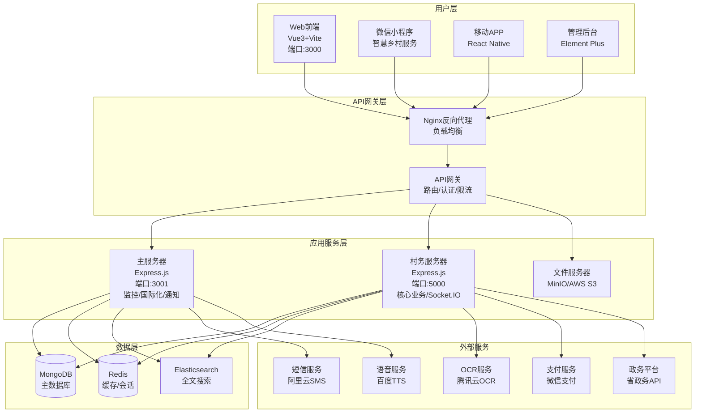
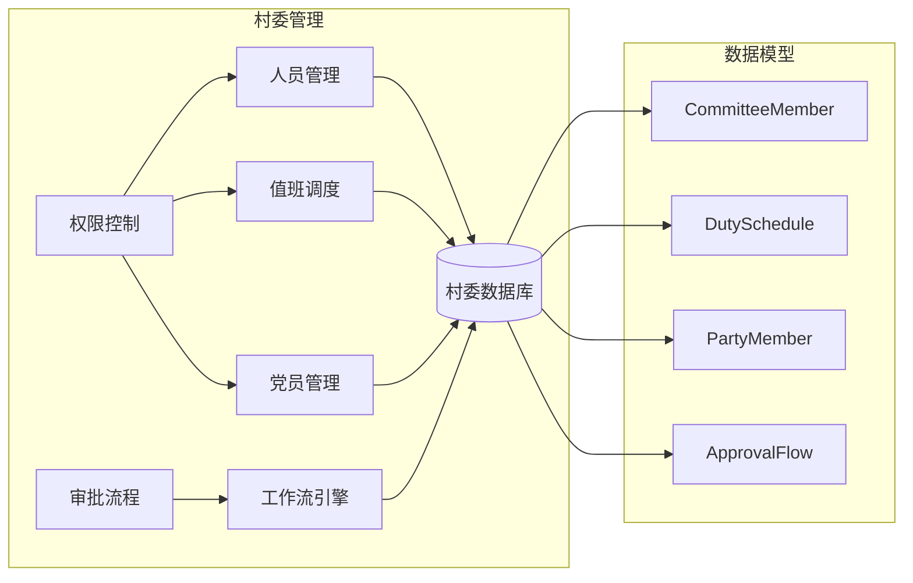
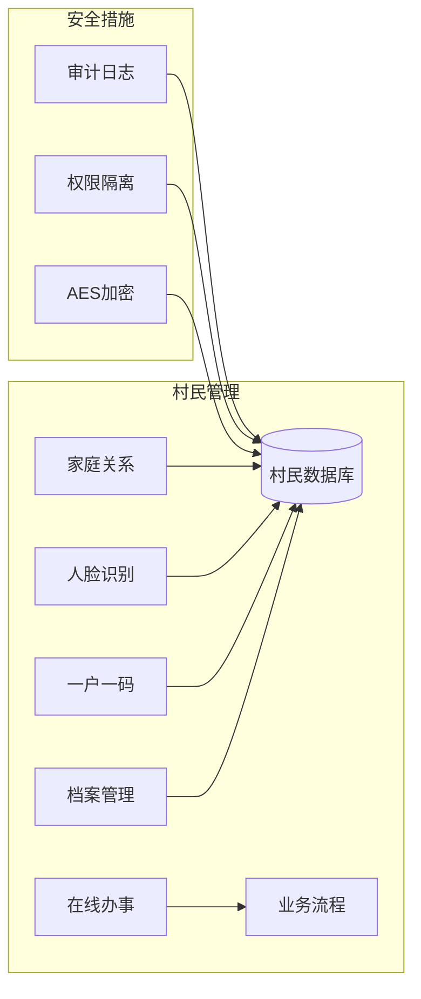
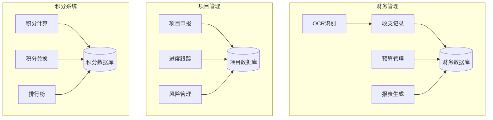
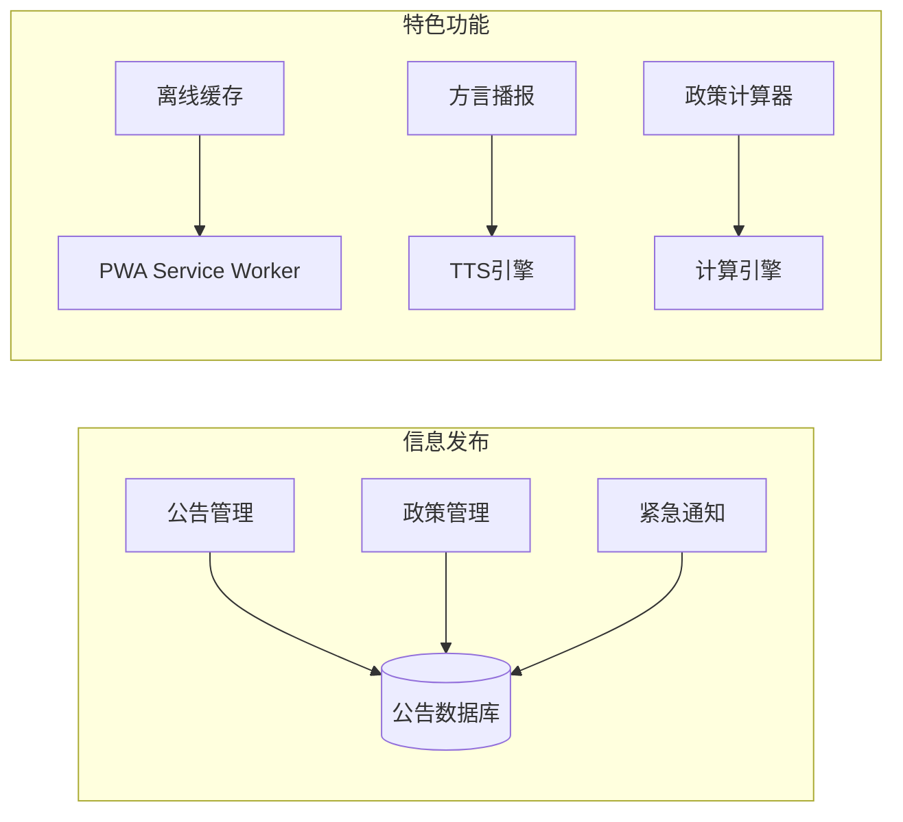
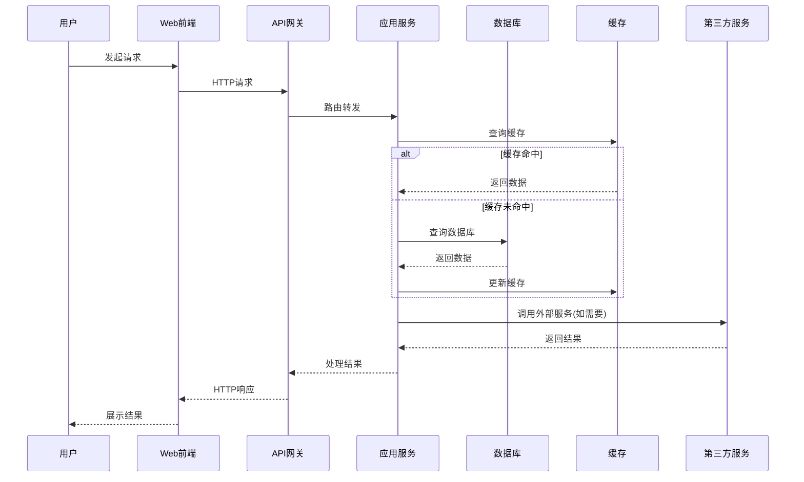
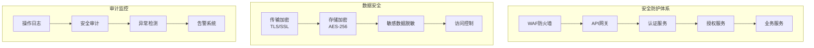
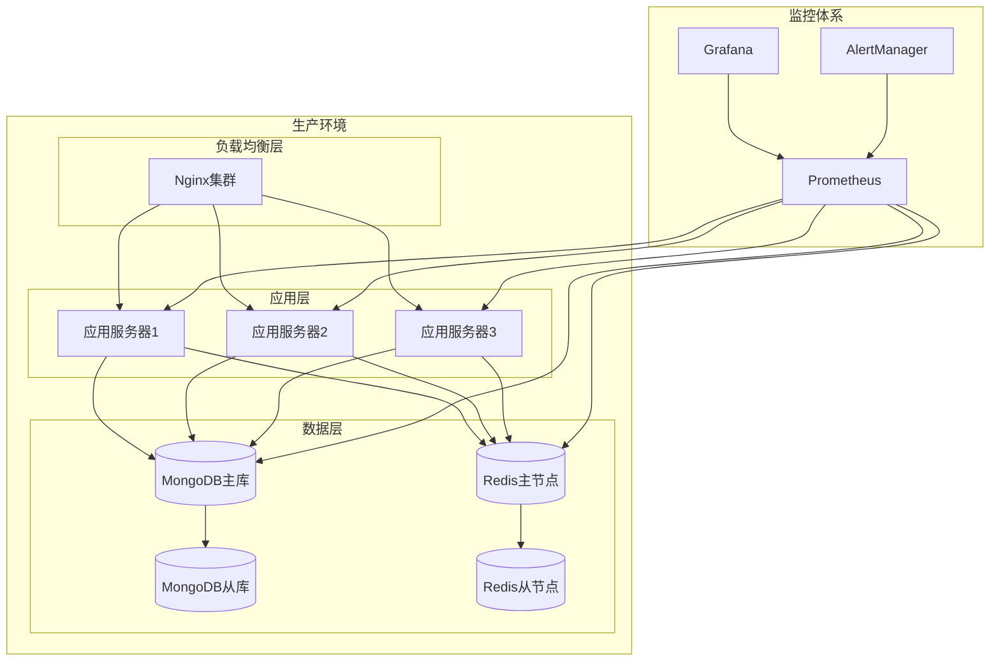

# 智慧乡村系统架构图

## 系统整体架构

## 核心模块架构

### 1. 村委管理模块

### 2. 村民管理模块

### 3. 村务治理模块

### 4. 信息公示模块

## 数据流架构

## 安全架构

## 部署架构

## 技术栈选择

### 前端技术栈
- **框架**: Vue 3 + Composition API
- **构建工具**: Vite
- **UI组件库**: Element Plus
- **状态管理**: Pinia
- **路由**: Vue Router 4
- **HTTP客户端**: Axios
- **样式**: Tailwind CSS
- **移动端**: UniApp (微信小程序)

### 后端技术栈
- **运行时**: Node.js 18+
- **框架**: Express.js
- **数据库**: MongoDB 6.0+
- **缓存**: Redis 7.0+
- **搜索**: Elasticsearch 8.0+
- **认证**: JWT + Passport.js
- **实时通信**: Socket.IO
- **文件存储**: MinIO/AWS S3
- **任务队列**: Bull Queue

### 开发工具
- **语言**: JavaScript/TypeScript
- **包管理**: npm/yarn
- **代码规范**: ESLint + Prettier
- **测试框架**: Jest + Supertest
- **API文档**: Swagger/OpenAPI
- **版本控制**: Git
- **CI/CD**: GitHub Actions
- **容器化**: Docker + Docker Compose
- **监控**: Prometheus + Grafana

---

**创建日期**: 2025-12-15
**版本**: v1.0
**维护者**: 开发团队