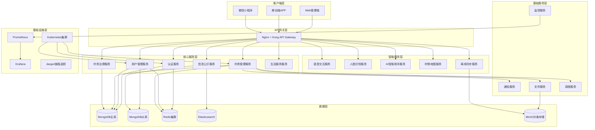
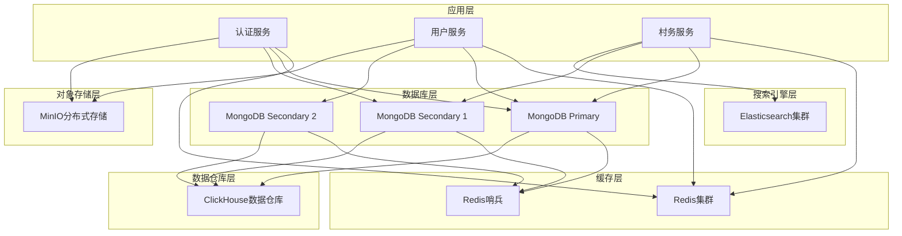

# 智慧乡村后端架构优化设计方案

## 一、现有架构分析

### 1.1 当前单服务器架构优点

#### 技术优势
- **简单部署**: 单体应用便于开发、测试和部署
- **性能良好**: 内存调用，无网络开销
- **事务一致性**: 单数据库事务，数据一致性强
- **调试便捷**: 所有服务在同一进程，问题定位容易

#### 业务优势
- **快速迭代**: 功能开发周期短
- **成本效益**: 初期基础设施投入低
- **团队协作**: 小团队即可维护

### 1.2 现有架构缺点

#### 扩展性限制
- **垂直扩展瓶颈**: 单机性能上限
- **功能耦合严重**: 村务管理、通知、监控等模块混合
- **数据库压力**: 所有功能共享单一MongoDB实例

#### 可靠性风险
- **单点故障**: 整个系统依赖单个服务器
- **级联故障**: 一个模块问题可能影响整个系统
- **维护困难**: 升级需要整体停机

#### 性能瓶颈
- **资源竞争**: CPU、内存、I/O资源争夺
- **阻塞调用**: 同步处理影响响应时间
- **缓存策略单一**: 缺乏分层缓存设计

## 二、优化微服务架构设计

### 2.1 整体架构图



### 2.2 服务边界定义

#### 2.2.1 核心业务服务

**认证服务 (auth-service)**
- 端口: 3001
- 职责: 用户认证、权限管理、Token管理
- 数据库: MongoDB auth_db
- 缓存: Redis (Session, Token)

**用户管理服务 (user-service)**
- 端口: 3002
- 职责: 用户CRUD、角色管理、村民档案
- 数据库: MongoDB user_db
- 缓存: Redis (用户信息缓存)

**村务管理服务 (village-service)**
- 端口: 3003
- 职责: 村委会管理、智能值班表、任务调度
- 数据库: MongoDB village_db
- 缓存: Redis (值班信息)

**村务治理服务 (governance-service)**
- 端口: 3004
- 职责: 财务管理、项目管理、投票决策
- 数据库: MongoDB governance_db
- 缓存: Redis (统计缓存)

**信息公示服务 (info-service)**
- 端口: 3005
- 职责: 公告发布、政策宣传、信息查询
- 数据库: MongoDB info_db + Elasticsearch
- 缓存: Redis (热点内容)

**生活服务服务 (life-service)**
- 端口: 3006
- 职责: 便民服务、互助平台、积分商城
- 数据库: MongoDB life_db
- 缓存: Redis (服务信息)

#### 2.2.2 智能服务

**语音交互服务 (voice-service)**
- 端口: 3010
- 职责: 方言识别、语音合成、语音命令
- 技术: 百度语音API + 自行训练模型
- 存储: MinIO (语音文件)

**人脸识别服务 (face-service)**
- 端口: 3011
- 职责: 人脸认证、活体检测、身份验证
- 技术: Face-API.js + 百度人脸识别
- 存储: MinIO (人脸特征)

**AI智能助手服务 (ai-service)**
- 端口: 3012
- 职责: 智能填表、政策计算、智能问答
- 技术: Claude API + 本地模型
- 缓存: Redis (对话历史)

**村情地图服务 (map-service)**
- 端口: 3013
- 职责: 地图服务、位置定位、应急响应
- 技术: 高德地图API + GIS
- 数据库: MongoDB geo_db

**离线同步服务 (sync-service)**
- 端口: 3014
- 职责: 离线数据管理、冲突解决、增量同步
- 技术: PouchDB + 自定义同步协议
- 存储: MinIO (离线包)

#### 2.2.3 基础服务

**通知服务 (notify-service)**
- 端口: 3020
- 职责: 短信、邮件、App推送、WebSocket通知
- 队列: Redis (消息队列)

**文件服务 (file-service)**
- 端口: 3021
- 职责: 文件上传、下载、压缩、水印
- 存储: MinIO对象存储

**监控服务 (monitor-service)**
- 端口: 3022
- 职责: 性能监控、告警、日志聚合
- 技术: Prometheus + Grafana

**调度服务 (schedule-service)**
- 端口: 3023
- 职责: 定时任务、工作流、批处理
- 技术: Bull Queue + Cron

### 2.3 服务通信策略

#### 同步通信
- **REST API**: 服务间标准HTTP调用
- **gRPC**: 高性能内部通信（可选）
- **GraphQL**: 客户端数据聚合（可选）

#### 异步通信
- **事件驱动**: Redis Pub/Sub发布订阅
- **消息队列**: Redis List/RQ任务队列
- **事件溯源**: MongoDB存储事件流

## 三、新功能API设计

### 3.1 语音交互模块

#### 3.1.1 方言识别API

```javascript
// API端点: POST /api/v1/voice/recognize
{
  "request": {
    "audio": "base64编码的音频数据",
    "format": "wav/mp3",
    "sample_rate": 16000,
    "dialect": "auto|cantonese|minnan|mandarin",
    "user_id": "用户ID",
    "context": {
      "module": "village|life|governance",
      "expected_intent": "query|command|feedback"
    }
  },
  "response": {
    "success": true,
    "data": {
      "text": "识别的文本内容",
      "confidence": 0.95,
      "dialect": "cantonese",
      "intent": "query_announcement",
      "entities": [
        {"type": "date", "value": "今天"},
        {"type": "category", "value": "通知"}
      ],
      "audio_duration": 3.5,
      "processing_time": 0.8
    }
  }
}
```

#### 3.1.2 语音合成API

```javascript
// API端点: POST /api/v1/voice/synthesize
{
  "request": {
    "text": "要合成的文本",
    "voice": "female|male|elderly",
    "dialect": "cantonese|minnan|mandarin",
    "speed": 1.0,
    "emotion": "neutral|happy|serious",
    "format": "mp3|wav"
  },
  "response": {
    "success": true,
    "data": {
      "audio_url": "合成的音频URL",
      "text": "确认的文本",
      "duration": 5.2,
      "file_size": 82944
    }
  }
}
```

### 3.2 离线数据同步机制

#### 3.2.1 离线数据包生成

```javascript
// API端点: POST /api/v1/sync/package
{
  "request": {
    "user_id": "用户ID",
    "village_id": "村庄ID",
    "data_types": ["announcements", "contacts", "forms", "policies"],
    "date_range": {
      "start": "2024-01-01",
      "end": "2024-12-31"
    },
    "compression": true,
    "encryption": true
  },
  "response": {
    "success": true,
    "data": {
      "package_id": "离线包ID",
      "download_url": "下载链接",
      "file_size": 15728640,
      "checksum": "MD5校验和",
      "expires_at": "过期时间",
      "version": "版本号"
    }
  }
}
```

#### 3.2.2 增量同步API

```javascript
// API端点: POST /api/v1/sync/incremental
{
  "request": {
    "user_id": "用户ID",
    "last_sync_time": "最后同步时间",
    "changes_only": true,
    "conflict_resolution": "client_wins|server_wins|manual"
  },
  "response": {
    "success": true,
    "data": {
      "changes": [
        {
          "type": "update|insert|delete",
          "collection": "announcements",
          "id": "文档ID",
          "data": "更新数据",
          "timestamp": "2024-01-15T10:30:00Z",
          "version": 3
        }
      ],
      "conflicts": [
        {
          "id": "冲突文档ID",
          "client_version": 2,
          "server_version": 3,
          "resolution_required": true
        }
      ],
      "sync_token": "下次同步令牌"
    }
  }
}
```

### 3.3 人脸识别认证系统

#### 3.3.1 人脸注册API

```javascript
// API端点: POST /api/v1/face/register
{
  "request": {
    "user_id": "用户ID",
    "face_images": [
      "base64编码的人脸图片1",
      "base64编码的人脸图片2",
      "base64编码的人脸图片3"
    ],
    "verification_level": "high|medium|low",
    "liveness_required": true
  },
  "response": {
    "success": true,
    "data": {
      "face_id": "人脸特征ID",
      "confidence": 0.98,
      "verification_status": "verified",
      "feature_vector": "特征向量(加密)",
      "template_count": 3,
      "quality_score": 0.95
    }
  }
}
```

#### 3.3.2 人脸认证API

```javascript
// API端点: POST /api/v1/face/authenticate
{
  "request": {
    "face_image": "base64编码的人脸图片",
    "user_id": "可选的用户ID(1:N或1:1认证)",
    "liveness_check": true,
    "anti_spoofing": true
  },
  "response": {
    "success": true,
    "data": {
      "authenticated": true,
      "user_id": "认证的用户ID",
      "confidence": 0.96,
      "liveness_passed": true,
      "anti_spoofing_passed": true,
      "match_distance": 0.23,
      "processing_time": 0.15
    }
  }
}
```

### 3.4 AI智能填表助手

#### 3.4.1 表单识别API

```javascript
// API端点: POST /api/v1/ai/form-recognize
{
  "request": {
    "form_image": "base64编码的表单图片",
    "form_type": "auto|application|report|survey",
    "extract_fields": true,
    "validate_format": true
  },
  "response": {
    "success": true,
    "data": {
      "form_type": "农村宅基地申请表",
      "fields": [
        {
          "name": "申请人姓名",
          "value": "张三",
          "confidence": 0.98,
          "coordinates": {"x": 100, "y": 200, "width": 150, "height": 30}
        },
        {
          "name": "身份证号",
          "value": "330106199001011234",
          "confidence": 0.95,
          "coordinates": {"x": 100, "y": 250, "width": 200, "height": 30}
        }
      ],
      "tables": [
        {
          "name": "家庭成员信息",
          "headers": ["姓名", "关系", "身份证号"],
          "rows": [
            ["张三", "申请人", "330106199001011234"],
            ["李四", "配偶", "330106199002021234"]
          ]
        }
      ],
      "total_confidence": 0.96
    }
  }
}
```

#### 3.4.2 智能填表API

```javascript
// API端点: POST /api/v1/ai/form-fill
{
  "request": {
    "form_template_id": "表单模板ID",
    "user_profile": {
      "name": "张三",
      "id_card": "330106199001011234",
      "address": "浙江省杭州市西湖区",
      "phone": "13800138000"
    },
    "auto_extract": true,
    "validate_required": true
  },
  "response": {
    "success": true,
    "data": {
      "filled_form": {
        "template_id": "表单模板ID",
        "fields": [
          {
            "field_id": "name",
            "value": "张三",
            "source": "user_profile",
            "confidence": 1.0
          },
          {
            "field_id": "id_card",
            "value": "330106199001011234",
            "source": "user_profile",
            "confidence": 1.0
          }
        ],
        "missing_fields": [],
        "validation_errors": []
      },
      "suggestions": [
        {
          "field": "联系电话",
          "suggested_value": "13800138000",
          "source": "user_profile"
        }
      ]
    }
  }
}
```

### 3.5 村委智能值班表

#### 3.5.1 值班表生成API

```javascript
// API端点: POST /api/v1/village/schedule/generate
{
  "request": {
    "village_id": "村庄ID",
    "period": {
      "start_date": "2024-01-01",
      "end_date": "2024-12-31"
    },
    "staff": [
      {
        "id": "staff_001",
        "name": "张书记",
        "role": "village_secretary",
        "availability": {
          "weekdays": true,
          "weekends": false,
          "holidays": false,
          "max_hours_per_week": 40
        },
        "skills": ["emergency", "administrative", "mediation"]
      }
    ],
    "shifts": [
      {
        "type": "morning",
        "start_time": "08:00",
        "end_time": "12:00",
        "required_skills": ["administrative"],
        "min_staff": 1,
        "max_staff": 2
      }
    ],
    "constraints": {
      "fair_distribution": true,
      "skill_matching": true,
      "continuous_rest": 12,
      "avoid_conflicts": true
    }
  },
  "response": {
    "success": true,
    "data": {
      "schedule_id": "排班ID",
      "schedule": [
        {
          "date": "2024-01-01",
          "shifts": [
            {
              "shift_type": "morning",
              "start_time": "08:00",
              "end_time": "12:00",
              "assigned_staff": [
                {
                  "staff_id": "staff_001",
                  "staff_name": "张书记",
                  "role": "village_secretary"
                }
              ],
              "coverage_score": 1.0
            }
          ]
        }
      ],
      "statistics": {
        "total_shifts": 365,
        "staff_workload": {
          "staff_001": {
            "total_hours": 2080,
            "average_weekly_hours": 40,
            "overtime_hours": 0,
            "fairness_score": 0.95
          }
        },
        "coverage_rate": 0.98,
        "constraint_violations": 0
      }
    }
  }
}
```

#### 3.5.2 紧急呼叫调度API

```javascript
// API端点: POST /api/v1/village/emergency/dispatch
{
  "request": {
    "village_id": "村庄ID",
    "emergency": {
      "type": "fire|medical|security|natural_disaster",
      "severity": "low|medium|high|critical",
      "location": {
        "address": "具体地址",
        "coordinates": {"lat": 30.2741, "lng": 120.1551},
        "description": "位置描述"
      },
      "reporter": {
        "name": "报告人姓名",
        "phone": "联系电话",
        "user_id": "用户ID"
      },
      "description": "紧急情况描述"
    }
  },
  "response": {
    "success": true,
    "data": {
      "incident_id": "事件ID",
      "dispatched_staff": [
        {
          "staff_id": "staff_001",
          "staff_name": "张书记",
          "role": "village_secretary",
          "contact": "联系电话",
          "distance_km": 0.5,
          "eta_minutes": 3,
          "skills": ["emergency", "leadership"]
        }
      ],
      "response_plan": {
        "immediate_actions": [
          "联系紧急服务",
          "组织现场救援",
          "通知周边村民"
        ],
        "resources_needed": [
          {"type": "fire_extinguisher", "quantity": 2},
          {"type": "first_aid_kit", "quantity": 1}
        ]
      },
      "status": "dispatched",
      "created_at": "2024-01-15T14:30:00Z"
    }
  }
}
```

### 3.6 村情地图集成

#### 3.6.1 地理信息查询API

```javascript
// API端点: POST /api/v1/map/geo-query
{
  "request": {
    "village_id": "村庄ID",
    "query_type": "point|polygon|buffer|route",
    "geometry": {
      "type": "Point",
      "coordinates": [120.1551, 30.2741]
    },
    "layers": [
      "households",
      "facilities",
      "farmland",
      "water_bodies",
      "roads",
      "emergency_equipment"
    ],
    "buffer_radius": 500,
    "return_count": true
  },
  "response": {
    "success": true,
    "data": {
      "results": {
        "households": [
          {
            "id": "household_001",
            "address": "村民地址",
            "coordinates": [120.1551, 30.2741],
            "household_head": "户主姓名",
            "population": 4,
            "special_groups": ["elderly", "children"],
            "distance_meters": 100
          }
        ],
        "facilities": [
          {
            "id": "facility_001",
            "type": "clinic|school|community_center",
            "name": "卫生所",
            "address": "地址",
            "coordinates": [120.1561, 30.2751],
            "capacity": 50,
            "operating_hours": "08:00-17:00",
            "distance_meters": 200
          }
        ]
      },
      "statistics": {
        "total_households": 156,
        "total_population": 624,
        "vulnerable_population": 89,
        "area_coverage_sqm": 78500
      }
    }
  }
}
```

#### 3.6.2 应急响应规划API

```javascript
// API端点: POST /api/v1/map/emergency-plan
{
  "request": {
    "village_id": "村庄ID",
    "emergency_scenario": "flood|fire|earthquake|epidemic",
    "incident_location": {
      "coordinates": [120.1551, 30.2741],
      "radius": 1000
    },
    "planning_options": {
      "include_evacuation_routes": true,
      "include_shelter_locations": true,
      "include_resource_allocation": true,
      "optimize_response_time": true
    }
  },
  "response": {
    "success": true,
    "data": {
      "emergency_plan": {
        "affected_area": {
          "total_area_sqm": 314000,
          "affected_households": 89,
          "affected_population": 356,
          "vulnerable_groups": 67
        },
        "evacuation_routes": [
          {
            "route_id": "evac_001",
            "name": "主要撤离路线1",
            "path": [[120.1551, 30.2741], [120.1561, 30.2751]],
            "capacity_per_hour": 500,
            "estimated_evacuation_time": 45,
            "status": "clear"
          }
        ],
        "shelter_locations": [
          {
            "shelter_id": "shelter_001",
            "name": "村委会应急避难所",
            "address": "地址",
            "coordinates": [120.1571, 30.2761],
            "capacity": 200,
            "facilities": ["water", "food", "medical", "communication"],
            "distance_from_incident": 800
          }
        ],
        "resource_allocation": {
          "emergency_equipment": [
            {
              "type": "pump",
              "available_count": 5,
              "required_count": 8,
              "locations": [
                {"coordinates": [120.1555, 30.2745], "quantity": 3},
                {"coordinates": [120.1565, 30.2755], "quantity": 2}
              ]
            }
          ],
          "personnel": [
            {
              "role": "rescue_team",
              "available": 12,
              "required": 15,
              "response_time_minutes": 15
            }
          ]
        },
        "communication_plan": {
          "alert_channels": ["sms", "broadcast", "door_to_door"],
          "message_templates": ["紧急撤离通知", "安全避难指南"],
          "priority_contacts": [
            {"role": "village_secretary", "contact": "电话"},
            {"role": "emergency_coordinator", "contact": "电话"}
          ]
        }
      }
    }
  }
}
```

## 四、数据库架构优化方案

### 4.1 数据库分层架构

#### 4.1.1 数据存储层次



### 4.2 MongoDB分片策略

#### 4.2.1 数据分片设计

```javascript
// 分片配置
const shardingConfig = {
  // 用户数据分片 - 按村庄ID分片
  users: {
    shardKey: { villageId: 1, _id: 1 },
    strategy: "hashed",
    chunks: "village_based"
  },

  // 村务数据分片 - 按时间+村庄分片
  villageData: {
    shardKey: { villageId: 1, createdAt: 1 },
    strategy: "ranged",
    chunks: "time_village_based"
  },

  // 文件数据分片 - 按文件类型分片
  files: {
    shardKey: { fileType: 1, uploadDate: 1 },
    strategy: "ranged",
    chunks: "type_time_based"
  },

  // 地理数据分片 - 按地理哈希分片
  geoData: {
    shardKey: { geoHash: 1 },
    strategy: "hashed",
    chunks: "geography_based"
  }
};

// 索引优化策略
const indexOptimization = {
  users: [
    { villageId: 1, role: 1 },
    { "profile.phone": 1 },
    { email: 1 },
    { villageId: 1, status: 1, createdAt: -1 }
  ],

  announcements: [
    { villageId: 1, status: 1, publishDate: -1 },
    { villageId: 1, category: 1, publishDate: -1 },
    { title: "text", content: "text" },
    { tags: 1, publishDate: -1 }
  ],

  households: [
    { villageId: 1, householdCode: 1 },
    { "address.coordinates": "2dsphere" },
    { villageId: 1, "members.specialGroups": 1 }
  ],

  notifications: [
    { userId: 1, createdAt: -1 },
    { villageId: 1, type: 1, status: 1 },
    { expireAt: 1 }
  ]
};
```

### 4.3 缓存策略设计

#### 4.3.1 多级缓存架构

```javascript
// L1缓存 - 应用内存缓存
const l1Cache = {
  userSessions: {
    type: "memory",
    ttl: 1800, // 30分钟
    maxSize: 10000,
    evictionPolicy: "LRU"
  },

  villageConfig: {
    type: "memory",
    ttl: 3600, // 1小时
    maxSize: 1000,
    evictionPolicy: "LRU"
  }
};

// L2缓存 - Redis缓存
const l2Cache = {
  userProfile: {
    keyPattern: "user:profile:{userId}",
    ttl: 3600,
    serializer: "json"
  },

  villageData: {
    keyPattern: "village:data:{villageId}:{dataType}",
    ttl: 1800,
    serializer: "json"
  },

  announcements: {
    keyPattern: "announcements:{villageId}:{page}",
    ttl: 600,
    serializer: "json"
  },

  permissions: {
    keyPattern: "permissions:{userId}:{resource}",
    ttl: 900,
    serializer: "json"
  }
};

// L3缓存 - CDN缓存
const l3Cache = {
  staticFiles: {
    type: "cdn",
    ttl: 86400, // 24小时
    compression: true,
    edgeLocations: "global"
  },

  apiResponses: {
    type: "cdn",
    ttl: 300, // 5分钟
    varyBy: ["user-agent", "accept-language"]
  }
};
```

### 4.4 数据同步策略

#### 4.4.1 读写分离配置

```javascript
const readPreferenceConfig = {
  // 默认读偏好
  default: "secondaryPreferred",

  // 业务特定读偏好
  userQueries: {
    readPreference: "secondaryPreferred",
    maxStalenessSeconds: 10,
    tagSets: [{ region: "local" }]
  },

  analyticsQueries: {
    readPreference: "secondary",
    maxStalenessSeconds: 300,
    tagSets: [{ nodeType: "analytics" }]
  },

  realtimeQueries: {
    readPreference: "primary",
    readConcern: { level: "majority" }
  }
};

const writeConcernConfig = {
  // 默认写关注
  default: {
    w: "majority",
    j: true,
    wtimeout: 5000
  },

  // 关键数据写关注
  critical: {
    w: "majority",
    j: true,
    wtimeout: 10000
  },

  // 日志数据写关注
  logs: {
    w: 1,
    j: false
  }
};
```

## 五、系统扩展性和维护性方案

### 5.1 水平扩展策略

#### 5.1.1 服务自动扩展

```yaml
# HPA配置示例
apiVersion: autoscaling/v2
kind: HorizontalPodAutoscaler
metadata:
  name: village-service-hpa
spec:
  scaleTargetRef:
    apiVersion: apps/v1
    kind: Deployment
    name: village-service
  minReplicas: 2
  maxReplicas: 10
  metrics:
  - type: Resource
    resource:
      name: cpu
      target:
        type: Utilization
        averageUtilization: 70
  - type: Resource
    resource:
      name: memory
      target:
        type: Utilization
        averageUtilization: 80
  behavior:
    scaleUp:
      stabilizationWindowSeconds: 60
      policies:
      - type: Percent
        value: 100
        periodSeconds: 15
    scaleDown:
      stabilizationWindowSeconds: 300
      policies:
      - type: Percent
        value: 10
        periodSeconds: 60
```

#### 5.1.2 数据库扩展方案

```javascript
// MongoDB分片集群扩展
const clusterExpansion = {
  currentConfig: {
    shards: [
      { host: "shard1/mongo-shard1-1:27017,mongo-shard1-2:27017,mongo-shard1-3:27017" },
      { host: "shard2/mongo-shard2-1:27017,mongo-shard2-2:27017,mongo-shard2-3:27017" }
    ],
    configServers: "cfg/mongo-cfg-1:27019,mongo-cfg-2:27019,mongo-cfg-3:27019",
    mongos: [
      "mongo-mongos-1:27017",
      "mongo-mongos-2:27017"
    ]
  },

  expansionPlan: {
    addShards: [
      "shard3/mongo-shard3-1:27017,mongo-shard3-2:27017,mongo-shard3-3:27017",
      "shard4/mongo-shard4-1:27017,mongo-shard4-2:27017,mongo-shard4-3:27017"
    ],
    addMongos: [
      "mongo-mongos-3:27017",
      "mongo-mongos-4:27017"
    ],
    migrationStrategy: "balancer",
    chunkSize: 128
  }
};
```

### 5.2 服务治理

#### 5.2.1 服务发现与注册

```javascript
// Consul服务注册配置
const serviceRegistry = {
  services: {
    "auth-service": {
      name: "auth-service",
      tags: ["auth", "security", "v1"],
      port: 3001,
      check: {
        http: "http://localhost:3001/health",
        interval: "10s",
        timeout: "3s",
        deregisterCriticalServiceAfter: "30s"
      },
      meta: {
        version: "1.0.0",
        environment: "production",
        team: "security"
      }
    },

    "village-service": {
      name: "village-service",
      tags: ["village", "management", "v1"],
      port: 3003,
      check: {
        http: "http://localhost:3003/health",
        interval: "10s",
        timeout: "3s",
        deregisterCriticalServiceAfter: "30s"
      },
      meta: {
        version: "1.0.0",
        environment: "production",
        team: "village"
      }
    }
  },

  healthChecks: {
    checks: [
      {
        name: "auth-service-health",
        service_id: "auth-service",
        ttl: "30s",
        deregister_critical_service_after: "60s"
      }
    ]
  }
};
```

#### 5.2.2 熔断器配置

```javascript
// Hystrix熔断器配置
const circuitBreakerConfig = {
  services: {
    "voice-service": {
      timeout: 5000,
      errorThresholdPercentage: 50,
      requestVolumeThreshold: 20,
      sleepWindow: 60000,
      fallback: "voice-service-fallback"
    },

    "face-service": {
      timeout: 3000,
      errorThresholdPercentage: 40,
      requestVolumeThreshold: 10,
      sleepWindow: 30000,
      fallback: "face-service-fallback"
    },

    "ai-service": {
      timeout: 10000,
      errorThresholdPercentage: 60,
      requestVolumeThreshold: 15,
      sleepWindow: 120000,
      fallback: "ai-service-fallback"
    }
  },

  monitoring: {
    metricsRollingPercentileWindow: 10000,
    metricsRollingPercentileWindowBuckets: 10,
    metricsRollingPercentileEnabled: true,
    metricsRollingStatisticalWindow: 10000
  }
};
```

### 5.3 监控与可观测性

#### 5.3.1 监控指标设计

```javascript
const monitoringMetrics = {
  // 业务指标
  business: {
    userActivity: {
      "active_users_total": "当前活跃用户数",
      "new_users_per_hour": "每小时新增用户",
      "village_coverage_rate": "村庄覆盖率",
      "service_usage_rate": "服务使用率"
    },

    servicePerformance: {
      "api_request_duration": "API请求耗时",
      "api_error_rate": "API错误率",
      "service_availability": "服务可用性",
      "response_time_p95": "95%响应时间"
    },

    systemResources: {
      "cpu_usage_percentage": "CPU使用率",
      "memory_usage_percentage": "内存使用率",
      "disk_usage_percentage": "磁盘使用率",
      "network_io_bytes": "网络IO字节数"
    }
  },

  // 技术指标
  technical: {
    database: {
      "mongodb_connections_active": "MongoDB活跃连接数",
      "mongodb_operation_duration": "MongoDB操作耗时",
      "mongodb_replication_lag": "MongoDB复制延迟",
      "cache_hit_rate": "缓存命中率"
    },

    messageQueue: {
      "queue_size": "队列大小",
      "message_processing_rate": "消息处理速率",
      "consumer_lag": "消费者延迟"
    }
  }
};
```

#### 5.3.2 链路追踪配置

```javascript
// Jaeger链路追踪配置
const tracingConfig = {
  serviceName: "smart-village-platform",
  agent: {
    host: "jaeger-agent",
    port: 6832
  },
  sampler: {
    type: "probabilistic",
    param: 0.1 // 10%采样率
  },
  options: {
    tags: {
      "service.version": "1.0.0",
      "service.environment": "production"
    }
  },

  tracing: {
    operations: [
      {
        operationName: "HTTP GET /api/v1/users",
        tags: ["http.method:GET", "http.target:/api/v1/users"]
      },
      {
        operationName: "Database Query",
        tags: ["db.type:mongodb", "db.collection:users"]
      },
      {
        operationName: "Cache Get",
        tags: ["cache.type:redis"]
      }
    ]
  }
};
```

### 5.4 容错与恢复

#### 5.4.1 故障转移策略

```javascript
const failoverStrategy = {
  database: {
    primaryFailure: {
      detectionTime: 5000, // 5秒检测
      failoverTime: 10000, // 10秒转移
      automaticPromotion: true,
      majorityConsensus: true
    },

    recoveryProcedure: {
      waitForStability: 30000, // 30秒等待稳定
      dataConsistencyCheck: true,
      automaticRejoining: true,
      resyncStrategy: "incremental"
    }
  },

  services: {
    circuitBreaker: {
      failureThreshold: 5,
      timeoutDuration: 60000,
      resetTimeout: 30000
    },

    retryPolicy: {
      maxAttempts: 3,
      backoffMultiplier: 2,
      initialDelay: 1000,
      maxDelay: 10000
    }
  }
};
```

#### 5.4.2 数据备份策略

```javascript
const backupStrategy = {
  mongodb: {
    // 全量备份
    fullBackup: {
      schedule: "0 2 * * 0", // 每周日凌晨2点
      retention: 4, // 保留4周
      compression: true,
      encryption: true,
      storage: "s3://smart-village-backups/mongodb/full/"
    },

    // 增量备份
    incrementalBackup: {
      schedule: "0 */6 * * *", // 每6小时
      retention: 28, // 保留28个增量备份
      oplogBased: true,
      storage: "s3://smart-village-backups/mongodb/incremental/"
    },

    // 灾难恢复
    disasterRecovery: {
      rpo: "15分钟", // 恢复点目标
      rto: "1小时", // 恢复时间目标
      crossRegion: true,
      automaticFailover: true
    }
  },

  files: {
    minioBackup: {
      schedule: "0 1 * * *", // 每日凌晨1点
      retention: 30, // 保留30天
      versioning: true,
      lifecyclePolicy: {
        transition: [
          { days: 30, storageClass: "STANDARD_IA" },
          { days: 90, storageClass: "GLACIER" },
          { days: 365, storageClass: "DEEP_ARCHIVE" }
        ]
      }
    }
  }
};
```

## 六、技术栈选择理由

### 6.1 核心技术栈

#### 6.1.1 后端技术选择

**Node.js + Express.js**
- **理由**: JavaScript全栈开发，团队技能匹配好，异步I/O适合高并发场景
- **优势**: 生态丰富，开发效率高，适合快速迭代

**MongoDB**
- **理由**: 文档型数据库适合乡村业务的多样化数据结构，水平扩展能力强
- **优势**: Schema灵活，地理位置查询支持好，社区成熟

**Redis**
- **理由**: 高性能内存数据库，适合缓存、会话、消息队列场景
- **优势**: 数据结构丰富，持久化支持，集群方案成熟

#### 6.1.2 容器化技术

**Docker + Kubernetes**
- **理由**: 标准化部署，自动扩缩容，服务治理完善
- **优势**: 资源利用率高，运维自动化，多云支持

### 6.2 新功能技术选择

#### 6.2.1 AI相关技术

**语音识别**
- **技术栈**: 百度语音API + Mozilla DeepSpeech
- **理由**: 百度API提供22种方言支持，DeepSpeech可离线部署

**人脸识别**
- **技术栈**: Face-API.js + 百度人脸识别API
- **理由**: 前端可本地处理，后端API提供高精度识别

**AI助手**
- **技术栈**: Claude API + 自行训练的领域模型
- **理由**: Claude提供强通用能力，领域模型保证专业性

#### 6.2.2 地理信息服务

**GIS技术栈**
- **技术**: 高德地图API + Turf.js + MongoDB地理索引
- **理由**: 国内服务稳定，Turf.js提供强大地理计算能力

### 6.3 基础设施选择

#### 6.3.1 监控方案

**Prometheus + Grafana**
- **理由**: 云原生监控事实标准，生态完善，可视化能力强

**Jaeger**
- **理由**: 分布式链路追踪，性能影响小，分析能力强

#### 6.3.2 对象存储

**MinIO**
- **理由**: S3兼容，开源可控，私有化部署友好
- **优势**: 性能好，集成简单，成本可控

## 七、性能优化策略

### 7.1 应用层优化

#### 7.1.1 API性能优化

```javascript
const apiOptimization = {
  // 响应压缩
  compression: {
    algorithm: "gzip",
    threshold: 1024,
    level: 6
  },

  // 请求缓存
  caching: {
    etag: true,
    maxAge: 300, // 5分钟
    varyBy: ["Authorization", "Accept-Language"]
  },

  // 连接池优化
  connectionPool: {
    keepAlive: true,
    maxSockets: 100,
    maxFreeSockets: 10,
    timeout: 60000
  },

  // 查询优化
  queryOptimization: {
    projection: true, // 只返回需要的字段
    limit: true, // 限制返回数量
    sort: true, // 优化排序
    aggregationPipeline: true // 使用聚合管道
  }
};
```

### 7.2 数据库优化

#### 7.2.1 查询优化策略

```javascript
const queryOptimization = {
  // 索引策略
  indexing: {
    compound: ["villageId + status", "userId + createdAt"],
    text: ["title", "content", "description"],
    geo: ["location.coordinates"],
    partial: [{ status: "active" }]
  },

  // 查询优化
  optimization: {
    // 使用投影减少数据传输
    projection: {
      announcements: { title: 1, content: 1, publishDate: 1 },
      users: { username: 1, profile: 1, villageId: 1 }
    },

    // 分页优化
    pagination: {
      strategy: "range_based",
      field: "_id",
      pageSize: 20,
      maxPageSize: 100
    },

    // 聚合优化
    aggregation: {
      pipelineOptimization: true,
      earlyFiltering: true,
      memoryOptimization: true,
      diskUsage: false
    }
  }
};
```

### 7.3 缓存优化

#### 7.3.1 智能缓存策略

```javascript
const smartCaching = {
  // 预热策略
  warmup: {
    criticalData: [
      "village_config",
      "user_permissions",
      "emergency_contacts"
    ],
    schedule: "0 6 * * *", // 每日6点预热
    parallel: true
  },

  // 失效策略
  invalidation: {
    tags: ["villageId", "dataType", "userId"],
    ttl: {
      user_session: 1800, // 30分钟
      village_data: 3600, // 1小时
      announcements: 600, // 10分钟
      static_config: 86400 // 24小时
    }
  },

  // 缓存穿透保护
  protection: {
    bloomFilter: true,
    emptyValue: true,
    rateLimit: true
  }
};
```

## 八、安全加固方案

### 8.1 身份认证与授权

#### 8.1.1 多因素认证

```javascript
const mfaConfig = {
  methods: [
    {
      type: "totp",
      name: "时间动态口令",
      issuer: "Smart Village",
      digits: 6,
      period: 30
    },
    {
      type: "sms",
      name: "短信验证码",
      template: "您的验证码是{code}",
      expireSeconds: 300
    },
    {
      type: "face",
      name: "人脸识别",
      confidence: 0.8,
      livenessCheck: true
    }
  ],

  policy: {
    requiredFactors: 2,
    gracePeriod: 86400, // 24小时
    trustedDevices: true,
    deviceLimit: 3
  }
};
```

### 8.2 数据加密

#### 8.2.1 加密策略

```javascript
const encryptionStrategy = {
  // 传输加密
  transport: {
    tls: {
      version: "1.3",
      ciphers: "TLS_AES_256_GCM_SHA384:TLS_CHACHA20_POLY1305_SHA256",
      protocols: ["TLSv1.3", "TLSv1.2"],
      hsts: {
        maxAge: 31536000,
        includeSubDomains: true,
        preload: true
      }
    }
  },

  // 存储加密
  storage: {
    fieldEncryption: {
      algorithm: "AES-256-GCM",
      keyRotation: 90, // 90天轮换
      fields: [
        "idCard",
        "phone",
        "bankAccount",
        "healthInfo"
      ]
    },

    fileEncryption: {
      algorithm: "AES-256-CBC",
      keyDerivation: "PBKDF2",
      iterations: 100000
    }
  }
};
```

## 九、实施路线图

### 9.1 第一阶段：基础设施搭建（1-2个月）

#### 9.1.1 周期1-2：容器化改造
- [ ] Docker化现有服务
- [ ] 搭建Kubernetes集群
- [ ] 配置CI/CD流水线
- [ ] 部署监控系统

#### 9.1.2 周期3-4：数据库优化
- [ ] MongoDB分片配置
- [ ] Redis集群搭建
- [ ] 数据迁移方案实施
- [ ] 备份策略部署

#### 9.1.3 周期5-6：服务拆分
- [ ] 拆分认证服务
- [ ] 拆分用户管理服务
- [ ] 拆分村务管理服务
- [ ] API网关配置

### 9.2 第二阶段：核心功能开发（2-3个月）

#### 9.2.1 周期7-9：智能服务
- [ ] 语音交互服务开发
- [ ] 人脸识别服务开发
- [ ] AI助手服务开发
- [ ] 服务集成测试

#### 9.2.2 周期10-12：地图与同步
- [ ] 村情地图服务开发
- [ ] 离线同步机制实现
- [ ] 智能值班表功能
- [ ] 性能优化

### 9.3 第三阶段：优化与上线（1个月）

#### 9.3.1 周期13：性能优化
- [ ] 全面性能测试
- [ ] 瓶颈识别与优化
- [ ] 压力测试
- [ ] 监控调优

#### 9.3.2 周期14：上线部署
- [ ] 生产环境部署
- [ ] 数据迁移
- [ ] 用户培训
- [ ] 运维交接

## 十、总结

本架构优化方案通过微服务化改造、智能功能集成、性能优化和安全加固，将智慧乡村平台从单体架构升级为现代化、可扩展、高可用的分布式系统。主要改进包括：

1. **架构现代化**: 微服务架构提升系统灵活性和可维护性
2. **功能智能化**: 集成语音识别、人脸识别、AI助手等智能化功能
3. **性能优化**: 多层缓存、数据库分片、异步处理等优化策略
4. **安全加固**: 多因素认证、数据加密、权限控制等安全措施
5. **运维自动化**: 容器化部署、自动扩缩容、监控告警等运维体系

通过分阶段实施，确保系统平滑升级，为智慧乡村建设提供强有力的技术支撑。