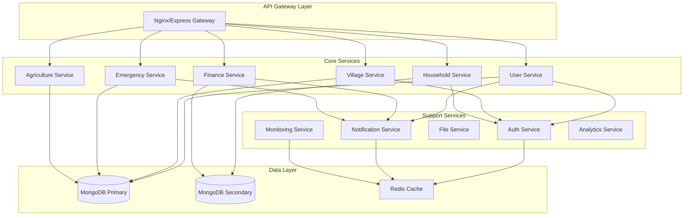
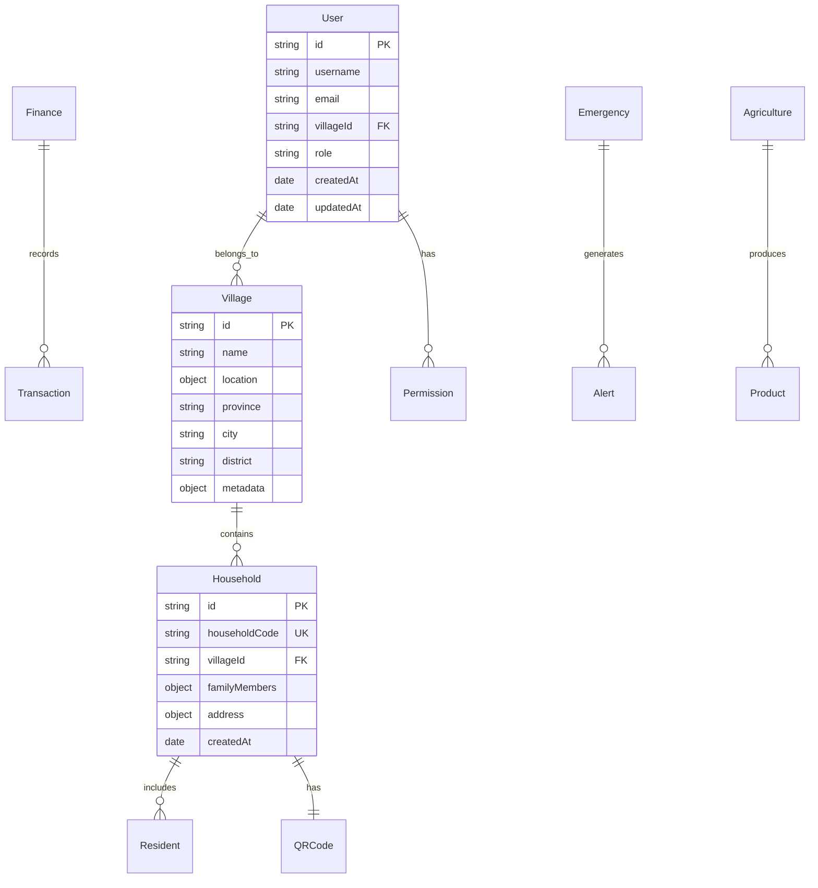
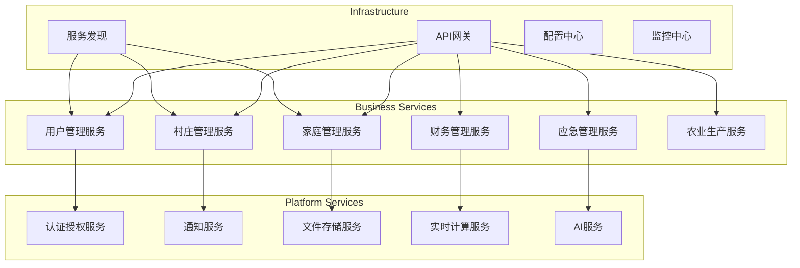
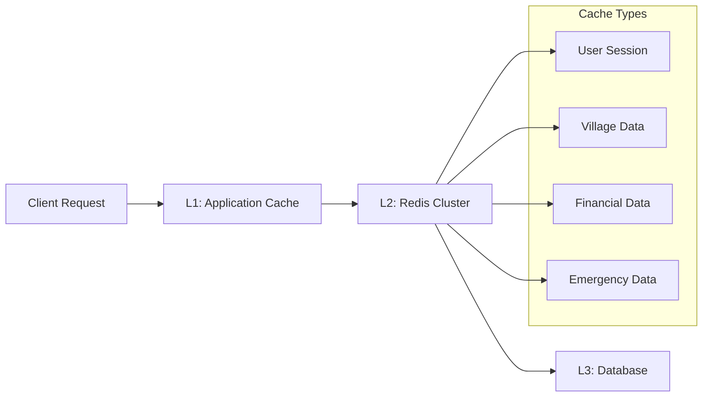

# 智慧乡村综合服务平台后端架构评估与优化方案

## 🔍 架构师评估报告

作为后端架构师，基于对智慧乡村综合服务平台的深入分析，现提供专业的架构评估和优化建议。

## 📊 现有架构评估

### 服务边界分析 ✅

当前系统采用了良好的模块化设计，主要服务边界清晰：



**评估结果**: 服务边界定义合理，职责分离清晰。建议将实时计算和AI功能独立为微服务。

### API设计评估 ⚠️

#### 当前API结构
```
/api/v1/
├── auth/           # 认证相关
├── users/          # 用户管理
├── villages/       # 村庄管理
├── households/     # 家庭管理
├── residents/      # 居民管理
├── finance/        # 财务管理
├── emergency/      # 应急管理
├── agriculture/    # 农业管理
├── notifications/  # 通知管理
├── files/          # 文件管理
└── monitoring/     # 监控管理
```

**优点**:
- RESTful设计规范
- 版本控制清晰
- 资源命名合理

**需要改进**:
1. 缺少统一的响应格式
2. 错误处理不够标准化
3. 缺少API限流和熔断机制
4. 文档不够完善

### 数据库设计评估 ✅

#### 核心数据模型关系


**优点**:
- 数据模型设计合理
- 关系定义清晰
- 索引设置恰当

**问题**:
1. 缺少分片策略
2. 大表缺少分区
3. 备份策略不完善
4. 缺少读写分离配置

## 🚀 架构优化方案

### 1. API标准化重构

#### 统一响应格式
```javascript
// 标准响应格式
{
  "success": true,
  "data": {},
  "message": "操作成功",
  "code": 200,
  "timestamp": "2025-01-18T00:00:00Z",
  "requestId": "uuid",
  "pagination": {
    "page": 1,
    "limit": 20,
    "total": 100
  }
}
```

#### API版本管理策略
```javascript
// 版本管理中间件
const apiVersionMiddleware = (req, res, next) => {
  const version = req.headers['api-version'] || 'v1';

  // 检查版本是否支持
  const supportedVersions = ['v1', 'v2'];
  if (!supportedVersions.includes(version)) {
    return res.status(400).json({
      success: false,
      message: `API版本 ${version} 不支持`,
      supportedVersions
    });
  }

  req.apiVersion = version;
  next();
};
```

### 2. 微服务架构优化

#### 服务拆分建议


#### 服务间通信
```javascript
// 使用消息队列解耦服务
const messageQueue = {
  // 用户注册事件
  'user.registered': {
    target: ['notification', 'analytics'],
    data: {
      userId: 'string',
      email: 'string',
      villageId: 'string'
    }
  },

  // 财务交易事件
  'finance.transaction.created': {
    target: ['notification', 'analytics'],
    data: {
      transactionId: 'string',
      amount: 'number',
      type: 'string'
    }
  }
};
```

### 3. 数据库优化方案

#### 读写分离实现
```javascript
// 数据库配置
const databaseConfig = {
  primary: {
    host: 'mongodb-primary.cluster.local',
    port: 27017,
    readPreference: 'primary'
  },
  secondary: {
    host: 'mongodb-secondary.cluster.local',
    port: 27017,
    readPreference: 'secondaryPreferred'
  }
};

// 动态选择数据库连接
const getDatabase = (operation) => {
  const readOperations = ['find', 'findOne', 'aggregate', 'count'];
  if (readOperations.includes(operation)) {
    return mongoose.connection.useDb('smart_village', {
      readPreference: 'secondaryPreferred'
    });
  }
  return mongoose.connection.useDb('smart_village');
};
```

#### 分片策略
```javascript
// 用户数据分片
const userSharding = {
  shardKey: 'villageId',
  strategy: 'hashed',
  collections: [
    'users',
    'households',
    'residents'
  ]
};

// 财务数据分片
const financeSharding = {
  shardKey: 'villageId',
  strategy: 'range',
  collections: [
    'transactions',
    'budgets',
    'invoices'
  ]
};
```

### 4. 缓存策略设计

#### 多级缓存架构


#### 缓存实现
```javascript
class CacheService {
  constructor() {
    this.localCache = new Map(); // L1缓存
    this.redis = new Redis(process.env.REDIS_URL); // L2缓存
  }

  async get(key, options = {}) {
    const { ttl = 300, useLocal = false } = options;

    // L1缓存检查
    if (useLocal && this.localCache.has(key)) {
      return this.localCache.get(key);
    }

    // L2缓存检查
    const cached = await this.redis.get(key);
    if (cached) {
      const data = JSON.parse(cached);

      // 回写L1缓存
      if (useLocal) {
        this.localCache.set(key, data);
        setTimeout(() => {
          this.localCache.delete(key);
        }, ttl * 1000);
      }

      return data;
    }

    return null;
  }

  async set(key, data, options = {}) {
    const { ttl = 300 } = options;

    // 写入L2缓存
    await this.redis.setex(key, ttl, JSON.stringify(data));

    return true;
  }
}
```

### 5. 性能优化建议

#### 连接池优化
```javascript
// MongoDB连接池配置
const mongooseOptions = {
  maxPoolSize: 50,      // 最大连接数
  minPoolSize: 5,       // 最小连接数
  maxIdleTimeMS: 30000, // 连接空闲时间
  serverSelectionTimeoutMS: 5000, // 服务器选择超时
  socketTimeoutMS: 45000,         // Socket超时
  bufferMaxEntries: 0,            // 禁用缓冲
  bufferCommands: false           // 禁用命令缓冲
};
```

#### 查询优化
```javascript
// 使用聚合管道优化复杂查询
const optimizedQuery = async (villageId, dateRange) => {
  return await Finance.aggregate([
    // 1. 先筛选数据
    { $match: { villageId, date: { $gte: dateRange.start, $lte: dateRange.end } } },

    // 2. 早期投影减少数据量
    { $project: {
      amount: 1,
      type: 1,
      category: 1,
      date: 1
    }},

    // 3. 使用索引进行分组
    { $group: {
      _id: '$category',
      total: { $sum: '$amount' },
      count: { $sum: 1 },
      avgAmount: { $avg: '$amount' }
    }},

    // 4. 排序
    { $sort: { total: -1 } }
  ]);
};
```

## 🛡️ 安全架构加固

### API安全层
```javascript
// API安全中间件栈
const securityMiddleware = [
  helmet(),                          // 安全头部
  rateLimit({                        // 限流
    windowMs: 15 * 60 * 1000,       // 15分钟
    max: 100                         // 限制100个请求
  }),
  slowDown({                        // 慢速攻击防护
    windowMs: 15 * 60 * 1000,
    delayAfter: 50,
    delayMs: 500
  }),
  expressValidator(),               // 输入验证
  sanitize(),                       // XSS防护
  cors()                           // CORS配置
];
```

### 数据加密策略
```javascript
// 敏感数据加密
const encryptionService = {
  // 字段级加密
  encryptField: (data) => {
    const cipher = crypto.createCipher('aes-256-cbc', process.env.ENCRYPTION_KEY);
    let encrypted = cipher.update(data, 'utf8', 'hex');
    encrypted += cipher.final('hex');
    return encrypted;
  },

  // 传输加密
  encryptTransmission: (data) => {
    return JSON.stringify({
      data: data,
      signature: this.generateSignature(data),
      timestamp: Date.now()
    });
  }
};
```

## 📈 扩展性设计

### 水平扩展策略
```yaml
# Docker Compose扩展配置
services:
  api:
    image: smart-village/api
    replicas: 3
    environment:
      - NODE_ENV=production
    deploy:
      resources:
        limits:
          cpus: '0.5'
          memory: 512M
        reservations:
          cpus: '0.25'
          memory: 256M

  mongodb:
    image: mongo:5.0
    command: mongod --replSet rs0
    deploy:
      replicas: 3

  redis:
    image: redis:6.2-alpine
    command: redis-server --cluster-enabled yes
    deploy:
      replicas: 6
```

### 负载均衡配置
```javascript
// Nginx负载均衡配置
upstream api_backend {
    least_conn;
    server api1:3001 max_fails=3 fail_timeout=30s;
    server api2:3001 max_fails=3 fail_timeout=30s;
    server api3:3001 max_fails=3 fail_timeout=30s;
}

server {
    listen 80;

    location /api/ {
        proxy_pass http://api_backend;
        proxy_set_header Host $host;
        proxy_set_header X-Real-IP $remote_addr;
        proxy_set_header X-Forwarded-For $proxy_add_x_forwarded_for;

        # 健康检查
        proxy_next_upstream error timeout invalid_header http_500 http_502 http_503;
        proxy_connect_timeout 5s;
        proxy_send_timeout 10s;
        proxy_read_timeout 10s;
    }
}
```

## 🔍 性能监控

#### 应用性能监控
```javascript
// APM中间件
const apmMiddleware = (req, res, next) => {
  const startTime = Date.now();

  res.on('finish', () => {
    const duration = Date.now() - startTime;

    // 记录性能指标
    metrics.histogram('api.request.duration', duration, {
      method: req.method,
      route: req.route?.path,
      status: res.statusCode
    });

    // 慢查询告警
    if (duration > 1000) {
      logger.warn('Slow API request', {
        url: req.url,
        method: req.method,
        duration,
        userAgent: req.get('User-Agent')
      });
    }
  });

  next();
};
```

## 📋 实施优先级

### 第一阶段（立即执行）
1. **API标准化重构**
   - 统一响应格式
   - 完善错误处理
   - 添加API文档

2. **缓存层实现**
   - Redis集群部署
   - 缓存策略实施
   - 性能监控

### 第二阶段（2周内）
1. **数据库优化**
   - 读写分离
   - 查询优化
   - 索引调整

2. **安全加固**
   - API安全中间件
   - 数据加密
   - 访问控制

### 第三阶段（1个月内）
1. **微服务拆分**
   - 服务边界定义
   - 服务间通信
   - 服务发现

2. **扩展性准备**
   - 容器化部署
   - 自动扩缩容
   - 负载均衡

## ✅ 成功指标

- API响应时间 < 200ms (P95)
- 系统可用性 > 99.9%
- 支持10000并发用户
- 数据库查询优化 50%
- 缓存命中率 > 80%

通过这些优化措施，智慧乡村综合服务平台将具备企业级的性能、可靠性和扩展性。