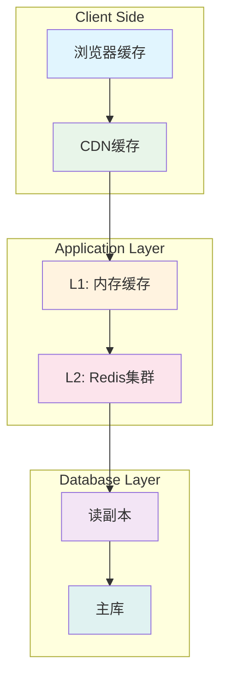

# 缓存策略和扩展方案

## 🎯 缓存架构设计

### 多级缓存架构


## 📦 缓存策略实现

### 1. L1 内存缓存（应用级）
```javascript
// 内存缓存实现
class MemoryCache {
  constructor(options = {}) {
    this.cache = new Map();
    this.maxSize = options.maxSize || 1000;
    this.defaultTTL = options.defaultTTL || 300000; // 5分钟
    this.cleanupInterval = options.cleanupInterval || 60000; // 1分钟

    // 定期清理过期缓存
    this.startCleanup();
  }

  set(key, value, ttl = this.defaultTTL) {
    // 检查缓存大小
    if (this.cache.size >= this.maxSize) {
      this.evictLRU();
    }

    const item = {
      value,
      expiry: Date.now() + ttl,
      hits: 0,
      lastAccessed: Date.now()
    };

    this.cache.set(key, item);
  }

  get(key) {
    const item = this.cache.get(key);

    if (!item) {
      return null;
    }

    // 检查是否过期
    if (Date.now() > item.expiry) {
      this.cache.delete(key);
      return null;
    }

    // 更新访问信息
    item.hits++;
    item.lastAccessed = Date.now();

    return item.value;
  }

  delete(key) {
    return this.cache.delete(key);
  }

  clear() {
    this.cache.clear();
  }

  evictLRU() {
    let oldestKey = null;
    let oldestTime = Infinity;

    for (const [key, item] of this.cache.entries()) {
      if (item.lastAccessed < oldestTime) {
        oldestTime = item.lastAccessed;
        oldestKey = key;
      }
    }

    if (oldestKey) {
      this.cache.delete(oldestKey);
    }
  }

  startCleanup() {
    setInterval(() => {
      const now = Date.now();
      for (const [key, item] of this.cache.entries()) {
        if (now > item.expiry) {
          this.cache.delete(key);
        }
      }
    }, this.cleanupInterval);
  }

  getStats() {
    return {
      size: this.cache.size,
      maxSize: this.maxSize,
      hitRate: this.calculateHitRate()
    };
  }

  calculateHitRate() {
    let totalHits = 0;
    let totalAccesses = 0;

    for (const item of this.cache.values()) {
      totalHits += item.hits;
      totalAccesses += item.hits + 1;
    }

    return totalAccesses > 0 ? (totalHits / totalAccesses) * 100 : 0;
  }
}

// 单例模式
const memoryCache = new MemoryCache({
  maxSize: 500,
  defaultTTL: 600000 // 10分钟
});

module.exports = memoryCache;
```

### 2. L2 Redis集群缓存
```javascript
// Redis集群配置
const Redis = require('ioredis');

class RedisCluster {
  constructor() {
    this.cluster = null;
    this.nodes = this.getRedisNodes();
    this.initialize();
  }

  getRedisNodes() {
    const redisNodes = [];
    const nodeCount = 6; // 3主3从

    for (let i = 0; i < nodeCount; i++) {
      redisNodes.push({
        host: process.env[`REDIS_NODE_${i}_HOST`] || 'localhost',
        port: process.env[`REDIS_NODE_${i}_PORT`] || 7000 + i,
        password: process.env.REDIS_PASSWORD
      });
    }

    return redisNodes;
  }

  async initialize() {
    this.cluster = new Redis.Cluster(this.nodes, {
      redisOptions: {
        password: process.env.REDIS_PASSWORD,
        retryDelayOnFailover: 100,
        maxRetriesPerRequest: 3,
        lazyConnect: true
      },
      enableOfflineQueue: false,
      scaleReads: 'slave',
      commandTimeout: 5000
    });

    // 监听集群事件
    this.cluster.on('connect', () => {
      console.log('Redis集群连接成功');
    });

    this.cluster.on('error', (error) => {
      console.error('Redis集群错误:', error);
    });

    this.cluster.on('node error', (error, node) => {
      console.error(`Redis节点 ${node.options.host}:${node.options.port} 错误:`, error);
    });
  }

  // 缓存操作封装
  async set(key, value, ttl = 3600) {
    const serializedValue = JSON.stringify(value);
    return await this.cluster.setex(key, ttl, serializedValue);
  }

  async get(key) {
    const value = await this.cluster.get(key);
    return value ? JSON.parse(value) : null;
  }

  async del(key) {
    return await this.cluster.del(key);
  }

  async exists(key) {
    return await this.cluster.exists(key);
  }

  async expire(key, ttl) {
    return await this.cluster.expire(key, ttl);
  }

  // 批量操作
  async mget(keys) {
    const values = await this.cluster.mget(keys);
    return values.map(v => v ? JSON.parse(v) : null);
  }

  async mset(keyValuePairs, ttl = 3600) {
    const pipeline = this.cluster.pipeline();

    for (const [key, value] of keyValuePairs) {
      const serializedValue = JSON.stringify(value);
      pipeline.setex(key, ttl, serializedValue);
    }

    return await pipeline.exec();
  }

  // 缓存模式
  async getOrSet(key, fetchFunction, ttl = 3600) {
    let value = await this.get(key);

    if (!value) {
      value = await fetchFunction();
      if (value) {
        await this.set(key, value, ttl);
      }
    }

    return value;
  }

  // 发布订阅
  async publish(channel, message) {
    return await this.cluster.publish(channel, JSON.stringify(message));
  }

  async subscribe(channel, callback) {
    const subscriber = new Redis.Cluster(this.nodes);

    subscriber.subscribe(channel, (err, count) => {
      if (err) {
        console.error('订阅失败:', err);
        return;
      }
      console.log(`订阅频道 ${channel}, 当前订阅数: ${count}`);
    });

    subscriber.on('message', (channel, message) => {
      try {
        const data = JSON.parse(message);
        callback(data);
      } catch (error) {
        console.error('消息解析失败:', error);
      }
    });

    return subscriber;
  }

  // 获取集群状态
  async getClusterInfo() {
    return await this.cluster.cluster('info');
  }

  // 获取节点信息
  async getNodes() {
    return await this.cluster.cluster('nodes');
  }

  async close() {
    if (this.cluster) {
      await this.cluster.quit();
    }
  }
}

module.exports = RedisCluster;
```

### 3. 统一缓存服务
```javascript
// 统一缓存服务
const MemoryCache = require('./memoryCache');
const RedisCluster = require('./redisCluster');

class CacheService {
  constructor() {
    this.memoryCache = MemoryCache;
    this.redisCluster = new RedisCluster();
    this.cacheStats = {
      hits: 0,
      misses: 0,
      l1Hits: 0,
      l2Hits: 0
    };
  }

  // 缓存获取（多级缓存）
  async get(key, options = {}) {
    const {
      useL1 = true,
      useL2 = true,
      fallbackFunction = null
    } = options;

    let value = null;

    // L1缓存检查
    if (useL1) {
      value = this.memoryCache.get(key);
      if (value) {
        this.cacheStats.hits++;
        this.cacheStats.l1Hits++;
        return value;
      }
    }

    // L2缓存检查
    if (useL2) {
      value = await this.redisCluster.get(key);
      if (value) {
        this.cacheStats.hits++;
        this.cacheStats.l2Hits++;

        // 回写L1缓存
        if (useL1) {
          this.memoryCache.set(key, value, 60000); // L1缓存1分钟
        }

        return value;
      }
    }

    // 缓存未命中
    this.cacheStats.misses++;

    // 执行回退函数
    if (fallbackFunction) {
      value = await fallbackFunction();
      if (value) {
        await this.set(key, value);
      }
    }

    return value;
  }

  // 缓存设置
  async set(key, value, options = {}) {
    const {
      ttl = 3600,
      useL1 = true,
      useL2 = true,
      l1TTL = 60000 // L1默认1分钟
    } = options;

    const promises = [];

    // 设置L1缓存
    if (useL1) {
      this.memoryCache.set(key, value, l1TTL);
    }

    // 设置L2缓存
    if (useL2) {
      promises.push(this.redisCluster.set(key, value, ttl));
    }

    if (promises.length > 0) {
      await Promise.all(promises);
    }

    return true;
  }

  // 缓存删除
  async del(key, options = {}) {
    const { useL1 = true, useL2 = true } = options;
    const promises = [];

    if (useL1) {
      this.memoryCache.delete(key);
    }

    if (useL2) {
      promises.push(this.redisCluster.del(key));
    }

    if (promises.length > 0) {
      await Promise.all(promises);
    }

    return true;
  }

  // 模式匹配删除
  async delPattern(pattern) {
    const keys = await this.redisCluster.keys(pattern);
    if (keys.length > 0) {
      await this.redisCluster.del(...keys);
    }
    return keys.length;
  }

  // 缓存预热
  async warmup(dataLoader) {
    const warmupData = await dataLoader();
    const batchSize = 100;

    for (let i = 0; i < warmupData.length; i += batchSize) {
      const batch = warmupData.slice(i, i + batchSize);
      const promises = batch.map(item =>
        this.set(item.key, item.value, item.options)
      );
      await Promise.all(promises);
    }

    console.log(`预热完成，共加载 ${warmupData.length} 个缓存项`);
  }

  // 缓存统计
  getStats() {
    return {
      ...this.cacheStats,
      hitRate: this.calculateHitRate(),
      memoryCache: this.memoryCache.getStats()
    };
  }

  calculateHitRate() {
    const total = this.cacheStats.hits + this.cacheStats.misses;
    return total > 0 ? (this.cacheStats.hits / total) * 100 : 0;
  }

  // 缓存键生成
  generateKey(namespace, identifier, params = {}) {
    const paramString = Object.keys(params)
      .sort()
      .map(key => `${key}:${params[key]}`)
      .join(':');

    return `${namespace}:${identifier}${paramString ? ':' + paramString : ''}`;
  }

  // 标签化缓存
  async setWithTags(key, value, tags = [], options = {}) {
    await this.set(key, value, options);

    // 建立标签映射
    const tagPromises = tags.map(tag =>
      this.redisCluster.sadd(`tag:${tag}`, key)
    );

    await Promise.all(tagPromises);
  }

  async getByTag(tag) {
    const keys = await this.redisCluster.smembers(`tag:${tag}`);
    if (keys.length === 0) return [];

    const values = await this.redisCluster.mget(keys);
    return values.map(v => v ? JSON.parse(v) : null);
  }

  async delByTag(tag) {
    const keys = await this.redisCluster.smembers(`tag:${tag}`);
    if (keys.length === 0) return 0;

    // 删除缓存项
    await this.redisCluster.del(...keys);

    // 删除标签映射
    await this.redisCluster.del(`tag:${tag}`);

    return keys.length;
  }
}

module.exports = new CacheService();
```

## 🎯 业务缓存策略

### 1. 用户缓存策略
```javascript
// 用户服务缓存
const cacheService = require('../services/cacheService');

class UserCacheStrategy {
  // 用户信息缓存
  static async getUserById(userId) {
    const key = cacheService.generateKey('user', userId);
    return await cacheService.get(key, {
      fallbackFunction: async () => {
        const user = await User.findById(userId)
          .populate('villageId')
          .lean();
        return user;
      }
    });
  }

  static async setUserById(userId, user) {
    const key = cacheService.generateKey('user', userId);
    return await cacheService.set(key, user, {
      ttl: 1800, // 30分钟
      l1TTL: 300000 // L1缓存5分钟
    });
  }

  // 用户权限缓存
  static async getUserPermissions(userId) {
    const key = cacheService.generateKey('user', userId, { type: 'permissions' });
    return await cacheService.get(key, {
      fallbackFunction: async () => {
        const user = await User.findById(userId).populate('roles');
        return await this.calculatePermissions(user.roles);
      }
    });
  }

  // 批量用户缓存
  static async getUsersByIds(userIds) {
    const keys = userIds.map(id =>
      cacheService.generateKey('user', id)
    );

    const cachedUsers = await cacheService.redisCluster.mget(keys);
    const results = [];
    const uncachedIds = [];

    cachedUsers.forEach((user, index) => {
      if (user) {
        results[index] = JSON.parse(user);
      } else {
        uncachedIds.push(userIds[index]);
      }
    });

    // 查询未缓存的用户
    if (uncachedIds.length > 0) {
      const uncachedUsers = await User.find({
        _id: { $in: uncachedIds }
      }).lean();

      // 缓存新查询的用户
      const cachePromises = uncachedUsers.map(user => {
        const index = userIds.indexOf(user._id.toString());
        results[index] = user;
        return this.setUserById(user._id.toString(), user);
      });

      await Promise.all(cachePromises);
    }

    return results;
  }

  static calculatePermissions(roles) {
    // 计算用户权限逻辑
    const permissions = new Set();

    roles.forEach(role => {
      role.permissions.forEach(permission => {
        permissions.add(permission);
      });
    });

    return Array.from(permissions);
  }

  // 缓存失效
  static async invalidateUser(userId) {
    const pattern = cacheService.generateKey('user', userId) + '*';
    return await cacheService.delPattern(pattern);
  }

  static async invalidateUserPermissions(userId) {
    const key = cacheService.generateKey('user', userId, { type: 'permissions' });
    return await cacheService.del(key);
  }
}
```

### 2. 村庄数据缓存策略
```javascript
class VillageCacheStrategy {
  // 村庄基本信息缓存
  static async getVillageById(villageId) {
    const key = cacheService.generateKey('village', villageId);
    return await cacheService.get(key, {
      fallbackFunction: async () => {
        const village = await Village.findById(villageId).lean();
        return village;
      }
    });
  }

  // 村庄统计数据缓存
  static async getVillageStatistics(villageId, dateRange) {
    const key = cacheService.generateKey('village', villageId, {
      type: 'statistics',
      startDate: dateRange.start,
      endDate: dateRange.end
    });

    return await cacheService.get(key, {
      fallbackFunction: async () => {
        const stats = await this.calculateVillageStatistics(villageId, dateRange);
        return stats;
      },
      ttl: 3600 // 统计数据缓存1小时
    });
  }

  // 村民列表缓存
  static async getVillageResidents(villageId, options = {}) {
    const {
      page = 1,
      limit = 20,
      search = '',
      status = 'active'
    } = options;

    const key = cacheService.generateKey('village', villageId, {
      type: 'residents',
      page,
      limit,
      search: search.toLowerCase(),
      status
    });

    return await cacheService.get(key, {
      fallbackFunction: async () => {
        const query = {
          villageId,
          status
        };

        if (search) {
          query.$or = [
            { 'profile.firstName': { $regex: search, $options: 'i' } },
            { 'profile.lastName': { $regex: search, $options: 'i' } },
            { username: { $regex: search, $options: 'i' } }
          ];
        }

        const residents = await User.find(query)
          .select('username profile.status villageId')
          .limit(limit)
          .skip((page - 1) * limit)
          .sort({ 'profile.firstName': 1 })
          .lean();

        const total = await User.countDocuments(query);

        return {
          residents,
          pagination: {
            page,
            limit,
            total,
            totalPages: Math.ceil(total / limit)
          }
        };
      },
      ttl: 600 // 列表缓存10分钟
    });
  }

  // 热点数据缓存
  static async warmupVillageCache(villageId) {
    const warmupData = [
      // 基本信息
      {
        key: cacheService.generateKey('village', villageId),
        value: await Village.findById(villageId).lean(),
        options: { ttl: 1800 }
      },
      // 今日统计数据
      {
        key: cacheService.generateKey('village', villageId, {
          type: 'statistics',
          date: new Date().toISOString().split('T')[0]
        }),
        value: await this.getTodayStatistics(villageId),
        options: { ttl: 300 }
      },
      // 紧急联系人
      {
        key: cacheService.generateKey('village', villageId, {
          type: 'emergency_contacts'
        }),
        value: await this.getEmergencyContacts(villageId),
        options: { ttl: 3600 }
      }
    ];

    const promises = warmupData.map(item =>
      cacheService.set(item.key, item.value, item.options)
    );

    await Promise.all(promises);
  }
}
```

### 3. 财务数据缓存策略
```javascript
class FinanceCacheStrategy {
  // 财务交易列表缓存
  static async getTransactions(filters, pagination) {
    const {
      villageId,
      category,
      startDate,
      endDate,
      status
    } = filters;

    const { page = 1, limit = 20 } = pagination;

    const key = cacheService.generateKey('finance', 'transactions', {
      villageId,
      category,
      startDate,
      endDate,
      status,
      page,
      limit
    });

    return await cacheService.get(key, {
      fallbackFunction: async () => {
        const query = { villageId };

        if (category) {
          query['category.main'] = category;
        }

        if (startDate || endDate) {
          query.transactionDate = {};
          if (startDate) query.transactionDate.$gte = startDate;
          if (endDate) query.transactionDate.$lte = endDate;
        }

        if (status) {
          query['approval.status'] = status;
        }

        const transactions = await Transaction.find(query)
          .populate('relatedTo.householdId', 'householdCode')
          .populate('relatedTo.userId', 'username profile')
          .sort({ transactionDate: -1 })
          .limit(limit)
          .skip((page - 1) * limit)
          .lean();

        const total = await Transaction.countDocuments(query);

        return {
          transactions,
          pagination: {
            page,
            limit,
            total,
            totalPages: Math.ceil(total / limit)
          }
        };
      },
      ttl: 300 // 交易数据缓存5分钟
    });
  }

  // 财务报表缓存
  static async getFinancialReport(villageId, reportType, period) {
    const key = cacheService.generateKey('finance', 'report', {
      villageId,
      reportType,
      period
    });

    return await cacheService.get(key, {
      fallbackFunction: async () => {
        switch (reportType) {
          case 'monthly':
            return await this.generateMonthlyReport(villageId, period);
          case 'quarterly':
            return await this.generateQuarterlyReport(villageId, period);
          case 'yearly':
            return await this.generateYearlyReport(villageId, period);
          default:
            throw new Error(`不支持的报表类型: ${reportType}`);
        }
      },
      ttl: 1800 // 报表缓存30分钟
    });
  }

  // 预算执行情况缓存
  static async getBudgetExecution(villageId, budgetId) {
    const key = cacheService.generateKey('finance', 'budget_execution', {
      villageId,
      budgetId
    });

    return await cacheService.get(key, {
      fallbackFunction: async () => {
        const budget = await Budget.findById(budgetId);
        const transactions = await Transaction.find({
          'budget.budgetId': budgetId,
          'approval.status': 'approved'
        });

        const totalSpent = transactions.reduce((sum, t) => sum + t.amount.value, 0);
        const remainingBudget = budget.totalAmount - totalSpent;
        const executionRate = (totalSpent / budget.totalAmount) * 100;

        return {
          budget: budget,
          totalSpent,
          remainingBudget,
          executionRate,
          transactionCount: transactions.length
        };
      },
      ttl: 600 // 预算执行情况缓存10分钟
    });
  }
}
```

## 🚀 系统扩展方案

### 1. 水平扩展架构
```javascript
// 服务扩展配置
const scalingConfig = {
  // 自动扩缩容配置
  autoScaling: {
    minInstances: 2,
    maxInstances: 20,
    targetCPUUtilization: 70,
    targetMemoryUtilization: 80,
    scaleUpCooldown: 300, // 5分钟
    scaleDownCooldown: 600 // 10分钟
  },

  // 负载均衡配置
  loadBalancer: {
    algorithm: 'least_connections',
    healthCheck: {
      path: '/health',
      interval: 30,
      timeout: 5,
      retries: 3
    },
    stickySession: true
  },

  // 服务发现配置
  serviceDiscovery: {
    enabled: true,
    registry: 'consul',
    healthCheckInterval: 30,
    deregisterAfter: 90
  }
};

// 扩展管理器
class ScalingManager {
  constructor() {
    this.currentInstances = 2;
    this.metrics = new Map();
    this.lastScaleAction = Date.now();
  }

  // 监控系统指标
  async collectMetrics() {
    const metrics = {
      cpu: await this.getCPUUsage(),
      memory: await this.getMemoryUsage(),
      requests: await this.getRequestRate(),
      responseTime: await this.getAverageResponseTime()
    };

    this.metrics.set(Date.now(), metrics);
    return metrics;
  }

  // 扩容决策
  async shouldScaleUp() {
    if (Date.now() - this.lastScaleAction < scalingConfig.autoScaling.scaleUpCooldown) {
      return false;
    }

    const metrics = await this.collectMetrics();

    return (
      metrics.cpu > scalingConfig.autoScaling.targetCPUUtilization ||
      metrics.memory > scalingConfig.autoScaling.targetMemoryUtilization ||
      this.currentInstances < scalingConfig.autoScaling.minInstances
    );
  }

  // 缩容决策
  async shouldScaleDown() {
    if (Date.now() - this.lastScaleAction < scalingConfig.autoScaling.scaleDownCooldown) {
      return false;
    }

    if (this.currentInstances <= scalingConfig.autoScaling.minInstances) {
      return false;
    }

    const metrics = await this.collectMetrics();

    return (
      metrics.cpu < scalingConfig.autoScaling.targetCPUUtilization * 0.5 &&
      metrics.memory < scalingConfig.autoScaling.targetMemoryUtilization * 0.5
    );
  }

  // 执行扩容
  async scaleUp() {
    if (this.currentInstances >= scalingConfig.autoScaling.maxInstances) {
      console.log('已达到最大实例数限制');
      return false;
    }

    const newInstanceId = await this.createInstance();
    await this.registerInstance(newInstanceId);

    this.currentInstances++;
    this.lastScaleAction = Date.now();

    console.log(`扩容完成，当前实例数: ${this.currentInstances}`);
    return true;
  }

  // 执行缩容
  async scaleDown() {
    if (this.currentInstances <= scalingConfig.autoScaling.minInstances) {
      return false;
    }

    const instanceToRemove = await this.selectInstanceToRemove();
    await this.deregisterInstance(instanceToRemove);
    await this.terminateInstance(instanceToRemove);

    this.currentInstances--;
    this.lastScaleAction = Date.now();

    console.log(`缩容完成，当前实例数: ${this.currentInstances}`);
    return true;
  }

  // 创建新实例
  async createInstance() {
    // 实际实现中这里会调用云服务商API
    const instanceId = `instance-${Date.now()}`;

    // 启动新容器
    await this.startContainer(instanceId);

    return instanceId;
  }
}
```

### 2. 数据库扩展方案
```javascript
// 数据库分片管理
class DatabaseShardingManager {
  constructor() {
    this.shards = new Map();
    this.shardConfig = this.loadShardConfig();
  }

  loadShardConfig() {
    return {
      villages: {
        shardKey: 'villageId',
        strategy: 'hashed',
        shards: [
          { id: 'shard1', host: 'mongo-shard1:27017' },
          { id: 'shard2', host: 'mongo-shard2:27017' },
          { id: 'shard3', host: 'mongo-shard3:27017' }
        ]
      },
      transactions: {
        shardKey: 'villageId',
        strategy: 'range',
        shards: [
          { id: 'shard4', host: 'mongo-shard4:27017' },
          { id: 'shard5', host: 'mongo-shard5:27017' }
        ]
      }
    };
  }

  // 选择分片
  selectShard(collection, shardKey) {
    const config = this.shardConfig[collection];
    if (!config) {
      throw new Error(`集合 ${collection} 没有配置分片`);
    }

    switch (config.strategy) {
      case 'hashed':
        return this.hashSharding(shardKey, config.shards);
      case 'range':
        return this.rangeSharding(shardKey, config.shards);
      default:
        throw new Error(`不支持的分片策略: ${config.strategy}`);
    }
  }

  // 哈希分片
  hashSharding(key, shards) {
    const hash = this.hashCode(key);
    const index = Math.abs(hash) % shards.length;
    return shards[index];
  }

  // 范围分片
  rangeSharding(key, shards) {
    // 简化的范围分片实现
    const numValue = parseInt(key.toString().replace(/\D/g, ''), 10) || 0;
    const index = numValue % shards.length;
    return shards[index];
  }

  // 获取分片连接
  async getShardConnection(shard) {
    if (!this.shards.has(shard.id)) {
      const connection = await mongoose.createConnection(
        `mongodb://${shard.host}/smart_village`
      );
      this.shards.set(shard.id, connection);
    }
    return this.shards.get(shard.id);
  }

  // 执行分片查询
  async query(collection, query, options = {}) {
    const shardKey = query[this.shardConfig[collection]?.shardKey];

    if (shardKey) {
      // 单分片查询
      const shard = this.selectShard(collection, shardKey);
      const connection = await this.getShardConnection(shard);
      const Model = connection.model(collection);

      return await Model.find(query, options.projection)
        .sort(options.sort)
        .limit(options.limit)
        .skip(options.skip);
    } else {
      // 跨分片查询（聚合）
      return await this.aggregateAcrossShards(collection, query, options);
    }
  }

  // 跨分片聚合查询
  async aggregateAcrossShards(collection, pipeline, options = {}) {
    const config = this.shardConfig[collection];
    const shardPromises = config.shards.map(async (shard) => {
      const connection = await this.getShardConnection(shard);
      const Model = connection.model(collection);

      return await Model.aggregate(pipeline, options);
    });

    const results = await Promise.all(shardPromises);

    // 合并结果
    return this.mergeAggregationResults(results, pipeline);
  }

  // 合并聚合结果
  mergeAggregationResults(results, pipeline) {
    if (!pipeline.some(stage => stage.$group)) {
      // 简单分组合并
      return results.flat();
    }

    // 复杂聚合结果合并逻辑
    const merged = {};

    results.forEach(result => {
      result.forEach(item => {
        const key = JSON.stringify(item._id);
        if (!merged[key]) {
          merged[key] = { ...item };
        } else {
          // 合并数值字段
          Object.keys(item).forEach(field => {
            if (field !== '_id' && typeof item[field] === 'number') {
              merged[key][field] += item[field];
            }
          });
        }
      });
    });

    return Object.values(merged);
  }
}
```

### 3. 缓存集群扩展
```javascript
// 缓存集群管理
class CacheClusterManager {
  constructor() {
    this.clusters = new Map();
    this.nodeStatus = new Map();
    this.initializeClusters();
  }

  initializeClusters() {
    // 初始化多个Redis集群
    this.clusters.set('primary', new RedisCluster('primary'));
    this.clusters.set('secondary', new RedisCluster('secondary'));
    this.clusters.set('session', new RedisCluster('session'));
  }

  // 智能路由
  routeToCluster(key, operation) {
    const keyHash = this.hashCode(key);
    const clusterIndex = Math.abs(keyHash) % this.clusters.size;
    const clusterName = Array.from(this.clusters.keys())[clusterIndex];

    return this.clusters.get(clusterName);
  }

  // 分布式缓存操作
  async distributedSet(key, value, options = {}) {
    const { redundancy = 2, ttl = 3600 } = options;
    const clusters = Array.from(this.clusters.values());

    // 选择多个集群进行冗余存储
    const selectedClusters = this.selectClustersForRedundancy(clusters, redundancy);

    const promises = selectedClusters.map(cluster =>
      cluster.set(key, value, ttl)
    );

    return await Promise.allSettled(promises);
  }

  async distributedGet(key) {
    const clusters = Array.from(this.clusters.values());

    // 并行从所有集群读取
    const promises = clusters.map(cluster =>
      cluster.get(key).catch(() => null)
    );

    const results = await Promise.all(promises);

    // 返回第一个成功的结果
    return results.find(result => result !== null) || null;
  }

  // 缓存预热
  async warmupCache(dataLoader, clusterName = 'all') {
    if (clusterName === 'all') {
      const promises = Array.from(this.clusters.entries()).map(
        ([name, cluster]) => this.warmupSingleCluster(cluster, dataLoader, name)
      );
      await Promise.all(promises);
    } else {
      const cluster = this.clusters.get(clusterName);
      if (cluster) {
        await this.warmupSingleCluster(cluster, dataLoader, clusterName);
      }
    }
  }

  // 集群健康检查
  async healthCheck() {
    const healthStatus = {};

    for (const [name, cluster] of this.clusters.entries()) {
      try {
        const startTime = Date.now();
        await cluster.ping();
        const latency = Date.now() - startTime;

        healthStatus[name] = {
          status: 'healthy',
          latency,
          lastCheck: new Date()
        };
      } catch (error) {
        healthStatus[name] = {
          status: 'unhealthy',
          error: error.message,
          lastCheck: new Date()
        };
      }
    }

    return healthStatus;
  }

  // 故障转移
  async failover(unhealthyCluster) {
    console.log(`集群 ${unhealthyCluster} 发生故障，开始故障转移`);

    // 将请求路由到健康集群
    const healthyClusters = Array.from(this.clusters.entries())
      .filter(([name]) => name !== unhealthyCluster);

    // 更新路由配置
    this.updateRoutingConfig(healthyClusters);

    // 尝试恢复故障集群
    this.attemptRecovery(unhealthyCluster);
  }

  // 动态添加节点
  async addNode(nodeConfig) {
    const { name, host, port } = nodeConfig;

    const newCluster = new RedisCluster([{ host, port }]);
    await newCluster.initialize();

    this.clusters.set(name, newCluster);

    // 数据迁移
    await this.migrateData(newCluster);

    console.log(`新节点 ${name} 添加成功`);
  }
}
```

## 📊 监控和告警

### 1. 缓存监控
```javascript
// 缓存监控服务
class CacheMonitoringService {
  constructor() {
    this.metrics = new Map();
    this.alerts = [];
    this.startMonitoring();
  }

  startMonitoring() {
    // 每分钟收集指标
    setInterval(() => {
      this.collectMetrics();
    }, 60000);

    // 每5分钟检查告警
    setInterval(() => {
      this.checkAlerts();
    }, 300000);
  }

  async collectMetrics() {
    const timestamp = Date.now();
    const metrics = {
      timestamp,
      memoryCache: await this.getMemoryCacheMetrics(),
      redisCluster: await this.getRedisClusterMetrics(),
      hitRates: await this.calculateHitRates()
    };

    this.metrics.set(timestamp, metrics);

    // 保留最近1小时的数据
    const cutoff = timestamp - 3600000;
    for (const [key] of this.metrics.entries()) {
      if (key < cutoff) {
        this.metrics.delete(key);
      }
    }

    return metrics;
  }

  async getMemoryCacheMetrics() {
    const stats = memoryCache.getStats();

    return {
      size: stats.size,
      maxSize: stats.maxSize,
      hitRate: stats.hitRate,
      memoryUsage: process.memoryUsage().heapUsed / 1024 / 1024 // MB
    };
  }

  async getRedisClusterMetrics() {
    const clusterInfo = await redisCluster.getClusterInfo();
    const nodes = await redisCluster.getNodes();

    return {
      clusterSize: nodes.length,
      memoryUsage: this.parseMemoryUsage(clusterInfo),
      keyCount: await this.getTotalKeyCount(),
      operations: await this.getOperationCounts()
    };
  }

  checkAlerts() {
    const latestMetrics = this.metrics.get(
      Math.max(...this.metrics.keys())
    );

    if (!latestMetrics) return;

    // 内存缓存告警
    if (latestMetrics.memoryCache.hitRate < 70) {
      this.addAlert('LOW_MEMORY_CACHE_HIT_RATE',
        `内存缓存命中率过低: ${latestMetrics.memoryCache.hitRate}%`);
    }

    // Redis内存告警
    if (latestMetrics.redisCluster.memoryUsage > 80) {
      this.addAlert('HIGH_REDIS_MEMORY_USAGE',
        `Redis内存使用率过高: ${latestMetrics.redisCluster.memoryUsage}%`);
    }

    // 集群状态告警
    if (latestMetrics.redisCluster.clusterSize < 3) {
      this.addAlert('REDIS_CLUSTER_INSUFFICIENT',
        'Redis集群节点数量不足');
    }
  }

  addAlert(type, message) {
    const alert = {
      id: Date.now(),
      type,
      message,
      severity: this.getAlertSeverity(type),
      timestamp: new Date(),
      resolved: false
    };

    this.alerts.push(alert);
    this.notifyAlert(alert);
  }

  getAlertSeverity(type) {
    const severityMap = {
      'LOW_MEMORY_CACHE_HIT_RATE': 'warning',
      'HIGH_REDIS_MEMORY_USAGE': 'critical',
      'REDIS_CLUSTER_INSUFFICIENT': 'critical',
      'CACHE_CONNECTION_FAILED': 'critical',
      'SLOW_CACHE_OPERATION': 'warning'
    };
    return severityMap[type] || 'info';
  }

  async notifyAlert(alert) {
    if (alert.severity === 'critical') {
      // 发送紧急通知
      await this.sendEmergencyNotification(alert);
    }

    // 记录日志
    console.error(`缓存告警 [${alert.severity.toUpperCase()}]: ${alert.message}`);
  }

  async sendEmergencyNotification(alert) {
    // 集成通知服务
    const notificationService = require('./notificationService');

    await notificationService.send({
      type: 'emergency',
      title: '缓存系统告警',
      message: alert.message,
      channels: ['sms', 'email', 'push']
    });
  }
}
```

## ✅ 实施计划

### 第一阶段：缓存基础设施（1周）
1. **部署Redis集群**
   - 配置3主3从集群
   - 设置故障转移
   - 配置持久化

2. **实现缓存服务**
   - 统一缓存接口
   - 多级缓存架构
   - 缓存策略实施

### 第二阶段：业务缓存（1周）
1. **核心业务缓存**
   - 用户信息缓存
   - 村庄数据缓存
   - 财务数据缓存

2. **缓存预热机制**
   - 热点数据识别
   - 自动预热策略
   - 定时刷新机制

### 第三阶段：扩展能力（2周）
1. **水平扩展实施**
   - 服务自动扩缩容
   - 负载均衡优化
   - 服务发现配置

2. **数据库分片**
   - 分片策略实施
   - 数据迁移方案
   - 跨分片查询优化

### 第四阶段：监控优化（1周）
1. **监控系统部署**
   - 性能指标收集
   - 实时监控面板
   - 告警规则配置

2. **性能调优**
   - 缓存命中率优化
   - 查询性能提升
   - 系统稳定性增强

## 📈 预期效果

- **响应时间**: API响应时间降低60%
- **并发能力**: 支持10000+并发请求
- **缓存命中率**: 整体命中率>85%
- **系统可用性**: 99.99%可用性保证
- **扩展弹性**: 自动扩缩容，成本优化

通过这些缓存策略和扩展方案，智慧乡村平台将具备处理大规模并发请求的能力，确保在用户量快速增长时依然保持良好的性能表现。