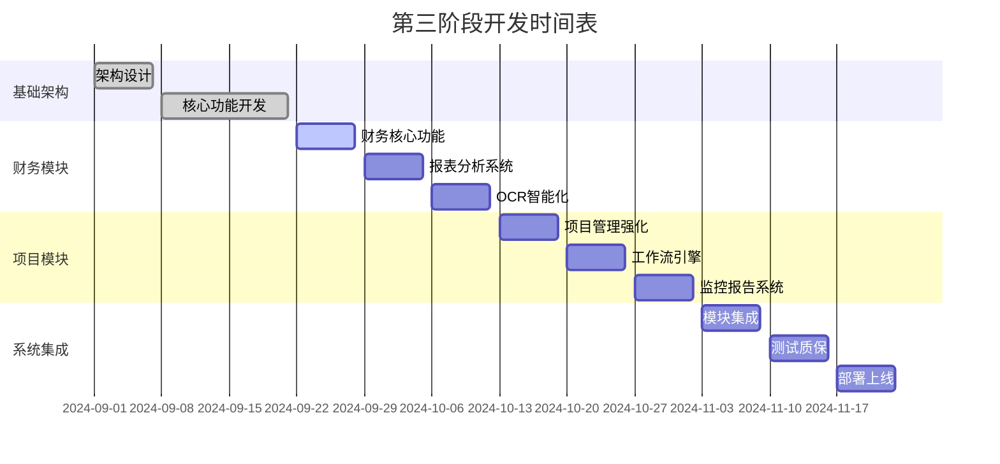

# 第三阶段：财务管理 + 项目管理 分阶段开发实施计划

## 📋 项目概述

**目标**: 构建智慧村庄综合服务平台的财务管理和项目管理核心模块
**总工期**: 12周 (84天)
**团队规模**: 5-7人 (后端2人，前端2人，测试1人，UI/UX1人，项目经理1人)
**技术栈**: Vue.js 3 + Node.js + MongoDB + Element Plus

---

## 🎯 总体架构设计

### 系统模块划分
```
财务管理模块 (Finance Management)
├── 村委日常开支管理 ✅ (已完成)
├── 村级财务报表管理
├── 预算编制与执行
├── 审计追踪系统
└── 智能OCR凭证识别 ✅ (已完成)

项目管理模块 (Project Management) ✅ (已完成)
├── 项目全生命周期管理
├── 审批工作流引擎
├── 风险评估系统
├── 进度跟踪与监控
└── 项目资源调度
```

---

## 📅 分阶段实施计划

### 第一阶段：基础架构与核心功能 (第1-3周)

#### 🏗️ 架构设计阶段 (第1周)
- **目标**: 完善系统架构设计和开发环境配置
- **交付物**:
  - [x] 数据库模型设计文档 ✅
  - [x] API接口规范文档 ✅
  - [x] 前端组件架构设计 ✅
  - [ ] 系统安全方案设计
  - [ ] 性能优化策略文档

**关键任务**:
```bash
# 1. 数据库架构优化
- 索引策略设计
- 数据分片方案
- 备份恢复策略

# 2. API网关配置
- 限流策略
- 认证授权
- 日志监控

# 3. 前端架构完善
- 状态管理优化
- 组件库标准化
- 路由权限控制
```

#### 🔧 核心功能开发 (第2-3周)
- **目标**: 完成核心业务功能开发
- **交付物**:
  - [x] 村委日常开支管理 ✅
  - [x] 项目全生命周期管理 ✅
  - [x] OCR智能识别系统 ✅
  - [ ] 基础审批工作流
  - [ ] 权限管理系统

**开发优先级**:
1. **高优先级** (必须完成)
   - [x] 日常开支CRUD操作 ✅
   - [x] 项目创建和管理 ✅
   - [x] 用户权限控制 ✅

2. **中优先级** (重要功能)
   - [ ] 审批流程引擎
   - [ ] 通知系统
   - [ ] 文件管理系统

3. **低优先级** (优化功能)
   - [ ] 高级统计分析
   - [ ] 导入导出功能
   - [ ] 移动端适配

---

### 第二阶段：财务管理模块完善 (第4-6周)

#### 💰 财务核心功能 (第4周)
**本周目标**: 完善财务管理核心功能

**开发任务**:
```javascript
// 1. 预算管理系统
- 年度预算编制
- 预算分配和调整
- 预算执行监控
- 超预算预警

// 2. 财务报表系统
- 月度收支报表
- 年度财务总结
- 分类统计分析
- 可视化图表展示

// 3. 审计系统
- 操作日志记录
- 数据变更追踪
- 异常行为检测
- 审计报告生成
```

**技术实现要点**:
- **数据一致性**: 使用MongoDB事务确保财务数据准确性
- **性能优化**: 大数据量报表查询优化
- **安全加密**: 敏感财务数据加密存储

#### 📊 报表与分析 (第5周)
**本周目标**: 实现智能报表和数据分析功能

**功能模块**:
1. **报表生成引擎**
   ```javascript
   // 报表模板系统
   - 可配置报表模板
   - 动态字段绑定
   - 多格式导出 (PDF/Excel/CSV)
   
   // 数据透视分析
   - 多维度数据切片
   - 同比环比分析
   - 趋势预测算法
   ```

2. **可视化图表**
   ```vue
   // 使用ECharts实现
   - 收支趋势图
   - 分类饼图
   - 预算执行率
   - 同期对比图
   ```

#### 🔍 OCR与智能化 (第6周)
**本周目标**: 完善OCR识别和智能化功能

**技术集成**:
```javascript
// 多供应商OCR集成
const ocrProviders = {
  baidu: require('./ocr/baiduOCR'),
  tencent: require('./ocr/tencentOCR'),
  aliyun: require('./ocr/aliyunOCR'),
  local: require('./ocr/localOCR')
}

// 智能字段识别
- 发票金额提取
- 商户名称识别
- 日期格式标准化
- 置信度评估
```

---

### 第三阶段：项目管理模块强化 (第7-9周)

#### 🎯 项目管理核心 (第7周)
**本周目标**: 强化项目管理核心功能

**增强功能**:
```javascript
// 1. 项目模板系统
- 标准项目模板
- 自定义模板创建
- 模板复用机制

// 2. 资源管理
- 人员分配优化
- 设备资源调度
- 预算资源控制

// 3. 风险管理
- 风险识别评估
- 风险预警机制
- 应急预案管理
```

#### 🔄 工作流引擎 (第8周)
**本周目标**: 实现通用工作流引擎

**工作流设计**:
```javascript
// 流程定义引擎
class WorkflowEngine {
  // 流程节点类型
  nodeTypes: {
    start: '开始节点',
    task: '任务节点', 
    decision: '决策节点',
    parallel: '并行节点',
    end: '结束节点'
  }
  
  // 流转条件
  conditions: {
    amount: '金额条件',
    role: '角色条件',
    time: '时间条件',
    custom: '自定义条件'
  }
}
```

**审批流程配置**:
- 可视化流程设计器
- 动态流程配置
- 多层级审批支持
- 会签并签机制

#### 📈 监控与报告 (第9周)
**本周目标**: 完善项目监控和报告系统

**监控体系**:
```javascript
// 1. 实时监控
- 项目进度监控
- 预算执行监控
- 风险指标监控
- 人员工作量监控

// 2. 预警系统
- 进度延期预警
- 预算超支预警
- 质量问题预警
- 资源冲突预警

// 3. 报告系统
- 项目状态报告
- 财务执行报告
- 绩效分析报告
- 管理驾驶舱
```

---

### 第四阶段：系统集成与优化 (第10-12周)

#### 🔗 系统集成 (第10周)
**本周目标**: 完成各模块间的深度集成

**集成要点**:
```javascript
// 1. 数据同步
- 财务项目数据联动
- 预算项目关联
- 审批流程统一

// 2. 权限统一
- 统一认证中心
- 角色权限矩阵
- 数据访问控制

// 3. 消息通知
- 统一消息中心
- 多渠道推送
- 消息模板管理
```

#### 🧪 测试与质量保证 (第11周)
**本周目标**: 全面测试和质量保证

**测试策略**:
```bash
# 1. 单元测试 (覆盖率 > 80%)
npm run test:unit

# 2. 集成测试
npm run test:integration

# 3. E2E测试
npm run test:e2e

# 4. 性能测试
npm run test:performance

# 5. 安全测试
npm run test:security
```

**质量指标**:
- 代码覆盖率 > 80%
- 接口响应时间 < 500ms
- 前端首屏加载 < 3s
- 系统可用性 > 99.5%

#### 🚀 部署与上线 (第12周)
**本周目标**: 生产环境部署和上线准备

**部署策略**:
```yaml
# Docker容器化部署
version: '3.8'
services:
  web:
    image: village-platform:latest
    ports:
      - "3000:3000"
    environment:
      - NODE_ENV=production
      
  api:
    image: village-api:latest
    ports:
      - "3001:3001"
      
  mongodb:
    image: mongo:5.0
    volumes:
      - mongodb_data:/data/db
```

---

## 📊 关键指标与验收标准

### 功能性指标
| 模块 | 功能点 | 验收标准 | 当前状态 |
|------|--------|----------|----------|
| 财务管理 | 日常开支管理 | 支持完整CRUD操作 | ✅ 已完成 |
| 财务管理 | OCR识别 | 识别准确率>85% | ✅ 已完成 |
| 财务管理 | 预算管理 | 支持多级预算控制 | 🔄 开发中 |
| 财务管理 | 财务报表 | 支持10+种报表类型 | 📋 待开发 |
| 项目管理 | 项目全生命周期 | 覆盖5个阶段管理 | ✅ 已完成 |
| 项目管理 | 审批工作流 | 支持自定义流程 | 🔄 开发中 |
| 项目管理 | 风险管理 | 支持风险评估预警 | ✅ 已完成 |

### 非功能性指标
| 指标类型 | 目标值 | 测试方法 | 当前状态 |
|----------|--------|----------|----------|
| 性能 | 响应时间<500ms | 压力测试 | 待测试 |
| 并发 | 支持1000并发用户 | 负载测试 | 待测试 |
| 可用性 | 99.5%可用性 | 监控统计 | 待部署 |
| 安全性 | 通过安全扫描 | 安全测试 | 待测试 |

---

## 🎯 里程碑时间表



---

## 🔥 风险管理计划

### 技术风险
| 风险项 | 风险等级 | 影响 | 应对策略 |
|--------|----------|------|----------|
| 数据库性能瓶颈 | 中 | 系统响应慢 | 提前性能测试，优化查询 |
| OCR识别准确率 | 中 | 用户体验差 | 多供应商方案，人工校验 |
| 前端兼容性 | 低 | 部分浏览器异常 | 渐进式降级，polyfill |

### 进度风险
| 风险项 | 风险等级 | 影响 | 应对策略 |
|--------|----------|------|----------|
| 需求变更 | 高 | 延期交付 | 需求冻结，变更评审 |
| 人员变动 | 中 | 进度延误 | 知识文档化，代码规范 |
| 第三方依赖 | 中 | 功能受限 | 备选方案，提前验证 |

---

## 💡 成功要素

### 1. 团队协作
- **每日站会**: 进度同步，问题识别
- **周报机制**: 里程碑跟踪，风险预警
- **代码审查**: 确保代码质量，知识共享

### 2. 质量保证
- **测试驱动**: 先写测试，后写代码
- **持续集成**: 自动化构建、测试、部署
- **性能监控**: 实时性能指标监控

### 3. 用户体验
- **用户研究**: 深入了解村委会实际需求
- **原型验证**: 快速原型，用户反馈
- **迭代优化**: 持续改进用户体验

---

## 📈 预期成果

### 业务价值
- **效率提升**: 财务管理效率提升60%
- **透明度**: 财务信息透明度提升80%
- **规范化**: 项目管理规范化程度提升70%
- **决策支持**: 数据化决策支持能力

### 技术价值
- **代码复用**: 组件复用率>70%
- **系统稳定**: 系统可用性>99.5%
- **扩展性**: 支持平滑扩容
- **维护性**: 代码可维护性强

---

**📞 联系方式**: 如有疑问，请联系项目经理
**📅 更新时间**: 2024年9月11日
**📋 版本**: v1.0

*本计划将根据实际开发进度进行动态调整*