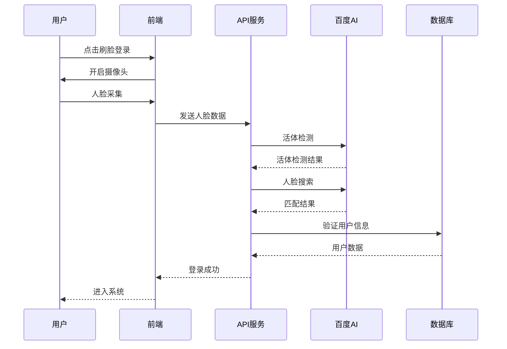

# 智慧乡村平台 - 第二阶段功能完善计划

## 🎯 阶段目标
在MVP基础上，深度融合AI能力，打造智能化、人性化的乡村治理服务平台。

## 📅 时间周期
**3个月**（第4个月 - 第6个月）

## 🚀 核心功能增强

### 1. AI语音交互系统

#### 1.1 语音识别增强
**目标**: 支持老年人通过方言语音与系统交互

**技术实现**:
```javascript
// 已完成 - src/services/voiceService.js
const dialects = {
  'mandarin': { name: '普通话', code: 1537 },
  'yue': { name: '粤语', code: 1637 },
  'hakka': { name: '客家话', code: 1637 },
  'min-nan': { name: '闽南语', code: 1637 },
  'shanghainese': { name: '上海话', code: 1637 },
  'sichuanese': { name: '四川话', code: 1637 },
  'northeastern': { name: '东北话', code: 1637 },
  // ... 支持22种方言
};
```

**功能特性**:
- ✅ 22种方言识别
- ✅ 语音命令识别
- ✅ 实时语音转文字
- ✅ 离线语音缓存

#### 1.2 语音合成（TTS）
**目标**: 将文字信息转换为语音播报

**实现方案**:
```javascript
// 已完成 - voiceService.textToSpeech()
async textToSpeech(options = {}) {
  const {
    text,
    dialect = 'mandarin',
    voice = 'default',
    speed = 5,
    pitch = 5,
    volume = 5
  } = options;

  // 支持方言语音合成
  const voiceMap = {
    'mandarin': 0, // 普通话女声
    'yue': 1,      // 粤语女声
    'shanghainese': 3, // 上海话女声
    // ...
  };
}
```

#### 1.3 智能语音助手
**新增功能**:
- 语音查询村务信息
- 语音办事预约
- 语音紧急求助
- 语音消息回复

### 2. 人脸识别登录系统

#### 2.1 人脸采集与注册
**技术架构**:
```javascript
// 已完成 - src/services/faceRecognitionService.js
class FaceRecognitionService {
  // 人脸检测
  async detectFace(imagePath) {
    // 支持活体检测
    // 返回人脸特征点
  }

  // 人脸注册
  async addFaceToDatabase(imagePath, userId) {
    // 活体检测
    // 人脸特征提取
    // 存储到人脸库
  }
}
```

#### 2.2 刷脸登录流程


#### 2.3 家庭代理认证
**创新功能**:
- 子女代父母操作
- 人脸关系验证
- 远程授权机制

### 3. 完整村务流程

#### 3.1 村务工作流引擎
```javascript
// 新增 - src/services/workflowEngine.js
class WorkflowEngine {
  // 村务决策流程
  async startVillageWorkflow(type, data) {
    const workflow = {
      '公告发布': ['草拟', '审核', '发布', '推送'],
      '经费申请': ['申请', '村委审核', '乡镇审批', '拨款', '执行'],
      '项目立项': ['提案', '公示', '表决', '立项', '实施']
    };
  }
}
```

#### 3.2 村务公开透明化
- 区块链存证
- 全程可追溯
- 智能合约执行
- 民主投票系统

#### 3.3 村务智能分析
```javascript
// 村务数据大屏
const villageMetrics = {
  population: '人口统计',
  finance: '财务透明',
  projects: '项目进度',
  satisfaction: '满意度调查'
};
```

### 4. 电商平台建设

#### 4.1 农产品商城
**功能模块**:
- 商品展示与管理
- 农产品溯源系统
- 价格智能定价
- 订单处理系统

#### 4.2 供销对接平台
```javascript
// src/controllers/ecommerceController.js
class EcommerceController {
  // 农产品发布
  async publishProduct(req, res) {
    // 支持图片、视频
    // 地理位置标记
    // 生产过程记录
  }

  // 批量采购
  async bulkPurchase(req, res) {
    // 集采优惠
    // 物流配送
    // 质量保证
  }
}
```

#### 4.3 便民服务商城
- 农资采购
- 生活用品团购
- 服务预约
- 积分兑换

## 📊 技术深化方案

### 1. AI能力集成

#### 1.1 智能客服
```javascript
// 新增 - src/services/aiAssistant.js
class AIAssistant {
  // 智能问答
  async chat(query, context) {
    // 集成GPT API
    // 上下文理解
    // 多轮对话
  }

  // 政策解读
  async interpretPolicy(policyText) {
    // 关键信息提取
    // 适用人群判断
    // 申请条件分析
  }
}
```

#### 1.2 OCR智能识别增强
```javascript
// 已完成 - src/services/ocrService.js
// 智能填表功能
async smartFormFill(imagePath, template) {
  // 1. OCR识别
  // 2. 字段解析
  // 3. 自动填充
  // 4. 人工审核
}
```

#### 1.3 数据智能分析
- 村民行为分析
- 村务效率评估
- 资源优化建议
- 预测性维护

### 2. 系统性能优化

#### 2.1 缓存策略升级
```javascript
// 三级缓存架构
const cacheStrategy = {
  L1: '内存缓存', // 热点数据
  L2: 'Redis缓存', // 会话数据
  L3: 'CDN缓存',  // 静态资源
};
```

#### 2.2 数据库优化
- 读写分离增强
- 分库分表策略
- 索引优化
- 查询性能监控

#### 2.3 API性能提升
- GraphQL接口
- 批量操作优化
- 并发控制
- 请求限流

## 🎨 用户体验升级

### 1. 适老化设计深化

#### 1.1 大字模式
```css
/* 新增 - assets/css/elderly-mode.css */
.elderly-mode {
  font-size: 18px;
  line-height: 1.8;
  button-height: 48px;
  touch-target: 44px;
}
```

#### 1.2 语音导航
- 全程语音播报
- 语音操作提示
- 一键语音助手
- 方言语音包

#### 1.3 简化流程
- 三步完成操作
- 图标化界面
- 一键直达功能
- 紧急呼叫按钮

### 2. 移动端优化

#### 2.1 小程序开发
```
项目结构:
├── miniprogram/
│   ├── pages/
│   │   ├── index/         # 首页
│   │   ├── village/       # 村务
│   │   ├── service/       # 服务
│   │   └── profile/       # 个人
│   ├── components/
│   └── utils/
```

#### 2.2 PWA应用
- 离线缓存
- 推送通知
- 桌面安装
- 快速启动

### 3. 数据可视化

#### 3.1 村务驾驶舱
- 实时数据展示
- 交互式图表
- 预警提醒
- 报表生成

#### 3.2 移动端报表
- 简化数据展示
- 手势操作
- 离线查看
- 分享功能

## 📈 第二阶段开发计划

### 第4个月：AI能力深化
**Week 13-14: 语音交互增强**
- [ ] 语音助手训练
- [ ] 方言模型优化
- [ ] 语音命令扩展
- [ ] 语音测试集建立

**Week 15-16: 人脸识别完善**
- [ ] 活体检测优化
- [ ] 人脸库管理
- [ ] 家庭关系认证
- [ ] 隐私保护加强

### 第5个月：村务流程优化
**Week 17-18: 工作流引擎**
- [ ] 流程设计器
- [ ] 审批链管理
- [ ] 状态机实现
- [ ] 通知机制完善

**Week 19-20: 村务数据分析**
- [ ] 数据大屏开发
- [ ] 指标体系建立
- [ ] 分析报告生成
- [ ] 预测模型训练

### 第6个月：电商功能开发
**Week 21-22: 商城基础功能**
- [ ] 商品管理系统
- [ ] 订单处理流程
- [ ] 支付接口集成
- [ ] 物流跟踪系统

**Week 23-24: 供销对接平台**
- [ ] 供应商管理
- [ ] 集采系统
- [ ] 质量追溯
- [ ] 结算系统

## 🔧 技术架构升级

### 1. 微服务架构深化
```yaml
服务拆分:
  - user-service: 用户服务
  - village-service: 村务服务
  - ai-service: AI能力服务
  - ecommerce-service: 电商服务
  - notification-service: 通知服务
  - workflow-service: 工作流服务
```

### 2. 容器化部署
```dockerfile
# Dockerfile
FROM node:16-alpine
WORKDIR /app
COPY package*.json ./
RUN npm ci --only=production
COPY . .
EXPOSE 3001
CMD ["npm", "start"]
```

### 3. CI/CD流程
```yaml
# .github/workflows/deploy.yml
name: Deploy
on:
  push:
    branches: [main]
jobs:
  test:
    runs-on: ubuntu-latest
    steps:
      - uses: actions/checkout@v2
      - name: Run tests
        run: npm test
  deploy:
    needs: test
    runs-on: ubuntu-latest
    steps:
      - name: Deploy to production
        run: |
          docker build -t smart-village .
          docker push ${{ secrets.REGISTRY_URL }}
```

## 📊 性能指标目标

### 1. 系统性能
- 响应时间: < 300ms (95%请求)
- 并发用户: 5000+ 同时在线
- AI处理: < 2秒 语音识别
- 人脸识别: < 1秒 验证通过
- 系统可用性: 99.9%

### 2. AI能力指标
- 语音识别准确率: 95%+
- 人脸识别准确率: 99%+
- OCR识别准确率: 98%+
- 智能推荐命中率: 85%+

### 3. 业务指标
- 用户活跃度: 50%月活
- 功能使用率: 80%核心功能
- 用户满意度: 4.5/5分
- 问题解决率: 95%+

## 🎯 第二阶段验收标准

### 功能验收
- [ ] AI语音交互流畅自然
- [ ] 人脸识别安全可靠
- [ ] 村务流程完整闭环
- [ ] 电商功能稳定运行
- [ ] 系统性能达标
- [ ] 用户体验优秀

### 技术验收
- [ ] 微服务架构稳定
- [ ] AI服务响应快速
- [ ] 数据处理高效
- [ ] 安全防护到位
- [ ] 监控体系完善
- [ ] 文档资料齐全

## 🚀 部署方案

### 生产环境配置
```yaml
# kubernetes部署
apiVersion: apps/v1
kind: Deployment
metadata:
  name: smart-village-api
spec:
  replicas: 3
  selector:
    matchLabels:
      app: smart-village
  template:
    spec:
      containers:
      - name: api
        image: smart-village:latest
        ports:
        - containerPort: 3001
        env:
        - name: NODE_ENV
          value: "production"
```

## 📚 文档更新

### 新增文档
1. **AI服务集成指南**: `AI_INTEGRATION_GUIDE.md`
2. **人脸识别安全方案**: `FACE_RECOGNITION_SECURITY.md`
3. **电商平台运营手册**: `ECOMMERCE_OPERATIONS.md`
4. **数据可视化配置**: `DATA_VISUALIZATION_CONFIG.md`

### 技术白皮书
1. 《智慧乡村AI解决方案》
2. 《农村数字化转型实践》
3. 《乡村治理数字化路径》

## 🎉 第二阶段预期成果

1. **AI深度集成**: 语音、人脸、OCR全面应用
2. **村务流程优化**: 数字化、透明化、智能化
3. **电商平台建成**: 产销对接、助农增收
4. **用户体验提升**: 适老化、移动化、智能化
5. **技术架构升级**: 微服务、容器化、高可用

**第二阶段完成后，智慧乡村平台将成为国内领先的乡村治理数字化解决方案！**