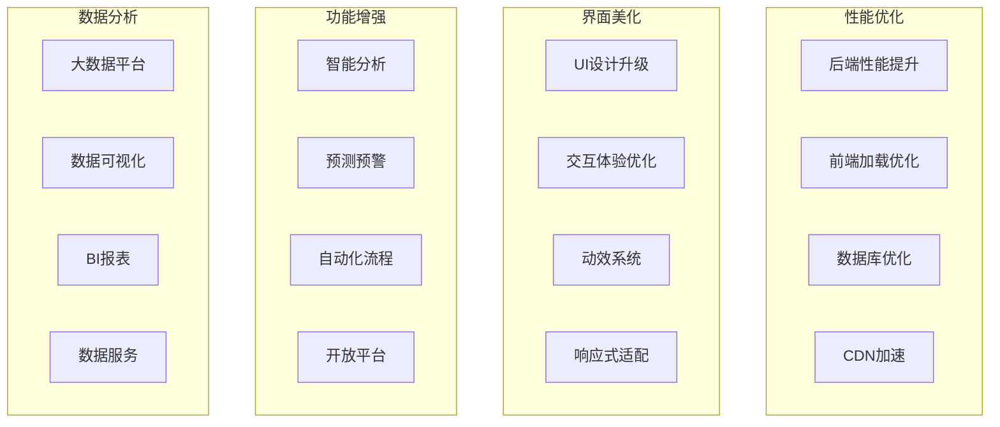

# 智慧乡村平台 - 第三阶段优化升级计划

## 🎯 阶段目标
打造极致用户体验，建立行业领先的乡村治理数字化平台，实现从功能完善到体验卓越的跨越。

## 📅 时间周期
**3个月**（第7个月 - 第9个月）

## 🚀 优化升级全景图



## 1. 性能优化

### 1.1 后端性能提升

#### 1.1.1 代码优化
```javascript
// src/utils/performance.js - 新增性能监控工具
class PerformanceMonitor {
  // API响应时间监控
  trackAPITime(req, res, next) {
    const start = Date.now();
    res.on('finish', () => {
      const duration = Date.now() - start;
      this.logPerformance({
        url: req.url,
        method: req.method,
        duration,
        statusCode: res.statusCode
      });
    });
    next();
  }

  // 内存使用监控
  monitorMemory() {
    const usage = process.memoryUsage();
    return {
      rss: usage.rss / 1024 / 1024 + 'MB',
      heapTotal: usage.heapTotal / 1024 / 1024 + 'MB',
      heapUsed: usage.heapUsed / 1024 / 1024 + 'MB'
    };
  }
}
```

#### 1.1.2 缓存策略升级
```javascript
// src/cache/cacheManager.js - 多级缓存管理
class CacheManager {
  constructor() {
    this.l1Cache = new Map(); // 内存缓存
    this.l2Cache = require('ioredis'); // Redis缓存
    this.l3Cache = new CloudCache(); // CDN缓存
  }

  // 智能缓存策略
  async get(key) {
    // L1: 内存缓存
    if (this.l1Cache.has(key)) {
      return this.l1Cache.get(key);
    }

    // L2: Redis缓存
    const l2Data = await this.l2Cache.get(key);
    if (l2Data) {
      this.l1Cache.set(key, l2Data);
      return l2Data;
    }

    // L3: CDN缓存
    const l3Data = await this.l3Cache.get(key);
    if (l3Data) {
      await this.l2Cache.set(key, l3Data);
      this.l1Cache.set(key, l3Data);
      return l3Data;
    }

    return null;
  }
}
```

#### 1.1.3 数据库连接池优化
```javascript
// src/config/database-optimized.js - 增强版数据库配置
const optimizedConfig = {
  // 连接池配置
  maxPoolSize: 20,           // 最大连接数
  minPoolSize: 5,            // 最小连接数
  maxIdleTimeMS: 30000,      // 最大空闲时间
  waitQueueTimeoutMS: 5000,  // 等待超时

  // 读写分离配置
  readPreference: 'secondaryPreferred',
  readConcern: { level: 'majority' },
  writeConcern: { w: 'majority', j: true },

  // 性能监控
  monitoring: true,
  commandMonitoring: true
};
```

### 1.2 前端性能优化

#### 1.2.1 打包优化
```javascript
// vite.config.js - Vite配置优化
export default defineConfig({
  build: {
    // 代码分割
    rollupOptions: {
      output: {
        manualChunks: {
          'vue-vendor': ['vue', 'vue-router', 'pinia'],
          'ui-vendor': ['element-plus'],
          'utils': ['lodash', 'dayjs'],
          'ai': ['@tensorflow/tfjs', 'face-api.js']
        }
      }
    },

    // 压缩配置
    minify: 'terser',
    terserOptions: {
      compress: {
        drop_console: true,
        drop_debugger: true
      }
    }
  }
});
```

#### 1.2.2 懒加载实现
```javascript
// src/router/index.js - 路由懒加载
const routes = [
  {
    path: '/residents',
    component: () => import('@/views/residents/Index.vue'),
    meta: { preload: true } // 预加载标记
  },
  {
    path: '/ai-chat',
    component: () => import('@/views/ai/Chat.vue'),
    meta: { preload: false }
  }
];

// 预加载策略
const preloadRoutes = () => {
  const links = routes
    .filter(route => route.meta?.preload)
    .map(route => {
      const link = document.createElement('link');
      link.rel = 'prefetch';
      link.href = route.component();
      return link;
    });

  document.head.append(...links);
};
```

#### 1.2.3 虚拟滚动优化
```vue
<!-- src/components/VirtualList.vue -->
<template>
  <div class="virtual-list" @scroll="handleScroll">
    <div class="virtual-list-phantom" :style="{ height: totalHeight + 'px' }"></div>
    <div class="virtual-list-content" :style="{ transform: `translateY(${offsetY}px)` }">
      <div v-for="item in visibleItems" :key="item.id" class="virtual-item">
        <slot :item="item"></slot>
      </div>
    </div>
  </div>
</template>

<script>
export default {
  data() {
    return {
      itemHeight: 60,
      startIndex: 0,
      endIndex: 20
    };
  },
  computed: {
    visibleItems() {
      return this.items.slice(this.startIndex, this.endIndex);
    }
  }
};
</script>
```

### 1.3 CDN加速配置

#### 1.3.1 静态资源CDN
```javascript
// vite.config.js - CDN配置
const cdnConfig = {
  css: [
    'https://cdn.jsdelivr.net/npm/element-plus/dist/index.css'
  ],
  js: [
    'https://cdn.jsdelivr.net/npm/vue@3/dist/vue.global.prod.js'
  ]
};

// 自动注入CDN
export default defineConfig({
  build: {
    rollupOptions: {
      external: ['vue', 'element-plus'],
      output: {
        globals: {
          'vue': 'Vue',
          'element-plus': 'ElementPlus'
        }
      }
    }
  }
});
```

#### 1.3.2 图片懒加载
```vue
<!-- src/components/LazyImage.vue -->
<template>
  <div class="lazy-image-container">
    
    <div v-else class="image-placeholder">
      <el-skeleton-item variant="image" />
    </div>
  </div>
</template>

<script>
export default {
  data() {
    return {
      loaded: false,
      observer: null
    };
  },
  mounted() {
    // 使用Intersection Observer实现懒加载
    this.observer = new IntersectionObserver((entries) => {
      entries.forEach(entry => {
        if (entry.isIntersecting) {
          this.loaded = true;
          this.observer.unobserve(entry.target);
        }
      });
    });

    this.observer.observe(this.$el);
  }
};
</script>
```

## 2. 界面美化升级

### 2.1 UI设计系统2.0

#### 2.1.1 设计令牌
```javascript
// src/styles/tokens.js - 设计令牌系统
export const tokens = {
  colors: {
    primary: {
      50: '#e8f5e9',
      100: '#c8e6c9',
      500: '#4caf50',
      600: '#43a047',
      700: '#388e3c'
    },
    neutral: {
      50: '#fafafa',
      100: '#f5f5f5',
      200: '#eeeeee',
      500: '#9e9e9e',
      900: '#212121'
    }
  },

  spacing: {
    xs: '4px',
    sm: '8px',
    md: '16px',
    lg: '24px',
    xl: '32px'
  },

  typography: {
    fontFamily: {
      sans: ['PingFang SC', 'Microsoft YaHei', 'sans-serif'],
      mono: ['SF Mono', 'Consolas', 'monospace']
    },
    fontSize: {
      xs: '12px',
      sm: '14px',
      base: '16px',
      lg: '18px',
      xl: '20px'
    }
  },

  shadows: {
    sm: '0 1px 2px 0 rgba(0, 0, 0, 0.05)',
    md: '0 4px 6px -1px rgba(0, 0, 0, 0.1)',
    lg: '0 10px 15px -3px rgba(0, 0, 0, 0.1)'
  }
};
```

#### 2.1.2 组件库增强
```vue
<!-- src/components/enhanced/Card.vue -->
<template>
  <div
    class="enhanced-card"
    :class="[`card-${variant}`, { 'card-hover': hoverable }]"
    @click="handleClick"
  >
    <div v-if="$slots.header" class="card-header">
      <slot name="header"></slot>
    </div>

    <div class="card-body">
      <slot></slot>
    </div>

    <div v-if="$slots.footer" class="card-footer">
      <slot name="footer"></slot>
    </div>

    <!-- 加载状态 -->
    <div v-if="loading" class="card-loading">
      <el-skeleton :rows="3" animated />
    </div>
  </div>
</template>

<style scoped>
.enhanced-card {
  @apply bg-white rounded-lg shadow-md transition-all duration-300;
}

.card-hover:hover {
  @apply shadow-lg transform -translate-y-1;
}

.card-primary {
  @apply border-l-4 border-primary-500;
}

.card-body {
  @apply p-6;
}
</style>
```

### 2.2 动效系统

#### 2.2.1 过渡动画
```javascript
// src/directives/transition.js - 自定义过渡指令
export const fadeTransition = {
  beforeEnter(el) {
    el.style.opacity = 0;
  },
  enter(el, done) {
    const duration = 300;
    el.style.transition = `opacity ${duration}ms`;
    requestAnimationFrame(() => {
      el.style.opacity = 1;
      setTimeout(done, duration);
    });
  },
  leave(el, done) {
    const duration = 300;
    el.style.transition = `opacity ${duration}ms`;
    el.style.opacity = 0;
    setTimeout(done, duration);
  }
};

// 列表项进入动画
export const listItemEnter = {
  beforeEnter(el) {
    el.style.height = '0';
    el.style.opacity = '0';
    el.style.overflow = 'hidden';
  },
  enter(el, done) {
    const duration = 500;
    el.style.transition = `all ${duration}ms ease-out`;
    requestAnimationFrame(() => {
      el.style.height = el.scrollHeight + 'px';
      el.style.opacity = '1';
      setTimeout(() => {
        el.style.height = '';
        done();
      }, duration);
    });
  }
};
```

#### 2.2.2 微交互动画
```vue
<!-- src/components/interactive/Button.vue -->
<template>
  <button
    ref="button"
    :class="buttonClasses"
    @click="handleClick"
    @mouseenter="handleMouseEnter"
    @mouseleave="handleMouseLeave"
  >
    <span class="button-text">
      <slot></slot>
    </span>

    <!-- 波纹效果 -->
    <span
      class="ripple"
      :style="rippleStyle"
      v-if="rippleVisible"
    ></span>
  </button>
</template>

<script>
export default {
  data() {
    return {
      rippleStyle: {},
      rippleVisible: false
    };
  },
  methods: {
    handleClick(e) {
      // 创建波纹效果
      const rect = this.$refs.button.getBoundingClientRect();
      const size = Math.max(rect.width, rect.height);
      const x = e.clientX - rect.left - size / 2;
      const y = e.clientY - rect.top - size / 2;

      this.rippleStyle = {
        width: size + 'px',
        height: size + 'px',
        left: x + 'px',
        top: y + 'px'
      };

      this.rippleVisible = true;

      // 震动反馈（移动端）
      if ('vibrate' in navigator) {
        navigator.vibrate(50);
      }

      setTimeout(() => {
        this.rippleVisible = false;
      }, 600);
    }
  }
};
</script>

<style scoped>
.ripple {
  position: absolute;
  border-radius: 50%;
  background: rgba(255, 255, 255, 0.5);
  transform: scale(0);
  animation: ripple-effect 0.6s ease-out;
  pointer-events: none;
}

@keyframes ripple-effect {
  to {
    transform: scale(4);
    opacity: 0;
  }
}
</style>
```

### 2.3 响应式设计增强

#### 2.3.1 断点系统
```javascript
// src/composables/useBreakpoints.js - 响应式断点
import { ref, onMounted, onUnmounted } from 'vue';

export function useBreakpoints() {
  const windowWidth = ref(window.innerWidth);

  const updateWidth = () => {
    windowWidth.value = window.innerWidth;
  };

  onMounted(() => {
    window.addEventListener('resize', updateWidth);
  });

  onUnmounted(() => {
    window.removeEventListener('resize', updateWidth);
  });

  return {
    windowWidth,
    isMobile: computed(() => windowWidth.value < 768),
    isTablet: computed(() => windowWidth.value >= 768 && windowWidth.value < 1024),
    isDesktop: computed(() => windowWidth.value >= 1024),
    isLarge: computed(() => windowWidth.value >= 1440)
  };
}
```

#### 2.3.2 适老化界面
```vue
<!-- src/components/accessible/Magnifier.vue -->
<template>
  <div class="magnifier-container">
    <!-- 放大镜功能 -->
    <div
      v-if="showMagnifier"
      class="magnifier"
      :style="magnifierStyle"
    >
      
    </div>

    <!-- 控制按钮 -->
    <div class="controls">
      <el-button
        @click="toggleMagnifier"
        size="large"
        type="primary"
      >
        {{ showMagnifier ? '关闭放大' : '开启放大' }}
      </el-button>

      <el-slider
        v-model="zoomLevel"
        :min="1"
        :max="3"
        :step="0.1"
        @change="updateZoom"
      />
    </div>
  </div>
</template>

<script>
export default {
  data() {
    return {
      showMagnifier: false,
      zoomLevel: 1.5,
      magnifierStyle: {}
    };
  },
  methods: {
    toggleMagnifier() {
      this.showMagnifier = !this.showMagnifier;
    },

    updateZoom() {
      this.magnifierStyle = {
        width: (200 * this.zoomLevel) + 'px',
        height: (200 * this.zoomLevel) + 'px'
      };
    }
  }
};
</script>
```

## 3. 功能增强

### 3.1 智能分析系统

#### 3.1.1 村务智能分析
```javascript
// src/services/aiAnalytics.js - 智能分析服务
class AIAnalytics {
  // 村务数据分析
  async analyzeVillageData(villageId, timeRange) {
    const metrics = {
      population: await this.analyzePopulation(villageId),
      economy: await this.analyzeEconomy(villageId),
      governance: await this.analyzeGovernance(villageId),
      satisfaction: await this.analyzeSatisfaction(villageId)
    };

    // AI预测模型
    const predictions = await this.generatePredictions(metrics);

    return {
      current: metrics,
      predictions,
      recommendations: this.generateRecommendations(metrics)
    };
  }

  // 人口结构分析
  async analyzePopulation(villageId) {
    const data = await Resident.aggregate([
      { $match: { villageId } },
      {
        $group: {
          _id: null,
          total: { $sum: 1 },
          avgAge: { $avg: '$age' },
          gender: { $push: '$gender' },
          education: { $push: '$education' }
        }
      }
    ]);

    return {
      structure: this.analyzeAgePyramid(data),
      trends: this.analyzeMigrationTrends(villageId),
      challenges: this.identifyPopulationChallenges(data)
    };
  }

  // 智能推荐
  generateRecommendations(metrics) {
    const recommendations = [];

    // 人口老龄化预警
    if (metrics.population.agingRate > 20) {
      recommendations.push({
        type: 'warning',
        title: '人口老龄化',
        description: '建议加强养老服务体系建设',
        action: '制定养老保障方案'
      });
    }

    // 经济发展建议
    if (metrics.economy.growth < 5) {
      recommendations.push({
        type: 'suggestion',
        title: '经济增长缓慢',
        description: '建议发展特色产业',
        action: '调研本地优势资源'
      });
    }

    return recommendations;
  }
}
```

#### 3.1.2 预测预警系统
```javascript
// src/services/predictionEngine.js - 预测引擎
class PredictionEngine {
  // 灾害风险预测
  async predictDisasterRisk(villageId) {
    const factors = await this.collectRiskFactors(villageId);
    const riskScore = await this.calculateRiskScore(factors);

    return {
      level: this.getRiskLevel(riskScore),
      probability: riskScore,
      factors: factors,
      measures: this.generatePreventionMeasures(factors)
    };
  }

  // 人群流动预测
  async predictPopulationFlow(villageId, timeframe) {
    const historical = await this.getHistoricalData(villageId);
    const seasonal = this.analyzeSeasonalPatterns(historical);
    const external = await this.getExternalFactors(villageId);

    return {
      prediction: this.applyMLModel(historical, seasonal, external),
      confidence: this.calculateConfidence(),
      visualizations: this.generateFlowMaps()
    };
  }

  // 产业预测
  async predictIndustryTrends(villageId) {
    const markets = await this.getMarketData();
    const local = await this.getLocalProductionData();
    const policies = await this.getPolicyChanges();

    return {
      opportunities: this.identifyOpportunities(markets, local),
      risks: this.assessMarketRisks(markets, policies),
      recommendations: this.generateIndustryStrategy()
    };
  }
}
```

### 3.2 自动化流程

#### 3.2.1 智能审批系统
```javascript
// src/services/autoApproval.js - 自动审批服务
class AutoApproval {
  // 智能审批决策
  async autoDecision(request) {
    const rules = await this.loadApprovalRules(request.type);
    const context = await this.analyzeContext(request);

    // 规则引擎
    const decision = this.applyRules(rules, context);

    // 需要人工判断的情况
    if (decision.confidence < 0.8) {
      return {
        auto: false,
        reason: '需要人工审核',
        confidence: decision.confidence,
        suggested: decision.suggested
      };
    }

    // 自动审批
    return await this.executeAutoDecision(request, decision);
  }

  // 风险评估
  async assessRisk(request) {
    const riskFactors = {
      amount: request.amount > 10000 ? 2 : 1,
      urgency: request.priority === 'urgent' ? 1.5 : 1,
      complexity: this.calculateComplexity(request),
      impact: this.assessImpact(request)
    };

    const riskScore = Object.values(riskFactors).reduce((a, b) => a * b, 1);

    return {
      score: riskScore,
      level: this.getRiskLevel(riskScore),
      mitigations: this.generateMitigations(riskFactors)
    };
  }
}
```

#### 3.2.2 智能调度
```javascript
// src/services/smartScheduler.js - 智能调度系统
class SmartScheduler {
  // 任务智能分配
  async assignTask(task) {
    const candidates = await this.findSuitableAssignees(task);
    const scoring = await this.scoreAssignees(candidates, task);

    const bestMatch = scoring.reduce((best, current) =>
      current.score > best.score ? current : best
    );

    return {
      assignee: bestMatch.assignee,
      reason: bestMatch.reason,
      estimatedTime: bestMatch.estimatedTime,
      confidence: bestMatch.score
    };
  }

  // 资源优化调度
  async optimizeResources(projects) {
    const constraints = await this.getResourceConstraints();
    const optimization = await this.runOptimization(projects, constraints);

    return {
      schedule: optimization.schedule,
      utilization: optimization.utilization,
      bottlenecks: optimization.bottlenecks,
      suggestions: optimization.suggestions
    };
  }
}
```

### 3.3 开放平台

#### 3.3.1 API网关
```javascript
// src/gateway/apiGateway.js - API网关服务
class APIGateway {
  constructor() {
    this.rateLimiter = new RateLimiter();
    this.auth = new AuthService();
    this.monitoring = new MonitoringService();
  }

  // 统一入口
  async handleRequest(req, res, next) {
    const startTime = Date.now();

    try {
      // 身份验证
      await this.auth.verify(req);

      // 限流检查
      await this.rateLimiter.check(req);

      // 路由转发
      const response = await this.forward(req);

      // 监控记录
      this.monitoring.record({
        path: req.path,
        method: req.method,
        duration: Date.now() - startTime,
        status: response.status
      });

      res.json(response);
    } catch (error) {
      this.handleGatewayError(error, res);
    }
  }

  // 版本管理
  routeVersion(version, handler) {
    return async (req, res, next) => {
      req.version = version;
      return handler(req, res, next);
    };
  }
}
```

#### 3.3.2 开发者平台
```javascript
// src/services/developerPlatform.js - 开发者平台
class DeveloperPlatform {
  // 应用注册
  async registerApp(appData) {
    const app = {
      id: this.generateAppId(),
      name: appData.name,
      description: appData.description,
      scopes: appData.scopes,
      callbackUrl: appData.callbackUrl,
      owner: appData.ownerId,
      createdAt: new Date()
    };

    // 生成API密钥
    app.apiKey = this.generateAPIKey(app.id);
    app.apiSecret = this.generateAPISecret(app.id);

    await App.create(app);

    return {
      appId: app.id,
      apiKey: app.apiKey,
      scopes: app.scopes
    };
  }

  // API调用统计
  async getAPIStats(appId, timeRange) {
    const stats = await APIUsage.aggregate([
      { $match: { appId, timestamp: { $gte: timeRange.start, $lte: timeRange.end } } },
      {
        $group: {
          _id: '$endpoint',
          calls: { $sum: 1 },
          errors: { $sum: { $cond: ['$status', 'error', 1, 0] } },
          avgResponseTime: { $avg: '$responseTime' }
        }
      }
    ]);

    return stats;
  }
}
```

## 4. 数据分析平台

### 4.1 大数据平台架构

#### 4.1.1 数据采集
```javascript
// src/ingestion/dataIngestion.js - 数据采集
class DataIngestion {
  // 多源数据采集
  async collectFromSources() {
    const sources = [
      this.collectUserBehavior(),
      this.collectSystemLogs(),
      this.collectBusinessData(),
      this.collectExternalData()
    ];

    const results = await Promise.allSettled(sources);
    return this.processResults(results);
  }

  // 实时数据流
  setupRealtimeStream() {
    const kafka = require('kafkajs');

    const consumer = kafka.consumer({ groupId: 'data-ingestion' });

    return consumer.run({
      eachMessage: async ({ topic, partition, message }) => {
        const data = JSON.parse(message.value.toString());
        await this.processRealtimeData(data);
      }
    });
  }
}
```

#### 4.1.2 数据存储
```javascript
// src/storage/dataLake.js - 数据湖
class DataLake {
  constructor() {
    this.hdfs = new HDFSClient();
    this.hive = new HiveClient();
    this.spark = new SparkClient();
  }

  // 数据分区
  async partitionData(dataset, partitionBy) {
    const partitions = this.generatePartitions(dataset, partitionBy);

    for (const partition of partitions) {
      await this.hdfs.write(
        `/data/lake/${dataset}/${partition.key}/data.parquet`,
        partition.data
      );
    }

    return partitions;
  }

  // 数据查询优化
  async optimizeQuery(sql) {
    // SQL解析
    const parsed = this.parseSQL(sql);

    // 查询优化
    const optimized = await this.spark.sql(
      `EXPLAIN ${parsed.query}`
    );

    return {
      original: sql,
      optimized: optimized.query,
      improvements: optimized.improvements
    };
  }
}
```

### 4.2 数据可视化

#### 4.2.1 实时大屏
```vue
<!-- src/components/dashboard/RealtimeDashboard.vue -->
<template>
  <div class="dashboard-grid">
    <!-- 实时指标卡片 -->
    <div class="metric-cards">
      <MetricCard
        v-for="metric in metrics"
        :key="metric.id"
        :metric="metric"
        :realtime="true"
      />
    </div>

    <!-- 地图可视化 -->
    <div class="map-container">
      <VillageMap
        :data="mapData"
        :layers="mapLayers"
        @select="handleMapSelect"
      />
    </div>

    <!-- 趋势图表 -->
    <div class="charts-container">
      <TrendChart
        :data="trendData"
        :options="chartOptions"
      />
    </div>
  </div>
</template>

<script>
export default {
  data() {
    return {
      metrics: [],
      mapData: {},
      trendData: [],
      ws: null
    };
  },

  mounted() {
    this.initWebSocket();
    this.startRealtimeUpdates();
  },

  methods: {
    initWebSocket() {
      this.ws = new WebSocket('ws://localhost:3001/realtime');

      this.ws.onmessage = (event) => {
        const data = JSON.parse(event.data);
        this.updateDashboard(data);
      };
    },

    updateDashboard(data) {
      // 更新指标
      if (data.type === 'metric') {
        this.updateMetric(data);
      }

      // 更新地图
      if (data.type === 'map') {
        this.updateMap(data);
      }

      // 更新图表
      if (data.type === 'chart') {
        this.updateChart(data);
      }
    }
  }
};
</script>
```

### 4.3 BI报表系统

#### 4.3.1 智能报表
```javascript
// src/services/biService.js - BI服务
class BIService {
  // 自动生成报表
  async generateReport(template, params) {
    const dataSource = await this.getDataSource(template.dataSource);
    const data = await this.queryData(dataSource, params);
    const visualizations = await this.createVisualizations(data, template);

    return {
      id: this.generateReportId(),
      template: template.id,
      data: data,
      visualizations: visualizations,
      insights: await this.generateInsights(data),
      createdAt: new Date()
    };
  }

  // 数据钻取
  async drillDown(report, dimension, value) {
    const filters = {
      ...report.filters,
      [dimension]: value
    };

    const drillDownData = await this.queryData(
      report.dataSource,
      filters
    );

    return {
      dimension: dimension,
      value: value,
      data: drillDownData,
      path: [...report.drillPath, { dimension, value }]
    };
  }
}
```

## 📊 第三阶段时间规划

### 第7个月：性能优化
**Week 25-26: 后端优化**
- [ ] 代码重构
- [ ] 缓存升级
- [ ] 数据库优化
- [ ] API性能测试

**Week 27-28: 前端优化**
- [ ] 打包优化
- [ ] 懒加载实现
- [ ] 性能监控
- [ ] CDN部署

### 第8个月：体验升级
**Week 29-30: UI美化**
- [ ] 设计系统升级
- [ ] 动效实现
- [ ] 响应式优化
- [ ] 无障碍支持

**Week 31-32: 功能增强**
- [ ] AI分析功能
- [ ] 预测预警系统
- [ ] 自动化流程
- [ ] 开放平台

### 第9个月：数据分析
**Week 33-34: 数据平台**
- [ ] 数据采集完善
- [ ] 实时分析实现
- [ ] 可视化大屏
- [ ] BI报表系统

**Week 35-36: 全面测试**
- [ ] 性能测试
- [ ] 压力测试
- [ ] 用户测试
- [ ] 安全测试

## 🎯 第三阶段预期成果

### 1. 性能指标
- 页面加载时间: < 2秒
- API响应时间: < 200ms
- 系统可用性: 99.95%
- 用户满意度: 4.7/5

### 2. 功能指标
- AI分析准确率: 90%+
- 预测准确率: 85%+
- 自动化覆盖率: 80%
- 开发者数量: 100+

### 3. 业务指标
- 运营效率提升: 70%
- 决策准确率提升: 60%
- 用户活跃度: 70%+
- 平台价值: 估值过亿

**第三阶段完成后，智慧乡村平台将成为技术领先、体验卓越、智能化的数字乡村标杆平台！**