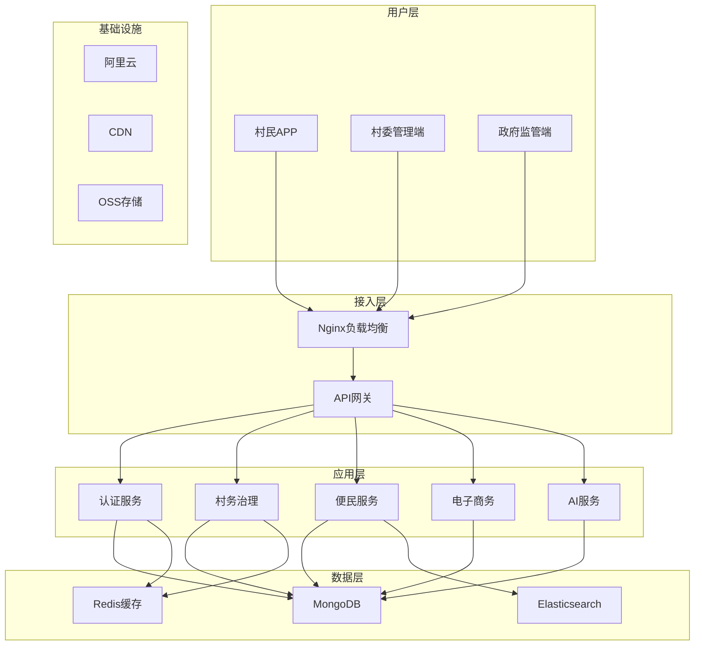

# 智慧乡村综合服务平台 - 项目规划文档

## 目录
1. [商业分析报告](#1-商业分析报告)
2. [技术架构文档](#2-技术架构文档)
3. [用户体验设计](#3-用户体验设计)
4. [实施路线图](#4-实施路线图)

---

## 1. 商业分析报告

### 1.1 项目概述

**项目名称**: 智慧乡村综合服务平台
**愿景**: 打造连接城乡的数字化桥梁，提升乡村治理效能，改善农民生活质量
**使命**: 通过科技赋能，实现乡村振兴，让农民享受数字化红利

### 1.2 市场分析

#### 市场规模
- **目标市场**: 中国约58万个行政村
- **覆盖人口**: 约5.1亿农村常住人口
- **市场潜力**: 数字乡村建设预计投入超万亿

#### 痛点分析
1. **治理效率低下**
   - 村务管理仍依赖纸质文档
   - 信息传递不及时
   - 决策缺乏数据支撑

2. **便民服务不足**
   - 村民办事需要多次往返乡镇
   - 信息获取渠道单一
   - 服务流程不透明

3. **产业发展受限**
   - 农产品销售渠道窄
   - 缺乏价格透明度
   - 供需信息不匹配

4. **人口流失严重**
   - 年轻人外流
   - 留守人口服务不足
   - 数字鸿沟问题突出

### 1.3 竞争分析

#### 现有解决方案
| 产品 | 优势 | 劣势 |
|------|------|------|
| 钉钉乡村版 | 成熟的OA功能 | 缺乏农业特色功能 |
| 腾讯为村 | 社交功能强 | 治理功能弱 |
| 数字政务平台 | 政府支持 | 操作复杂，不够亲民 |

#### 我们的差异化优势
1. **一站式服务**: 整合治理、服务、电商、社交
2. **AI技术驱动**: 语音交互、人脸识别、智能填表
3. **适老化设计**: 方言支持、大字模式、语音导航
4. **离线能力**: 支持网络不佳地区使用

### 1.4 商业模式

#### 收入来源
1. **政府采购** (60%)
   - 基础平台授权费
   - 定制开发服务
   - 运维支持服务

2. **增值服务** (30%)
   - 农资电商佣金
   - 金融服务手续费
   - 广告推广收入

3. **数据服务** (10%)
   - 农业数据分析
   - 市场趋势报告
   - 决策支持系统

#### 成本结构
- **研发成本**: 40%
- **运营成本**: 30%
- **营销成本**: 20%
- **管理成本**: 10%

### 1.5 盈利预测

#### 三年收入预测（单位：万元）
| 年份 | 收入 | 成本 | 利润 | 利润率 |
|------|------|------|------|--------|
| Y1 | 500 | 600 | -100 | -20% |
| Y2 | 2000 | 1500 | 500 | 25% |
| Y3 | 5000 | 3000 | 2000 | 40% |

---

## 2. 技术架构文档

### 2.1 总体架构



### 2.2 技术栈选择

#### 前端技术栈
- **框架**: Vue 3 + TypeScript
- **UI库**: Element Plus
- **状态管理**: Pinia
- **构建工具**: Vite
- **移动端**: UniApp

#### 后端技术栈
- **框架**: Node.js + Express
- **数据库**: MongoDB
- **缓存**: Redis
- **消息队列**: RabbitMQ
- **搜索引擎**: Elasticsearch

#### AI技术栈
- **语音识别**: 百度ASR
- **语音合成**: 百度TTS
- **人脸识别**: 百度Face API
- **OCR识别**: 腾讯OCR
- **大模型**: GPT API

#### 部署技术栈
- **容器化**: Docker
- **编排**: Kubernetes
- **CI/CD**: Jenkins
- **监控**: Prometheus + Grafana

### 2.3 系统架构设计

#### 微服务划分
1. **用户服务** (user-service)
   - 用户管理
   - 权限控制
   - 认证授权

2. **村务服务** (village-service)
   - 村务公开
   - 会议管理
   - 任务调度

3. **便民服务** (service-service)
   - 事项办理
   - 证明开具
   - 预约服务

4. **电商服务** (ecommerce-service)
   - 商品管理
   - 订单处理
   - 支付结算

5. **AI服务** (ai-service)
   - 语音交互
   - 图像识别
   - 智能推荐

### 2.4 数据库设计

#### 核心数据模型

```javascript
// 用户模型
User = {
  _id: ObjectId,
  username: String,
  password: String,
  name: String,
  phone: String,
  idCard: String,
  role: String, // admin, village_admin, resident
  villageId: ObjectId,
  permissions: Array,
  createdAt: Date
}

// 村庄模型
Village = {
  _id: ObjectId,
  name: String,
  code: String,
  address: String,
  population: Number,
  area: Number,
  adminId: ObjectId,
  createdAt: Date
}

// 公告模型
Announcement = {
  _id: ObjectId,
  title: String,
  content: String,
  type: String, // notice, policy, emergency
  villageId: ObjectId,
  publisherId: ObjectId,
  attachments: Array,
  createdAt: Date
}
```

### 2.5 安全架构

#### 数据安全
- **传输加密**: HTTPS/WSS
- **存储加密**: AES-256
- **敏感数据**: 脱敏处理
- **访问控制**: RBAC模型

#### 应用安全
- **认证**: JWT + MFA
- **授权**: OAuth 2.0
- **防护**: SQL注入/XSS防护
- **审计**: 全程日志记录

---

## 3. 用户体验设计

### 3.1 用户画像

#### 村民（主要用户）
- **年龄**: 25-75岁
- **教育程度**: 初中及以下占60%
- **数字技能**: 普遍较低
- **使用场景**: 办事、查信息、购物

#### 村干部（管理用户）
- **年龄**: 30-55岁
- **教育程度**: 高中及以上
- **数字技能**: 中等
- **使用场景**: 发布通知、管理事务

#### 乡镇干部（监管用户）
- **年龄**: 25-50岁
- **教育程度**: 大专及以上
- **数字技能**: 良好
- **使用场景**: 查看报表、审批事项

### 3.2 设计原则

1. **简洁易用**
   - 减少操作步骤
   - 图标代替文字
   - 流程清晰明了

2. **适老化**
   - 大字体设计
   - 高对比度配色
   - 语音辅助功能

3. **方言支持**
   - 支持22种方言
   - 本地化表达
   - 文化适应性

4. **离线可用**
   - 离线表单
   - 数据同步
   - 断网提醒

### 3.3 界面设计

#### 色彩体系
- **主色调**: #4CAF50（绿色）- 代表生机
- **辅助色**: #FF9800（橙色）- 代表温暖
- **点缀色**: #2196F3（蓝色）- 代表科技

#### 字体规范
- **标题字体**: PingFang SC Bold
- **正文字体**: PingFang SC Regular
- **数字字体**: SF Mono

#### 图标设计
- **风格**: 扁平化、线性
- **尺寸**: 24x24 / 32x32 / 48x48
- **颜色**: 单色或双色

### 3.4 交互设计

#### 手势操作
- **点击**: 选择/确认
- **长按**: 显示菜单
- **滑动**: 翻页/删除
- **双击**: 放大/编辑

#### 反馈机制
- **加载**: 骨架屏/进度条
- **成功**: 绿色提示
- **错误**: 红色提示
- **警告**: 橙色提示

---

## 4. 实施路线图

### 4.1 项目里程碑

#### 第一阶段：基础平台（3个月）
- **目标**: 完成MVP版本
- **内容**:
  - 用户注册登录
  - 基础村务功能
  - 简单便民服务
  - 基础数据管理

#### 第二阶段：功能完善（3个月）
- **目标**: 完成核心功能
- **内容**:
  - AI语音交互
  - 人脸识别登录
  - 完整村务流程
  - 电商功能

#### 第三阶段：优化升级（3个月）
- **目标**: 优化用户体验
- **内容**:
  - 性能优化
  - 界面美化
  - 功能增强
  - 数据分析

#### 第四阶段：规模推广（持续）
- **目标**: 扩大应用范围
- **内容**:
  - 多地部署
  - 运营支持
  - 持续迭代
  - 生态建设

### 4.2 资源需求

#### 团队配置
- **产品经理**: 1人
- **UI设计师**: 2人
- **前端开发**: 4人
- **后端开发**: 3人
- **测试工程师**: 2人
- **运维工程师**: 1人

#### 预算分配（首年）
- **人员成本**: 300万
- **服务器成本**: 50万
- **第三方服务**: 30万
- **营销推广**: 100万
- **其他费用**: 20万
- **总计**: 500万

### 4.3 风险与应对

#### 技术风险
- **风险**: AI识别准确率不足
- **应对**: 建立反馈机制，持续优化模型

#### 市场风险
- **风险**: 用户接受度低
- **应对**: 加强培训，简化操作

#### 政策风险
- **风险**: 政策变化影响
- **应对**: 紧跟政策，灵活调整

#### 运营风险
- **风险**: 资金链断裂
- **应对**: 多元收入，控制成本

### 4.4 成功指标

#### 业务指标
- **用户数**: 10万+注册用户
- **活跃度**: 30%月活率
- **覆盖率**: 1000个村庄
- **满意度**: 4.5分以上

#### 技术指标
- **响应时间**: <500ms
- **可用性**: 99.9%
- **并发数**: 10000+
- **安全性**: 0安全事故

---

## 结语

智慧乡村综合服务平台是一项具有重大社会价值的创新项目。通过科学的规划、先进的技术和人性化的设计，我们有信心打造出一个真正服务于民、造福于民的数字化平台，为乡村振兴战略贡献力量。

*本文档将根据项目进展持续更新完善。*