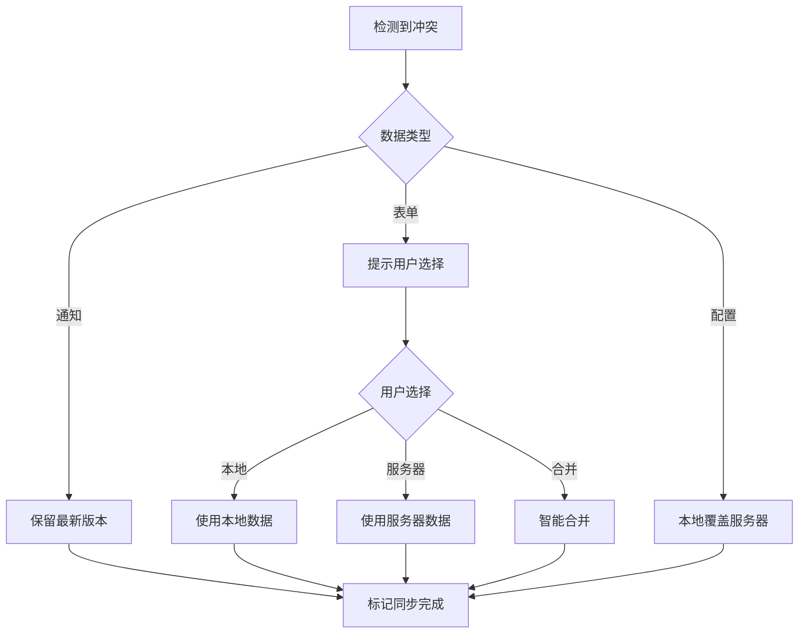

# 智慧乡村平台 - 移动端适老化升级产品需求文档 (PRD)

**文档版本**: v1.0
**创建日期**: 2025-12-28
**产品负责人**: 智慧乡村项目组
**目标受众**: 普通村民(老年用户为主)、村干部、村委工作人员

---

## 目录
1. [产品概述](#1-产品概述)
2. [目标用户画像](#2-目标用户画像)
3. [核心功能需求](#3-核心功能需求)
4. [用户体验设计](#4-用户体验设计)
5. [技术架构要求](#5-技术架构要求)
6. [离线/弱网支持方案](#6-离线弱网支持方案)
7. [安全与隐私](#7-安全与隐私)
8. [性能指标](#8-性能指标)
9. [成功指标(KPI)](#9-成功指标kpi)
10. [实施路线图](#10-实施路线图)

---

## 1. 产品概述

### 1.1 产品定位
智慧乡村平台移动端适老化升级项目,旨在为农村老年用户提供简单、易用、可靠的数字化服务体验,弥合数字鸿沟,提升乡村治理效率。

### 1.2 核心价值主张
- **易用性**: 大字模式、语音交互、简洁流程,让老年用户"零门槛"使用
- **可靠性**: 离线优先架构,确保弱网/无网环境下核心功能可用
- **安全性**: 数据加密、权限管控、操作可追溯,保障村民隐私
- **实用性**: 贴近农村实际场景,解决村民日常办事和应急需求

### 1.3 产品愿景
打造"适老化、离线优先、安全可靠"的乡村数字服务平台,成为老年村民"看得懂、用得来、离不开"的数字助手。

---

## 2. 目标用户画像

### 2.1 主要用户群体

#### 用户画像A: 张大爷(75岁)
- **基本信息**: 独居老人,小学文化程度
- **技术能力**: 仅会使用老年手机接打电话,不会打字
- **主要需求**:
  - 查看村务公告和通知
  - 一键呼叫村委/卫生所
  - 了解补贴政策
- **痛点**:
  - 看不清小字
  - 不会打字输入
  - 家里网络信号弱
  - 担心操作错误

#### 用户画像B: 李阿姨(65岁)
- **基本信息**: 低保户,负责照顾孙辈
- **技术能力**: 会使用微信视频通话和语音消息
- **主要需求**:
  - 在线申请福利补助
  - 查询政策补贴
  - 了解村务财务公开
- **痛点**:
  - 不熟悉复杂流程
  - 担心信息泄露
  - 不清楚需要准备哪些材料

#### 用户画像C: 王村支书(50岁)
- **基本信息**: 村委会负责人,高中文化
- **技术能力**: 熟练使用智能手机和电脑
- **主要需求**:
  - 发布村务通知
  - 处理村民申请
  - 应急事件响应
  - 数据统计分析
- **痛点**:
  - 需要频繁下乡办公
  - 网络不稳定影响工作
  - 老年村民咨询量大

### 2.2 使用场景

#### 场景1: 离线环境查看通知
**背景**: 张大爷家在山区,手机信号时有时无
**流程**:
1. 村委发布重要通知(防汛预警)
2. 系统自动推送至张大爷手机(离线缓存)
3. 张大爷在无信号环境下打开APP
4. 立即看到离线通知,并有语音播报
5. 张大爷点击"我已了解",状态标记为"已读"

#### 场景2: 语音上报问题
**背景**: 李阿姨发现村道路灯损坏
**流程**:
1. 李阿姨打开APP"一键上报"
2. 点击语音输入按钮
3. 说出:"村口路灯坏了"
4. 系统语音转文字,并自动定位位置
5. 李阿姨确认无误后提交
6. 数据缓存至本地,联网后自动上传

#### 场景3: 紧急求助
**背景**: 独居老人突发疾病
**流程**:
1. 老人长按APP红色SOS按钮3秒
2. 系统自动拨打预设紧急联系人电话
3. 同时发送定位和求助信息给村委群
4. 村委成员收到紧急推送
5. 第一时间赶到现场救助

---

## 3. 核心功能需求

### 3.1 功能优先级矩阵

| 优先级 | 功能模块 | 用户价值 | 技术复杂度 | 备注 |
|-------|---------|---------|-----------|------|
| P0 | 大字模式 | 高 | 低 | 必须功能 |
| P0 | 离线通知查看 | 高 | 中 | 核心痛点 |
| P0 | 紧急一键呼叫 | 高 | 低 | 安全保障 |
| P0 | 语音输入(普通话) | 高 | 中 | 适老化必备 |
| P1 | 方言语音识别 | 高 | 高 | 差异化优势 |
| P1 | 离线表单填写 | 中 | 中 | 提升体验 |
| P1 | 读屏功能 | 中 | 中 | 无障碍支持 |
| P1 | 人脸识别登录 | 中 | 高 | 安全便捷 |
| P2 | 政策计算器 | 中 | 低 | 实用工具 |
| P2 | 家庭一户一码 | 低 | 中 | 长期规划 |
| P2 | 视频办事指南 | 中 | 中 | 培训成本高 |
| P3 | 社交分享 | 低 | 低 | 非核心需求 |

### 3.2 P0级别功能详细需求

#### 3.2.1 大字模式 (适老化UI)

**功能描述**: 提供大字体、大按钮、高对比度的界面模式

**核心需求**:
- **字体缩放**:
  - 标准模式: 基础字体16px
  - 大字模式: 基础字体20px,标题24px,重要信息28px
  - 超大模式: 基础字体24px,标题30px,重要信息36px
  - 支持系统级动态缩放(100%-150%-200%)

- **触控区域**:
  - 最小点击区域: 44px × 44px (Apple HIG标准)
  - 推荐点击区域: 48px × 48px
  - 重要按钮(如SOS): 64px × 64px

- **视觉设计**:
  - 高对比度配色(符合WCAG 2.1 AAA级标准)
  - 清晰的图标 + 文字标签组合
  - 减少装饰性元素,突出核心功能
  - 避免使用纯色区分(如红/绿),增加图标/文字辅助

- **交互优化**:
  - 简化导航层级(最多2级)
  - 一键返回首页
  - 关键操作二次确认
  - 操作结果即时反馈

**验收标准**:
- 65岁以上老年用户首次使用成功率 > 90%
- 完成核心任务平均时间 < 3分钟
- 用户误操作率 < 5%

#### 3.2.2 离线通知查看

**功能描述**: 支持在无网络环境下查看已推送的通知

**核心需求**:
- **离线缓存机制**:
  - 使用IndexedDB存储通知数据
  - 自动缓存最近30天通知
  - 重要通知(应急、政策)优先缓存
  - 缓存容量限制: 50MB

- **智能同步策略**:
  - WiFi环境下自动后台同步
  - 4G环境下按需同步(用户触发)
  - 弱网环境(信号<2格)仅同步文本,延迟加载图片
  - 同步进度可视化展示

- **离线状态提示**:
  - 顶部显示"离线模式"标识
  - 显示"最后同步时间"
  - 待上传数据数量提示
  - 联网后自动上传提示

**验收标准**:
- 离线环境下通知查看成功率 100%
- 同步成功率 > 99%
- 缓存数据占用空间 < 30MB

#### 3.2.3 紧急一键呼叫

**功能描述**: 快速拨打预设的紧急联系人电话

**核心需求**:
- **预设联系人**:
  - 村委书记(必设)
  - 村长(必设)
  - 卫生所(可编辑)
  - 派出所/110(固定)
  - 消防队/119(固定)
  - 救护车/120(固定)

- **触发方式**:
  - 快速拨号网格: 3×2布局,大图标+文字
  - 悬浮SOS按钮: 右下角红色圆形按钮(长按3秒触发)
  - 语音触发: 说"救命"、"报警"自动拨打

- **防误触机制**:
  - 长按确认或二次确认弹窗
  - 拨打前震动反馈
  - 自动录音留存(用于取证)

- **辅助功能**:
  - 自动发送定位信息
  - 紧急情况快速选择(火灾/急救/报警)
  - 同时通知多个联系人(群呼)

**验收标准**:
- 拨号响应时间 < 2秒
- 定位精度 < 50米
- 误触率 < 1%

#### 3.2.4 语音输入(普通话)

**功能描述**: 支持语音转文字输入,方便不会打字的用户

**核心需求**:
- **语音识别**:
  - 集成Web Speech API或百度语音识别
  - 支持普通话识别
  - 识别准确率 > 95%
  - 实时转录显示

- **交互设计**:
  - 按住说话按钮(类似微信)
  - 语音波形动画反馈
  - 自动停止静音检测(3秒无声音自动停止)
  - 手动停止按钮

- **编辑功能**:
  - 识别结果可手动编辑
  - 支持重新识别
  - 常用语快捷插入

**验收标准**:
- 识别准确率 > 95%
- 识别延迟 < 500ms
- 用户满意度 > 90%

### 3.3 P1级别功能详细需求

#### 3.3.1 方言语音识别

**功能描述**: 识别粤语、闽南语、四川话等常见方言

**技术方案**:
- 方案A: 调用第三方方言识别API(百度/科大讯飞)
- 方案B: 训练方言识别模型(需数据收集)
- 方案C: 通用语音识别 + 方言词典转换

**支持方言**:
- 第一期: 粤语、四川话、河南话
- 第二期: 闽南语、客家话、东北话
- 第三期: 根据用户分布动态扩展

**验收标准**:
- 方言识别准确率 > 85%
- 识别延迟 < 1s

#### 3.3.2 离线表单填写

**功能描述**: 支持离线填写表单,联网后自动提交

**核心需求**:
- **离线表单缓存**:
  - 使用Service Worker缓存表单页面
  - 本地存储填写数据(localStorage + IndexedDB)
  - 支持多次编辑和草稿保存

- **智能表单设计**:
  - 简化表单字段(必填项 < 5个)
  - 智能默认值填充
  - 选项式输入替代文字输入
  - 自动定位、自动拍照

- **上传队列管理**:
  - 显示待上传表单数量
  - WiFi环境自动上传
  - 上传失败自动重试(最多3次)
  - 上传进度可视化

**验收标准**:
- 离线表单填写成功率 100%
- 自动上传成功率 > 98%

#### 3.3.3 读屏功能

**功能描述**: 为视障用户提供语音播报辅助

**核心需求**:
- **内容播报**:
  - 页面加载时自动播报标题
  - 触摸元素时播报标签
  - 长按播报详细信息

- **交互辅助**:
  - 语音指令导航("返回"、"确认"、"取消")
  - 震动反馈确认操作
  - 高对比度模式

- **个性化设置**:
  - 播报语速调节
  - 播报音量调节
  - 播报语言选择(普通话/方言)

**技术方案**:
- 集成Web Speech API (SpeechSynthesis)
- 使用ARIA标签增强可访问性
- 支持iOS/Android原生读屏功能(VoiceOver/TalkBack)

**验收标准**:
- 视障用户完成核心任务成功率 > 80%

#### 3.3.4 人脸识别登录

**功能描述**: 支持刷脸登录,替代传统账号密码

**核心需求**:
- **人脸采集**:
  - 支持活体检测(眨眼/摇头)
  - 光线自适应(暗光环境提示)
  - 多角度识别

- **安全机制**:
  - 人脸特征加密存储
  - 登录失败次数限制(3次/小时)
  - 异地登录提醒
  - 支持手机号/身份证号备用登录

- **亲属代理**:
  - 子女可远程协助验证
  - 临时授权码机制

**技术方案**:
- 集成face-api.js或腾讯云人脸识别
- 后端使用Python/Node.js验证

**验收标准**:
- 识别准确率 > 99%
- 识别响应时间 < 2s
- 误识率(FAR) < 0.1%

### 3.4 P2-P3级别功能简要说明

#### 政策计算器
- 输入家庭信息,自动计算可享受的政策补贴
- 支持耕地补贴、低保补贴、老年人补贴等

#### 家庭一户一码
- 每户生成唯一二维码
- 扫码查看/更新家庭信息
- 支持多人协作管理

#### 视频办事指南
- 短视频形式讲解办事流程
- 支持离线下载观看
- 方言配音版本

---

## 4. 用户体验设计

### 4.1 信息架构

```
首页(大字模式)
├── 快捷入口(2×3网格)
│   ├── 村务通知
│   ├── 一键呼叫
│   ├── 在线办事
│   ├── 政策查询
│   ├── 财务公开
│   └── 我的
├── 紧急SOS(悬浮按钮)
└── 底部导航(4个Tab)
    ├── 首页
    ├── 办事
    ├── 消息
    └── 我的
```

### 4.2 核心用户旅程

#### 旅程1: 查看村务通知

| 步骤 | 用户操作 | 系统响应 | 预期时间 |
|------|---------|---------|---------|
| 1 | 打开APP | 加载首页,显示未读通知数量 | < 2s |
| 2 | 点击"村务通知" | 进入通知列表,显示最新通知 | < 1s |
| 3 | 点击具体通知 | 显示通知详情,自动语音播报 | < 1s |
| 4 | 点击"我已了解" | 标记已读,返回列表 | < 0.5s |

**总时间**: < 5秒
**满意度目标**: > 95%

#### 旅程2: 语音上报问题

| 步骤 | 用户操作 | 系统响应 | 预期时间 |
|------|---------|---------|---------|
| 1 | 打开"在线办事" | 显示办事类型选择 | < 2s |
| 2 | 点击"问题上报" | 进入表单页 | < 1s |
| 3 | 点击"语音输入" | 开始录音,显示波形动画 | 即时 |
| 4 | 说出问题描述 | 实时转文字显示 | < 500ms |
| 5 | 点击"提交" | 提交成功,显示受理编号 | < 2s |

**总时间**: < 10秒
**满意度目标**: > 90%

#### 旅程3: 紧急求助

| 步骤 | 用户操作 | 系统响应 | 预期时间 |
|------|---------|---------|---------|
| 1 | 长按SOS按钮3秒 | 震动反馈,弹出确认对话框 | 即时 |
| 2 | 确认求助类型 | 开始拨打联系人电话,发送定位 | < 2s |
| 3 | 等待救援 | 显示联系人状态,保持通话 | 持续 |

**总时间**: < 5秒(从触发到拨打)
**可靠性目标**: 100%

### 4.3 界面设计规范

#### 4.3.1 色彩规范

| 用途 | 颜色 | 色值 | 对比度 |
|------|------|------|--------|
| 主色 | 蓝色 | #409EFF | 4.5:1 |
| 成功 | 绿色 | #67C23A | 4.5:1 |
| 警告 | 橙色 | #E6A23C | 4.5:1 |
| 危险 | 红色 | #F56C6C | 4.5:1 |
| 背景 | 白色 | #FFFFFF | - |
| 文本 | 黑色 | #303133 | 7:1 |
| 次要文本 | 灰色 | #606266 | 4.5:1 |

#### 4.3.2 字体规范

| 层级 | 标准模式 | 大字模式 | 超大模式 |
|------|---------|---------|---------|
| 标题H1 | 24px | 30px | 36px |
| 标题H2 | 20px | 24px | 30px |
| 标题H3 | 18px | 22px | 26px |
| 正文 | 16px | 20px | 24px |
| 辅助文字 | 14px | 18px | 22px |
| 最小字号 | 12px | 16px | 20px |

#### 4.3.3 间距规范

| 元素 | 标准模式 | 大字模式 |
|------|---------|---------|
| 页面边距 | 16px | 20px |
| 卡片间距 | 12px | 16px |
| 元素间距 | 8px | 12px |
| 按钮高度 | 40px | 48px |
| 行高 | 1.5 | 1.8 |

### 4.4 无障碍设计

- **WCAG 2.1 AAA级标准**
  - 文本对比度 ≥ 7:1
  - 点击区域 ≥ 44×44px
  - 键盘导航支持
  - 屏幕阅读器兼容

- **ARIA标签**
  ```html
  <button aria-label="紧急呼叫" aria-describedby="sos-help">
    <icon type="sos" />
  </button>
  <span id="sos-help">长按3秒拨打紧急电话</span>
  ```

- **焦点管理**
  - 逻辑Tab顺序
  - 清晰焦点指示器
  - 跳过导航链接

---

## 5. 技术架构要求

### 5.1 前端技术栈

#### 核心框架
- **Vue 3**: 使用Composition API
- **Vite**: 快速构建和热更新
- **Element Plus**: UI组件库(需二次封装适老化组件)
- **Pinia**: 状态管理

#### PWA增强
- **Workbox**: Service Worker生成工具
- **IndexedDB**: 离线数据存储
- **Cache API**: 静态资源缓存

#### 语音技术
- **Web Speech API**: 语音识别和合成
- **百度/科大讯飞SDK**: 方言识别(备用)
- **face-api.js**: 人脸识别(可选)

#### 其他关键库
- **axios**: HTTP客户端(支持离线队列)
- **dayjs**: 时间处理
- **lodash-es**: 工具函数
- **Vant**: 移动端组件库(补充)

### 5.2 后端架构

#### API服务
- **Express.js**: RESTful API服务
- **Socket.IO**: 实时通信(紧急通知)
- **JWT**: 身份验证
- **Multer**: 文件上传

#### 数据存储
- **MongoDB**: 主数据库
- **Redis**: 缓存和队列
- **sql.js**: 本地离线数据库(可选)

#### 第三方集成
- **百度TTS**: 文字转语音
- **腾讯OCR**: 票据识别
- **阿里云OSS**: 文件存储
- **短信服务**: 通知推送

### 5.3 离线优先架构

#### 5.3.1 Service Worker策略

```javascript
// 缓存策略
const CACHE_STRATEGIES = {
  // 静态资源: Cache First
  static: {
    match: /\.(js|css|png|jpg|svg|woff2)$/,
    strategy: 'cacheFirst'
  },

  // API数据: Network First, 降级到Cache
  api: {
    match: /\/api\//,
    strategy: 'networkFirst',
    fallback: 'cacheOnly'
  },

  // 通知: Cache First, 后台更新
  notifications: {
    match: /\/api\/notifications/,
    strategy: 'cacheFirst',
    backgroundSync: true
  },

  // 表单提交: Network Only, 失败入队
  forms: {
    match: /\/api\/forms/,
    strategy: 'networkOnly',
    queue: true
  }
}
```

#### 5.3.2 数据同步机制

**同步策略**:
1. **增量同步**: 仅同步变更数据
2. **压缩传输**: Gzip/Brotli压缩
3. **分页加载**: 每页20条数据
4. **冲突解决**: 时间戳 + 服务端优先

**同步触发时机**:
- APP启动时(静默同步)
- 切换到前台时
- WiFi连接时
- 用户手动触发

**冲突处理流程**:


### 5.4 性能优化

#### 5.4.1 加载性能

| 指标 | 目标值 | 优化手段 |
|------|--------|---------|
| 首屏加载时间(FCP) | < 1.5s | 代码分割、懒加载 |
| 可交互时间(TTI) | < 3s | 减少主线程阻塞 |
| 最大内容绘制(LCP) | < 2.5s | 图片优化、预加载 |
| 累积布局偏移(CLS) | < 0.1 | 尺寸预留、动画控制 |

#### 5.4.2 资源优化

- **代码分割**: 按路由懒加载
- **Tree Shaking**: 移除未使用代码
- **图片优化**: WebP格式、响应式图片
- **字体优化**: 子集化、system font fallback
- **Gzip压缩**: 压缩率 > 70%

#### 5.4.3 运行时性能

- **虚拟滚动**: 长列表性能优化
- **防抖节流**: 减少高频操作
- **Web Worker**: 耗时任务后台处理
- **requestIdleCallback**: 空闲时处理低优先级任务

### 5.5 兼容性要求

#### 浏览器支持

| 平台 | 浏览器 | 最低版本 |
|------|--------|---------|
| iOS | Safari | 12+ |
| iOS | Chrome | 80+ |
| Android | Chrome | 80+ |
| Android | 微信内置 | 7.0+ |
| Android | 支付宝内置 | 10+ |

#### 设备支持

- **屏幕尺寸**: 320px - 768px(移动端)
- **DPI**: 1x - 3x(支持高清屏)
- **触摸屏**: 单点/多点触控
- **传感器**: GPS、摄像头、麦克风(可选)

#### 降级方案

- **不支持SW**: 显示离线提示,引导使用在线模式
- **不支持语音**: 隐藏语音输入,提供文字输入
- **不支持人脸**: 使用手机号/身份证号登录

---

## 6. 离线/弱网支持方案

### 6.1 离线功能矩阵

| 功能模块 | 在线模式 | 弱网模式 | 离线模式 |
|---------|---------|---------|---------|
| 查看通知 | ✓ | ✓(仅文本) | ✓(缓存) |
| 语音输入 | ✓ | ✓ | ✓(本地识别) |
| 表单填写 | ✓ | ✓ | ✓(本地存储) |
| 一键呼叫 | ✓ | ✓ | ✓(直接拨号) |
| 人脸识别 | ✗ | ✗ | ✗(需网络) |
| 视频观看 | ✓ | ✓(低画质) | ✓(已缓存) |
| 数据上传 | ✓ | 延迟上传 | 队列等待 |

### 6.2 弱网优化策略

#### 6.2.1 网络状态检测

```javascript
// 网络质量分级
const NETWORK_QUALITY = {
  EXCELLENT: { rtt: 0, downlink: Infinity }, // 优秀
  GOOD: { rtt: 100, downlink: 10 },          // 良好(4G/WiFi)
  FAIR: { rtt: 300, downlink: 1.5 },         // 一般(3G)
  POOR: { rtt: 1000, downlink: 0.5 }         // 较差(2G)
}

// 检测逻辑
function detectNetworkQuality() {
  const connection = navigator.connection || navigator.mozConnection || navigator.webkitConnection
  if (!connection) return 'GOOD'

  const { rtt, downlink } = connection
  if (rtt < 100 && downlink >= 10) return 'EXCELLENT'
  if (rtt < 300 && downlink >= 1.5) return 'GOOD'
  if (rtt < 1000 && downlink >= 0.5) return 'FAIR'
  return 'POOR'
}
```

#### 6.2.2 自适应加载

| 网络质量 | 图片策略 | 视频策略 | 数据策略 |
|---------|---------|---------|---------|
| 优秀 | 原图 | 1080p | 全量加载 |
| 良好 | 压缩图 | 720p | 分页加载 |
| 一般 | 缩略图 | 480p | 精简字段 |
| 较差 | 占位图 | 仅音频 | 仅核心数据 |

#### 6.2.3 请求优化

- **请求合并**: 多个小请求合并为一个大请求
- **请求去重**: 相同请求仅发送一次
- **预加载**: 预测用户行为,提前加载资源
- **超时控制**: 弱网环境缩短超时时间(5s → 3s)

### 6.3 数据一致性保证

#### 6.3.1 版本控制

```javascript
// 数据版本号
const DATA_VERSION = {
  notifications: '2025-12-28-v1',
  residents: '2025-12-28-v1',
  forms: '2025-12-28-v1'
}

// 版本比较
function compareVersions(localVersion, serverVersion) {
  if (localVersion === serverVersion) return 'EQUAL'
  return localVersion < serverVersion ? 'OLD' : 'NEW'
}
```

#### 6.3.2 冲突解决

**策略1: 时间戳优先**
```javascript
function resolveByTimestamp(localData, serverData) {
  return localData.timestamp > serverData.timestamp ? localData : serverData
}
```

**策略2: 用户选择**
```javascript
function resolveByUserChoice(localData, serverData) {
  showConflictDialog({
    local: localData,
    server: serverData,
    onChoose: (choice) => {
      // choice: 'local' | 'server' | 'merge'
      applyResolution(choice)
    }
  })
}
```

**策略3: 智能合并**
```javascript
function smartMerge(localData, serverData) {
  const merged = { ...serverData }
  for (const key in localData) {
    if (!serverData[key] || localData.timestamp > serverData.timestamp) {
      merged[key] = localData[key]
    }
  }
  return merged
}
```

### 6.4 离线存储方案

#### 6.4.1 存储技术选型

| 技术 | 容量 | 性能 | 适用场景 |
|------|------|------|---------|
| localStorage | 5-10MB | 快 | 用户设置、小数据 |
| IndexedDB | 50MB+ | 中等 | 结构化数据、离线表单 |
| Cache API | 无限制 | 快 | 静态资源、图片 |
| WebSQL | 已废弃 | - | 不推荐使用 |

#### 6.4.2 数据结构设计

```javascript
// IndexedDB 数据库结构
const DB_SCHEMA = {
  name: 'SmartVillageDB',
  version: 1,
  stores: {
    // 通知缓存
    notifications: {
      keyPath: 'id',
      indexes: {
        timestamp: 'timestamp',
        read: 'read',
        priority: 'priority'
      },
      maxRecords: 500,
      ttl: 30 * 24 * 60 * 60 * 1000 // 30天
    },

    // 离线表单
    forms: {
      keyPath: 'id',
      indexes: {
        status: 'status', // pending/synced/failed
        createdAt: 'createdAt'
      },
      maxRecords: 100,
      ttl: 7 * 24 * 60 * 60 * 1000 // 7天
    },

    // 用户配置
    settings: {
      keyPath: 'key',
      ttl: null // 永久
    },

    // 搜索历史
    searchHistory: {
      keyPath: 'id',
      indexes: {
        query: 'query',
        createdAt: 'createdAt'
      },
      maxRecords: 50,
      ttl: 30 * 24 * 60 * 60 * 1000 // 30天
    }
  }
}
```

#### 6.4.3 缓存清理策略

```javascript
// LRU缓存淘汰
class LRUCache {
  constructor(maxSize = 50) {
    this.maxSize = maxSize
    this.cache = new Map()
  }

  get(key) {
    if (!this.cache.has(key)) return null
    const value = this.cache.get(key)
    this.cache.delete(key)
    this.cache.set(key, value)
    return value
  }

  set(key, value) {
    if (this.cache.has(key)) {
      this.cache.delete(key)
    } else if (this.cache.size >= this.maxSize) {
      const firstKey = this.cache.keys().next().value
      this.cache.delete(firstKey)
    }
    this.cache.set(key, value)
  }
}

// TTL过期清理
function cleanExpiredCache() {
  const now = Date.now()
  for (const [storeName, store] of Object.entries(DB_SCHEMA.stores)) {
    if (!store.ttl) continue

    const tx = db.transaction(storeName, 'readwrite')
    const index = tx.store.index('createdAt')
    const range = IDBKeyRange.upperBound(now - store.ttl)

    index.openCursor(range).onsuccess = (e) => {
      const cursor = e.target.result
      if (cursor) {
        cursor.delete()
        cursor.continue()
      }
    }
  }
}
```

---

## 7. 安全与隐私

### 7.1 数据安全

#### 7.1.1 传输加密

- **HTTPS**: 所有API请求使用HTTPS
- **证书固定**: 防止中间人攻击
- **请求签名**: 关键操作添加签名验证

```javascript
// 请求签名示例
function signRequest(data, secretKey) {
  const timestamp = Date.now()
  const nonce = generateNonce()
  const content = JSON.stringify(data) + timestamp + nonce
  const signature = crypto.createHmac('sha256', secretKey)
    .update(content)
    .digest('hex')

  return {
    ...data,
    timestamp,
    nonce,
    signature
  }
}
```

#### 7.1.2 存储加密

- **敏感数据加密**: 身份证号、银行卡号等使用AES加密
- **密钥管理**: 密钥不存储在客户端,从服务器获取

```javascript
// AES加密示例
async function encryptData(data, key) {
  const encoder = new TextEncoder()
  const dataBuffer = encoder.encode(data)

  const keyBuffer = await crypto.subtle.importKey(
    'raw',
    encoder.encode(key),
    { name: 'AES-GCM' },
    false,
    ['encrypt']
  )

  const iv = crypto.getRandomValues(new Uint8Array(12))
  const encrypted = await crypto.subtle.encrypt(
    { name: 'AES-GCM', iv },
    keyBuffer,
    dataBuffer
  )

  return {
    iv: Array.from(iv),
    data: Array.from(new Uint8Array(encrypted))
  }
}
```

#### 7.1.3 权限控制

- **角色权限**: 村民、村委、管理员三级权限
- **数据隔离**: 村级数据隔离,村民只能查看本村数据
- **字段脱敏**: 敏感信息脱敏展示(身份证号、手机号)

```javascript
// 数据脱敏示例
function maskSensitiveField(type, value) {
  if (!value) return ''

  switch (type) {
    case 'idCard':
      return value.replace(/(\d{6})\d{8}(\d{4})/, '$1********$2')
    case 'phone':
      return value.replace(/(\d{3})\d{4}(\d{4})/, '$1****$2')
    case 'name':
      return value.replace(/(.{1}).*/, '$1**')
    default:
      return value
  }
}
```

### 7.2 隐私保护

#### 7.2.1 最小必要原则

- 仅收集必要的用户信息
- 明确告知数据用途
- 提供数据删除功能

#### 7.2.2 用户同意

- 首次使用前显示隐私政策
- 敏感权限(摄像头、麦克风)单独授权
- 可撤回同意

```javascript
// 隐私同意检查
async function checkPrivacyConsent() {
  const consent = localStorage.getItem('privacyConsent')
  if (!consent) {
    await showPrivacyDialog()
  }
}

async function showPrivacyDialog() {
  const result = await ElMessageBox.confirm(
    '我们将收集您的手机号、位置信息用于紧急求助和村务通知',
    '隐私政策',
    {
      confirmButtonText: '同意',
      cancelButtonText: '不同意',
      type: 'info'
    }
  )

  if (result === 'confirm') {
    localStorage.setItem('privacyConsent', Date.now().toString())
  } else {
    ElMessage.warning('不同意隐私政策将无法使用部分功能')
  }
}
```

#### 7.2.3 操作审计

- 记录所有敏感操作
- 日志保存时间 ≥ 10年
- 支持用户查询自己的操作记录

```javascript
// 操作日志
function logSensitiveOperation(operation, details) {
  const log = {
    id: generateUUID(),
    userId: getCurrentUserId(),
    operation,
    details,
    timestamp: new Date().toISOString(),
    userAgent: navigator.userAgent,
    ip: await getClientIP()
  }

  // 发送到服务器
  axios.post('/api/audit/logs', log)
}
```

### 7.3 合规性

#### 7.3.1 法律法规

- 《个人信息保护法》
- 《数据安全法》
- 《网络安全法》

#### 7.3.2 标准认证

- **等保2.0**: 三级认证要求
- **ISO 27001**: 信息安全管理体系
- **隐私认证**: TRUSTe、Privacy Seal

---

## 8. 性能指标

### 8.1 前端性能

| 指标 | 目标值 | 测量方法 |
|------|--------|---------|
| 首屏加载时间(FCP) | < 1.5s | Lighthouse |
| 可交互时间(TTI) | < 3s | Lighthouse |
| 最大内容绘制(LCP) | < 2.5s | Lighthouse |
| 累积布局偏移(CLS) | < 0.1 | Lighthouse |
| 首次输入延迟(FID) | < 100ms | Lighthouse |
| Time to Interactive | < 5s | 真机测试 |
| 离线恢复时间 | < 1s | 真机测试 |

### 8.2 后端性能

| 指标 | 目标值 | 测量方法 |
|------|--------|---------|
| API响应时间(P50) | < 200ms | APM工具 |
| API响应时间(P99) | < 500ms | APM工具 |
| 并发用户数 | > 1000 | 压力测试 |
| 数据库查询时间 | < 100ms | 慢查询日志 |
| 缓存命中率 | > 80% | Redis监控 |
| 错误率 | < 0.1% | 日志分析 |

### 8.3 用户体验

| 指标 | 目标值 | 测量方法 |
|------|--------|---------|
| 任务完成率 | > 95% | 用户测试 |
| 任务完成时间 | < 3min | 用户测试 |
| 用户满意度 | > 4.5/5 | 问卷调查 |
| 用户留存率(D7) | > 60% | 数据分析 |
| 用户活跃度(DAU/MAU) | > 30% | 数据分析 |

### 8.4 离线性能

| 指标 | 目标值 | 测量方法 |
|------|--------|---------|
| 离线功能可用率 | 100% | 功能测试 |
| 数据同步成功率 | > 99% | 日志分析 |
| 同步延迟 | < 30s | 性能测试 |
| 冲突解决率 | > 95% | 数据分析 |

---

## 9. 成功指标(KPI)

### 9.1 用户增长

| 指标 | 基准值(3个月) | 目标值(6个月) | 目标值(12个月) |
|------|--------------|--------------|---------------|
| 注册用户数 | 500 | 2000 | 10000 |
| 活跃用户数(DAU) | 100 | 500 | 3000 |
| 老年用户占比 | > 60% | > 70% | > 75% |
| 用户增长率 | - | > 20%/月 | > 15%/月 |

### 9.2 用户活跃

| 指标 | 基准值 | 目标值 |
|------|--------|--------|
| 日活跃用户(DAU) | 100 | 3000 |
| 月活跃用户(MAU) | 300 | 8000 |
| 用户留存率(D1) | 40% | 60% |
| 用户留存率(D7) | 20% | 50% |
| 用户留存率(D30) | 10% | 30% |
| 活跃度(DAU/MAU) | 20% | 40% |

### 9.3 功能使用

| 指标 | 目标值 | 测量方法 |
|------|--------|---------|
| 大字模式使用率 | > 70% | 数据统计 |
| 语音输入使用率 | > 40% | 数据统计 |
| 离线功能使用率 | > 30% | 数据统计 |
| 人脸识别登录使用率 | > 50% | 数据统计 |
| 紧急呼叫使用次数 | > 10次/月 | 数据统计 |

### 9.4 用户满意度

| 指标 | 目标值 | 测量方法 |
|------|--------|---------|
| 用户满意度评分 | > 4.5/5 | 问卷调查 |
| NPS(净推荐值) | > 50 | 问卷调查 |
| 客户投诉率 | < 1% | 客服统计 |
| 用户反馈响应时间 | < 24h | 工单统计 |

### 9.5 业务价值

| 指标 | 目标值 | 测量方法 |
|------|--------|---------|
| 村务通知送达率 | > 95% | 数据统计 |
| 在线办事成功率 | > 90% | 数据统计 |
| 纸质表单减少率 | > 60% | 对比分析 |
| 村民办事时间缩短 | > 50% | 用户调研 |
| 紧急事件响应时间 | < 10min | 实际案例 |

---

## 10. 实施路线图

### 10.1 开发阶段

#### 第一阶段: 基础建设(4周)

**目标**: 搭建离线优先架构和适老化UI基础

**任务**:
- Week 1-2: 离线优先架构搭建
  - Service Worker配置
  - IndexedDB封装
  - 离线队列系统

- Week 3: 适老化UI组件开发
  - 大字模式主题
  - 无障碍样式
  - 触控优化

- Week 4: 核心功能开发
  - 离线通知查看
  - 一键呼叫
  - 用户认证

**交付物**:
- 离线优先架构技术文档
- 适老化UI组件库
- 核心功能Demo

#### 第二阶段: 核心功能(6周)

**目标**: 完成P0级别功能开发

**任务**:
- Week 5-6: 语音功能
  - 普通话语音识别
  - 语音播报
  - 语音命令

- Week 7-8: 离线表单
  - 表单离线填写
  - 数据同步
  - 冲突解决

- Week 9-10: 紧急求助
  - SOS按钮
  - 定位功能
  - 多人通知

**交付物**:
- 语音输入功能
- 离线表单系统
- 紧急求助功能

#### 第三阶段: 高级功能(4周)

**目标**: 完成P1级别功能开发

**任务**:
- Week 11-12: 方言识别
  - 粤语识别
  - 四川话识别
  - 方言切换

- Week 13: 人脸识别
  - 人脸采集
  - 活体检测
  - 登录认证

- Week 14: 读屏功能
  - 内容播报
  - 语音导航
  - 辅助功能

**交付物**:
- 方言识别功能
- 人脸识别登录
- 读屏辅助功能

#### 第四阶段: 优化测试(2周)

**目标**: 性能优化和全面测试

**任务**:
- Week 15: 性能优化
  - 加载速度优化
  - 内存优化
  - 电池优化

- Week 16: 测试验收
  - 功能测试
  - 兼容性测试
  - 用户测试

**交付物**:
- 性能优化报告
- 测试报告
- 上线版本

### 10.2 上线计划

#### 灰度发布

| 阶段 | 用户范围 | 时间 | 目标 |
|------|---------|------|------|
| 内测 | 项目组 + 村委10人 | 1周 | 发现重大问题 |
| 小范围 | 单个村100人 | 2周 | 收集反馈优化 |
| 中范围 | 3个村500人 | 2周 | 验证稳定性 |
| 全量 | 所有村民 | 1周 | 全面推广 |

#### 推广策略

1. **培训推广**:
   - 制作使用手册(图文/视频)
   - 组织村民培训会
   - 设置村级推广员

2. **激励措施**:
   - 首次注册送积分
   - 邀请好友奖励
   - 活跃用户抽奖

3. **宣传渠道**:
   - 村委广播通知
   - 村民微信群
   - 线下海报宣传

### 10.3 运营支持

#### 客服支持

- **在线客服**: 工作日 9:00-18:00
- **电话客服**: 24小时热线
- **村级服务点**: 每村设置服务点

#### 持续优化

- **数据监控**: 实时监控核心指标
- **用户反馈**: 定期收集用户意见
- **快速迭代**: 每2周一个小版本

---

## 11. 风险与应对

### 11.1 技术风险

| 风险 | 影响 | 概率 | 应对措施 |
|------|------|------|---------|
| 浏览器兼容性问题 | 高 | 中 | 提前测试,准备降级方案 |
| 离线同步失败 | 高 | 低 | 多重重试,冲突解决机制 |
| 语音识别准确率低 | 中 | 中 | 提供文字输入作为备选 |
| 人脸识别安全性 | 高 | 低 | 活体检测,多重认证 |

### 11.2 用户风险

| 风险 | 影响 | 概率 | 应对措施 |
|------|------|------|---------|
| 老年用户不接受 | 高 | 中 | 充分培训,简化流程 |
| 用户误操作 | 中 | 高 | 二次确认,操作可撤销 |
| 隐私泄露担忧 | 高 | 中 | 透明化隐私政策,数据脱敏 |

### 11.3 运营风险

| 风险 | 影响 | 概率 | 应对措施 |
|------|------|------|---------|
| 推广难度大 | 中 | 高 | 线下培训,激励措施 |
| 客服压力大 | 中 | 中 | 设置村级服务点 |
| 数据安全风险 | 高 | 低 | 加密存储,权限控制 |

---

## 12. 附录

### 12.1 术语表

| 术语 | 解释 |
|------|------|
| PWA | Progressive Web App,渐进式Web应用 |
| Service Worker | 离线缓存和后台同步的技术 |
| IndexedDB | 浏览器本地结构化存储数据库 |
| TTI | Time to Interactive,可交互时间 |
| WCAG | Web Content Accessibility Guidelines,Web内容无障碍指南 |
| ARIA | Accessible Rich Internet Applications,无障碍富互联网应用 |
| FCP | First Contentful Paint,首次内容绘制 |
| LCP | Largest Contentful Paint,最大内容绘制 |
| CLS | Cumulative Layout Shift,累积布局偏移 |

### 12.2 参考资料

- [WCAG 2.1 标准](https://www.w3.org/WAI/WCAG21/quickref/)
- [PWA 最佳实践](https://web.dev/pwa/)
- [Web Speech API 文档](https://developer.mozilla.org/en-US/docs/Web/API/Web_Speech_API)
- [Service Worker 标准](https://w3c.github.io/ServiceWorker/)
- [中国适老化设计指南](https://www.sac.gov.cn/)

### 12.3 变更记录

| 版本 | 日期 | 变更内容 | 变更人 |
|------|------|---------|--------|
| v1.0 | 2025-12-28 | 初始版本 | 智慧乡村项目组 |

---

**文档结束**
