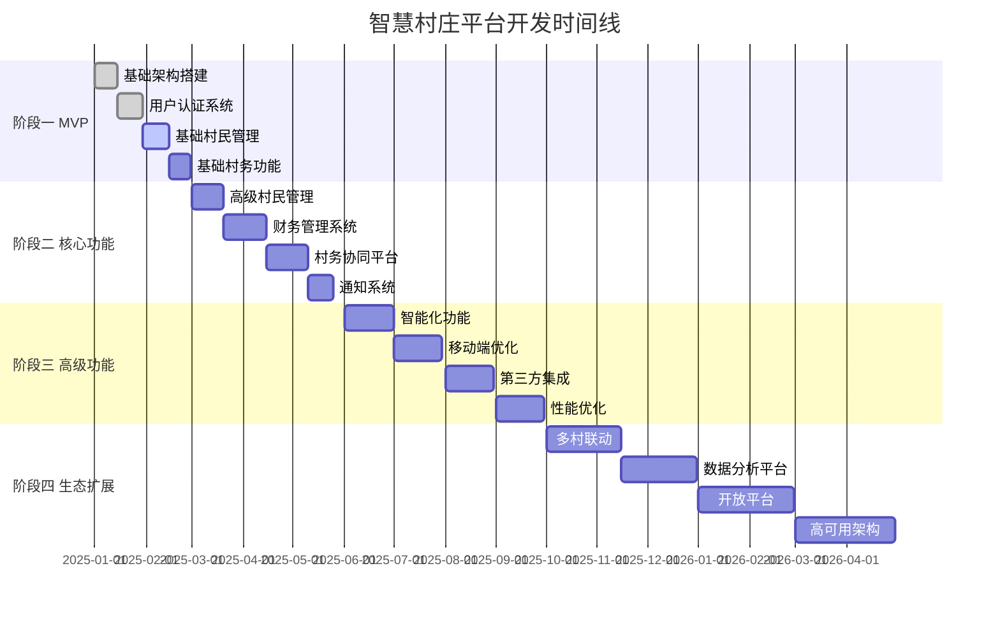
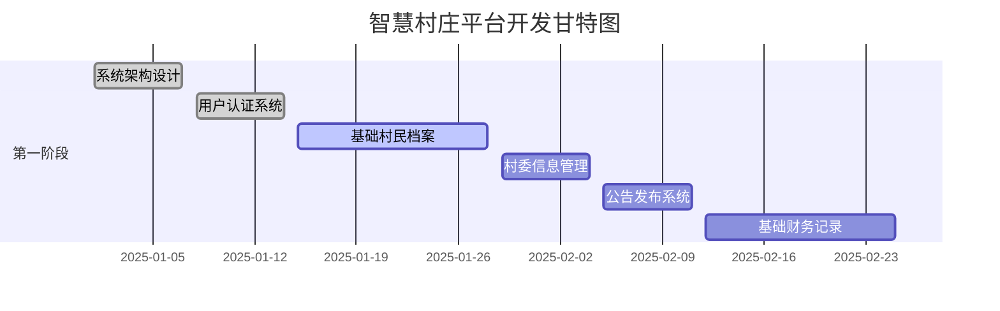
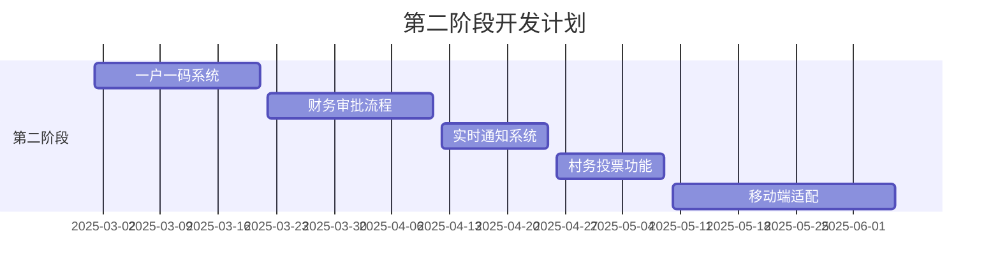
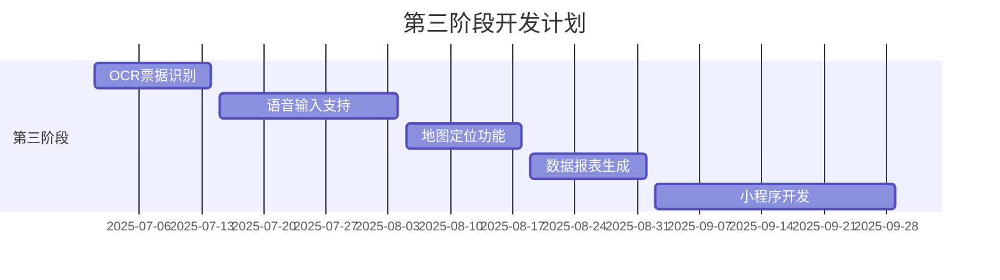

# 🏘️ 智慧村庄综合服务平台

一个现代化、全功能的村庄数字化管理平台，致力于提升农村治理效率和村民生活品质。

## 📋 目录

- [项目概述](#项目概述)
- [核心功能](#核心功能)
- [技术架构](#技术架构)
- [多端支持方案](#多端支持方案)
- [项目结构](#项目结构)
- [快速开始](#快速开始)
- [移动端开发指南](#移动端开发指南)
- [功能优先级与开发计划](#功能优先级与开发计划)
- [API文档](#api文档)
- [部署指南](#部署指南)
- [贡献指南](#贡献指南)

## 🎯 项目概述

智慧村庄综合服务平台是一个面向现代农村治理的数字化解决方案，采用微服务架构设计，支持多种数据库后端，提供完整的村务管理、村民服务、财务透明、信息公开等功能。

### 设计理念
- **以人为本** - 为村民和村干部提供简单易用的数字化工具
- **数据驱动** - 基于数据分析优化村庄治理决策
- **安全第一** - 全方位的数据安全和隐私保护
- **开放互通** - 标准化API设计，支持第三方系统集成

### 应用场景
- 🏘️ **行政村管理** - 完整的村级行政事务数字化
- 🏢 **社区治理** - 现代化社区管理和服务
- 🌾 **农业合作社** - 农业生产和经营管理
- 🏛️ **乡镇政府** - 多村统一管理平台

### 多端覆盖
- 💻 **Web管理端** - 村委会办公使用，功能完整
- 📱 **移动App** - 村民日常使用，操作便捷
- 🖥️ **大屏展示** - 村务公开展示，信息透明
- ⌚ **小程序** - 轻量级服务，快速访问

## 🚀 核心功能

### 一、村委管理模块 🏛️
**功能描述**: 村委会人员、权限、职能管理系统

#### 核心特性
- **分级权限体系**: 支持村支书、村主任、会计、人口主任等不同角色
- **智能值班调度**: 自动排班、扫码呼叫、应急响应
- **审计追踪系统**: 全程记录操作日志，支持10年数据保存
- **村情地图功能**: 实时显示村民位置（隐私脱敏），应急救援

```javascript
// 权限管理示例
const rolePermissions = {
  '村支书': ['all_permissions'],
  '村主任': ['村务管理', '项目审批', '财务查看'],
  '会计': ['财务管理', '预算编制', '报表生成'],
  '人口主任': ['村民管理', '户籍变更', '统计上报']
}
```

### 二、村民管理模块 👥
**功能描述**: 村民档案数字化管理，支持隐私保护和智能查询

#### 核心特性
- **一户一码系统**: 每户生成独立二维码，扫码查看/更新信息
- **血缘关系验证**: 自动识别家庭成员，控制信息访问权限
- **人脸识别登录**: 支持老年人刷脸查询，子女远程协助
- **敏感信息保护**: 身份证号自动脱敏，需验证后查看

```sql
-- 村民档案数据结构
CREATE TABLE residents (
  id INTEGER PRIMARY KEY,
  name VARCHAR(50) NOT NULL,
  id_card VARCHAR(18) UNIQUE, -- 加密存储
  household_id VARCHAR(20),   -- 一户一码
  family_relations JSON,      -- 血缘关系
  privacy_level INTEGER,      -- 隐私等级 1-5
  created_at TIMESTAMP,
  updated_at TIMESTAMP
);
```

### 三、村务治理模块 📢
**功能描述**: 村务公开透明化，民主决策数字化

#### 核心特性
- **公告发布系统**: 支持文字、图片、视频多媒体公告
- **投票表决功能**: 在线民主决策，实时统计结果
- **会议管理系统**: 会议通知、议题管理、决议记录
- **意见反馈平台**: 村民建议收集、处理状态跟踪

### 四、财务管理模块 💰
**功能描述**: 村级财务透明化管理，支持预算控制和审批流程

#### 核心特性
- **智能票据识别**: OCR自动识别发票信息，提升录入效率80%
- **预算控制系统**: 年度预算编制、执行监控、预警机制
- **多级审批流程**: 自定义审批链路，电子签章验证
- **财务报表生成**: 自动生成月度、季度、年度财务报表

```javascript
// 财务审批流程配置
const approvalWorkflow = {
  '日常开支': {
    amount_limit: 1000,
    approvers: ['会计', '村主任'],
    auto_approve: true
  },
  '重大项目': {
    amount_limit: 50000,
    approvers: ['会计', '村主任', '村支书', '村民代表'],
    require_meeting: true
  }
}
```

### 五、信息公示模块 📰
**功能描述**: 政策宣传、信息发布、查询服务

#### 核心特性
- **政策计算器**: 输入家庭信息自动计算补贴金额
- **方言播报功能**: AI转换重要政策为方言语音
- **智能搜索系统**: 支持关键词、分类、时间等多维度搜索
- **信息订阅服务**: 个性化信息推送，精准触达

### 七、采购商管理模块 🛒
**功能描述**: 企业和个人采购商实名注册认证，支持农产品采购对接

#### 核心特性
- **企业采购商认证**: 营业执照实名认证，多级审核流程
- **个人采购商注册**: 简化注册流程，直接激活使用
- **采购权限分级**: 企业采购商支持大宗采购，个人采购商支持零售购买
- **供应商对接**: 连接村合作社和农户，实现农产品直销

```javascript
// 采购商权限体系
const purchaserPermissions = {
  'enterprise_purchaser': [
    'view_products',         // 查看所有产品
    'create_orders',         // 创建采购订单
    'manage_contracts',      // 管理采购合同
    'view_suppliers',        // 查看供应商信息
    'bulk_purchase'          // 大宗采购功能
  ],
  'individual_purchaser': [
    'personal_purchase',     // 个人采购功能
    'view_retail_products',  // 查看零售产品
    'create_personal_orders' // 创建个人订单
  ]
}

// 企业采购商注册验证
const enterpriseValidation = {
  required_documents: [
    '营业执照正副本',
    '法定代表人身份证',
    '公司税务登记证',
    '银行开户许可证'
  ],
  verification_process: [
    '提交材料审核',
    '工商信息核验',
    '实地调研（可选）',
    '账户激活'
  ],
  approval_time: '3-5个工作日'
}
```

### 八、生活服务模块 🛠️
**功能描述**: 便民服务、社区互助、在线办事

#### 核心特性
- **证件办理服务**: 在线申请、进度查询、邮寄送达
- **邻里互助平台**: 发布需求、技能共享、积分奖励
- **乡村电商入口**: 对接主流电商平台，助农产品销售
- **应急求助功能**: 一键报警、医疗救助、灾害上报

## 🏗️ 技术架构

### 系统架构图
```
┌─────────────────────────────────────────────────────────────┐
│                     前端展示层                                │
├─────────────────────────────────────────────────────────────┤
│  Vue.js 3 + TypeScript + Element Plus + Vite + Pinia        │
│  ├── 村民端 (Mobile First)                                   │
│  ├── 村委端 (Desktop)                                        │
│  └── 监控大屏 (Large Screen)                                 │
├─────────────────────────────────────────────────────────────┤
│                     API网关层                                │
├─────────────────────────────────────────────────────────────┤
│  Nginx + 负载均衡 + 限流 + 缓存                               │
├─────────────────────────────────────────────────────────────┤
│                   业务服务层                                 │
├─────────────────────────────────────────────────────────────┤
│  主API服务器 (Port 3001)     │  村务服务器 (Port 5000)        │
│  ├── 监控系统               │  ├── 核心业务逻辑             │
│  ├── 稳定性管理             │  ├── Socket.IO实时通信        │
│  ├── 多语言支持             │  ├── 文件上传处理             │
│  ├── 通知模板               │  └── 应急广播系统             │
│  └── 权限认证               │                              │
├─────────────────────────────────────────────────────────────┤
│                    数据存储层                                │
├─────────────────────────────────────────────────────────────┤
│  MongoDB (主数据库)  │  SQLite (轻量级)  │  Redis (缓存)      │
│  ├── 村民档案       │  ├── 开发测试     │  ├── 会话存储     │
│  ├── 财务数据       │  ├── 离线应用     │  ├── 限流计数     │
│  ├── 村务记录       │  └── 边缘部署     │  └── 实时数据     │
│  └── 操作日志       │                  │                  │
└─────────────────────────────────────────────────────────────┘
```

### 技术选型详解

#### 🖥️ 前端技术栈
```json
{
  "framework": "Vue.js 3.0+",
  "language": "TypeScript",
  "build": "Vite 5.0",
  "ui": "Element Plus",
  "state": "Pinia",
  "router": "Vue Router 4",
  "http": "Axios",
  "css": "Tailwind CSS 4.0",
  "charts": "ECharts",
  "maps": "高德地图API"
}
```

#### ⚙️ 后端技术栈
```json
{
  "runtime": "Node.js 20+",
  "framework": "Express.js",
  "language": "JavaScript ES6+",
  "auth": "JWT + bcryptjs",
  "validation": "express-validator",
  "logging": "Winston",
  "monitoring": "Custom WebSocket",
  "testing": "Jest",
  "docs": "Swagger/OpenAPI"
}
```

#### 🔐 认证与权限系统
```json
{
  "authentication": "JWT + bcryptjs",
  "authorization": "RBAC (Role-Based Access Control)",
  "roles": [
    "villager (村民)",
    "committee (村委)",
    "admin (管理员)",
    "purchaser (企业采购商)",
    "individual_purchaser (个人采购商)"
  ],
  "security": "express-validator + 数据加密",
  "audit": "Winston日志 + 操作追踪",
  "mfa": "多因素认证支持"
}
```

#### 🛒 采购商管理系统
```json
{
  "enterprise_verification": {
    "ocr": "营业执照OCR识别",
    "api": "工商信息API核验",
    "workflow": "多级审核流程",
    "documents": "证件文档管理"
  },
  "individual_registration": {
    "simplified": "简化注册流程",
    "instant": "即时账户激活",
    "validation": "基础信息验证"
  },
  "permissions": {
    "enterprise": ["bulk_purchase", "supplier_management", "contract_mgmt"],
    "individual": ["personal_purchase", "retail_access", "order_tracking"]
  }
}
```

#### 💾 数据库设计
```json
{
  "primary": "MongoDB (文档数据库)",
  "secondary": "SQLite (嵌入式数据库)",
  "cache": "Redis (内存数据库)",
  "search": "MongoDB Text Search",
  "backup": "自动备份 + 增量备份"
}
```

## 📱 多端支持方案

### 全平台生态架构
```
                    ┌─────────────────────────────────────────┐
                    │           统一API服务层                  │
                    │     Express.js + Socket.IO              │
                    └─────────────────────────────────────────┘
                                     │
        ┌─────────────────┬─────────────────┬─────────────────┬─────────────────┐
        │                 │                 │                 │                 │
┌─────────────────┐┌─────────────────┐┌─────────────────┐┌─────────────────┐┌─────────────────┐
│   Web管理端      ││   移动App端      ││   小程序端       ││  浏览器插件端    ││   大屏展示端     │
│   Vue.js 3      ││  React Native   ││  uni-app        ││  Browser Ext.   ││   Vue.js 3      │
│   Desktop First ││  Mobile First   ││  Hybrid         ││  Popup/Content  ││   4K Display    │
└─────────────────┘└─────────────────┘└─────────────────┘└─────────────────┘└─────────────────┘
```

### 1. 📱 移动App端 (React Native)
```javascript
// 技术栈配置
const mobileAppStack = {
  framework: "React Native 0.73+",
  navigation: "React Navigation 6",
  stateManagement: "Redux Toolkit + RTK Query",
  ui: "NativeBase / Tamagui",
  storage: "AsyncStorage + MMKV",
  networking: "Axios + WebSocket",
  push: "React Native Push Notification",
  biometric: "React Native Biometrics",
  camera: "React Native Camera",
  maps: "React Native Maps (高德地图)",
  charts: "React Native Chart Kit"
}

// 应用特性
const appFeatures = {
  offline: "离线数据缓存，网络恢复自动同步",
  push: "实时消息推送，重要通知不错过",
  biometric: "指纹/人脸识别登录，安全便捷",
  voice: "语音输入支持，方言识别",
  camera: "扫码功能，票据OCR识别",
  location: "位置服务，应急定位",
  darkMode: "深色模式支持，护眼体验"
}
```

### 2. ⌚ 小程序端 (uni-app)
```javascript
// 多平台小程序支持
const miniProgramPlatforms = {
  wechat: "微信小程序 - 主要平台",
  alipay: "支付宝小程序 - 支付功能",
  baidu: "百度小程序 - 搜索入口", 
  toutiao: "抖音小程序 - 年轻用户",
  qq: "QQ小程序 - 补充渠道"
}

// 技术栈
const miniProgramStack = {
  framework: "uni-app 3.0+",
  ui: "uView 2.0",
  stateManagement: "Vuex 4",
  storage: "uni.storage",
  request: "uni.request",
  realtime: "WebSocket",
  components: "uniCloud + 云函数"
}
```

### 3. 🌐 浏览器插件 (Browser Extension)
```javascript
// 支持浏览器
const supportedBrowsers = {
  chrome: "Chrome 88+ (主要支持)",
  firefox: "Firefox 78+ (完整支持)",
  edge: "Edge 88+ (Chromium内核)",
  safari: "Safari 14+ (WebKit)"
}

// 插件功能
const extensionFeatures = {
  quickAccess: "快速访问村务信息",
  notifications: "桌面通知提醒",
  formFill: "表单自动填充",
  dataCapture: "网页数据采集",
  sidePanel: "侧边栏快速操作",
  contextMenu: "右键菜单扩展"
}
```

### 4. 🖥️ 大屏展示端 (数据可视化)
```javascript
// 大屏应用配置
const dashboardConfig = {
  framework: "Vue.js 3 + TypeScript",
  charts: "ECharts 5 + D3.js",
  maps: "高德地图 + 自定义图层",
  animation: "GSAP + CSS3 Animations", 
  responsive: "4K/8K屏幕适配",
  realtime: "WebSocket实时数据更新"
}

// 展示内容
const dashboardModules = {
  overview: "村庄概况总览",
  population: "人口统计分析", 
  finance: "财务状况监控",
  projects: "项目进度展示",
  emergency: "应急事件处理",
  weather: "天气环境信息"
}
```

## 📁 完整项目结构

```
smart-village-platform/                    # 🏘️ 智慧村庄综合服务平台
├── 📁 backend/                            # 🖥️ 后端服务 
│   ├── 📁 src/                            # 主API服务器 (Port 3001)
│   │   ├── 📁 config/                     # 配置文件
│   │   │   ├── 📄 database.js             # 数据库配置 (MongoDB/SQLite/Redis)
│   │   │   ├── 📄 auth.js                 # 认证配置 (JWT/OAuth2.0)
│   │   │   ├── 📄 upload.js               # 文件上传配置 (OSS/本地存储)
│   │   │   └── 📄 notification.js         # 通知配置 (短信/邮件/推送)
│   │   ├── 📁 controllers/                # 控制器层
│   │   │   ├── 📄 authController.js       # 认证控制器 - 登录/注册/MFA
│   │   │   ├── 📄 userController.js       # 用户控制器 - 用户管理/权限分配
│   │   │   ├── 📄 villageController.js    # 村务控制器 - 村庄信息/公告管理
│   │   │   ├── 📄 residentController.js   # 村民控制器 - 档案管理/血缘关系
│   │   │   ├── 📄 financeController.js    # 财务控制器 - 财务管理/预算控制
│   │   │   └── 📄 emergencyController.js  # 应急控制器 - 应急广播/事件处理
│   │   ├── 📁 middleware/                 # 中间件
│   │   │   ├── 📄 auth.js                 # 身份验证中间件
│   │   │   ├── 📄 permission.js           # 权限检查中间件
│   │   │   ├── 📄 validation.js           # 数据验证中间件
│   │   │   ├── 📄 rateLimit.js            # 请求限流中间件
│   │   │   ├── 📄 encryption.js           # 数据加密中间件
│   │   │   └── 📄 audit.js                # 审计日志中间件
│   │   ├── 📁 models/                     # 数据模型
│   │   │   ├── 📄 User.js                 # 用户模型 - 基础用户信息
│   │   │   ├── 📄 Village.js              # 村庄模型 - 村庄基本信息
│   │   │   ├── 📄 Resident.js             # 村民模型 - 详细档案信息
│   │   │   ├── 📄 Committee.js            # 村委模型 - 村委会成员信息
│   │   │   ├── 📄 Finance.js              # 财务模型 - 收支记录
│   │   │   ├── 📄 Announcement.js         # 公告模型 - 通知公告
│   │   │   └── 📄 AuditLog.js             # 审计模型 - 操作日志
│   │   ├── 📁 routes/                     # 路由定义
│   │   │   ├── 📄 auth.js                 # 认证路由 - /api/auth/*
│   │   │   ├── 📄 users.js                # 用户路由 - /api/users/*
│   │   │   ├── 📄 villages.js             # 村务路由 - /api/villages/*
│   │   │   ├── 📄 residents.js            # 村民路由 - /api/residents/*
│   │   │   ├── 📄 finance.js              # 财务路由 - /api/finance/*
│   │   │   ├── 📄 notifications.js        # 通知路由 - /api/notifications/*
│   │   │   └── 📄 monitoring.js           # 监控路由 - /api/monitoring/*
│   │   ├── 📁 services/                   # 业务服务层
│   │   │   ├── 📄 authService.js          # 认证服务 - JWT/MFA/SSO
│   │   │   ├── 📄 encryptionService.js    # 加密服务 - 数据加密/脱敏
│   │   │   ├── 📄 notificationService.js  # 通知服务 - 多渠道推送
│   │   │   ├── 📄 ocrService.js           # OCR服务 - 票据识别
│   │   │   ├── 📄 voiceService.js         # 语音服务 - 方言识别/TTS
│   │   │   ├── 📄 geoService.js           # 地理服务 - 位置定位/地图
│   │   │   └── 📄 aiService.js            # AI服务 - 智能问答/数据分析
│   │   ├── 📁 utils/                      # 工具函数
│   │   │   ├── 📄 logger.js               # 日志工具 - Winston日志管理
│   │   │   ├── 📄 validator.js            # 验证工具 - 数据格式验证
│   │   │   ├── 📄 dateHelper.js           # 日期工具 - 时间处理
│   │   │   └── 📄 fileHelper.js           # 文件工具 - 上传/处理
│   │   ├── 📁 i18n/                       # 国际化
│   │   │   ├── 📁 locales/                # 语言包
│   │   │   │   ├── 📁 zh-CN/              # 简体中文
│   │   │   │   ├── 📁 zh-TW/              # 繁体中文
│   │   │   │   ├── 📁 pcc/                # 粤语方言
│   │   │   │   └── 📁 en-US/              # 英文
│   │   │   └── 📄 index.js                # 多语言配置
│   │   └── 📄 app.js                      # 主应用入口
│   │
│   ├── 📁 server/                         # 村务服务器 (Port 5000)
│   │   ├── 📁 controllers/                # 村务专用控制器
│   │   ├── 📁 models/                     # 村务数据模型
│   │   ├── 📁 routes/                     # 村务路由
│   │   ├── 📁 services/                   # 村务服务
│   │   ├── 📁 sockets/                    # Socket.IO处理
│   │   │   ├── 📄 villageSocket.js        # 村务实时通信
│   │   │   ├── 📄 emergencySocket.js      # 应急广播
│   │   │   └── 📄 chatSocket.js           # 社区聊天
│   │   └── 📄 app.js                      # 村务服务入口
│   │
│   └── 📁 shared/                         # 共享模块
│       ├── 📁 constants/                  # 常量定义
│       ├── 📁 types/                      # TypeScript类型定义
│       └── 📁 schemas/                    # 数据校验Schema
│
├── 📁 frontend/                           # 🖥️ 前端应用
│   ├── 📁 web-admin/                      # Web管理端 (Vue.js)
│   │   ├── 📁 src/
│   │   │   ├── 📁 components/             # 组件库
│   │   │   │   ├── 📁 common/             # 通用组件
│   │   │   │   │   ├── 📄 VillageCard.vue # 村庄卡片组件
│   │   │   │   │   ├── 📄 ResidentTable.vue # 村民表格组件
│   │   │   │   │   ├── 📄 FinanceChart.vue # 财务图表组件
│   │   │   │   │   └── 📄 ApprovalFlow.vue # 审批流程组件
│   │   │   │   ├── 📁 forms/              # 表单组件
│   │   │   │   │   ├── 📄 ResidentForm.vue # 村民档案表单
│   │   │   │   │   ├── 📄 FinanceForm.vue  # 财务记录表单
│   │   │   │   │   └── 📄 AnnouncementForm.vue # 公告发布表单
│   │   │   │   └── 📁 charts/             # 图表组件
│   │   │   │       ├── 📄 PopulationChart.vue # 人口统计图表
│   │   │   │       ├── 📄 BudgetChart.vue   # 预算执行图表
│   │   │   │       └── 📄 ProjectChart.vue  # 项目进度图表
│   │   │   ├── 📁 views/                  # 页面视图
│   │   │   │   ├── 📁 auth/               # 认证页面
│   │   │   │   │   ├── 📄 LoginView.vue   # 登录页 - 多因素认证
│   │   │   │   │   ├── 📄 RegisterView.vue # 注册页 - 实名认证
│   │   │   │   │   └── 📄 MFAView.vue     # 多因素认证页
│   │   │   │   ├── 📁 dashboard/          # 仪表板
│   │   │   │   │   ├── 📄 Overview.vue    # 总览页 - 关键指标
│   │   │   │   │   ├── 📄 Analytics.vue   # 数据分析页
│   │   │   │   │   └── 📄 Reports.vue     # 报表中心
│   │   │   │   ├── 📁 village/            # 村务管理
│   │   │   │   │   ├── 📄 CommitteeView.vue # 村委管理 - 人员权限
│   │   │   │   │   ├── 📄 ResidentsView.vue # 村民管理 - 档案查询
│   │   │   │   │   ├── 📄 AffairsView.vue   # 村务协同 - 投票决议
│   │   │   │   │   └── 📄 AnnouncementsView.vue # 公告管理
│   │   │   │   ├── 📁 finance/            # 财务管理
│   │   │   │   │   ├── 📄 BudgetView.vue   # 预算管理 - 编制执行
│   │   │   │   │   ├── 📄 ExpenseView.vue  # 支出管理 - OCR识别
│   │   │   │   │   ├── 📄 ApprovalView.vue # 审批管理 - 工作流
│   │   │   │   │   └── 📄 ReportsView.vue  # 财务报表
│   │   │   │   └── 📁 system/             # 系统管理
│   │   │   │       ├── 📄 UsersView.vue    # 用户管理 - RBAC权限
│   │   │   │       ├── 📄 RolesView.vue    # 角色管理
│   │   │   │       ├── 📄 LogsView.vue     # 日志审计
│   │   │   │       └── 📄 SettingsView.vue # 系统设置
│   │   │   ├── 📁 stores/                 # 状态管理 (Pinia)
│   │   │   │   ├── 📄 auth.js             # 认证状态 - 用户信息/权限
│   │   │   │   ├── 📄 village.js          # 村务状态 - 当前村庄信息
│   │   │   │   ├── 📄 residents.js        # 村民状态 - 档案数据
│   │   │   │   └── 📄 notifications.js    # 通知状态 - 消息管理
│   │   │   └── 📁 utils/                  # 工具函数
│   │   │       ├── 📄 request.js          # HTTP请求封装
│   │   │       ├── 📄 auth.js             # 认证工具
│   │   │       ├── 📄 permissions.js      # 权限检查工具
│   │   │       └── 📄 formatters.js       # 数据格式化工具
│   │   ├── 📄 package.json                # Web端依赖配置
│   │   └── 📄 vite.config.js              # Vite构建配置
│   │
│   ├── 📁 mobile-app/                     # 📱 移动App端 (React Native)
│   │   ├── 📁 src/
│   │   │   ├── 📁 components/             # 移动端组件
│   │   │   │   ├── 📁 common/             # 通用组件
│   │   │   │   │   ├── 📄 VillageCard.tsx # 村庄信息卡片
│   │   │   │   │   ├── 📄 NoticeList.tsx  # 通知列表组件
│   │   │   │   │   ├── 📄 ServiceGrid.tsx # 服务网格组件
│   │   │   │   │   └── 📄 QuickActions.tsx # 快捷操作组件
│   │   │   │   ├── 📁 forms/              # 表单组件
│   │   │   │   │   ├── 📄 ProfileForm.tsx # 个人资料表单
│   │   │   │   │   ├── 📄 FeedbackForm.tsx # 意见反馈表单
│   │   │   │   │   └── 📄 EmergencyForm.tsx # 应急报告表单
│   │   │   │   └── 📁 media/              # 媒体组件
│   │   │   │       ├── 📄 CameraCapture.tsx # 拍照组件
│   │   │   │       ├── 📄 QRScanner.tsx    # 二维码扫描
│   │   │   │       └── 📄 VoiceRecorder.tsx # 语音录制
│   │   │   ├── 📁 screens/                # 页面屏幕
│   │   │   │   ├── 📁 auth/               # 认证页面
│   │   │   │   │   ├── 📄 LoginScreen.tsx  # 登录页 - 生物识别
│   │   │   │   │   ├── 📄 BiometricScreen.tsx # 生物认证页
│   │   │   │   │   └── 📄 SMSVerifyScreen.tsx # 短信验证页
│   │   │   │   ├── 📁 home/               # 首页
│   │   │   │   │   ├── 📄 HomeScreen.tsx   # 首页 - 服务入口
│   │   │   │   │   ├── 📄 NewsScreen.tsx   # 资讯页 - 村务公告
│   │   │   │   │   └── 📄 WeatherScreen.tsx # 天气页 - 农情信息
│   │   │   │   ├── 📁 services/           # 服务页面
│   │   │   │   │   ├── 📄 CertificateScreen.tsx # 证件办理
│   │   │   │   │   ├── 📄 SubsidyScreen.tsx    # 补贴查询
│   │   │   │   │   ├── 📄 HelpScreen.tsx       # 邻里互助
│   │   │   │   │   └── 📄 EmergencyScreen.tsx  # 应急求助
│   │   │   │   ├── 📁 profile/            # 个人中心
│   │   │   │   │   ├── 📄 ProfileScreen.tsx # 个人资料
│   │   │   │   │   ├── 📄 FamilyScreen.tsx  # 家庭信息
│   │   │   │   │   └── 📄 HistoryScreen.tsx # 操作历史
│   │   │   │   └── 📁 community/          # 社区功能
│   │   │   │       ├── 📄 ChatScreen.tsx   # 社区聊天
│   │   │   │       ├── 📄 VotingScreen.tsx # 投票参与
│   │   │   │       └── 📄 EventsScreen.tsx # 活动报名
│   │   │   ├── 📁 navigation/             # 导航配置
│   │   │   │   ├── 📄 AppNavigator.tsx    # 主导航器
│   │   │   │   ├── 📄 AuthNavigator.tsx   # 认证导航
│   │   │   │   └── 📄 TabNavigator.tsx    # 底部标签导航
│   │   │   ├── 📁 store/                  # Redux状态管理
│   │   │   │   ├── 📄 authSlice.ts        # 认证状态切片
│   │   │   │   ├── 📄 userSlice.ts        # 用户状态切片
│   │   │   │   ├── 📄 notificationSlice.ts # 通知状态切片
│   │   │   │   └── 📄 offlineSlice.ts     # 离线状态切片
│   │   │   └── 📁 services/               # API服务
│   │   │       ├── 📄 api.ts              # API基础配置
│   │   │       ├── 📄 authAPI.ts          # 认证API
│   │   │       ├── 📄 userAPI.ts          # 用户API
│   │   │       └── 📄 villageAPI.ts       # 村务API
│   │   ├── 📁 android/                    # Android原生代码
│   │   ├── 📁 ios/                        # iOS原生代码
│   │   ├── 📄 package.json                # 移动端依赖
│   │   └── 📄 metro.config.js             # Metro打包配置
│   │
│   ├── 📁 mini-programs/                  # ⌚ 小程序端 (uni-app)
│   │   ├── 📁 pages/                      # 页面目录
│   │   │   ├── 📁 index/                  # 首页
│   │   │   │   ├── 📄 index.vue           # 首页 - 服务导航
│   │   │   │   └── 📄 index.js            # 页面逻辑
│   │   │   ├── 📁 auth/                   # 认证页面
│   │   │   │   ├── 📄 login.vue           # 登录页 - 微信授权
│   │   │   │   └── 📄 register.vue        # 注册页 - 实名绑定
│   │   │   ├── 📁 services/               # 服务页面
│   │   │   │   ├── 📄 query.vue           # 信息查询 - 补贴/证件
│   │   │   │   ├── 📄 apply.vue           # 在线申请 - 表单填写
│   │   │   │   ├── 📄 feedback.vue        # 意见反馈 - 问题上报
│   │   │   │   └── 📄 help.vue            # 帮助中心 - 常见问题
│   │   │   └── 📁 profile/                # 个人中心
│   │   │       ├── 📄 info.vue            # 个人信息
│   │   │       ├── 📄 family.vue          # 家庭成员
│   │   │       └── 📄 history.vue         # 办事记录
│   │   ├── 📁 components/                 # 小程序组件
│   │   │   ├── 📄 service-card.vue        # 服务卡片组件
│   │   │   ├── 📄 notice-item.vue         # 通知条目组件
│   │   │   └── 📄 form-field.vue          # 表单字段组件
│   │   ├── 📁 api/                        # API接口
│   │   │   ├── 📄 request.js              # 请求封装
│   │   │   ├── 📄 auth.js                 # 认证接口
│   │   │   └── 📄 village.js              # 村务接口
│   │   ├── 📄 manifest.json               # 应用配置
│   │   ├── 📄 pages.json                  # 页面配置
│   │   └── 📄 App.vue                     # 应用根组件
│   │
│   ├── 📁 browser-extension/              # 🌐 浏览器插件
│   │   ├── 📁 src/
│   │   │   ├── 📁 popup/                  # 弹窗页面
│   │   │   │   ├── 📄 popup.html          # 弹窗HTML
│   │   │   │   ├── 📄 popup.js            # 弹窗逻辑
│   │   │   │   └── 📄 popup.css           # 弹窗样式
│   │   │   ├── 📁 content/                # 内容脚本
│   │   │   │   ├── 📄 content.js          # 页面注入脚本
│   │   │   │   └── 📄 content.css         # 注入样式
│   │   │   ├── 📁 background/             # 后台脚本
│   │   │   │   ├── 📄 background.js       # 服务工作者
│   │   │   │   └── 📄 notifications.js    # 通知处理
│   │   │   ├── 📁 options/                # 选项页面
│   │   │   │   ├── 📄 options.html        # 设置页HTML
│   │   │   │   └── 📄 options.js          # 设置页逻辑
│   │   │   └── 📁 assets/                 # 资源文件
│   │   │       ├── 📁 icons/              # 图标文件
│   │   │       └── 📁 images/             # 图片资源
│   │   ├── 📄 manifest.json               # 插件配置文件
│   │   └── 📄 webpack.config.js           # 打包配置
│   │
│   └── 📁 dashboard/                      # 🖥️ 大屏展示端
│       ├── 📁 src/
│       │   ├── 📁 components/             # 可视化组件
│       │   │   ├── 📄 OverviewPanel.vue   # 概览面板 - 关键指标
│       │   │   ├── 📄 MapView.vue         # 地图视图 - 村庄地理信息
│       │   │   ├── 📄 RealTimeChart.vue   # 实时图表 - 动态数据
│       │   │   ├── 📄 ProgressBar.vue     # 进度条 - 项目进度
│       │   │   └── 📄 AlertPanel.vue      # 告警面板 - 异常提醒
│       │   ├── 📁 views/                  # 大屏页面
│       │   │   ├── 📄 MainDashboard.vue   # 主仪表板 - 综合展示
│       │   │   ├── 📄 PopulationView.vue  # 人口分析 - 统计图表
│       │   │   ├── 📄 FinanceView.vue     # 财务监控 - 预算执行
│       │   │   ├── 📄 ProjectView.vue     # 项目管控 - 进度跟踪
│       │   │   └── 📄 EmergencyView.vue   # 应急指挥 - 实时响应
│       │   ├── 📁 utils/                  # 工具函数
│       │   │   ├── 📄 chartConfig.js      # 图表配置
│       │   │   ├── 📄 dataProcessor.js    # 数据处理
│       │   │   └── 📄 animations.js       # 动画效果
│       │   └── 📄 main.js                 # 应用入口
│       ├── 📄 package.json                # 大屏端依赖
│       └── 📄 vite.config.js              # 构建配置
│
├── 📁 tests/                              # 🧪 测试文件
│   ├── 📁 unit/                           # 单元测试
│   │   ├── 📁 backend/                    # 后端单元测试
│   │   │   ├── 📄 auth.test.js            # 认证模块测试
│   │   │   ├── 📄 resident.test.js        # 村民管理测试
│   │   │   └── 📄 finance.test.js         # 财务模块测试
│   │   └── 📁 frontend/                   # 前端单元测试
│   │       ├── 📄 components.test.js      # 组件测试
│   │       └── 📄 utils.test.js           # 工具函数测试
│   ├── 📁 integration/                    # 集成测试
│   │   ├── 📄 api.test.js                 # API接口测试
│   │   ├── 📄 auth.test.js                # 认证流程测试
│   │   └── 📄 workflow.test.js            # 业务流程测试
│   ├── 📁 e2e/                            # 端到端测试
│   │   ├── 📄 web.test.js                 # Web端E2E测试
│   │   ├── 📄 mobile.test.js              # 移动端E2E测试
│   │   └── 📄 miniprogram.test.js         # 小程序E2E测试
│   └── 📁 performance/                    # 性能测试
│       ├── 📄 load.test.js                # 负载测试
│       └── 📄 stress.test.js              # 压力测试
│
├── 📁 docs/                               # 📚 项目文档
│   ├── 📄 API.md                          # API接口文档
│   ├── 📄 ARCHITECTURE.md                 # 架构设计文档
│   ├── 📄 DEPLOYMENT.md                   # 部署运维文档
│   ├── 📄 SECURITY.md                     # 安全指南文档
│   ├── 📄 MOBILE_DEV.md                   # 移动端开发指南
│   ├── 📄 MINIPROGRAM_DEV.md              # 小程序开发指南
│   ├── 📄 EXTENSION_DEV.md                # 浏览器插件开发指南
│   └── 📄 TESTING.md                      # 测试指南文档
│
├── 📁 scripts/                            # 🛠️ 脚本文件
│   ├── 📄 setup.js                        # 项目初始化脚本
│   ├── 📄 build-all.js                    # 全平台构建脚本
│   ├── 📄 deploy-web.sh                   # Web端部署脚本
│   ├── 📄 build-mobile.sh                 # 移动端构建脚本
│   ├── 📄 build-miniprogram.sh            # 小程序构建脚本
│   ├── 📄 package-extension.sh            # 插件打包脚本
│   ├── 📄 test-all.js                     # 全平台测试脚本
│   └── 📄 release.js                      # 版本发布脚本
│
├── 📁 config/                             # ⚙️ 配置文件
│   ├── 📄 .env.example                    # 环境变量模板
│   ├── 📄 .env.development                # 开发环境配置
│   ├── 📄 .env.production                 # 生产环境配置
│   ├── 📄 docker-compose.yml              # Docker编排配置
│   ├── 📄 nginx.conf                      # Nginx配置
│   └── 📄 pm2.config.js                   # PM2进程管理配置
│
├── 📁 assets/                             # 🎨 公共资源
│   ├── 📁 icons/                          # 图标资源
│   │   ├── 📁 web/                        # Web端图标
│   │   ├── 📁 mobile/                     # 移动端图标
│   │   ├── 📁 miniprogram/                # 小程序图标
│   │   └── 📁 extension/                  # 插件图标
│   ├── 📁 images/                         # 图片资源
│   └── 📁 fonts/                          # 字体文件
│
├── 📄 .gitignore                          # Git忽略文件
├── 📄 package.json                        # 根项目依赖配置
├── 📄 README.md                           # 项目说明文档
├── 📄 CHANGELOG.md                        # 版本更新日志
├── 📄 LICENSE                             # 开源协议
└── 📄 lerna.json                          # Monorepo管理配置
## 📱 移动端开发指南

### 快速开始

#### 环境要求
```bash
# 开发环境
Node.js: 20.17.0+
React Native CLI: 12.0+
Android Studio: 2023.1+
Xcode: 15.0+ (macOS only)

# 移动端SDK
Android SDK: API 33+
iOS SDK: 15.0+
```

#### 安装与启动
```bash
# 安装依赖
cd frontend/mobile-app
npm install

# iOS开发
cd ios && pod install && cd ..
npm run ios

# Android开发  
npm run android

# 小程序开发
cd frontend/mini-programs
npm install
npm run dev:mp-weixin  # 微信小程序
npm run dev:mp-alipay  # 支付宝小程序

# 浏览器插件开发
cd frontend/browser-extension
npm install
npm run build:chrome   # Chrome插件
npm run build:firefox  # Firefox插件

# 大屏展示开发
cd frontend/dashboard
npm install
npm run dev
```

### 移动端特色功能

#### 📱 App端核心功能
```javascript
// 生物识别登录
const biometricFeatures = {
  fingerprint: "指纹识别登录",
  faceId: "面部识别登录",  
  voiceId: "声纹识别登录",
  multiModal: "多模态生物识别"
}

// 离线功能
const offlineCapabilities = {
  dataCache: "关键数据离线缓存",
  formDraft: "表单草稿离线保存",
  syncQueue: "网络恢复自动同步",
  offlineNotify: "离线状态智能提醒"
}

// AR/VR功能 (未来扩展)
const arVrFeatures = {
  villageMap: "AR村庄地图导航",
  propertyView: "VR房产展示",
  remoteGuide: "AR远程指导",
  virtualMeeting: "VR虚拟会议"
}
```

#### ⌚ 小程序特色功能
```javascript
// 微信生态集成
const wechatIntegration = {
  officialAccount: "公众号消息推送",
  miniProgram: "小程序快速服务",
  wechatPay: "微信支付集成",
  socialShare: "微信社交分享"
}

// 支付宝生态集成  
const alipayIntegration = {
  realNameAuth: "支付宝实名认证",
  creditAuth: "芝麻信用授权",
  alipayPay: "支付宝支付",
  lifeService: "生活服务入口"
}
```

#### 🌐 浏览器插件功能
```javascript
// 政务网站增强
const govWebEnhancement = {
  autoFill: "政务表单自动填充",
  statusTrack: "办事进度跟踪", 
  documentOCR: "证件信息自动识别",
  reminderSystem: "重要事项提醒"
}

// 数据采集与分析
const dataCollection = {
  policyMonitor: "政策信息监控",
  newsAnalysis: "涉农新闻分析",
  priceTracking: "农产品价格跟踪",
  weatherAlert: "天气预警推送"
}
```
│   │   │   └── 📄 usePermission.js    # 权限控制
│   │   ├── 📁 plugins/                # 插件配置
│   │   │   ├── 📄 element-plus.js     # UI组件库
│   │   │   ├── 📄 axios.js            # HTTP客户端
│   │   │   └── 📄 echarts.js          # 图表库
│   │   ├── 📁 router/                 # 路由配置
│   │   │   └── 📄 index.js            # 主路由文件
│   │   ├── 📁 stores/                 # 状态管理
│   │   │   ├── 📄 user.js             # 用户状态
│   │   │   ├── 📄 app.js              # 应用状态
│   │   │   └── 📄 permission.js       # 权限状态
│   │   ├── 📁 utils/                  # 工具函数
│   │   │   ├── 📄 request.js          # 请求封装
│   │   │   ├── 📄 storage.js          # 存储工具
│   │   │   ├── 📄 validator.js        # 验证工具
│   │   │   └── 📄 date.js             # 日期工具
│   │   ├── 📁 views/                  # 页面视图
│   │   │   ├── 📁 auth/               # 认证页面
│   │   │   │   ├── 📄 LoginView.vue   # 登录页
│   │   │   │   ├── 📄 RegisterView.vue # 注册页
│   │   │   │   └── 📄 ResetPassword.vue # 密码重置
│   │   │   ├── 📁 dashboard/          # 仪表板
│   │   │   │   ├── 📄 Overview.vue    # 总览页
│   │   │   │   ├── 📄 Analytics.vue   # 数据分析
│   │   │   │   └── 📄 Reports.vue     # 报表页面
│   │   │   ├── 📁 village/            # 村务管理
│   │   │   │   ├── 📄 Committee.vue   # 村委管理
│   │   │   │   ├── 📄 Residents.vue   # 村民管理
│   │   │   │   ├── 📄 Affairs.vue     # 村务协同
│   │   │   │   └── 📄 Announcements.vue # 公告管理
│   │   │   ├── 📁 finance/            # 财务管理
│   │   │   │   ├── 📄 Budget.vue      # 预算管理
│   │   │   │   ├── 📄 Expenses.vue    # 支出管理
│   │   │   │   ├── 📄 Reports.vue     # 财务报表
│   │   │   │   └── 📄 Audit.vue       # 审计管理
│   │   │   ├── 📁 services/           # 生活服务
│   │   │   │   ├── 📄 Applications.vue # 办事服务
│   │   │   │   ├── 📄 Community.vue   # 社区互助
│   │   │   │   └── 📄 Emergency.vue   # 应急服务
│   │   │   └── 📁 system/             # 系统管理
│   │   │       ├── 📄 Users.vue       # 用户管理
│   │   │       ├── 📄 Roles.vue       # 角色管理
│   │   │       ├── 📄 Permissions.vue # 权限管理
│   │   │       └── 📄 Settings.vue    # 系统设置
│   │   ├── 📄 App.vue                 # 根组件
│   │   └── 📄 main.js                 # 入口文件
│   ├── 📄 package.json                # 依赖配置
│   ├── 📄 vite.config.js              # 构建配置
│   └── 📄 tailwind.config.js          # 样式配置
│
├── 📁 src/                             # 主API服务器
│   ├── 📁 config/                      # 配置文件
│   │   ├── 📄 database.js             # 数据库配置
│   │   ├── 📄 auth.js                 # 认证配置
│   │   └── 📄 app.js                  # 应用配置
│   ├── 📁 controllers/                # 控制器层
│   │   ├── 📄 authController.js       # 认证控制器
│   │   ├── 📄 userController.js       # 用户控制器
│   │   ├── 📄 villageController.js    # 村务控制器
│   │   └── 📄 financeController.js    # 财务控制器
│   ├── 📁 middleware/                 # 中间件
│   │   ├── 📄 auth.js                 # 身份验证
│   │   ├── 📄 permission.js           # 权限检查
│   │   ├── 📄 validation.js           # 数据验证
│   │   ├── 📄 rateLimit.js            # 限流控制
│   │   └── 📄 errorHandler.js         # 错误处理
│   ├── 📁 models/                     # 数据模型
│   │   ├── 📄 User.js                 # 用户模型
│   │   ├── 📄 Village.js              # 村庄模型
│   │   ├── 📄 Resident.js             # 村民模型
│   │   ├── 📄 Finance.js              # 财务模型
│   │   └── 📄 Announcement.js         # 公告模型
│   ├── 📁 routes/                     # 路由定义
│   │   ├── 📄 auth.js                 # 认证路由
│   │   ├── 📄 users.js                # 用户路由
│   │   ├── 📄 village.js              # 村务路由
│   │   ├── 📄 finance.js              # 财务路由
│   │   ├── 📄 notifications.js        # 通知路由
│   │   └── 📄 monitoring.js           # 监控路由
│   ├── 📁 services/                   # 业务服务层
│   │   ├── 📄 authService.js          # 认证服务
│   │   ├── 📄 userService.js          # 用户服务
│   │   ├── 📄 villageService.js       # 村务服务
│   │   ├── 📄 financeService.js       # 财务服务
│   │   ├── 📄 notificationService.js  # 通知服务
│   │   ├── 📄 monitoringService.js    # 监控服务
│   │   └── 📄 stabilityManager.js     # 稳定性管理
│   ├── 📁 utils/                      # 工具函数
│   │   ├── 📄 logger.js               # 日志工具
│   │   ├── 📄 validator.js            # 验证工具
│   │   ├── 📄 encryption.js           # 加密工具
│   │   ├── 📄 fileUpload.js           # 文件上传
│   │   └── 📄 dateHelper.js           # 日期处理
│   ├── 📁 database/                   # 数据库服务
│   │   ├── 📄 mongoConnection.js      # MongoDB连接
│   │   ├── 📄 sqliteConnection.js     # SQLite连接
│   │   └── 📄 databaseService.js      # 数据库服务
│   ├── 📁 i18n/                       # 国际化
│   │   ├── 📁 locales/                # 语言包
│   │   │   ├── 📁 zh-CN/              # 简体中文
│   │   │   ├── 📁 zh-TW/              # 繁体中文
│   │   │   ├── 📁 en-US/              # 英文
│   │   │   └── 📁 pcc/                # 方言支持
│   │   └── 📄 index.js                # 国际化配置
│   └── 📄 app.js                      # 应用入口
│
├── 📁 server/                          # 村务服务器
│   ├── 📁 controllers/                # 控制器
│   ├── 📁 models/                     # 数据模型
│   ├── 📁 routes/                     # 路由
│   ├── 📁 services/                   # 服务
│   ├── 📁 middleware/                 # 中间件
│   ├── 📁 utils/                      # 工具
│   └── 📄 app.js                      # 服务器入口
│
├── 📁 tests/                           # 测试文件
│   ├── 📁 unit/                       # 单元测试
│   ├── 📁 integration/                # 集成测试
│   ├── 📁 e2e/                        # 端到端测试
│   └── 📁 fixtures/                   # 测试数据
│
├── 📁 docs/                            # 项目文档
│   ├── 📄 API.md                      # API文档
│   ├── 📄 DEPLOYMENT.md               # 部署文档
│   ├── 📄 DEVELOPMENT.md              # 开发指南
│   └── 📄 ARCHITECTURE.md             # 架构文档
│
├── 📁 scripts/                         # 脚本文件
│   ├── 📄 setup.js                    # 项目初始化
│   ├── 📄 deploy.sh                   # 部署脚本
│   ├── 📄 backup.js                   # 数据备份
│   └── 📄 migrate.js                  # 数据迁移
│
├── 📁 public/                          # 静态资源
│   ├── 📁 uploads/                    # 用户上传文件
│   ├── 📁 images/                     # 系统图片
│   └── 📁 docs/                       # 帮助文档
│
├── 📄 .env.example                     # 环境变量模板
├── 📄 .gitignore                      # Git忽略文件
├── 📄 package.json                    # 项目依赖
├── 📄 README.md                       # 项目说明
├── 📄 CHANGELOG.md                    # 更新日志
└── 📄 LICENSE                         # 开源协议
```

## 🚀 快速开始

### 环境要求
```json
{
  "node": ">=20.17.0",
  "npm": ">=10.0.0",
  "mongodb": ">=6.0 (可选)",
  "redis": ">=7.0 (推荐)"
}
```

### 一键安装
```bash
# 克隆项目
git clone https://github.com/your-org/smart-village-platform.git
cd smart-village-platform

# 安装所有依赖
npm run init

# 环境配置
cp .env.example .env
# 编辑 .env 文件配置数据库连接

# 初始化数据库
npm run init-db

# 启动开发服务
npm run dev        # 启动后端服务 (端口 3001)
npm run client     # 启动前端服务 (端口 3000)

# 或者同时启动
npm run start:dev
```

### Docker 部署
```yaml
# docker-compose.yml
version: '3.8'
services:
  app:
    build: .
    ports:
      - "3000:3000"
      - "3001:3001"
    environment:
      - NODE_ENV=production
      - MONGO_URI=mongodb://mongo:27017/village
    depends_on:
      - mongo
      - redis

  mongo:
    image: mongo:6
    volumes:
      - mongo_data:/data/db

  redis:
    image: redis:7-alpine

volumes:
  mongo_data:
```

```bash
# 启动 Docker 服务
docker-compose up -d
```

## 🎯 功能优先级与开发计划

### 阶段一：MVP核心功能 (1-2个月) 🟢
**目标**: 建立基础系统框架，实现核心业务功能

#### 优先级 P0 (必须完成)
1. **用户认证系统** ⭐⭐⭐⭐⭐
   - 登录/注册功能
   - 角色权限管理 (村民/村委/管理员)
   - JWT token认证
   - 密码加密存储

2. **基础村民管理** ⭐⭐⭐⭐⭐
   - 村民信息录入/查询
   - 基础档案管理
   - 简单权限控制

3. **基础村务功能** ⭐⭐⭐⭐
   - 公告发布系统
   - 简单的财务记录
   - 村委会人员管理

4. **系统基础设施** ⭐⭐⭐⭐⭐
   - 数据库设计优化
   - API接口标准化
   - 基础监控系统
   - 错误日志记录

```javascript
// 阶段一开发检查清单
const phase1Checklist = {
  backend: [
    '✅ Express服务器搭建',
    '✅ 数据库连接 (MongoDB + SQLite)',
    '✅ JWT认证中间件',
    '✅ 基础CRUD操作',
    '✅ API错误处理',
    '⏳ 用户权限系统',
    '⏳ 数据验证中间件',
    '⏳ 日志系统优化'
  ],
  frontend: [
    '✅ Vue3 + Vite项目搭建',
    '✅ 路由系统',
    '✅ 状态管理 (Pinia)',
    '✅ 基础UI组件',
    '⏳ 认证页面完善',
    '⏳ 仪表板功能',
    '⏳ 响应式设计优化',
    '⏳ 错误边界处理'
  ]
}
```

### 阶段二：核心业务功能 (2-3个月) 🟡
**目标**: 完善主要业务模块，提升用户体验

#### 优先级 P1 (重要功能)
1. **高级村民管理** ⭐⭐⭐⭐
   - 一户一码系统
   - 血缘关系管理
   - 隐私保护机制
   - 人脸识别集成

2. **财务管理系统** ⭐⭐⭐⭐
   - OCR票据识别
   - 预算控制系统
   - 多级审批流程
   - 财务报表生成

3. **村务协同平台** ⭐⭐⭐
   - 在线投票系统
   - 会议管理功能
   - 意见反馈收集
   - 工作流引擎

4. **通知系统** ⭐⭐⭐⭐
   - 多渠道通知 (短信/邮件/推送)
   - 消息模板管理
   - 定时发送功能
   - 统计分析

```javascript
// 阶段二功能模块设计
const phase2Architecture = {
  '村民管理': {
    components: ['档案管理', '关系图谱', '隐私控制', '生物识别'],
    priority: 'P1',
    estimatedTime: '3周'
  },
  '财务管理': {
    components: ['智能识别', '预算系统', '审批流程', '报表引擎'],
    priority: 'P1', 
    estimatedTime: '4周'
  },
  '村务协同': {
    components: ['投票系统', '会议管理', '反馈收集', '流程引擎'],
    priority: 'P1',
    estimatedTime: '3周'
  },
  '通知系统': {
    components: ['多渠道发送', '模板管理', '定时任务', '数据分析'],
    priority: 'P1',
    estimatedTime: '2周'
  }
}
```

### 阶段三：高级功能与优化 (3-4个月) 🔵
**目标**: 实现高级功能，提升系统性能和用户体验

#### 优先级 P2 (增强功能)
1. **智能化功能** ⭐⭐⭐
   - AI政策解读
   - 智能问答系统
   - 数据分析预测
   - 异常行为检测

2. **移动端优化** ⭐⭐⭐⭐
   - PWA应用
   - 离线数据同步
   - 手机端适配优化
   - 微信小程序版本

3. **第三方集成** ⭐⭐⭐
   - 政务系统对接
   - 银行支付接入
   - 地图服务集成
   - 电商平台连接

4. **性能优化** ⭐⭐⭐⭐
   - 数据库性能调优
   - 缓存策略优化
   - CDN加速配置
   - 负载均衡实施

### 阶段四：生态扩展 (4-6个月) 🟣
**目标**: 构建完整生态系统，支持规模化部署

#### 优先级 P3 (扩展功能)
1. **多村联动** ⭐⭐⭐
   - 跨村数据共享
   - 统一管理平台
   - 资源调度系统
   - 协作治理机制

2. **数据分析平台** ⭐⭐⭐
   - 大数据分析
   - 可视化大屏
   - 趋势预测
   - 决策支持

3. **开放平台** ⭐⭐
   - 开放API接口
   - 第三方插件系统
   - 开发者文档
   - 应用市场

4. **高可用架构** ⭐⭐⭐⭐
   - 微服务架构
   - 容器化部署
   - 自动化运维
   - 灾备系统

## 📊 开发里程碑



## 📡 API 文档

### 认证接口
```javascript
// POST /api/auth/login - 用户登录
{
  "username": "string",
  "password": "string", 
  "userType": "resident|committee|admin|purchaser|individual_purchaser"
}

// Response
{
  "success": true,
  "token": "jwt_token_string",
  "user": {
    "id": "user_id",
    "username": "username",
    "role": "user_role",
    "permissions": ["permission1", "permission2"]
  }
}

// POST /api/auth/register-purchaser - 企业采购商实名注册
{
  "username": "string",
  "password": "string",
  "realName": "string",
  "phone": "string",
  "email": "string",
  "purchaserInfo": {
    "companyName": "string",
    "businessLicense": "string",
    "legalPerson": "string", 
    "companyAddress": "string",
    "taxNumber": "string",
    "bankAccount": "string",
    "purchaseCategories": ["农产品", "副食品"],
    "monthlyBudget": 100000
  }
}

// POST /api/auth/register-individual-purchaser - 个人采购商注册
{
  "username": "string",
  "password": "string",
  "realName": "string",
  "phone": "string",
  "email": "string" // 可选
}

// Response
{
  "success": true,
  "message": "注册成功",
  "data": {
    "user": {...},
    "canLogin": true,
    "verificationStatus": "approved|pending"
  }
}
```

### 村民管理接口
```javascript
// GET /api/residents - 获取村民列表
// Query参数: ?page=1&limit=20&search=name&village=village_id

// POST /api/residents - 创建村民档案
{
  "name": "string",
  "idCard": "string",        // 加密存储
  "householdId": "string",   // 一户一码
  "phone": "string",
  "address": "string",
  "familyRelations": [],     // 血缘关系
  "privacyLevel": 1          // 隐私等级 1-5
}
```

### 财务管理接口
```javascript
// POST /api/finance/expenses - 添加支出记录
{
  "amount": 1000.50,
  "category": "daily_expense",
  "description": "string",
  "receiptImage": "base64_string", // OCR识别
  "approvalWorkflow": "default"
}

// GET /api/finance/reports - 财务报表
// Query参数: ?type=monthly&year=2025&month=1
```

### 完整API文档
服务器启动后访问: `http://localhost:3001/api-docs`

## 🔒 安全性设计

### 数据安全
```javascript
// 敏感数据加密示例
const sensitiveFields = {
  idCard: {
    encryption: 'AES-256-GCM',
    display: 'masked',      // 显示: 320***********1234
    accessLevel: ['owner', 'family', 'admin']
  },
  bankAccount: {
    encryption: 'AES-256-GCM', 
    display: 'hidden',
    accessLevel: ['owner', 'admin']
  },
  phone: {
    encryption: 'none',
    display: 'masked',      // 显示: 138****1234
    accessLevel: ['owner', 'family', 'committee']
  }
}
```

### 权限控制
```javascript
// RBAC权限模型
const permissions = {
  'village.committee.senior': [
    'resident:read', 'resident:write', 'resident:delete',
    'finance:read', 'finance:write', 'finance:approve', 
    'village:read', 'village:write', 'village:publish'
  ],
  'village.committee.accountant': [
    'finance:read', 'finance:write', 'finance:report',
    'resident:read:financial'
  ],
  'village.resident': [
    'resident:read:self', 'resident:read:family',
    'village:read:public', 'service:use'
  ]
}
```

### 审计日志
```javascript
// 操作日志结构
const auditLog = {
  userId: 'user_id',
  action: 'resident:update',
  resource: 'resident_id', 
  oldValue: {...},         // 修改前数据
  newValue: {...},         // 修改后数据
  ipAddress: '192.168.1.1',
  userAgent: 'browser_info',
  timestamp: new Date(),
  result: 'success|failed'
}
```

## 🚀 部署指南

### 生产环境配置
```bash
# 环境变量配置
NODE_ENV=production
PORT=3001
MONGO_URI=mongodb://localhost:27017/village_prod
REDIS_URL=redis://localhost:6379
JWT_SECRET=your_super_secret_key
UPLOAD_DIR=/var/www/uploads
LOG_LEVEL=info

# SSL证书配置
HTTPS_KEY=/path/to/private.key
HTTPS_CERT=/path/to/certificate.crt

# 第三方服务配置
BAIDU_TTS_APP_ID=your_app_id
TENCENT_OCR_SECRET_ID=your_secret_id
SMS_PROVIDER=aliyun
```

### Nginx配置
```nginx
upstream village_backend {
    server 127.0.0.1:3001;
    server 127.0.0.1:5000 backup;
}

server {
    listen 80;
    server_name your-domain.com;
    return 301 https://$server_name$request_uri;
}

server {
    listen 443 ssl http2;
    server_name your-domain.com;
    
    ssl_certificate /path/to/cert.pem;
    ssl_certificate_key /path/to/key.pem;
    
    # API代理
    location /api/ {
        proxy_pass http://village_backend;
        proxy_set_header Host $host;
        proxy_set_header X-Real-IP $remote_addr;
        proxy_set_header X-Forwarded-For $proxy_add_x_forwarded_for;
        proxy_set_header X-Forwarded-Proto $scheme;
    }
    
    # 静态文件服务
    location / {
        root /var/www/village-frontend;
        try_files $uri $uri/ /index.html;
        expires 1y;
        add_header Cache-Control "public, immutable";
    }
    
    # 文件上传大小限制
    client_max_body_size 10M;
    
    # 安全headers
    add_header X-Frame-Options DENY;
    add_header X-Content-Type-Options nosniff;
    add_header X-XSS-Protection "1; mode=block";
}
```

### PM2进程管理
```javascript
// ecosystem.config.js
module.exports = {
  apps: [
    {
      name: 'village-main-server',
      script: './src/app.js',
      instances: 'max',
      exec_mode: 'cluster',
      env: {
        NODE_ENV: 'production',
        PORT: 3001
      },
      error_file: './logs/main-err.log',
      out_file: './logs/main-out.log',
      log_file: './logs/main-combined.log',
      time: true
    },
    {
      name: 'village-service-server', 
      script: './server/app.js',
      instances: 2,
      env: {
        NODE_ENV: 'production',
        PORT: 5000
      },
      error_file: './logs/service-err.log',
      out_file: './logs/service-out.log'
    }
  ]
}
```

### 数据库备份策略
```bash
#!/bin/bash
# backup.sh - 自动备份脚本

DATE=$(date +%Y%m%d_%H%M%S)
BACKUP_DIR="/backup/village"
MONGO_DB="village_prod"

# MongoDB备份
mongodump --db $MONGO_DB --out "$BACKUP_DIR/mongo_$DATE"

# SQLite备份
cp ./data/village.db "$BACKUP_DIR/sqlite_$DATE.db"

# 压缩备份文件
tar -czf "$BACKUP_DIR/full_backup_$DATE.tar.gz" \
    "$BACKUP_DIR/mongo_$DATE" \
    "$BACKUP_DIR/sqlite_$DATE.db"

# 清理30天前的备份
find $BACKUP_DIR -name "*.tar.gz" -mtime +30 -delete

# 上传到云存储 (可选)
# aws s3 cp "$BACKUP_DIR/full_backup_$DATE.tar.gz" s3://village-backup/
```

## 🤝 贡献指南

### 代码规范
```javascript
// ESLint配置
{
  "extends": ["eslint:recommended", "@vue/typescript/recommended"],
  "rules": {
    "indent": ["error", 2],
    "quotes": ["error", "single"],
    "semi": ["error", "always"],
    "no-console": "warn",
    "vue/multi-word-component-names": "off"
  }
}
```

### 提交规范
```bash
# 提交信息格式
type(scope): description

# 类型说明
feat: 新功能
fix: 修复bug
docs: 文档更新
style: 代码格式修改
refactor: 代码重构
test: 测试相关
chore: 构建过程或辅助工具的变动

# 示例
feat(auth): add WeChat login support
fix(finance): resolve OCR recognition accuracy issue
docs(api): update authentication endpoint documentation
```

### 开发工作流
```bash
# 1. 创建功能分支
git checkout -b feature/user-management

# 2. 开发并测试
npm test
npm run lint

# 3. 提交代码
git add .
git commit -m "feat(user): implement user profile management"

# 4. 推送分支
git push origin feature/user-management

# 5. 创建Pull Request
# 在GitHub上创建PR，等待代码审核
```

### 代码审核检查清单
- [ ] 功能是否按需求正确实现
- [ ] 代码是否遵循项目规范
- [ ] 是否包含必要的单元测试
- [ ] 是否更新了相关文档
- [ ] 是否考虑了安全性问题
- [ ] 性能是否达到预期
- [ ] 是否兼容现有功能

## 📞 技术支持

### 联系方式
- **项目维护**: [GitHub Issues](https://github.com/your-org/smart-village-platform/issues)
- **技术讨论**: [Discussion Forum](https://github.com/your-org/smart-village-platform/discussions)
- **安全漏洞**: security@village-platform.com
- **商业合作**: business@village-platform.com

### 文档资源
- 📖 [开发者指南](./docs/DEVELOPMENT.md)
- 🏗️ [架构设计文档](./docs/ARCHITECTURE.md)
- 🚀 [部署运维手册](./docs/DEPLOYMENT.md)
- 📊 [数据库设计文档](./docs/DATABASE.md)
- 🔐 [安全性指南](./docs/SECURITY.md)

### 社区支持
- 🐛 [Bug反馈](https://github.com/your-org/smart-village-platform/issues/new?template=bug_report.md)
- 💡 [功能建议](https://github.com/your-org/smart-village-platform/issues/new?template=feature_request.md)
- ❓ [使用问题](https://github.com/your-org/smart-village-platform/discussions/categories/q-a)

---

## 📄 许可证

本项目基于 [MIT License](./LICENSE) 开源协议发布。

## 📋 功能开发优先级矩阵

### 优先级评估标准
基于以下四个维度对功能进行评估：
- **用户价值** (1-5分): 对村民和村委的实际使用价值
- **技术复杂度** (1-5分): 开发实现的技术难度
- **业务重要性** (1-5分): 对村庄治理的核心重要程度
- **投入产出比** (1-5分): 开发成本与预期收益的比值

### P0级功能 (核心必需) - 第1-2个月

| 功能模块 | 用户价值 | 技术复杂度 | 业务重要性 | 投入产出比 | 总分 | 开发周期 |
|---------|---------|-----------|-----------|-----------|------|---------|
| **用户认证系统** | 5 | 3 | 5 | 5 | 18 | 1周 |
| **基础村民档案** | 5 | 2 | 5 | 5 | 17 | 2周 |
| **村委信息管理** | 4 | 2 | 5 | 4 | 15 | 1周 |
| **公告发布系统** | 4 | 2 | 4 | 5 | 15 | 1周 |
| **基础财务记录** | 4 | 3 | 5 | 4 | 16 | 2周 |
| **采购商注册系统** | 4 | 3 | 4 | 4 | 15 | 1.5周 |

```javascript
// P0级功能实现示例 - 采购商注册系统
const purchaserRegistrationSystem = {
  enterprisePurchaser: {
    verification: '营业执照OCR识别 + 工商API核验',
    approval: '多级审核流程，人工+自动验证',
    features: '大宗采购权限，供应商管理'
  },
  individualPurchaser: {
    registration: '简化流程，仅需基本信息验证',
    activation: '即时激活，无需审核等待',
    features: '个人采购权限，零售产品访问'
  },
  integration: {
    paymentGateway: '对接主流支付平台',
    logistics: '配送物流系统集成',
    contract: '电子合同签署功能'
  }
}

// P0级功能实现示例 - 用户认证系统
const authenticationFeatures = {
  login: {
    methods: ['密码登录', '手机验证码', '人脸识别'],
    security: 'JWT Token + 会话管理',
    multiRole: '村民/村委/管理员/采购商角色区分'
  },
  authorization: {
    rbac: '基于角色的权限控制',
    permissions: '细粒度权限管理',
    audit: '登录日志审计'
  }
}
```

### P1级功能 (重要功能) - 第3-4个月

| 功能模块 | 用户价值 | 技术复杂度 | 业务重要性 | 投入产出比 | 总分 | 开发周期 |
|---------|---------|-----------|-----------|-----------|------|---------|
| **一户一码系统** | 5 | 4 | 4 | 4 | 17 | 3周 |
| **财务审批流程** | 4 | 4 | 5 | 4 | 17 | 3周 |
| **实时通知系统** | 4 | 3 | 4 | 4 | 15 | 2周 |
| **村务投票功能** | 4 | 3 | 4 | 4 | 15 | 2周 |
| **移动端适配** | 5 | 4 | 3 | 4 | 16 | 4周 |

```javascript
// P1级功能实现示例 - 一户一码系统
const householdCodeSystem = {
  generation: {
    pattern: 'VILLAGE_CODE + HOUSEHOLD_NUMBER + CHECK_DIGIT',
    qrcode: '二维码生成和扫码识别',
    encryption: '码值加密防伪造'
  },
  features: {
    quickAccess: '扫码快速查看户籍信息',
    updateInfo: '扫码更新家庭成员状态',
    emergency: '应急情况快速定位'
  }
}
```

### P2级功能 (增强功能) - 第5-6个月

| 功能模块 | 用户价值 | 技术复杂度 | 业务重要性 | 投入产出比 | 总分 | 开发周期 |
|---------|---------|-----------|-----------|-----------|------|---------|
| **OCR票据识别** | 4 | 4 | 3 | 3 | 14 | 2周 |
| **语音输入支持** | 3 | 4 | 3 | 3 | 13 | 3周 |
| **地图定位功能** | 3 | 3 | 3 | 3 | 12 | 2周 |
| **数据报表生成** | 3 | 3 | 4 | 4 | 14 | 2周 |
| **小程序开发** | 4 | 4 | 3 | 3 | 14 | 4周 |

### P3级功能 (优化功能) - 第7-8个月

| 功能模块 | 用户价值 | 技术复杂度 | 业务重要性 | 投入产出比 | 总分 | 开发周期 |
|---------|---------|-----------|-----------|-----------|------|---------|
| **AI智能问答** | 3 | 5 | 2 | 2 | 12 | 3周 |
| **区块链存证** | 2 | 5 | 3 | 2 | 12 | 4周 |
| **大数据分析** | 3 | 4 | 3 | 3 | 13 | 3周 |
| **视频会议** | 3 | 4 | 2 | 2 | 11 | 3周 |

## 📊 开发时间线规划

### 第一阶段：基础平台搭建 (1-2个月)


**里程碑目标**：
- ✅ 完成核心认证和权限体系
- ✅ 建立村民基础档案数据库
- 🎯 实现村务公告发布和查看
- 🎯 完成财务收支基础记录

### 第二阶段：核心功能开发 (3-4个月)


**里程碑目标**：
- 🎯 每户生成唯一识别码，支持扫码操作
- 🎯 建立完整的财务审批工作流
- 🎯 实现多渠道实时消息推送
- 🎯 支持村务事项在线投票决策

### 第三阶段：功能增强 (5-6个月)


**里程碑目标**：
- 🎯 支持拍照自动识别票据信息
- 🎯 老年用户可通过语音操作
- 🎯 集成地图服务和定位功能
- 🎯 自动生成各类村务报表

## 🎯 开发资源配置建议

### 团队配置 (推荐最小团队)
```javascript
const teamConfiguration = {
  // 核心开发团队 (4-6人)
  fullstack: {
    frontend: 2, // Vue.js + 移动端开发
    backend: 2,  // Node.js + 数据库设计
    ui: 1,       // UI/UX设计师
    qa: 1        // 测试工程师
  },
  
  // 产品支持团队 (2-3人)  
  product: {
    manager: 1,     // 产品经理
    business: 1,    // 业务分析师
    operations: 1   // 运维工程师
  },
  
  // 外部支持 (按需)
  external: {
    security: '安全审计咨询',
    compliance: '合规性检查',
    training: '用户培训支持'
  }
}
```

### 技术投入分配
```javascript
const resourceAllocation = {
  development: {
    backend: '40%', // 业务逻辑 + 数据库设计
    frontend: '35%', // 界面开发 + 交互体验
    mobile: '15%',   // 移动端适配
    testing: '10%'   // 质量保障
  },
  
  infrastructure: {
    servers: '服务器租赁费用 ¥5000/月',
    database: '数据库服务 ¥3000/月', 
    cdn: 'CDN加速服务 ¥2000/月',
    security: '安全防护服务 ¥4000/月'
  }
}
```

## 📈 预期效果与价值评估

### 村民端价值体现
```javascript
const villagerBenefits = {
  timeEfficiency: {
    beforeDigitization: '办事跑腿时间: 平均2-3小时',
    afterDigitization: '在线办事时间: 平均10-15分钟',
    improvement: '效率提升90%'
  },
  
  informationAccess: {
    policyUpdates: '政策通知实时推送，覆盖率100%',
    serviceGuide: '办事指南在线查看，随时可得',
    helpSupport: '邻里互助平台，响应时间<30分钟'
  },
  
  participationLevel: {
    villageAffairs: '村务参与度提升300%',
    votingRate: '投票参与率从30%提升至80%',
    feedbackResponse: '意见反馈响应时间从7天缩短至24小时'
  }
}
```

### 村委端管理效率
```javascript
const committeeEfficiency = {
  dataManagement: {
    before: '纸质档案查找时间: 30-60分钟',
    after: '电子档案查询时间: 30秒',
    accuracy: '数据准确率从85%提升至99%'
  },
  
  decisionMaking: {
    meetingPreparation: '会议准备时间减少70%',
    voteCollection: '投票收集时间从3天缩短至3小时',
    resultAnalysis: '实时统计分析，决策效率提升500%'
  },
  
  transparencyLevel: {
    financialDisclosure: '财务公开实时化，信任度提升40%',
    projectProgress: '项目进度透明化，监督效果提升300%',
    policyImplementation: '政策执行跟踪，落实率提升60%'
  }
}
```

## 🚀 技术创新亮点

### 一户一码创新设计
```javascript
const innovativeFeatures = {
  householdQRCode: {
    uniqueness: '每户生成全球唯一识别码',
    functionality: [
      '扫码查看家庭基本信息',
      '疫苗接种状态快速核验', 
      '应急情况人员快速定位',
      '政策补贴资格自动判断'
    ],
    security: '二维码加密防篡改，隐私信息脱敏显示'
  },
  
  intelligentVoiceInput: {
    dialectSupport: '支持22种地方方言识别',
    scenarios: [
      '老年用户语音查询补贴信息',
      '方言语音转换自动生成工单',
      '重要政策语音播报推送'
    ],
    accuracy: '方言识别准确率>85%'
  },
  
  blockchainCertification: {
    immutableRecords: '村级重要决议区块链存证',
    applications: [
      '财务支出记录不可篡改',
      '土地确权信息永久存证',
      '村民投票结果可追溯验证'
    ],
    compliance: '符合《电子签名法》法律效力要求'
  }
}
```

## 🔮 未来发展路线图

### 2025年 - 数字化基础建设
- Q1: 完成核心平台开发，试点3个村庄
- Q2: 移动端上线，扩展到10个村庄  
- Q3: 小程序发布，覆盖30个村庄
- Q4: 浏览器插件上线，达到50个村庄

### 2026年 - 智能化功能升级
- 集成AI智能问答，支持政策解读
- 上线区块链存证，保障数据安全
- 开发大数据分析，支持决策辅助
- 实现跨村数据共享和协作治理

### 2027年 - 生态化平台扩展
- 对接省市政务平台，实现数据互通
- 集成电商平台，支持农产品销售
- 连接金融服务，提供普惠金融支持
- 建设乡村数字化治理标准体系

```javascript
const developmentRoadmap = {
  phase1_Foundation: {
    timeframe: '2025年',
    goal: '建立数字化基础设施',
    coverage: '100个村庄',
    keyMetrics: {
      userAdoption: '村民使用率>70%',
      systemStability: '可用性>99.5%',
      responseTime: '平均响应时间<2秒'
    }
  },
  
  phase2_Intelligence: {
    timeframe: '2026年',
    goal: '实现智能化治理功能',
    coverage: '500个村庄',
    keyMetrics: {
      automationLevel: '自动化处理率>60%',
      decisionSupport: 'AI辅助决策覆盖率>80%',
      dataAccuracy: '数据准确率>99%'
    }
  },
  
  phase3_Ecosystem: {
    timeframe: '2027年',
    goal: '构建数字乡村生态体系',
    coverage: '1000个村庄',
    keyMetrics: {
      platformIntegration: '外部平台对接>20个',
      economicImpact: '村民收入提升>15%',
      governanceEfficiency: '治理效率提升>200%'
    }
  }
}
```

## 🙏 致谢

感谢所有为智慧村庄项目贡献代码、提供反馈和支持的开发者和用户。

特别感谢：
- 各试点村庄的村委会和村民们的大力支持
- 开源社区提供的优秀技术框架和工具
- 产品设计和用户体验优化的宝贵建议

---

**智慧村庄综合服务平台** - 让科技赋能乡村，让数字化服务每一个村民 🏘️✨

---

> 💡 **提示**: 本文档会随着项目发展持续更新，请关注最新版本。
> 
> 📅 **最后更新**: 2025年1月
> 
> 🔄 **版本**: v2.0.0