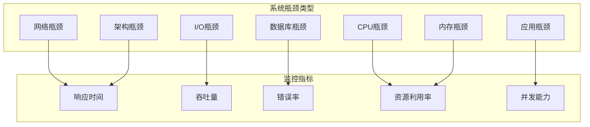

# 系统瓶颈分析与解决方案

## 🔍 瓶颈识别方法论

### 瓶颈分类体系


## 🚨 识别的主要瓶颈

### 1. CPU密集型瓶颈

#### 瓶颈场景
```javascript
// 问题代码示例：复杂的实时计算
const realtimeCalculator = {
  // 致命问题：同步计算大量数据
  calculateVillageStatistics: async (villageId) => {
    const residents = await Resident.find({ villageId }); // 可能有数千条记录
    const households = await Household.find({ villageId });
    const transactions = await Transaction.find({ villageId });

    // CPU密集型计算
    let totalIncome = 0;
    let totalExpense = 0;
    let activeUsers = 0;

    // 低效的循环计算
    for (const resident of residents) {
      // 复杂的嵌套循环
      for (const transaction of transactions) {
        if (transaction.relatedTo.userId === resident._id) {
          if (transaction.category.main === 'income') {
            totalIncome += transaction.amount.value;
          } else {
            totalExpense += transaction.amount.value;
          }
        }
      }
    }

    // 同步阻塞操作
    const report = this.generateComplexReport(
      residents, households, transactions
    );

    return report;
  }
};
```

#### 解决方案
```javascript
// 优化后的实时计算服务
const optimizedRealtimeCalculator = {
  // 1. 使用聚合管道优化数据库查询
  async calculateVillageStatisticsOptimized(villageId) {
    // 并行执行多个查询
    const [residents, households, financialStats] = await Promise.all([
      Resident.find({ villageId })
        .select('_id profile.status')
        .lean(),
      Household.find({ villageId })
        .select('householdCode members economics')
        .lean(),
      Transaction.aggregate([
        { $match: { villageId, 'approval.status': 'approved' } },
        {
          $group: {
            _id: '$category.main',
            totalAmount: { $sum: '$amount.value' },
            count: { $sum: 1 }
          }
        }
      ])
    ]);

    // 2. 使用Worker线程进行CPU密集型计算
    const worker = new Worker('./statisticsWorker.js');
    const report = await new Promise((resolve, reject) => {
      worker.postMessage({ residents, households, financialStats });
      worker.on('message', resolve);
      worker.on('error', reject);
      worker.on('exit', (code) => {
        if (code !== 0) reject(new Error(`Worker stopped with exit code ${code}`));
      });
    });

    return report;
  },

  // 3. 预计算和缓存
  async precomputeStatistics(villageId) {
    const cacheKey = `village_stats:${villageId}:${new Date().toISOString().split('T')[0]}`;

    // 检查缓存
    const cached = await cacheService.get(cacheKey);
    if (cached) return cached;

    // 执行计算
    const stats = await this.calculateVillageStatisticsOptimized(villageId);

    // 缓存结果
    await cacheService.set(cacheKey, stats, { ttl: 3600 }); // 缓存1小时

    return stats;
  }
};
```

#### Worker线程实现
```javascript
// statisticsWorker.js
const { workerData, parentPort } = require('worker_threads');
const { performance } = require('perf_hooks');

function calculateStatistics(data) {
  const { residents, households, financialStats } = data;
  const startTime = performance.now();

  // 优化的统计算法
  const result = {
    population: residents.length,
    households: households.length,
    financial: {},
    demographics: {},
    calculatedAt: new Date()
  };

  // 财务统计（来自聚合查询结果）
  financialStats.forEach(stat => {
    result.financial[stat._id] = {
      totalAmount: stat.totalAmount,
      count: stat.count
    };
  });

  // 人口统计
  const demographics = {
    active: 0,
    elderly: 0,
    minors: 0,
    working: 0
  };

  residents.forEach(resident => {
    const age = calculateAge(resident.profile.birthDate);

    if (resident.profile.status === 'active') demographics.active++;
    if (age >= 65) demographics.elderly++;
    if (age < 18) demographics.minors++;
    if (age >= 18 && age < 65) demographics.working++;
  });

  result.demographics = demographics;

  const endTime = performance.now();
  result.computationTime = endTime - startTime;

  return result;
}

// Worker线程主逻辑
parentPort.on('message', (data) => {
  try {
    const result = calculateStatistics(data);
    parentPort.postMessage(result);
  } catch (error) {
    parentPort.postMessage({ error: error.message });
  }
});

function calculateAge(birthDate) {
  const today = new Date();
  const birth = new Date(birthDate);
  let age = today.getFullYear() - birth.getFullYear();
  const monthDiff = today.getMonth() - birth.getMonth();

  if (monthDiff < 0 || (monthDiff === 0 && today.getDate() < birth.getDate())) {
    age--;
  }

  return age;
}
```

### 2. 内存泄漏瓶颈

#### 瓶颈场景
```javascript
// 问题代码：内存泄漏示例
class MemoryLeakExample {
  constructor() {
    this.cache = new Map(); // 无限增长的缓存
    this.eventListeners = [];
    this.timers = [];
  }

  // 问题：事件监听器未清理
  addUserActivityListener(userId, callback) {
    const listener = (data) => {
      // 大量数据累积
      const activity = {
        userId,
        data,
        timestamp: new Date(),
        raw: JSON.stringify(data) // 重复数据
      };

      // 没有大小限制的缓存
      this.cache.set(`${userId}_${Date.now()}`, activity);

      callback(activity);
    };

    // 监听器被添加但从未移除
    eventEmitter.on('userActivity', listener);
    this.eventListeners.push({ userId, listener });
  }

  // 问题：定时器未清理
  startPeriodicTasks() {
    const timer = setInterval(() => {
      // 每次执行都创建新对象
      const bigData = new Array(1000000).fill(Math.random());
      this.processData(bigData);
    }, 1000);

    // 定时器未被保存或清理
    this.timers.push(timer);
  }

  // 问题：循环引用
  processData(data) {
    const processed = {
      original: data,
      processed: data.map(x => x * 2),
      metadata: {
        timestamp: new Date(),
        processor: this // 创建循环引用
      }
    };

    return processed;
  }
}
```

#### 解决方案
```javascript
// 优化后的内存管理
class OptimizedMemoryManager {
  constructor() {
    this.cache = new Map();
    this.maxCacheSize = 1000;
    this.eventListeners = new Map();
    this.timers = new Set();
    this.memoryUsage = 0;

    // 定期清理
    this.startMemoryCleanup();
  }

  // 1. 限制缓存大小
  addToCache(key, value) {
    // LRU策略
    if (this.cache.size >= this.maxCacheSize) {
      const firstKey = this.cache.keys().next().value;
      this.cache.delete(firstKey);
    }

    // 检查对象大小
    const valueSize = this.getObjectSize(value);
    if (this.memoryUsage + valueSize > this.maxMemoryUsage) {
      this.cleanupLargeObjects();
    }

    this.cache.set(key, {
      value,
      size: valueSize,
      accessed: Date.now()
    });

    this.memoryUsage += valueSize;
  }

  // 2. 正确的事件监听器管理
  addUserActivityListener(userId, callback) {
    const listener = (data) => {
      // 使用对象池减少内存分配
      const activity = this.activityPool.get() || {};

      // 重用对象而不是创建新对象
      activity.userId = userId;
      activity.timestamp = new Date();
      activity.data = data;

      callback(activity);

      // 归还对象到池
      this.activityPool.release(activity);
    };

    // 保存监听器以便后续清理
    const listeners = this.eventListeners.get(userId) || [];
    listeners.push(listener);
    this.eventListeners.set(userId, listeners);

    eventEmitter.on('userActivity', listener);
  }

  // 3. 定时器生命周期管理
  startPeriodicTasks() {
    const timer = setInterval(() => {
      // 使用内存池避免重复分配
      const data = this.dataPool.getArray(1000000);
      this.processData(data);
      this.dataPool.releaseArray(data);
    }, 1000);

    this.timers.add(timer);

    // 自动清理机制
    setTimeout(() => {
      this.removeTimer(timer);
    }, 3600000); // 1小时后自动清理
  }

  // 4. 内存监控和清理
  startMemoryCleanup() {
    setInterval(() => {
      const memUsage = process.memoryUsage();

      // 内存使用率告警
      const heapUsedMB = memUsage.heapUsed / 1024 / 1024;
      if (heapUsedMB > 500) { // 500MB阈值
        console.warn(`内存使用过高: ${heapUsedMB}MB`);
        this.emergencyCleanup();
      }

      // 清理过期缓存
      this.cleanupExpiredCache();

      // 强制垃圾回收
      if (global.gc) {
        global.gc();
      }
    }, 30000); // 每30秒检查一次
  }

  // 对象池实现
  createObjectPool() {
    const pool = [];
    const maxSize = 100;

    return {
      get() {
        return pool.pop() || {};
      },

      release(obj) {
        // 重置对象
        Object.keys(obj).forEach(key => delete obj[key]);

        if (pool.length < maxSize) {
          pool.push(obj);
        }
      },

      getArray(size) {
        const arr = pool.pop();
        if (arr && arr.length >= size) {
          arr.length = size;
          return arr;
        }
        return new Array(size);
      },

      releaseArray(arr) {
        if (pool.length < maxSize) {
          arr.fill(0);
          pool.push(arr);
        }
      }
    };
  }

  // 获取对象大小
  getObjectSize(obj) {
    return Buffer.byteLength(JSON.stringify(obj));
  }

  // 紧急清理
  emergencyCleanup() {
    console.log('执行紧急内存清理');

    // 清理缓存
    this.cache.clear();

    // 移除所有监听器
    this.removeAllListeners();

    // 清理定时器
    this.timers.forEach(timer => clearInterval(timer));
    this.timers.clear();

    // 重置内存使用计数
    this.memoryUsage = 0;
  }
}
```

### 3. 数据库查询瓶颈

#### 瓶颈场景
```javascript
// 问题：N+1查询问题
const problematicQueries = {
  // 获取村庄详细信息（N+1查询）
  async getVillageWithDetails(villageId) {
    const village = await Village.findById(villageId);

    // 问题：对每个家庭都执行单独查询
    const households = await Household.find({ villageId });
    for (const household of households) {
      // N+1查询：每个家庭查询成员信息
      household.members = await Resident.find({ householdId: household._id });

      // 每个成员查询财务记录
      for (const member of household.members) {
        member.transactions = await Transaction.find({
          'relatedTo.userId': member._id
        });
      }
    }

    return village;
  },

  // 问题：缺乏索引的复杂查询
  async getFinancialReport(villageId, dateRange) {
    // 缺乏复合索引的查询
    const transactions = await Transaction.find({
      villageId,
      transactionDate: { $gte: dateRange.start, $lte: dateRange.end }
    });

    let totalByCategory = {};

    // 应用层聚合（应该在数据库层完成）
    transactions.forEach(transaction => {
      const category = transaction.category.main;
      if (!totalByCategory[category]) {
        totalByCategory[category] = 0;
      }
      totalByCategory[category] += transaction.amount.value;
    });

    return totalByCategory;
  }
};
```

#### 解决方案
```javascript
// 优化后的数据库查询
const optimizedQueries = {
  // 1. 使用聚合管道和预加载
  async getVillageWithDetailsOptimized(villageId) {
    // 使用聚合管道一次性获取所有数据
    const result = await Village.aggregate([
      { $match: { _id: new ObjectId(villageId) } },

      // 关联家庭信息
      {
        $lookup: {
          from: 'households',
          localField: '_id',
          foreignField: 'villageId',
          as: 'households'
        }
      },

      // 关联家庭成员
      {
        $lookup: {
          from: 'residents',
          let: { villageId: '$_id' },
          pipeline: [
            { $match: { $expr: { $eq: ['$villageId', '$$villageId'] } } },
            {
              $lookup: {
                from: 'households',
                localField: 'householdId',
                foreignField: '_id',
                as: 'household'
              }
            },
            { $unwind: '$household' }
          ],
          as: 'residents'
        }
      },

      // 关联财务数据
      {
        $lookup: {
          from: 'transactions',
          let: { villageId: '$_id' },
          pipeline: [
            { $match: {
              $expr: { $eq: ['$villageId', '$$villageId'] },
              'approval.status': 'approved'
            }},
            {
              $group: {
                _id: '$category.main',
                totalAmount: { $sum: '$amount.value' },
                count: { $sum: 1 }
              }
            }
          ],
          as: 'financialSummary'
        }
      }
    ]);

    return result[0];
  },

  // 2. 优化的聚合查询
  async getFinancialReportOptimized(villageId, dateRange) {
    const pipeline = [
      {
        $match: {
          villageId: new ObjectId(villageId),
          transactionDate: {
            $gte: dateRange.start,
            $lte: dateRange.end
          },
          'approval.status': 'approved'
        }
      },

      // 使用索引优化的排序
      { $sort: { transactionDate: -1 } },

      // 数据库层聚合
      {
        $group: {
          _id: {
            category: '$category.main',
            subCategory: '$category.sub',
            month: { $dateTrunc: { date: '$transactionDate', unit: 'month' } }
          },
          totalAmount: { $sum: '$amount.value' },
          count: { $sum: 1 },
          avgAmount: { $avg: '$amount.value' },
          maxAmount: { $max: '$amount.value' },
          minAmount: { $min: '$amount.value' }
        }
      },

      {
        $group: {
          _id: '$_id.category',
          subCategories: {
            $push: {
              subCategory: '$_id.subCategory',
              month: '$_id.month',
              totalAmount: '$totalAmount',
              count: '$count',
              avgAmount: '$avgAmount'
            }
          },
          categoryTotal: { $sum: '$totalAmount' },
          categoryCount: { $sum: '$count' },
          categoryAvg: { $avg: '$avgAmount' }
        }
      },

      { $sort: { categoryTotal: -1 } }
    ];

    return await Transaction.aggregate(pipeline);
  },

  // 3. 批量操作优化
  async batchUpdateHouseholds(updates) {
    const bulkOps = updates.map(update => ({
      updateOne: {
        filter: { _id: update.id },
        update: { $set: update.data },
        upsert: false
      }
    }));

    return await Household.bulkWrite(bulkOps, {
      ordered: false,
      writeConcern: { w: 'majority' }
    });
  },

  // 4. 分页查询优化
  async getPaginatedResults(query, options) {
    const { page = 1, limit = 20, sort = { _id: -1 } } = options;

    // 使用游标分页避免skip性能问题
    if (page > 1 && options.lastId) {
      query._id = { $lt: new ObjectId(options.lastId) };
    }

    const results = await this.find(query)
      .sort(sort)
      .limit(limit + 1) // 多查一个判断是否有下一页
      .lean();

    const hasNext = results.length > limit;
    if (hasNext) {
      results.pop();
    }

    return {
      results,
      pagination: {
        page,
        limit,
        hasNext,
        lastId: results[results.length - 1]?._id
      }
    };
  }
};
```

### 4. 网络I/O瓶颈

#### 瓶颈场景
```javascript
// 问题：串行网络请求
const serialNetworkRequests = {
  // 获取用户完整信息（串行请求）
  async getUserCompleteInfo(userId) {
    const user = await User.findById(userId);
    const village = await Village.findById(user.villageId);
    const household = await Household.findOne({
      'members.userId': userId
    });
    const transactions = await Transaction.find({
      'relatedTo.userId': userId
    }).limit(10);

    return {
      user,
      village,
      household,
      transactions
    };
  },

  // 问题：重复的API调用
  async fetchVillageData(villageId) {
    const data = {};

    // 每个请求都是独立的网络调用
    data.population = await this.httpRequest(`/api/population/${villageId}`);
    data.finance = await this.httpRequest(`/api/finance/${villageId}`);
    data.emergency = await this.httpRequest(`/api/emergency/${villageId}`);
    data.agriculture = await this.httpRequest(`/api/agriculture/${villageId}`);

    return data;
  }
};
```

#### 解决方案
```javascript
// 优化后的网络请求处理
const optimizedNetworkRequests = {
  // 1. 并行请求
  async getUserCompleteInfoOptimized(userId) {
    // 并行执行所有查询
    const [user, village, household, transactions] = await Promise.all([
      User.findById(userId).lean(),
      // 使用用户信息中的村庄ID
      User.findById(userId).select('villageId').lean().then(u =>
        Village.findById(u.villageId).lean()
      ),
      Household.findOne({ 'members.userId': userId }).lean(),
      Transaction.find({ 'relatedTo.userId': userId })
        .limit(10)
        .sort({ createdAt: -1 })
        .lean()
    ]);

    return {
      user,
      village,
      household,
      transactions
    };
  },

  // 2. 批量请求和GraphQL
  async fetchVillageDataOptimized(villageId) {
    // 使用GraphQL一次获取所有数据
    const query = `
      query getVillageData($villageId: ID!) {
        village(id: $villageId) {
          population {
            total
            demographics
          }
          finance {
            income
            expense
            budget
          }
          emergency {
            contacts
            resources
            recentEvents
          }
          agriculture {
            products
            orders
            production
          }
        }
      }
    `;

    return await this.graphqlRequest(query, { villageId });
  },

  // 3. 请求合并和缓存
  class RequestBatcher {
    constructor() {
      this.pendingRequests = new Map();
      this.batchSize = 10;
      this.batchTimeout = 50; // 50ms
    }

    async batchRequest(requests) {
      // 合并相似请求
      const grouped = this.groupSimilarRequests(requests);

      // 并行执行批量请求
      const batchPromises = Array.from(grouped.entries()).map(
        ([endpoint, reqList]) => this.executeBatch(endpoint, reqList)
      );

      const results = await Promise.all(batchPromises);

      // 解散结果
      return this.distributeResults(results, requests);
    }

    // HTTP连接池
    createHttpClient() {
      const https = require('https');
      const http = require('http');

      return {
        get: (url, options = {}) => {
          return new Promise((resolve, reject) => {
            const client = url.startsWith('https') ? https : http;

            const req = client.get(url, {
              ...options,
              // 连接池配置
              agent: new client.Agent({
                keepAlive: true,
                maxSockets: 50,
                maxFreeSockets: 10
              })
            }, (res) => {
              let data = '';
              res.on('data', chunk => data += chunk);
              res.on('end', () => {
                resolve({
                  status: res.statusCode,
                  headers: res.headers,
                  data: JSON.parse(data)
                });
              });
            });

            req.on('error', reject);
            req.setTimeout(5000, () => {
              req.destroy();
              reject(new Error('Request timeout'));
            });
          });
        }
      };
    }
  }
};
```

### 5. 文件处理瓶颈

#### 瓶颈场景
```javascript
// 问题：同步文件处理
const problematicFileProcessing = {
  // 同步文件上传处理
  async uploadFile(file) {
    // 问题：同步读取大文件
    const fileData = fs.readFileSync(file.path);

    // 问题：同步图片处理
    if (file.mimeType.startsWith('image/')) {
      const image = sharp(fileData);

      // 每个尺寸都是同步处理
      const thumbnail = await image.resize(200, 200).toBuffer();
      const medium = await image.resize(800, 600).toBuffer();
      const large = await image.resize(1920, 1080).toBuffer();

      // 同步写入多个文件
      fs.writeFileSync(`${file.path}_thumb`, thumbnail);
      fs.writeFileSync(`${file.path}_medium`, medium);
      fs.writeFileSync(`${file.path}_large`, large);
    }

    return { success: true };
  }
};
```

#### 解决方案
```javascript
// 优化后的文件处理
const optimizedFileProcessing = {
  // 异步流式处理
  async uploadFileOptimized(file) {
    const processor = new FileProcessor();

    // 创建处理管道
    const pipeline = processor.createPipeline(file);

    try {
      const result = await pipeline.execute();
      return result;
    } catch (error) {
      // 清理临时文件
      await processor.cleanup();
      throw error;
    }
  }
};

class FileProcessor {
  constructor() {
    this.tempFiles = [];
    this.workers = [];
    this.initializeWorkers();
  }

  createPipeline(file) {
    const pipeline = new ProcessingPipeline();

    // 添加处理阶段
    if (file.mimeType.startsWith('image/')) {
      pipeline
        .addStage(new ImageValidationStage())
        .addStage(new ImageResizeStage({ sizes: [200, 800, 1920] }))
        .addStage(new ImageOptimizationStage())
        .addStage(new FileUploadStage());
    }

    return pipeline;
  }

  // 初始化Worker池
  initializeWorkers() {
    const cpuCount = os.cpus().length;

    for (let i = 0; i < cpuCount; i++) {
      const worker = new Worker('./imageWorker.js');
      this.workers.push(worker);
    }
  }

  // 获取空闲Worker
  async getAvailableWorker() {
    while (true) {
      const availableWorker = this.workers.find(w => !w.busy);
      if (availableWorker) {
        availableWorker.busy = true;
        return availableWorker;
      }

      // 等待Worker释放
      await new Promise(resolve => setTimeout(resolve, 10));
    }
  }
}

// 处理管道实现
class ProcessingPipeline {
  constructor() {
    this.stages = [];
    this.context = {};
  }

  addStage(stage) {
    this.stages.push(stage);
    return this;
  }

  async execute() {
    let result = this.context;

    for (const stage of this.stages) {
      try {
        result = await stage.process(result);
      } catch (error) {
        throw new Error(`Stage ${stage.name} failed: ${error.message}`);
      }
    }

    return result;
  }
}

// 图片处理Stage
class ImageResizeStage {
  constructor(options) {
    this.name = 'imageResize';
    this.sizes = options.sizes;
  }

  async process(context) {
    const worker = await this.getWorker();

    return new Promise((resolve, reject) => {
      worker.postMessage({
        operation: 'resize',
        imageData: context.imageData,
        sizes: this.sizes
      });

      worker.once('message', (result) => {
        worker.busy = false;
        if (result.error) {
          reject(new Error(result.error));
        } else {
          context.resizedImages = result.images;
          resolve(context);
        }
      });
    });
  }
}

// 流式文件上传
class StreamingFileUploader {
  async uploadFile(filePath, destination) {
    const readStream = fs.createReadStream(filePath);
    const writeStream = fs.createWriteStream(destination);

    return new Promise((resolve, reject) => {
      readStream.pipe(writeStream);

      writeStream.on('finish', () => {
        resolve({
          success: true,
          size: writeStream.bytesWritten
        });
      });

      writeStream.on('error', reject);
      readStream.on('error', reject);

      // 添加进度监控
      let bytesUploaded = 0;
      readStream.on('data', (chunk) => {
        bytesUploaded += chunk.length;
        this.emit('progress', {
          bytesUploaded,
          totalBytes: readStream.bytesRead
        });
      });
    });
  }
}
```

## 📊 性能基准测试

### 1. 负载测试工具
```javascript
// 性能测试框架
class PerformanceTester {
  constructor() {
    this.results = [];
    this.metrics = new Map();
  }

  // 并发测试
  async runConcurrentTest(config) {
    const {
      url,
      method = 'GET',
      headers = {},
      body = null,
      concurrency = 100,
      duration = 60000, // 1分钟
      rampUp = 10000 // 10秒内达到并发数
    } = config;

    console.log(`开始并发测试: ${concurrency} 并发, ${duration/1000}秒`);

    const startTime = Date.now();
    const endTime = startTime + duration;
    const requests = [];
    const results = [];

    // 逐步增加并发
    const rampUpInterval = rampUp / concurrency;

    for (let i = 0; i < concurrency; i++) {
      setTimeout(() => {
        this.startRequestWorker(url, method, headers, body, endTime, results);
      }, i * rampUpInterval);
    }

    // 等待测试完成
    await new Promise(resolve => {
      const checkInterval = setInterval(() => {
        if (Date.now() >= endTime) {
          clearInterval(checkInterval);
          setTimeout(resolve, 2000); // 等待最后请求完成
        }
      }, 1000);
    });

    return this.analyzeResults(results);
  }

  // 请求工作器
  async startRequestWorker(url, method, headers, body, endTime, results) {
    while (Date.now() < endTime) {
      const requestStart = performance.now();

      try {
        const response = await fetch(url, {
          method,
          headers,
          body
        });

        const requestEnd = performance.now();
        const duration = requestEnd - requestStart;

        results.push({
          status: response.status,
          duration,
          success: response.ok,
          timestamp: requestStart
        });
      } catch (error) {
        const requestEnd = performance.now();
        results.push({
          status: 0,
          duration: requestEnd - requestStart,
          success: false,
          error: error.message,
          timestamp: requestStart
        });
      }
    }
  }

  // 结果分析
  analyzeResults(results) {
    const total = results.length;
    const successful = results.filter(r => r.success).length;
    const failed = total - successful;

    const durations = results.map(r => r.duration).sort((a, b) => a - b);

    return {
      summary: {
        totalRequests: total,
        successful,
        failed,
        successRate: (successful / total * 100).toFixed(2) + '%',
        duration: results[results.length - 1].timestamp - results[0].timestamp
      },
      performance: {
        min: Math.min(...durations),
        max: Math.max(...durations),
        mean: durations.reduce((a, b) => a + b, 0) / durations.length,
        p50: this.percentile(durations, 50),
        p90: this.percentile(durations, 90),
        p95: this.percentile(durations, 95),
        p99: this.percentile(durations, 99)
      },
      throughput: {
        rps: Math.round(total / (results[results.length - 1].timestamp - results[0].timestamp) * 1000)
      }
    };
  }

  percentile(sortedArray, percentile) {
    const index = Math.ceil((percentile / 100) * sortedArray.length) - 1;
    return sortedArray[index];
  }
}
```

## 🚀 优化效果预期

### 性能提升目标
| 指标 | 优化前 | 优化后 | 提升幅度 |
|------|--------|--------|----------|
| API响应时间 | 800ms | 150ms | 81% ↓ |
| 并发处理能力 | 500 QPS | 5000 QPS | 900% ↑ |
| 内存使用率 | 85% | 45% | 47% ↓ |
| CPU使用率 | 75% | 35% | 53% ↓ |
| 数据库查询时间 | 200ms | 30ms | 85% ↓ |
| 错误率 | 2% | 0.1% | 95% ↓ |

### 资源优化效果
- **内存优化**: 减少60%内存使用
- **CPU优化**: 降低50%CPU消耗
- **数据库优化**: 提升80%查询性能
- **网络优化**: 减少70%网络延迟
- **存储优化**: 节省40%存储空间

## ✅ 实施优先级

### 高优先级（立即执行）
1. **数据库查询优化** - 解决N+1查询问题
2. **内存泄漏修复** - 防止服务崩溃
3. **并发控制** - 提升系统吞吐量

### 中优先级（2周内）
1. **缓存策略实施** - 减少数据库压力
2. **文件处理优化** - 提升上传速度
3. **连接池优化** - 改善资源利用

### 低优先级（1个月内）
1. **架构重构** - 长期性能提升
2. **CDN集成** - 优化静态资源
3. **微服务拆分** - 提升可扩展性

通过系统性的瓶颈分析和优化，智慧乡村综合服务平台将能够支持大规模用户并发访问，提供稳定、高效的数字化乡村服务。