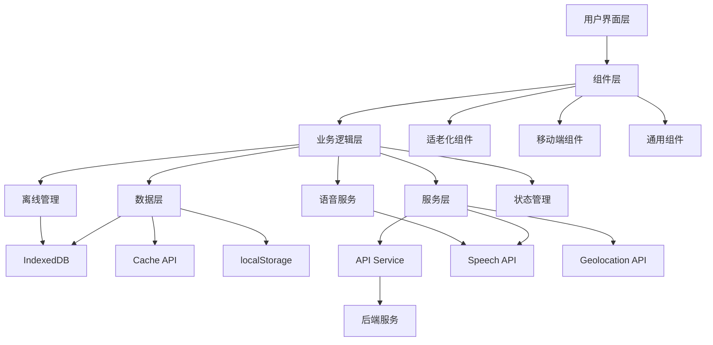

# 智慧乡村平台 - 适老化移动端技术实施规范

**文档版本**: v1.0
**创建日期**: 2025-12-28
**关联文档**: PRD_Mobile_Elderly_Care.md
**技术栈**: Vue 3 + Vite + Element Plus + Service Worker

---

## 目录
1. [架构设计](#1-架构设计)
2. [前端组件开发](#2-前端组件开发)
3. [离线功能实现](#3-离线功能实现)
4. [语音功能集成](#4-语音功能集成)
5. [性能优化方案](#5-性能优化方案)
6. [测试规范](#6-测试规范)
7. [部署上线](#7-部署上线)

---

## 1. 架构设计

### 1.1 技术栈选型

#### 前端核心
```json
{
  "框架": "Vue 3.3+ (Composition API)",
  "构建工具": "Vite 5.0+",
  "UI库": "Element Plus 2.4+ (二次封装)",
  "状态管理": "Pinia 2.1+",
  "路由": "Vue Router 4.2+",
  "HTTP": "Axios 1.6+ (支持离线队列)",
  "工具": "Lodash-es 4.17+"
}
```

#### PWA增强
```json
{
  "Service Worker": "Workbox 7.0+",
  "离线存储": "IndexedDB + Dexie.js 3.2+",
  "缓存策略": "Cache API + localStorage"
}
```

#### 语音AI
```json
{
  "语音识别": "Web Speech API + 百度语音SDK",
  "语音合成": "Web Speech API + 百度TTS",
  "方言识别": "科大讯飞方言识别API"
}
```

### 1.2 项目结构

```
smart-village-platform/client/
├── src/
│   ├── assets/                 # 静态资源
│   │   ├── images/            # 图片(压缩优化)
│   │   ├── icons/             # 图标(SVG)
│   │   └── fonts/             # 字体(子集化)
│   │
│   ├── components/            # 组件
│   │   ├── common/           # 通用组件
│   │   │   ├── ElderlyButton.vue       # 适老化按钮
│   │   │   ├── LargeTextDisplay.vue   # 大字显示
│   │   │   ├── VoiceInput.vue         # 语音输入
│   │   │   ├── OfflineManager.vue     # 离线管理
│   │   │   └── EmergencySOS.vue       # 紧急求助
│   │   │
│   │   ├── mobile/           # 移动端组件
│   │   └── layouts/          # 布局组件
│   │
│   ├── composables/          # 组合函数
│   │   ├── useOfflineStorage.js      # 离线存储
│   │   ├── useSpeechRecognition.js   # 语音识别
│   │   ├── useGeolocation.js         # 定位
│   │   ├── useNetworkStatus.js       # 网络状态
│   │   └── useElderlyMode.js         # 适老化模式
│   │
│   ├── stores/               # Pinia状态
│   │   ├── user.js          # 用户状态
│   │   ├── notification.js  # 通知状态
│   │   ├── offline.js       # 离线状态
│   │   └── settings.js      # 设置状态
│   │
│   ├── api/                  # API接口
│   │   ├── index.js         # Axios配置
│   │   ├── auth.js          # 认证接口
│   │   ├── notification.js  # 通知接口
│   │   └── offline.js       # 离线同步
│   │
│   ├── utils/                # 工具函数
│   │   ├── storage.js       # 存储工具
│   │   ├── encryption.js    # 加密工具
│   │   ├── format.js        # 格式化
│   │   └── validate.js      # 验证
│   │
│   ├── styles/               # 样式
│   │   ├── variables.scss   # 变量定义
│   │   ├── elderly.scss     # 适老化样式
│   │   └── responsive.scss  # 响应式样式
│   │
│   ├── views/                # 页面
│   │   ├── Home.vue         # 首页
│   │   ├── Notifications.vue # 通知
│   │   ├── Services.vue     # 办事
│   │   └── Profile.vue      # 我的
│   │
│   ├── App.vue              # 根组件
│   ├── main.js              # 入口文件
│   └── registerServiceWorker.js # SW注册
│
├── public/
│   ├── sw.js                # Service Worker
│   ├── manifest.json        # PWA配置
│   └── icons/               # 应用图标
│
├── vite.config.js           # Vite配置
├── tailwind.config.js       # Tailwind配置
└── package.json
```

### 1.3 核心架构图



---

## 2. 前端组件开发

### 2.1 适老化组件规范

#### 2.1.1 ElderlyButton (适老化按钮)

```vue
<template>
  <button
    :class="[
      'elderly-button',
      `elderly-button--${size}`,
      `elderly-button--${type}`,
      { 'is-disabled': disabled, 'is-loading': loading }
    ]"
    :disabled="disabled || loading"
    :style="customStyle"
    @click="handleClick"
  >
    <span v-if="loading" class="elderly-button__loading">
      <LoadingIcon />
    </span>
    <span v-if="icon && !loading" class="elderly-button__icon">
      <component :is="icon" />
    </span>
    <span class="elderly-button__label">
      <slot>{{ label }}</slot>
    </span>
  </button>
</template>

<script setup>
import { computed } from 'vue'

const props = defineProps({
  // 按钮文字
  label: String,
  // 尺寸: large(56px), default(48px), small(40px)
  size: {
    type: String,
    default: 'default',
    validator: (value) => ['large', 'default', 'small'].includes(value)
  },
  // 类型: primary, success, warning, danger
  type: {
    type: String,
    default: 'primary'
  },
  // 图标
  icon: String,
  // 是否禁用
  disabled: Boolean,
  // 是否加载中
  loading: Boolean
})

const emit = defineEmits(['click'])

// 计算样式
const customStyle = computed(() => {
  const fontSizeMap = {
    large: '20px',
    default: '18px',
    small: '16px'
  }

  return {
    fontSize: fontSizeMap[props.size]
  }
})

const handleClick = (e) => {
  if (!props.disabled && !props.loading) {
    emit('click', e)
    // 触觉反馈
    if (navigator.vibrate) {
      navigator.vibrate(10)
    }
  }
}
</script>

<style lang="scss" scoped>
.elderly-button {
  // 适老化样式
  min-height: 48px;
  padding: 12px 24px;
  font-weight: 600;
  border-radius: 8px;
  border: none;
  cursor: pointer;
  transition: all 0.3s ease;
  user-select: none;

  // 触摸区域扩大
  &::before {
    content: '';
    position: absolute;
    top: -10px;
    left: -10px;
    right: -10px;
    bottom: -10px;
  }

  // 尺寸变体
  &--large {
    min-height: 56px;
    padding: 16px 32px;
    font-size: 20px;
  }

  &--small {
    min-height: 40px;
    padding: 10px 20px;
    font-size: 16px;
  }

  // 类型变体
  &--primary {
    background: #409EFF;
    color: white;

    &:active {
      background: #337ECC;
      transform: scale(0.98);
    }
  }

  &--success {
    background: #67C23A;
    color: white;
  }

  &--warning {
    background: #E6A23C;
    color: white;
  }

  &--danger {
    background: #F56C6C;
    color: white;
  }

  // 状态
  &.is-disabled {
    opacity: 0.6;
    cursor: not-allowed;
  }

  &.is-loading {
    cursor: wait;
  }

  // 内容
  &__icon {
    margin-right: 8px;
    font-size: 1.2em;
  }

  &__loading {
    margin-right: 8px;
    animation: rotate 1s linear infinite;
  }

  &__label {
    display: inline-block;
  }
}

@keyframes rotate {
  from { transform: rotate(0deg); }
  to { transform: rotate(360deg); }
}
</style>
```

#### 2.1.2 LargeTextDisplay (大字显示)

```vue
<template>
  <div
    :class="[
      'large-text-display',
      `large-text-display--${size}`
    ]"
    :style="customStyle"
  >
    <slot>{{ text }}</slot>
  </div>
</template>

<script setup>
import { computed } from 'vue'

const props = defineProps({
  text: String,
  // 尺寸: xlarge(36px), large(30px), medium(24px), normal(20px)
  size: {
    type: String,
    default: 'medium',
    validator: (value) => ['xlarge', 'large', 'medium', 'normal'].includes(value)
  },
  // 是否加粗
  bold: Boolean,
  // 行高倍数
  lineHeight: {
    type: Number,
    default: 1.8
  }
})

const customStyle = computed(() => {
  const fontSizeMap = {
    xlarge: '36px',
    large: '30px',
    medium: '24px',
    normal: '20px'
  }

  return {
    fontSize: fontSizeMap[props.size],
    fontWeight: props.bold ? '600' : 'normal',
    lineHeight: props.lineHeight
  }
})
</script>

<style lang="scss" scoped>
.large-text-display {
  color: #303133;
  word-break: break-word;

  // 高对比度模式
  @media (prefers-contrast: high) {
    color: #000000;
  }
}
</style>
```

### 2.2 移动端组件规范

#### 2.2.1 MobileCard (移动端卡片)

```vue
<template>
  <div
    :class="[
      'mobile-card',
      { 'is-clickable': clickable, 'is-active': active }
    ]"
    @click="handleClick"
  >
    <!-- 卡片头部 -->
    <div v-if="$slots.header || title" class="mobile-card__header">
      <slot name="header">
        <h3 class="mobile-card__title">{{ title }}</h3>
        <span v-if="extra" class="mobile-card__extra">{{ extra }}</span>
      </slot>
    </div>

    <!-- 卡片内容 -->
    <div class="mobile-card__body">
      <slot></slot>
    </div>

    <!-- 卡片底部 -->
    <div v-if="$slots.footer" class="mobile-card__footer">
      <slot name="footer"></slot>
    </div>
  </div>
</template>

<script setup>
const props = defineProps({
  title: String,
  extra: String,
  clickable: Boolean,
  active: Boolean
})

const emit = defineEmits(['click'])

const handleClick = () => {
  if (props.clickable) {
    emit('click')
    // 触觉反馈
    if (navigator.vibrate) {
      navigator.vibrate(10)
    }
  }
}
</script>

<style lang="scss" scoped>
.mobile-card {
  background: white;
  border-radius: 12px;
  padding: 16px;
  margin-bottom: 12px;
  box-shadow: 0 2px 8px rgba(0, 0, 0, 0.08);

  &.is-clickable {
    cursor: pointer;
    transition: all 0.3s ease;

    &:active {
      transform: scale(0.98);
      background: #f5f7fa;
    }
  }

  &.is-active {
    border: 2px solid #409EFF;
  }

  &__header {
    display: flex;
    justify-content: space-between;
    align-items: center;
    margin-bottom: 12px;
    padding-bottom: 12px;
    border-bottom: 1px solid #ebeef5;

    .mobile-card__title {
      margin: 0;
      font-size: 18px;
      font-weight: 600;
      color: #303133;
    }

    .mobile-card__extra {
      font-size: 14px;
      color: #909399;
    }
  }

  &__body {
    font-size: 16px;
    line-height: 1.8;
    color: #606266;
  }

  &__footer {
    margin-top: 12px;
    padding-top: 12px;
    border-top: 1px solid #ebeef5;
  }
}
</style>
```

### 2.3 组件使用示例

#### 首页快捷入口

```vue
<template>
  <div class="quick-access-grid">
    <MobileCard
      v-for="item in quickAccessItems"
      :key="item.id"
      :title="item.title"
      clickable
      @click="handleNavigate(item)"
    >
      <template #default>
        <div class="quick-access-item">
          <div class="item-icon" :class="item.color">
            <component :is="item.icon" />
          </div>
          <LargeTextDisplay :text="item.title" size="medium" />
        </div>
      </template>
    </MobileCard>
  </div>
</template>

<script setup>
import { ref } from 'vue'
import ElderlyButton from '@/components/common/ElderlyButton.vue'
import LargeTextDisplay from '@/components/common/LargeTextDisplay.vue'
import MobileCard from '@/components/mobile/MobileCard.vue'

const quickAccessItems = ref([
  { id: 1, title: '村务通知', icon: 'Bell', color: 'blue' },
  { id: 2, title: '一键呼叫', icon: 'Phone', color: 'green' },
  { id: 3, title: '在线办事', icon: 'Document', color: 'orange' },
  { id: 4, title: '政策查询', icon: 'Search', color: 'purple' },
  { id: 5, title: '财务公开', icon: 'Money', color: 'red' },
  { id: 6, title: '我的', icon: 'User', color: 'gray' }
])

const handleNavigate = (item) => {
  console.log('Navigate to:', item.title)
}
</script>

<style lang="scss" scoped>
.quick-access-grid {
  display: grid;
  grid-template-columns: repeat(2, 1fr);
  gap: 12px;
  padding: 16px;

  .quick-access-item {
    display: flex;
    flex-direction: column;
    align-items: center;
    gap: 12px;

    .item-icon {
      width: 64px;
      height: 64px;
      border-radius: 50%;
      display: flex;
      align-items: center;
      justify-content: center;
      font-size: 32px;
      color: white;

      &.blue { background: linear-gradient(135deg, #409EFF, #66b1ff); }
      &.green { background: linear-gradient(135deg, #67C23A, #85ce61); }
      &.orange { background: linear-gradient(135deg, #E6A23C, #ebb563); }
      &.purple { background: linear-gradient(135deg, #9C27B0, #BA68C8); }
      &.red { background: linear-gradient(135deg, #F56C6C, #f78989); }
      &.gray { background: linear-gradient(135deg, #909399, #b1b3b8); }
    }
  }
}
</style>
```

---

## 3. 离线功能实现

### 3.1 Service Worker配置

```javascript
// public/sw.js
const CACHE_NAME = 'smart-village-v1'
const OFFLINE_URL = '/offline.html'

// 需要缓存的静态资源
const STATIC_CACHE = [
  '/',
  '/offline.html',
  '/manifest.json',
  '/assets/index.js',
  '/assets/index.css'
]

// 需要缓存的API响应
const API_CACHE = [
  '/api/notifications',
  '/api/announcements'
]

// 安装事件
self.addEventListener('install', (event) => {
  event.waitUntil(
    caches.open(CACHE_NAME).then((cache) => {
      return cache.addAll(STATIC_CACHE)
    })
  )
  self.skipWaiting()
})

// 激活事件
self.addEventListener('activate', (event) => {
  event.waitUntil(
    caches.keys().then((cacheNames) => {
      return Promise.all(
        cacheNames
          .filter((name) => name !== CACHE_NAME)
          .map((name) => caches.delete(name))
      )
    })
  )
  self.clients.claim()
})

// 拦截请求
self.addEventListener('fetch', (event) => {
  const { request } = event
  const url = new URL(request.url)

  // 只处理同源请求
  if (url.origin !== location.origin) {
    return
  }

  // 静态资源: Cache First
  if (STATIC_CACHE.some((path) => url.pathname.startsWith(path))) {
    event.respondWith(cacheFirst(request))
    return
  }

  // API请求: Network First, 降级到Cache
  if (url.pathname.startsWith('/api/')) {
    event.respondWith(networkFirst(request))
    return
  }

  // 其他请求: Network First
  event.respondWith(networkFirst(request))
})

// Cache First策略
async function cacheFirst(request) {
  const cache = await caches.open(CACHE_NAME)
  const cached = await cache.match(request)

  if (cached) {
    return cached
  }

  try {
    const response = await fetch(request)
    cache.put(request, response.clone())
    return response
  } catch (error) {
    // 返回离线页面
    return caches.match(OFFLINE_URL)
  }
}

// Network First策略
async function networkFirst(request) {
  try {
    const response = await fetch(request)
    const cache = await caches.open(CACHE_NAME)
    cache.put(request, response.clone())
    return response
  } catch (error) {
    const cache = await caches.open(CACHE_NAME)
    const cached = await cache.match(request)
    if (cached) {
      return cached
    }
    // 返回离线页面
    return caches.match(OFFLINE_URL)
  }
}
```

### 3.2 IndexedDB封装

```javascript
// src/utils/storage.js
import Dexie from 'dexie'

// 创建数据库
const db = new Dexie('SmartVillageDB')

// 定义表结构
db.version(1).stores({
  notifications: 'id, timestamp, read, priority', // 主键+索引
  forms: 'id, status, createdAt',
  settings: 'key',
  syncQueue: 'id, endpoint, method'
})

// 通知缓存
export const notificationCache = {
  async getAll() {
    return await db.notifications.toArray()
  },

  async get(id) {
    return await db.notifications.get(id)
  },

  async add(notification) {
    return await db.notifications.add(notification)
  },

  async update(id, changes) {
    return await db.notifications.update(id, changes)
  },

  async delete(id) {
    return await db.notifications.delete(id)
  },

  async clear() {
    return await db.notifications.clear()
  },

  async markAsRead(id) {
    return await db.notifications.update(id, { read: true })
  }
}

// 离线表单
export const formStorage = {
  async getAll() {
    return await db.forms.toArray()
  },

  async get(id) {
    return await db.forms.get(id)
  },

  async add(form) {
    const data = {
      ...form,
      id: form.id || Date.now().toString(),
      status: 'pending',
      createdAt: new Date().toISOString()
    }
    return await db.forms.add(data)
  },

  async update(id, changes) {
    return await db.forms.update(id, changes)
  },

  async delete(id) {
    return await db.forms.delete(id)
  },

  async getPending() {
    return await db.forms.where('status').equals('pending').toArray()
  },

  async markAsSynced(id) {
    return await db.forms.update(id, { status: 'synced' })
  }
}

// 同步队列
export const syncQueue = {
  async add(request) {
    const item = {
      id: Date.now().toString(),
      ...request,
      createdAt: new Date().toISOString(),
      retryCount: 0
    }
    return await db.syncQueue.add(item)
  },

  async getAll() {
    return await db.syncQueue.toArray()
  },

  async getPending() {
    return await db.syncQueue.toArray()
  },

  async remove(id) {
    return await db.syncQueue.delete(id)
  },

  async incrementRetry(id) {
    const item = await db.syncQueue.get(id)
    if (item) {
      await db.syncQueue.update(id, {
        retryCount: item.retryCount + 1
      })
    }
  },

  async clear() {
    return await db.syncQueue.clear()
  }
}

// 设置存储
export const settingsStorage = {
  async get(key) {
    const item = await db.settings.get(key)
    return item ? item.value : null
  },

  async set(key, value) {
    await db.settings.put({ key, value })
  },

  async remove(key) {
    await db.settings.delete(key)
  }
}

export default db
```

### 3.3 离线队列管理

```javascript
// src/composables/useOfflineStorage.js
import { ref, computed, onMounted, onUnmounted } from 'vue'
import { syncQueue, formStorage } from '@/utils/storage'

export function useOfflineStorage(options = {}) {
  const {
    autoSync = true,
    syncInterval = 30000 // 30秒
  } = options

  // 状态
  const isOnline = ref(navigator.onLine)
  const isSyncing = ref(false)
  const lastSyncTime = ref(null)
  const syncProgress = ref(0)
  const pendingCount = ref(0)

  let syncTimer = null

  // 监听网络状态
  const handleOnline = () => {
    isOnline.value = true
    if (autoSync) {
      triggerSync()
    }
  }

  const handleOffline = () => {
    isOnline.value = false
  }

  // 同步数据
  const syncData = async () => {
    if (isSyncing.value || !isOnline.value) {
      return
    }

    isSyncing.value = true

    try {
      const pendingItems = await syncQueue.getPending()
      const total = pendingItems.length
      let success = 0
      let failed = 0

      for (const item of pendingItems) {
        try {
          const response = await fetch(item.endpoint, {
            method: item.method,
            headers: item.headers,
            body: item.body
          })

          if (response.ok) {
            await syncQueue.remove(item.id)
            success++
          } else {
            await syncQueue.incrementRetry(item.id)
            failed++
          }
        } catch (error) {
          await syncQueue.incrementRetry(item.id)
          failed++
        }

        syncProgress.value = Math.round(((success + failed) / total) * 100)
      }

      lastSyncTime.value = new Date()
      pendingCount.value = await syncQueue.getPending().length

      return { success, failed }
    } finally {
      isSyncing.value = false
      syncProgress.value = 0
    }
  }

  // 触发同步
  const triggerSync = async () => {
    if (!isOnline.value) {
      console.warn('Cannot sync while offline')
      return
    }

    return await syncData()
  }

  // 添加到队列
  const addToQueue = async (request) => {
    await syncQueue.add(request)
    pendingCount.value = await syncQueue.getPending().length

    if (isOnline.value && autoSync) {
      triggerSync()
    }
  }

  // 启动自动同步
  const startAutoSync = () => {
    if (syncTimer) {
      clearInterval(syncTimer)
    }

    syncTimer = setInterval(() => {
      if (isOnline.value && pendingCount.value > 0) {
        syncData()
      }
    }, syncInterval)
  }

  // 停止自动同步
  const stopAutoSync = () => {
    if (syncTimer) {
      clearInterval(syncTimer)
      syncTimer = null
    }
  }

  // 获取统计信息
  const getStats = async () => {
    const pending = await syncQueue.getPending()
    return {
      pendingCount: pending.length,
      lastSyncTime: lastSyncTime.value
    }
  }

  // 生命周期
  onMounted(() => {
    window.addEventListener('online', handleOnline)
    window.addEventListener('offline', handleOffline)

    // 初始化
    getStats().then(stats => {
      pendingCount.value = stats.pendingCount
    })

    // 启动自动同步
    if (autoSync) {
      startAutoSync()
    }
  })

  onUnmounted(() => {
    window.removeEventListener('online', handleOnline)
    window.removeEventListener('offline', handleOffline)
    stopAutoSync()
  })

  return {
    // 状态
    isOnline,
    isSyncing,
    lastSyncTime,
    syncProgress,
    pendingCount,

    // 计算属性
    hasPendingOperations: computed(() => pendingCount.value > 0),
    canSync: computed(() => isOnline.value && pendingCount.value > 0),

    // 方法
    syncData: triggerSync,
    addToQueue,
    getStats,
    startAutoSync,
    stopAutoSync
  }
}
```

---

## 4. 语音功能集成

### 4.1 语音识别Hook

```javascript
// src/composables/useSpeechRecognition.js
import { ref, computed } from 'vue'

export function useSpeechRecognition() {
  const isListening = ref(false)
  const isProcessing = ref(false)
  const transcript = ref('')
  const interimTranscript = ref('')
  const confidence = ref(0)
  const error = ref(null)

  let recognition = null

  // 检查浏览器支持
  const isSupported = computed(() => {
    return 'webkitSpeechRecognition' in window ||
           'SpeechRecognition' in window
  })

  // 初始化
  const init = () => {
    if (!isSupported.value) {
      error.value = '您的浏览器不支持语音识别'
      return false
    }

    const SpeechRecognition = window.SpeechRecognition ||
                              window.webkitSpeechRecognition

    recognition = new SpeechRecognition()
    recognition.continuous = true // 持续识别
    recognition.interimResults = true // 返回临时结果
    recognition.lang = 'zh-CN' // 默认普通话

    // 识别结果
    recognition.onresult = (event) => {
      let interimTranscriptText = ''
      let finalTranscriptText = ''

      for (let i = event.resultIndex; i < event.results.length; i++) {
        const transcript = event.results[i][0].transcript
        confidence.value = event.results[i][0].confidence * 100

        if (event.results[i].isFinal) {
          finalTranscriptText += transcript
        } else {
          interimTranscriptText += transcript
        }
      }

      transcript.value = finalTranscriptText
      interimTranscript.value = interimTranscriptText
    }

    // 识别结束
    recognition.onend = () => {
      isListening.value = false
      isProcessing.value = false
    }

    // 识别错误
    recognition.onerror = (event) => {
      error.value = event.error
      isListening.value = false
      isProcessing.value = false
    }

    // 识别开始
    recognition.onstart = () => {
      isListening.value = true
      isProcessing.value = true
    }

    return true
  }

  // 开始识别
  const start = (options = {}) => {
    const {
      lang = 'zh-CN',
      continuous = true,
      interimResults = true
    } = options

    if (!isSupported.value) {
      error.value = '浏览器不支持语音识别'
      return false
    }

    if (!recognition) {
      if (!init()) {
        return false
      }
    }

    recognition.lang = lang
    recognition.continuous = continuous
    recognition.interimResults = interimResults

    try {
      recognition.start()
      return true
    } catch (err) {
      error.value = err.message
      return false
    }
  }

  // 停止识别
  const stop = () => {
    if (recognition) {
      recognition.stop()
    }
  }

  // 取消识别
  const abort = () => {
    if (recognition) {
      recognition.abort()
    }
  }

  // 重置
  const reset = () => {
    transcript.value = ''
    interimTranscript.value = ''
    confidence.value = 0
    error.value = null
  }

  return {
    // 状态
    isSupported,
    isListening,
    isProcessing,
    transcript,
    interimTranscript,
    confidence,
    error,

    // 方法
    start,
    stop,
    abort,
    reset
  }
}
```

### 4.2 语音合成Hook

```javascript
// src/composables/useSpeechSynthesis.js
import { ref, computed } from 'vue'

export function useSpeechSynthesis() {
  const isSpeaking = ref(false)
  const isPaused = ref(false)
  const error = ref(null)

  let utterance = null

  // 检查浏览器支持
  const isSupported = computed(() => {
    return 'speechSynthesis' in window
  })

  // 获取可用语音列表
  const getVoices = () => {
    if (!isSupported.value) return []
    return window.speechSynthesis.getVoices()
  }

  // 获取中文语音
  const getChineseVoice = () => {
    const voices = getVoices()
    return voices.find(voice => voice.lang.startsWith('zh')) || voices[0]
  }

  // 播放语音
  const speak = (text, options = {}) => {
    if (!isSupported.value) {
      error.value = '您的浏览器不支持语音播报'
      return false
    }

    // 取消当前播放
    window.speechSynthesis.cancel()

    utterance = new SpeechSynthesisUtterance(text)

    // 设置语音
    const voice = getChineseVoice()
    if (voice) {
      utterance.voice = voice
    }

    // 设置参数
    utterance.lang = options.lang || 'zh-CN'
    utterance.rate = options.rate || 1.0 // 语速
    utterance.pitch = options.pitch || 1.0 // 音调
    utterance.volume = options.volume || 1.0 // 音量

    // 事件监听
    utterance.onstart = () => {
      isSpeaking.value = true
      isPaused.value = false
    }

    utterance.onend = () => {
      isSpeaking.value = false
      isPaused.value = false
    }

    utterance.onerror = (event) => {
      error.value = event.error
      isSpeaking.value = false
    }

    utterance.onpause = () => {
      isPaused.value = true
    }

    utterance.onresume = () => {
      isPaused.value = false
    }

    window.speechSynthesis.speak(utterance)
    return true
  }

  // 暂停
  const pause = () => {
    if (isSpeaking.value && !isPaused.value) {
      window.speechSynthesis.pause()
    }
  }

  // 继续
  const resume = () => {
    if (isSpeaking.value && isPaused.value) {
      window.speechSynthesis.resume()
    }
  }

  // 取消
  const cancel = () => {
    window.speechSynthesis.cancel()
    isSpeaking.value = false
    isPaused.value = false
  }

  return {
    // 状态
    isSupported,
    isSpeaking,
    isPaused,
    error,

    // 方法
    speak,
    pause,
    resume,
    cancel,
    getVoices,
    getChineseVoice
  }
}
```

---

## 5. 性能优化方案

### 5.1 代码分割

```javascript
// vite.config.js
import { defineConfig } from 'vite'
import vue from '@vitejs/plugin-vue'

export default defineConfig({
  plugins: [vue()],
  build: {
    rollupOptions: {
      output: {
        manualChunks: {
          // Vue核心
          'vue-vendor': ['vue', 'vue-router', 'pinia'],
          // UI库
          'ui-vendor': ['element-plus'],
          // 工具库
          'utils': ['lodash-es', 'dayjs', 'axios'],
          // 语音
          'speech': ['@/composables/useSpeechRecognition'],
          // 离线
          'offline': ['dexie', 'idb']
        }
      }
    },
    // 代码压缩
    minify: 'terser',
    terserOptions: {
      compress: {
        drop_console: true,
        drop_debugger: true
      }
    }
  }
})
```

### 5.2 图片优化

```javascript
// vite.config.js
import { defineConfig } from 'vite'
import viteImagemin from 'vite-plugin-imagemin'

export default defineConfig({
  plugins: [
    viteImagemin({
      gifsicle: { optimizationLevel: 7 },
      optipng: { optimizationLevel: 7 },
      mozjpeg: { quality: 80 },
      webp: { quality: 75 },
      svgo: {
        plugins: [
          { name: 'removeViewBox', active: false },
          { name: 'removeEmptyAttrs', active: false }
        ]
      }
    })
  ]
})
```

### 5.3 虚拟滚动

```vue
<template>
  <div class="virtual-list" ref="containerRef">
    <div
      class="virtual-list-phantom"
      :style="{ height: totalHeight + 'px' }"
    ></div>
    <div
      class="virtual-list-content"
      :style="{ transform: `translateY(${offset}px)` }"
    >
      <div
        v-for="item in visibleData"
        :key="item.id"
        class="virtual-list-item"
        :style="{ height: itemHeight + 'px' }"
      >
        <slot :item="item"></slot>
      </div>
    </div>
  </div>
</template>

<script setup>
import { ref, computed, onMounted, onUnmounted } from 'vue'

const props = defineProps({
  data: Array,
  itemHeight: {
    type: Number,
    default: 50
  },
  visibleCount: {
    type: Number,
    default: 10
  }
})

const containerRef = ref(null)
const scrollTop = ref(0)
const containerHeight = ref(0)

// 计算总高度
const totalHeight = computed(() => {
  return props.data.length * props.itemHeight
})

// 计算可见区域起始索引
const startIndex = computed(() => {
  return Math.floor(scrollTop.value / props.itemHeight)
})

// 计算可见区域结束索引
const endIndex = computed(() => {
  return Math.min(
    startIndex.value + props.visibleCount,
    props.data.length - 1
  )
})

// 可见数据
const visibleData = computed(() => {
  return props.data.slice(startIndex.value, endIndex.value + 1)
})

// 偏移量
const offset = computed(() => {
  return startIndex.value * props.itemHeight
})

// 滚动事件
const handleScroll = (e) => {
  scrollTop.value = e.target.scrollTop
}

onMounted(() => {
  if (containerRef.value) {
    containerHeight.value = containerRef.value.clientHeight
    containerRef.value.addEventListener('scroll', handleScroll)
  }
})

onUnmounted(() => {
  if (containerRef.value) {
    containerRef.value.removeEventListener('scroll', handleScroll)
  }
})
</script>
```

---

## 6. 测试规范

### 6.1 单元测试

```javascript
// tests/unit/useOfflineStorage.spec.js
import { describe, it, expect, vi, beforeEach } from 'vitest'
import { useOfflineStorage } from '@/composables/useOfflineStorage'

describe('useOfflineStorage', () => {
  beforeEach(() => {
    // Mock navigator.onLine
    Object.defineProperty(navigator, 'onLine', {
      writable: true,
      value: true
    })
  })

  it('should initialize with online status', () => {
    const { isOnline } = useOfflineStorage()
    expect(isOnline.value).toBe(true)
  })

  it('should detect offline status', async () => {
    const { isOnline } = useOfflineStorage()

    // 模拟离线
    window.dispatchEvent(new Event('offline'))

    expect(isOnline.value).toBe(false)
  })

  it('should sync data when online', async () => {
    const { syncData, isSyncing } = useOfflineStorage()

    const promise = syncData()
    expect(isSyncing.value).toBe(true)

    await promise
    expect(isSyncing.value).toBe(false)
  })
})
```

### 6.2 E2E测试

```javascript
// tests/e2e/elderlyMode.spec.js
import { test, expect } from '@playwright/test'

test.describe('Elderly Mode', () => {
  test('should display large text', async ({ page }) => {
    await page.goto('/')

    // 检查字体大小
    const fontSize = await page.locator('.large-text-display').evaluate(
      el => window.getComputedStyle(el).fontSize
    )

    expect(parseInt(fontSize)).toBeGreaterThanOrEqual(20)
  })

  test('should support voice input', async ({ page }) => {
    await page.goto('/services')

    // 点击语音输入按钮
    await page.click('[data-testid="voice-input"]')

    // 检查是否显示录音状态
    await expect(page.locator('.is-listening')).toBeVisible()
  })

  test('should work offline', async ({ page, context }) => {
    // 模拟离线
    await context.setOffline(true)

    await page.goto('/notifications')

    // 检查离线标识
    await expect(page.locator('.offline-badge')).toBeVisible()

    // 检查缓存数据
    await expect(page.locator('.notification-item')).toHaveCount(3)
  })
})
```

---

## 7. 部署上线

### 7.1 Docker部署

```dockerfile
# Dockerfile
FROM node:20-alpine AS builder

WORKDIR /app
COPY package*.json ./
RUN npm ci
COPY . .
RUN npm run build

FROM nginx:alpine
COPY --from=builder /app/dist /usr/share/nginx/html
COPY nginx.conf /etc/nginx/nginx.conf
EXPOSE 80
CMD ["nginx", "-g", "daemon off;"]
```

### 7.2 Nginx配置

```nginx
# nginx.conf
user nginx;
worker_processes auto;
error_log /var/log/nginx/error.log;
pid /run/nginx.pid;

events {
    worker_connections 1024;
}

http {
    include /etc/nginx/mime.types;
    default_type application/octet-stream;

    server {
        listen 80;
        server_name localhost;
        root /usr/share/nginx/html;
        index index.html;

        # 启用gzip压缩
        gzip on;
        gzip_types text/plain text/css application/json application/javascript text/xml;
        gzip_min_length 1000;

        # Service Worker
        location /sw.js {
            add_header Content-Type application/javascript;
        }

        # API代理
        location /api/ {
            proxy_pass http://backend:3001;
            proxy_set_header Host $host;
            proxy_set_header X-Real-IP $remote_addr;
        }

        # SPA路由
        location / {
            try_files $uri $uri/ /index.html;
        }

        # 缓存策略
        location ~* \.(js|css|png|jpg|jpeg|gif|svg|ico)$ {
            expires 1y;
            add_header Cache-Control "public, immutable";
        }
    }
}
```

---

**文档结束**
