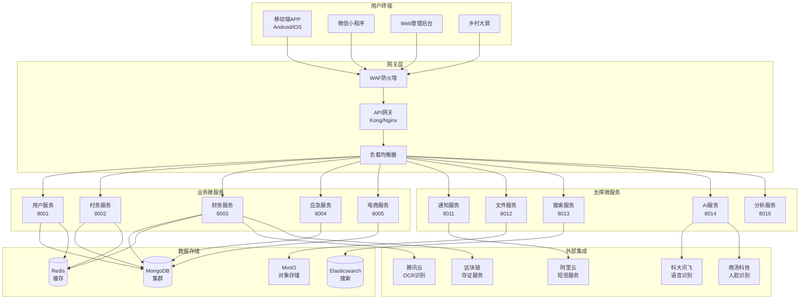
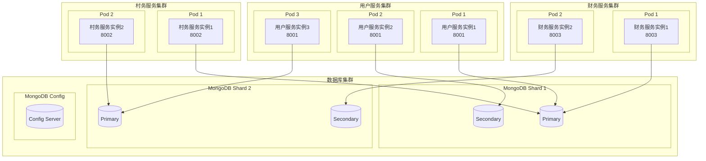
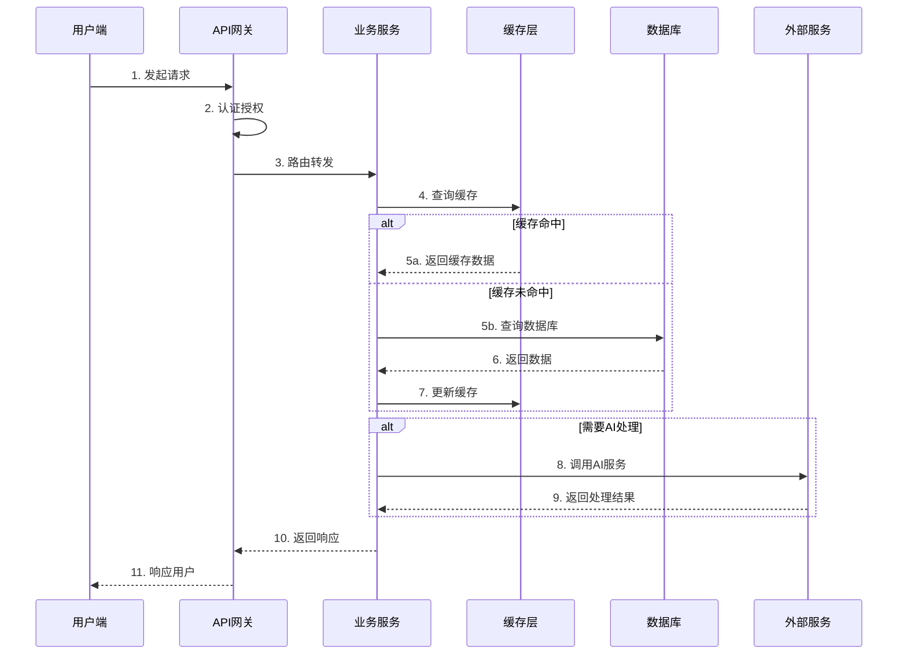
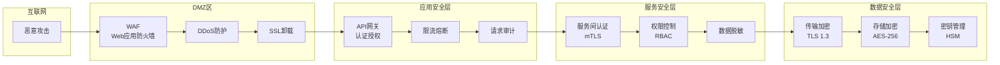
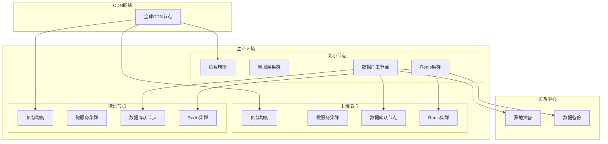
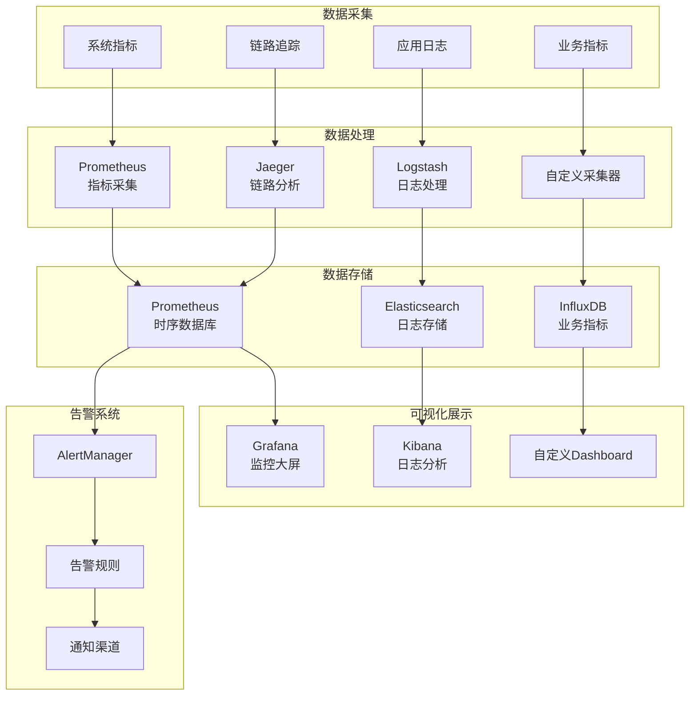

# 智慧乡村系统架构图

## 整体架构概览

```mermaid
graph TB
    %% 用户层
    subgraph "用户终端"
        A[移动端APP<br/>Android/iOS]
        B[微信小程序]
        C[Web管理后台]
        D[乡村大屏]
    end

    %% 网关层
    subgraph "网关层"
        E[WAF防火墙]
        F[API网关<br/>Kong/Nginx]
        G[负载均衡器]
    end

    %% 微服务层
    subgraph "业务微服务"
        H[用户服务<br/>8001]
        I[村务服务<br/>8002]
        J[财务服务<br/>8003]
        K[应急服务<br/>8004]
        L[电商服务<br/>8005]
    end

    subgraph "支撑微服务"
        M[通知服务<br/>8011]
        N[文件服务<br/>8012]
        O[搜索服务<br/>8013]
        P[AI服务<br/>8014]
        Q[分析服务<br/>8015]
    end

    %% 数据层
    subgraph "数据存储"
        R[(MongoDB<br/>集群)]
        S[(Redis<br/>缓存)]
        T[(Elasticsearch<br/>搜索)]
        U[MinIO<br/>对象存储]
    end

    %% 外部服务
    subgraph "外部集成"
        V[科大讯飞<br/>语音识别]
        W[商汤科技<br/>人脸识别]
        X[腾讯云<br/>OCR识别]
        Y[阿里云<br/>短信服务]
        Z[区块链<br/>存证服务]
    end

    %% 连接关系
    A --> E
    B --> E
    C --> E
    D --> E

    E --> F
    F --> G

    G --> H
    G --> I
    G --> J
    G --> K
    G --> L

    G --> M
    G --> N
    G --> O
    G --> P
    G --> Q

    H --> R
    I --> R
    J --> R
    K --> R
    L --> R

    H --> S
    I --> S
    J --> S

    O --> T
    N --> U

    P --> V
    P --> W
    J --> X
    M --> Y
    J --> Z
```

## 微服务详细架构

```mermaid
graph TB
    subgraph "用户服务集群"
        subgraph "Pod 1"
            H1[用户服务实例1<br/>8001]
        end
        subgraph "Pod 2"
            H2[用户服务实例2<br/>8001]
        end
        subgraph "Pod 3"
            H3[用户服务实例3<br/>8001]
        end
    end

    subgraph "村务服务集群"
        subgraph "Pod 1"
            I1[村务服务实例1<br/>8002]
        end
        subgraph "Pod 2"
            I2[村务服务实例2<br/>8002]
        end
    end

    subgraph "财务服务集群"
        subgraph "Pod 1"
            J1[财务服务实例1<br/>8003]
        end
        subgraph "Pod 2"
            J2[财务服务实例2<br/>8003]
        end
    end

    subgraph "数据库集群"
        subgraph "MongoDB Shard 1"
            R1[(Primary)]
            R2[(Secondary)]
        end
        subgraph "MongoDB Shard 2"
            R3[(Primary)]
            R4[(Secondary)]
        end
        subgraph "MongoDB Config"
            R5[(Config Server)]
        end
    end

    H1 --> R1
    H2 --> R2
    H3 --> R3
    I1 --> R1
    I2 --> R3
    J1 --> R1
    J2 --> R4
```

## 数据流转架构

```mermaid
sequenceDiagram
    participant U as 用户端
    participant G as API网关
    participant S as 业务服务
    participant C as 缓存层
    participant D as 数据库
    participant E as 外部服务

    U->>G: 1. 发起请求
    G->>G: 2. 认证授权
    G->>S: 3. 路由转发

    S->>C: 4. 查询缓存
    alt 缓存命中
        C-->>S: 5a. 返回缓存数据
    else 缓存未命中
        S->>D: 5b. 查询数据库
        D-->>S: 6. 返回数据
        S->>C: 7. 更新缓存
    end

    alt 需要AI处理
        S->>E: 8. 调用AI服务
        E-->>S: 9. 返回处理结果
    end

    S-->>G: 10. 返回响应
    G-->>U: 11. 响应用户
```

## 安全架构

```mermaid
graph LR
    subgraph "互联网"
        A[恶意攻击]
    end

    subgraph "DMZ区"
        B[WAF<br/>Web应用防火墙]
        C[DDoS防护]
        D[SSL卸载]
    end

    subgraph "应用安全层"
        E[API网关<br/>认证授权]
        F[限流熔断]
        G[请求审计]
    end

    subgraph "服务安全层"
        H[服务间认证<br/>mTLS]
        I[权限控制<br/>RBAC]
        J[数据脱敏]
    end

    subgraph "数据安全层"
        K[传输加密<br/>TLS 1.3]
        L[存储加密<br/>AES-256]
        M[密钥管理<br/>HSM]
    end

    A --> B
    B --> C
    C --> D
    D --> E
    E --> F
    F --> G
    G --> H
    H --> I
    I --> J
    J --> K
    K --> L
    L --> M
```

## 部署架构

```mermaid
graph TB
    subgraph "生产环境"
        subgraph "北京节点"
            A1[负载均衡]
            B1[微服务集群]
            C1[数据库主节点]
            D1[Redis集群]
        end

        subgraph "上海节点"
            A2[负载均衡]
            B2[微服务集群]
            C2[数据库从节点]
            D2[Redis集群]
        end

        subgraph "深圳节点"
            A3[负载均衡]
            B3[微服务集群]
            C3[数据库从节点]
            D3[Redis集群]
        end
    end

    subgraph "CDN网络"
        E[全球CDN节点]
    end

    subgraph "灾备中心"
        F[异地灾备]
        G[数据备份]
    end

    E --> A1
    E --> A2
    E --> A3

    C1 --> C2
    C1 --> C3
    C1 --> F

    D1 --> D2
    D1 --> D3
    D1 --> G
```

## 监控架构

```mermaid
graph TB
    subgraph "数据采集"
        A[应用日志]
        B[系统指标]
        C[链路追踪]
        D[业务指标]
    end

    subgraph "数据处理"
        E[Logstash<br/>日志处理]
        F[Prometheus<br/>指标采集]
        G[Jaeger<br/>链路分析]
        H[自定义采集器]
    end

    subgraph "数据存储"
        I[Elasticsearch<br/>日志存储]
        J[Prometheus<br/>时序数据库]
        K[InfluxDB<br/>业务指标]
    end

    subgraph "可视化展示"
        L[Grafana<br/>监控大屏]
        M[Kibana<br/>日志分析]
        N[自定义Dashboard]
    end

    subgraph "告警系统"
        O[AlertManager]
        P[告警规则]
        Q[通知渠道]
    end

    A --> E
    B --> F
    C --> G
    D --> H

    E --> I
    F --> J
    G --> J
    H --> K

    I --> M
    J --> L
    K --> N

    J --> O
    O --> P
    P --> Q
```