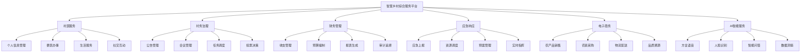
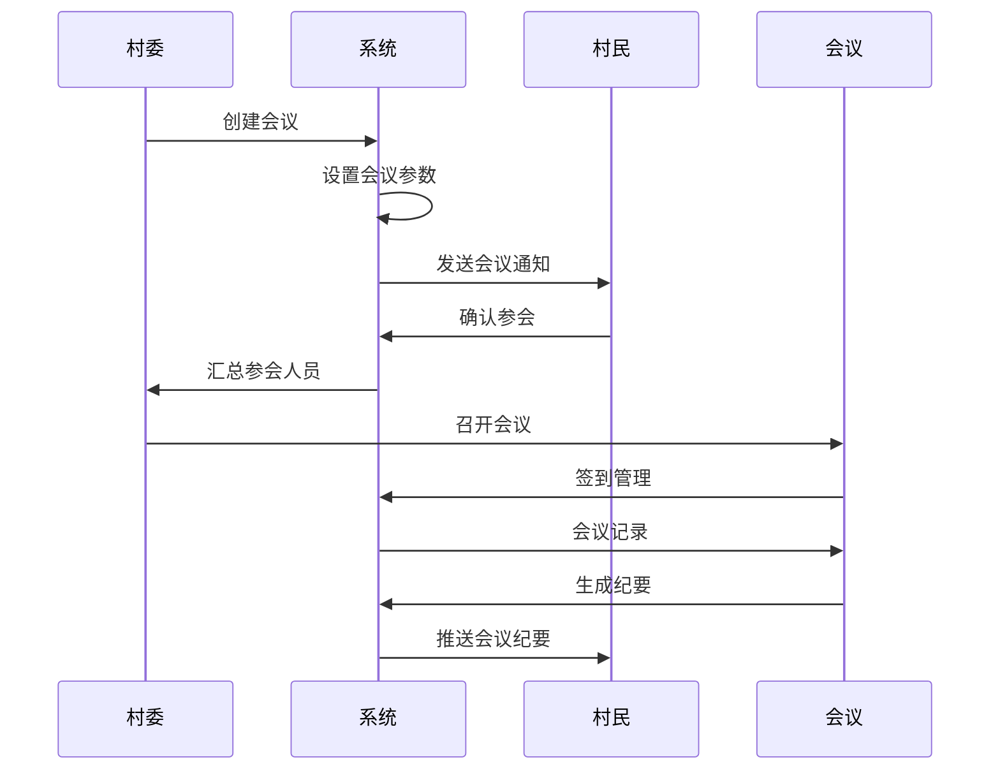

# 智慧乡村综合服务平台 - 产品需求文档（PRD）

## 文档信息

- **文档版本**：v1.0
- **创建日期**：2025年1月
- **最后更新**：2025年1月
- **文档状态**：已评审
- **项目负责人**：[待定]
- **产品经理**：[待定]

---

## 1. 产品概述

### 1.1 产品背景

随着乡村振兴战略的深入推进，乡村数字化治理需求日益增长。当前乡村治理面临的主要挑战：

- **信息不对称**：政策传达滞后，村民获取信息渠道有限
- **服务效率低**：办事流程繁琐，需要多次往返村委
- **数据孤岛**：各部门数据不互通，重复填报
- **数字鸿沟**：老年村民不会使用智能设备
- **监管困难**：村务公开透明度不足，监督缺失

### 1.2 产品定位

智慧乡村综合服务平台是一个面向乡村振兴的数字化基础设施，通过"平台+服务+生态"的模式，构建连接政府、村民、企业的数字化桥梁。

**核心定位**：
- 村务治理的数字化工具
- 便民服务的统一入口
- 乡村振兴的数据中枢
- 城乡融合的连接器

### 1.3 产品愿景

**短期目标**（1-2年）：
- 覆盖1000个行政村
- 服务100万村民
- 建立标杆案例

**长期愿景**（3-5年）：
- 成为乡村振兴的数字化基础设施
- 覆盖全国主要乡村地区
- 构建完整的乡村数字经济生态

### 1.4 目标用户

#### 1.4.1 村民群体
- **老年村民**（60+岁）：占比30%
  - 主要需求：便民服务、医疗协助、政策了解
  - 使用特点：需要语音辅助、大字体、简易操作

- **中年村民**（40-60岁）：占比40%
  - 主要需求：农业技术、市场信息、村务参与
  - 使用特点：日常高频使用、关注实用性

- **青年村民**（18-40岁）：占比30%
  - 主要需求：远程参与村务、电商购物、社交互动
  - 使用特点：熟练使用、关注便捷性

#### 1.4.2 村委干部
- **村支书/村主任**：村务决策者
  - 需求：数据统计、任务调度、应急指挥

- **村会计/文书**：日常办公人员
  - 需求：财务记录、档案管理、数据上报

- **网格员/村干部**：一线服务人员
  - 需求：任务执行、信息收集、村民服务

#### 1.4.3 政府部门
- **县级管理部门**：监管协调
  - 需求：数据汇总、监督检查、政策传达

- **乡镇政府**：指导服务
  - 需求：工作部署、进度跟踪、绩效评估

### 1.5 市场分析

#### 1.5.1 市场规模
- **目标市场**：全国48万个行政村
- **潜在用户**：5.6亿农村人口
- **市场规模**：年投入150亿元（数字化建设）

#### 1.5.2 竞争分析
| 竞品类型 | 代表产品 | 优势 | 劣势 | 我方优势 |
|---------|---------|------|------|---------|
| 政务平台 | 浙里办、粤省事 | 功能全面 | 乡村特色不足 | 深度乡村适配 |
| 电商 | 淘宝、拼多多 | 流量巨大 | 治理功能缺失 | 电商+治理融合 |
| 通讯工具 | 微信 | 用户基数大 | 专业性不足 | 垂直场景深度 |

---

## 2. 产品功能规划

### 2.1 功能架构图



### 2.2 核心功能详述

#### 2.2.1 村民服务模块

##### 2.2.1.1 个人信息管理
**功能描述**：村民个人及家庭档案的数字化管理

**用户故事**：
- 作为村民，我希望能建立完整的数字档案，方便办理各种业务
- 作为村委，我希望能准确掌握村民信息，提供精准服务

**功能点**：
1. **基础信息管理**
   - 个人身份信息（姓名、身份证、联系方式等）
   - 家庭关系维护（自动生成家族树）
   - 特殊标签管理（低保户、独居老人、党员等）

2. **证件材料管理**
   - 身份证、户口本等证件电子化
   - 各类证明材料存储
   - 材料到期提醒

3. **隐私保护机制**
   - 信息分级查看权限
   - 敏感信息脱敏显示
   - 查看记录审计

**验收标准**：
- 支持10万级用户数据管理
- 信息查询响应时间<1秒
- 隐私数据100%加密存储

##### 2.2.1.2 便民办事
**功能描述**：各类政务服务的线上办理

**用户故事**：
- 作为村民，我希望不用多次跑村委就能办成事
- 作为村委，我希望减少纸质材料，提高办事效率

**功能点**：
1. **办事指南**
   - 办事流程说明
   - 所需材料清单
   - 办事时限告知

2. **在线申请**
   - 电子表单填写
   - 材料上传
   - 进度跟踪

3. **智能预审**
   - 材料完整性检查
   - 格式规范校验
   - 智能填表建议

4. **结果通知**
   - 办结消息推送
   - 电子证照下载
   - 评价反馈

**支持的办事事项**：
- 证明类：居住证明、亲属关系证明等
- 补贴类：低保申请、补贴申领等
- 证件类：身份证办理、户口迁移等
- 项目类：建房申请、土地审批等

##### 2.2.1.3 语音交互服务
**功能描述**：支持22种方言的语音交互

**用户故事**：
- 作为老年村民，我希望用方言说话就能办事
- 作为文盲用户，我希望听语音就能了解政策

**技术方案**：
- **语音识别**：科大讯飞ASR引擎
- **方言支持**：
  - 北方方言：北京话、东北话、山东话等
  - 南方方言：粤语、闽南话、客家话等
  - 西南方言：四川话、重庆话等

**功能实现**：
1. **语音输入**
   - 任何输入框支持语音
   - 自动识别方言类型
   - 实时转文字显示

2. **语音播报**
   - 文字转方言语音
   - 智能语音助手
   - 重要信息语音提醒

3. **语音导航**
   - 全程语音引导
   - 操作步骤提示
   - 错误语音纠正

**性能指标**：
- 识别准确率：≥90%（标准环境）
- 响应延迟：≤1秒
- 支持方言：22种

#### 2.2.2 村务治理模块

##### 2.2.2.1 公告通知系统
**功能描述**：村务公告的发布、推送和管理

**核心功能**：
1. **多级公告管理**
   - 紧急通知（红色预警）
   - 重要公告（橙色提醒）
   - 一般通知（蓝色提示）

2. **精准推送**
   - 按人群推送（年龄段、性别、职业等）
   - 按地域推送（村民小组）
   - 按标签推送（党员、低保户等）

3. **多渠道触达**
   - APP推送
   - 短信通知
   - 语音广播
   - 村务大屏
   - 微信群转发

4. **阅读追踪**
   - 已读未读状态
   - 阅读时间统计
   - 阅读确认签字

**特色功能**：
- **方言播报**：重要公告自动转换为方言语音
- **一键转发**：村民可将重要通知转发到家庭群
- **确认回执**：重要通知需要村民确认收到

##### 2.2.2.2 会议管理
**功能描述**：村级会议的全流程数字化管理

**业务流程**：


**功能模块**：
1. **会议创建**
   - 会议类型选择（例会、临时、专题等）
   - 时间地点设定
   - 参会人员邀请
   - 议程上传

2. **参会管理**
   - 在线报名
   - 签到打卡（人脸识别）
   - 请假管理
   - 出勤统计

3. **会议记录**
   - 实时记录
   - 语音转文字
   - 现场拍照
   - 投票表决

4. **纪要生成**
   - 自动生成模板
   - 人工编辑完善
   - 审核发布
   - 归档查询

##### 2.2.2.3 村务公开
**功能描述**：村务信息的透明化展示

**公开内容**：
1. **财务公开**
   - 收支明细
   - 预算执行
   - 集体资产
   - 工程项目

2. **村务决策**
   - 重要决策过程
   - 投票结果
   - 实施方案
   - 执行进度

3. **惠民政策**
   - 政策原文
   - 申请条件
   - 办理流程
   - 受益名单

4. **公示公告**
   - 评选公示
   - 事项公示
   - 人员公示
   - 结果公示

**公开方式**：
- **大屏展示**：村务大屏实时显示
- **APP查看**：村民随时查阅
- **纸质张贴**：传统方式保留
- **网站发布**：互联网公开

#### 2.2.3 财务管理模块

##### 2.2.3.1 智能财务记账
**功能描述**：村级财务的智能化管理

**创新功能**：
1. **发票OCR识别**
   - 拍照自动识别
   - 智能提取信息
   - 原件存档
   - 真伪校验

2. **自动分类**
   - AI智能分类
   - 规则引擎匹配
   - 手动调整
   - 学习优化

3. **工作流管理**
   - 多级审批
   - 额度控制
   - 审批轨迹
   - 电子签章

4. **实时记账**
   - 移动端记账
   - 实时同步
   - 自动对账
   - 差异提醒

**支持票据类型**：
- 费用报销类（餐饮、交通、办公用品等）
- 采购类（农资、设备、工程材料等）
- 收入类（集体收入、补助收入等）
- 工程类（工程款、劳务费等）

##### 2.2.3.2 财务透明化
**功能描述**：让村民看得懂、能监督的财务系统

**实现方案**：
1. **简化展示**
   - 图表可视化
   - 项目分类归集
   - 文字解读说明
   - 重点突出显示

2. **实时查询**
   - 收支明细
   - 项目进度
   - 余额查询
   - 历史对比

3. **监督机制**
   - 在线提问
   - 投诉举报
   - 审计跟踪
   - 评价反馈

4. **区块链存证**
   - 重要凭证上链
   - 防篡改机制
   - 全程追溯
   - 公信力保障

#### 2.2.4 应急响应模块

##### 2.2.4.1 一键求助
**功能描述**：紧急情况的快速求助通道

**功能实现**：
1. **一键求助按钮**
   - 显眼位置（首页）
   - 紧急联系
   - 位置自动发送
   - 情况简述

2. **求助类型**
   - 医疗急救
   - 火灾报警
   - 自然灾害
   - 治安事件
   - 其他紧急

3. **响应机制**
   - 自动通知网格员
   - 村委实时查看
   - 110/120联动
   - 救援力量调度

4. **状态追踪**
   - 救援进度
   - 实时位置
   - 预计到达时间
   - 处理结果反馈

##### 2.2.4.2 应急资源管理
**功能描述**：应急资源的统筹调度

**资源类型**：
1. **人力资源**
   - 应急队员
   - 医护人员
   - 党员干部
   - 志愿者

2. **物资资源**
   - 医疗设备
   - 救援器材
   - 通信设备
   - 生活物资

3. **场所资源**
   - 应急避难所
   - 医疗点
   - 物资仓库
   - 指挥中心

**功能特性**：
- **资源地图**：可视化展示资源分布
- **智能调度**：就近匹配，最优路线
- **状态管理**：实时更新资源状态
- **预警提醒**：资源不足预警

##### 2.2.4.3 应急预案
**功能描述**：数字化应急预案管理

**预案管理**：
1. **预案库**
   - 防汛抗旱
   - 森林防火
   - 地质灾害
   - 疫情防控
   - 食品安全

2. **预案执行**
   - 一键启动
   - 自动通知
   - 任务分发
   - 进度跟踪

3. **预案演练**
   - 模拟演练
   - 效果评估
   - 问题记录
   - 预案优化

#### 2.2.5 电子商务模块

##### 2.2.5.1 农产品销售
**功能描述**：帮助农民销售农产品的电商平台

**特色功能**：
1. **产品展示**
   - 图文并茂
   - 视频介绍
   - 产地直播
   - 品质认证

2. **智能定价**
   - 市场价格比对
   - 品质分级定价
   - 批量采购优惠
   - 动态价格调整

3. **营销工具**
   - 拼团功能
   - 预售模式
   - 限时特惠
   - 满减活动

4. **物流管理**
   - 上门揽收
   - 包装服务
   - 冷链配送
   - 保价服务

**供应链服务**：
- 产品标准化
- 品质检测
- 品牌包装
- 营销推广

##### 2.2.5.2 农资采购
**功能描述**：农资产品的集中采购平台

**服务内容**：
1. **产品供应**
   - 种子种苗
   - 化肥农药
   - 农机具
   - 养殖饲料

2. **集采优惠**
   - 村级集采
   - 量大从优
   - 统一配送
   - 售后保障

3. **技术服务**
   - 使用指导
   - 病虫害防治
   - 农技咨询
   - 培训课程

4. **金融支持**
   - 信用采购
   - 分期付款
   - 农业保险
   - 贷款服务

#### 2.2.6 AI智能服务

##### 2.2.6.1 智能问答助手
**功能描述**：基于AI的村务问答系统

**服务内容**：
1. **政策咨询**
   - 惠农政策解读
   - 申请条件查询
   - 办理流程指导
   - 实时政策更新

2. **农技服务**
   - 种植技术咨询
   - 病虫害诊断
   - 天气预警
   - 农事提醒

3. **生活服务**
   - 便民信息查询
   - 生活缴费指导
   - 时刻表查询
   - 通讯录查询

4. **村务问答**
   - 村务咨询
   - 业务办理指导
   - 流程查询
   - 投诉建议

**技术特性**：
- 自然语言理解
- 多轮对话
- 知识图谱
- 持续学习

##### 2.2.6.2 人脸识别服务
**功能描述**：基于人脸识别的身份认证

**应用场景**：
1. **登录认证**
   - 快速登录
   - 活体检测
   - 安全保障
   - 多人识别

2. **会议签到**
   - 快速签到
   - 自动统计
   - 异常提醒
   - 考勤管理

3. **办事确认**
   - 人脸核验
   - 操作确认
   - 授权管理
   - 审计追踪

4. **亲情认证**
   - 远程协助
   - 家庭共享
   - 代办授权
   - 安全控制

**安全保障**：
- 本地+云端双重验证
- 活体检测防照片
- 加密存储
- 隐私保护

---

## 3. 非功能性需求

### 3.1 性能需求

| 指标项 | 要求 | 测试条件 |
|-------|------|---------|
| 响应时间 | < 2秒 | 95%请求 |
| 并发用户 | 10,000人 | 峰值时段 |
| 系统可用性 | 99.9% | 7×24小时 |
| 数据同步 | 实时 | 关键数据 |
| 离线支持 | 核心功能 | 网络中断 |

### 3.2 安全需求

#### 3.2.1 数据安全
- 传输加密：HTTPS/TLS 1.3
- 存储加密：AES-256
- 敏感数据：字段级加密
- 密钥管理：定期轮换

#### 3.2.2 访问控制
- 身份认证：多因子认证
- 权限控制：RBAC模型
- 操作审计：全记录
- 异常检测：实时告警

#### 3.2.3 隐私保护
- 最小必要原则
- 脱敏处理
- 用户授权
- 删除权保障

### 3.3 兼容性需求

#### 3.3.1 设备兼容
- 操作系统：Android 8.0+、iOS 12+
- 屏幕适配：4.7寸-12.9寸
- 网络环境：2G-5G

#### 3.3.2 浏览器兼容
- Chrome 90+
- Safari 14+
- Firefox 88+
- Edge 90+

### 3.4 可用性需求

#### 3.4.1 易用性
- 新用户上手时间：< 5分钟
- 任务完成率：> 95%
- 用户满意度：> 4.5/5.0

#### 3.4.2 无障碍
- WCAG 2.1 AA级标准
- 读屏软件支持
- 高对比度模式
- 键盘操作

---

## 4. 技术需求

### 4.1 技术架构

#### 4.1.1 整体架构
```
前端层：
  - 移动端：React Native
  - Web端：Vue 3 + Element Plus
  - 大屏端：Vue 3 + ECharts

网关层：
  - API网关：Kong
  - 负载均衡：Nginx
  - WAF防火墙：ModSecurity

服务层：
  - 微服务框架：Node.js + Express
  - 服务注册：Consul
  - 配置中心：Apollo
  - 消息队列：Kafka

数据层：
  - 业务数据：MongoDB
  - 缓存：Redis
  - 搜索：Elasticsearch
  - 文件：MinIO

基础设施：
  - 容器：Docker + Kubernetes
  - 监控：Prometheus + Grafana
  - 日志：ELK Stack
  - CI/CD：Jenkins
```

#### 4.1.2 微服务拆分
```
核心业务服务：
  - user-service（用户服务）
  - governance-service（村务服务）
  - finance-service（财务服务）
  - emergency-service（应急服务）
  - ecommerce-service（电商服务）

支撑服务：
  - notification-service（通知服务）
  - file-service（文件服务）
  - search-service（搜索服务）
  - ai-service（AI服务）
  - analytics-service（分析服务）
```

### 4.2 接口规范

#### 4.2.1 RESTful API
```
请求格式：
- Method: GET/POST/PUT/DELETE
- Content-Type: application/json
- Authorization: Bearer {token}

响应格式：
{
  "code": 200,
  "message": "success",
  "data": {},
  "timestamp": 1640995200000
}
```

#### 4.2.2 错误码规范
```
成功：200
业务错误：400-499
系统错误：500-599
认证错误：401
授权错误：403
资源不存在：404
```

### 4.3 数据库设计

#### 4.3.1 数据库选型
- **MongoDB**：主数据库，文档型数据
- **Redis**：缓存，会话存储
- **Elasticsearch**：搜索引擎
- **MinIO**：对象存储

#### 4.3.2 分库分表策略
```
按村分库：每个行政村独立数据库
按年分表：大表按年份分表
按月归档：历史数据定期归档
```

---

## 5. 数据需求

### 5.1 数据字典

#### 5.1.1 用户数据
```json
{
  "userId": "用户唯一标识",
  "name": "姓名",
  "gender": "性别",
  "birthDate": "出生日期",
  "idCard": "身份证号",
  "phone": "手机号",
  "address": "地址",
  "villageId": "所属村庄",
  "role": "角色",
  "faceFeatures": "人脸特征",
  "familyRelations": "家庭关系",
  "tags": "标签",
  "createTime": "创建时间"
}
```

#### 5.1.2 村务数据
```json
{
  "id": "公告ID",
  "title": "标题",
  "content": "内容",
  "type": "类型",
  "priority": "优先级",
  "publisher": "发布者",
  "publishTime": "发布时间",
  "targets": "目标人群",
  "readStatus": "阅读状态",
  "attachments": "附件"
}
```

### 5.2 数据治理

#### 5.2.1 数据质量
- 完整性检查
- 准确性校验
- 一致性保证
- 及时性要求

#### 5.2.2 数据安全
- 敏感数据加密
- 访问权限控制
- 操作日志记录
- 数据备份恢复

### 5.3 数据标准

#### 5.3.1 编码规范
- 村庄编码：国家标准行政区划码
- 用户编码：村庄码+序列号
- 业务编码：业务类型+时间戳+序列号

#### 5.3.2 数据格式
- 日期：YYYY-MM-DD
- 时间：YYYY-MM-DD HH:mm:ss
- 金额：保留2位小数
- 坐标：GCJ-02坐标系

---

## 6. 运营需求

### 6.1 运营体系

#### 6.1.1 运营团队
- **运营总监**：1人
- **内容运营**：2人
- **用户运营**：3人
- **活动运营**：2人
- **数据分析**：1人

#### 6.1.2 运营流程
```
用户拉新 → 引导激活 → 促活留存 → 价值转化 → 口碑传播
```

### 6.2 客服体系

#### 6.2.1 服务渠道
- 在线客服（7×24小时）
- 电话热线（工作日9-18点）
- 邮件支持（24小时回复）
- 现场支持（预约制）

#### 6.2.2 服务标准
- 首次响应：< 1分钟
- 问题解决：< 24小时
- 满意度：> 95%

### 6.3 培训体系

#### 6.3.1 培训内容
- 基础操作培训
- 功能使用培训
- 问题处理培训
- 安全意识培训

#### 6.3.2 培训方式
- 线上视频课程
- 线下集中培训
- 一对一指导
- 印刷手册

---

## 7. 商业模式

### 7.1 收入模式

#### 7.1.1 政府付费
- **系统使用费**：年费模式，每个村庄2-5万元/年
- **定制开发费**：根据需求定价
- **数据服务费**：数据分析和报告服务
- **运维服务费**：系统维护和升级

#### 7.1.2 企业付费
- **平台佣金**：交易额的1-3%
- **广告推广**：信息流广告、开屏广告
- **增值服务**：高级功能、数据洞察

#### 7.1.3 个人用户
- **基础功能**：永久免费
- **增值服务**：云存储、高级查询
- **会员服务**：专属客服、优先处理

### 7.2 成本结构

#### 7.2.1 固定成本
- 研发成本：3000万/年
- 人力成本：4000万/年
- 基础设施：1000万/年

#### 7.2.2 变动成本
- 市场推广：收入的20%
- 运营成本：收入的10%
- 支付成本：交易额的0.6%

### 7.3 盈利预测

| 年份 | 覆盖村庄 | 活跃用户 | 年收入 | 毛利率 |
|------|---------|---------|-------|-------|
| 第1年 | 10个 | 1000人 | 100万 | -100% |
| 第2年 | 100个 | 1万人 | 1000万 | 20% |
| 第3年 | 500个 | 5万人 | 5000万 | 50% |
| 第4年 | 2000个 | 20万人 | 2亿 | 60% |
| 第5年 | 5000个 | 50万人 | 5亿 | 65% |

---

## 8. 项目计划

### 8.1 里程碑计划

| 里程碑 | 时间节点 | 交付物 | 成功标准 |
|-------|---------|-------|---------|
| MVP版本 | 2025年6月 | 基础功能 | 5个试点村庄 |
| V1.0版本 | 2025年12月 | 完整功能 | 100个村庄 |
| V2.0版本 | 2026年6月 | 智能化 | 500个村庄 |
| V3.0版本 | 2027年1月 | 生态化 | 2000个村庄 |

### 8.2 开发计划

#### 8.2.1 第一阶段（0-3月）
- 需求细化：2周
- 系统设计：2周
- 环境搭建：1周
- 核心开发：8周
- 测试优化：1周

#### 8.2.2 第二阶段（4-6月）
- 功能扩展：8周
- 集成测试：2周
- 试点部署：2周
- 运营准备：2周

### 8.3 资源需求

#### 8.3.1 人力需求
- 产品团队：5人
- 设计团队：3人
- 开发团队：20人
- 测试团队：5人
- 运维团队：5人

#### 8.3.2 预算需求
- 人力成本：3000万
- 技术采购：1000万
- 市场推广：1000万
- 运营成本：500万
- 总计：5500万

---

## 9. 风险评估

### 9.1 技术风险

| 风险项 | 可能性 | 影响 | 应对措施 |
|-------|-------|------|---------|
| 方言识别准确率低 | 中 | 高 | 多引擎对比、持续优化 |
| 系统性能不达标 | 低 | 高 | 提前压测、架构优化 |
| 数据安全漏洞 | 中 | 高 | 安全审计、加密存储 |
| 兼容性问题 | 中 | 中 | 全面测试、降级方案 |

### 9.2 市场风险

| 风险项 | 可能性 | 影响 | 应对措施 |
|-------|-------|------|---------|
| 政策变化 | 中 | 高 | 政策研究、灵活调整 |
| 竞争加剧 | 高 | 中 | 差异化定位、快速迭代 |
| 用户接受度低 | 中 | 高 | 用户教育、简化操作 |
| 商业模式失败 | 低 | 高 | 多元化收入、试点验证 |

### 9.3 运营风险

| 风险项 | 可能性 | 影响 | 应对措施 |
|-------|-------|------|---------|
| 人才流失 | 中 | 中 | 股权激励、企业文化 |
| 服务质量 | 中 | 高 | SLA保障、监控告警 |
| 数据泄露 | 低 | 极高 | 加密存储、权限控制 |
| 供应链中断 | 低 | 中 | 多供应商、备选方案 |

---

## 10. 成功指标

### 10.1 用户指标
- **用户增长**：月新增用户数
- **用户活跃**：DAU/MAU比值
- **用户留存**：次日、7日、30日留存
- **用户满意度**：NPS评分

### 10.2 业务指标
- **功能使用率**：各模块使用率
- **任务完成率**：办事成功率
- **响应时间**：平均响应时长
- **问题解决率**：客服问题解决率

### 10.3 商业指标
- **收入增长**：月度收入增长
- **市场份额**：覆盖村庄占比
- **客户价值**：ARPU值
- **盈利能力**：毛利率、净利率

---

## 11. 附录

### 11.1 术语表

| 术语 | 解释 |
|------|------|
| 智慧乡村 | 通过数字化手段提升乡村治理和服务的概念 |
| 微服务架构 | 将应用拆分为多个独立服务的架构模式 |
| RBAC | 基于角色的访问控制模型 |
| OCR | 光学字符识别技术 |
| NLU | 自然语言理解 |

### 11.2 参考资料

1. 《数字乡村发展战略纲要》
2. 《乡村振兴促进法》
3. 《个人信息保护法》
4. WCAG 2.1无障碍标准

### 11.3 变更记录

| 版本 | 日期 | 变更内容 | 变更人 |
|------|------|---------|-------|
| v1.0 | 2025-01-19 | 初始版本 | 产品团队 |

---

**文档状态：已评审，等待开发实施**

下一步行动：
1. 组建核心团队
2. 细化技术方案
3. 启动开发工作
4. 准备试点村庄