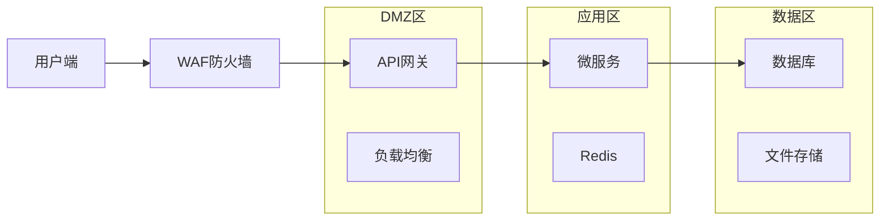

# 智慧乡村综合服务平台 - 技术架构设计

## 架构概览

### 设计原则
1. **微服务架构**：15个独立服务，单一职责原则
2. **高可用性**：99.9%系统可用性目标
3. **可扩展性**：支持从1000到10,000,000用户的平滑扩展
4. **数据安全**：端到端加密，多层数据保护
5. **云原生**：基于Docker和Kubernetes的容器化部署

### 技术栈选择

#### 核心技术栈
- **后端框架**：Node.js + Express.js (轻量、生态丰富)
- **数据库**：MongoDB (灵活文档结构) + Redis (缓存)
- **消息队列**：Apache Kafka (高吞吐量事件流)
- **容器化**：Docker + Kubernetes
- **API网关**：Kong/Nginx (路由、限流、认证)

#### 特殊需求技术
- **AI语音**：科大讯飞ASR (22种方言支持)
- **人脸识别**：商汤科技/旷视Face++
- **加密存储**：AES-256 + RSA加密
- **区块链**：Hyperledger Fabric (财务数据存证)

---

## 微服务架构设计

### 1. 核心业务服务

#### 1.1 用户与权限服务 (user-service)
**端口**：8001
**职责**：
- 村民、村委、政府人员管理
- 角色权限控制 (RBAC)
- 人脸识别认证集成
- 多租户支持

**核心API**：
```javascript
// 用户认证
POST /api/v1/auth/login
POST /api/v1/auth/face-login
POST /api/v1/auth/refresh

// 用户管理
GET /api/v1/users/profile
PUT /api/v1/users/profile
GET /api/v1/users/:id/family-tree
POST /api/v1/users/batch-import
```

**数据模型**：
```json
{
  "_id": "ObjectId",
  "userId": "string", // 村编号+户编号+身份证后6位
  "villageId": "string",
  "name": "string",
  "role": "enum[villager,cadre,government]",
  "faceFeatures": "buffer", // 加密存储
  "familyRelations": ["ObjectId"],
  "permissions": ["string"],
  "isDeleted": false,
  "createdAt": "Date",
  "updatedAt": "Date"
}
```

#### 1.2 村务管理服务 (governance-service)
**端口**：8002
**职责**：
- 公告发布与通知
- 会议管理与纪要
- 政策传达与解读
- 村务投票系统

**核心API**：
```javascript
// 公告管理
POST /api/v1/announcements
GET /api/v1/announcements/:villageId
PUT /api/v1/announcements/:id/publish
DELETE /api/v1/announcements/:id

// 会议管理
POST /api/v1/meetings
GET /api/v1/meetings/upcoming
POST /api/v1/meetings/:id/attendance
```

#### 1.3 财务管理服务 (finance-service)
**端口**：8003
**职责**：
- 收支流水记录
- 预算编制与审批
- 财务报表生成
- 发票OCR识别
- 区块链存证

**特殊功能**：
- 发票智能识别 (腾讯OCR)
- 财务流程工作流引擎
- 财务数据上链存证

**数据模型**：
```json
{
  "_id": "ObjectId",
  "transactionId": "string", // TXN+时间戳+随机数
  "type": "enum[income,expense]",
  "category": "string", // 收支类别
  "amount": "number",
  "description": "string",
  "attachments": ["string"], // 发票图片
  "approvedBy": "ObjectId",
  "blockchainHash": "string", // 上链哈希
  "createdAt": "Date"
}
```

#### 1.4 应急响应服务 (emergency-service)
**端口**：8004
**职责**：
- 应急事件上报
- 实时位置共享
- 救援资源调度
- 应急预案管理

**核心API**：
```javascript
// 应急上报
POST /api/v1/emergency/report
GET /api/v1/emergency/nearby
PUT /api/v1/emergency/:id/status

// 资源调度
GET /api/v1/emergency/resources
POST /api/v1/emergency/dispatch
```

#### 1.5 电子商务服务 (ecommerce-service)
**端口**：8005
**职责**：
- 农产品展示与销售
- 订单管理与物流
- 评价系统
- 拼团功能

**特色功能**：
- 农产品溯源系统
- 实时价格比价
- 集采优惠系统

### 2. 技术支撑服务

#### 2.1 通知服务 (notification-service)
**端口**：8011
**职责**：
- 多渠道消息推送 (短信、微信、APP)
- 消息模板管理
- 推送统计分析

**集成服务**：
- 短信：阿里云SMS
- 微信：企业微信API
- 邮件：SendGrid

#### 2.2 文件服务 (file-service)
**端口**：8012
**职责**：
- 文件上传下载
- 图片处理与压缩
- 文件安全扫描
- CDN加速

**存储方案**：
- 本地存储：MinIO
- 云存储：阿里云OSS
- CDN：阿里云CDN

#### 2.3 搜索服务 (search-service)
**端口**：8013
**职责**：
- 全文搜索
- 智能推荐
- 搜索分析

**技术方案**：Elasticsearch + IK分词器

#### 2.4 AI智能服务 (ai-service)
**端口**：8014
**职责**：
- 22种方言语音识别
- 文字转语音 (TTS)
- 智能问答助手
- 图像识别

**API示例**：
```javascript
// 语音识别
POST /api/v1/ai/asr
{
  "audio": "base64",
  "dialect": "cantonese"
}

// 智能问答
POST /api/v1/ai/chat
{
  "question": "如何申请低保？",
  "context": "village_id"
}
```

#### 2.5 数据分析服务 (analytics-service)
**端口**：8015
**职责**：
- 用户行为分析
- 业务数据统计
- 实时大屏数据
- 数据导出

### 3. 基础设施服务

#### 3.1 API网关 (api-gateway)
**端口**：8080
**功能**：
- 请求路由
- 认证授权
- 限流熔断
- 监控日志
- API文档

#### 3.2 配置中心 (config-center)
**功能**：
- 动态配置管理
- 环境隔离
- 配置版本控制

#### 3.3 监控服务 (monitoring-service)
**功能**：
- 系统性能监控
- 应用链路追踪
- 告警通知

**技术栈**：
- 监控：Prometheus + Grafana
- 链路：Jaeger
- 日志：ELK Stack

---

## 数据库设计

### 1. MongoDB分片策略

#### 分片键选择
```javascript
// 村级数据按villageId分片
sh.shardCollection("wisdom_village.users", {"villageId": 1})
sh.shardCollection("wisdom_village.announcements", {"villageId": 1})

// 事务数据按时间分片
sh.shardCollection("wisdom_village.transactions", {"createdAt": 1})
```

#### 索引设计
```javascript
// 用户服务
db.users.createIndex({"userId": 1}, {unique: true})
db.users.createIndex({"villageId": 1, "role": 1})
db.users.createIndex({"name": "text", "villageId": 1})

// 财务服务
db.transactions.createIndex({"villageId": 1, "createdAt": -1})
db.transactions.createIndex({"transactionId": 1}, {unique: true})
db.transactions.createIndex({"category": 1, "type": 1})

// 搜索服务
db.content.createIndex({"villageId": 1, "title": "text"})
db.content.createIndex({"tags": 1, "createdAt": -1})
```

### 2. Redis缓存设计

#### 缓存策略
```javascript
// 用户会话
"user:session:{userId}" -> {user_data, ttl: 24h}

// 村级公告缓存
"village:announcements:{villageId}" -> {list, ttl: 1h}

// 热点数据
"hot:content:{type}" -> {list, ttl: 30min}

// 验证码
"sms:code:{phone}" -> {code, ttl: 5min}
```

---

## 安全架构

### 1. 网络安全


### 2. 数据加密
```javascript
// 传输加密
TLS 1.3 + 证书双向验证

// 存储加密
- 敏感字段：AES-256加密
- 文件存储：服务端加密
- 备份：离线加密存储

// 密钥管理
- 密钥轮换：每90天
- 密钥分层：不同服务独立密钥
```

### 3. 权限控制
```javascript
// RBAC权限模型
const roles = {
  'villager': [
    'profile:read', 'profile:update',
    'announcements:read',
    'services:use'
  ],
  'cadre': [
    '...villager', // 继承村民权限
    'announcements:create', 'announcements:update',
    'users:read', 'villagers:manage'
  ],
  'admin': [
    '...cadre', // 继承村委权限
    'system:config', 'users:admin'
  ]
}

// 数据权限
- 村级隔离：只能访问本村数据
- 字段级控制：敏感字段脱敏
- 操作审计：所有操作记录日志
```

---

## 性能优化

### 1. 缓存策略
```javascript
// 多级缓存
L1: 应用内存缓存 (LRU, 1小时)
L2: Redis集群 (5分钟-24小时)
L3: 数据库查询结果缓存 (1天)

// 缓存模式
- Cache Aside：应用层控制
- Read Through：缓存层代理
- Write Through：同步写入
- Write Back：异步写入
```

### 2. 数据库优化
```javascript
// 读写分离
- 主库：写操作
- 从库：读操作
- 延迟：<100ms

// 连接池配置
{
  max: 50, // 最大连接数
  min: 5,  // 最小连接数
  acquireTimeoutMillis: 30000,
  idleTimeoutMillis: 30000
}
```

### 3. 异步处理
```javascript
// 消息队列使用场景
- 通知推送：异步队列
- 文件处理：后台任务
- 数据统计：定时批处理
- 日志收集：高吞吐量
```

---

## 部署架构

### 1. 容器化部署
```yaml
# docker-compose.yml
version: '3.8'
services:
  # API网关
  gateway:
    image: wisdom-village/gateway
    ports: ["8080:8080"]
    replicas: 3

  # 核心服务
  user-service:
    image: wisdom-village/user-service
    replicas: 3
    resources:
      limits: {memory: 512M, cpu: 500m}

  # 数据库
  mongodb:
    image: mongo:4.4
    volumes: ["mongo-data:/data/db"]

  # 缓存
  redis:
    image: redis:6.2
    volumes: ["redis-data:/data"]
```

### 2. Kubernetes部署
```yaml
# deployment.yaml
apiVersion: apps/v1
kind: Deployment
metadata:
  name: user-service
spec:
  replicas: 3
  selector:
    matchLabels:
      app: user-service
  template:
    spec:
      containers:
      - name: user-service
        image: wisdom-village/user-service
        ports: [{containerPort: 8001}]
        env:
        - name: NODE_ENV
          value: production
        resources:
          requests: {memory: 256Mi, cpu: 100m}
          limits: {memory: 512Mi, cpu: 500m}
```

### 3. CI/CD流程
```yaml
# .github/workflows/deploy.yml
name: Deploy
on:
  push:
    branches: [main]
jobs:
  test:
    runs-on: ubuntu-latest
    steps:
      - uses: actions/checkout
      - name: Run tests
        run: npm test

  build:
    needs: test
    runs-on: ubuntu-latest
    steps:
      - name: Build image
        run: docker build -t wisdom-village/api .
      - name: Push to registry
        run: docker push registry.com/wisdom-village/api

  deploy:
    needs: build
    runs-on: ubuntu-latest
    steps:
      - name: Deploy to K8s
        run: kubectl apply -f k8s/
```

---

## 监控与运维

### 1. 监控指标
```javascript
// 业务监控
- API响应时间 (P95 < 500ms)
- 错误率 (< 0.1%)
- 用户活跃度
- 订单转化率

// 系统监控
- CPU使用率 (< 80%)
- 内存使用率 (< 85%)
- 磁盘使用率 (< 90%)
- 网络带宽
```

### 2. 告警规则
```yaml
# prometheus-alerts.yml
groups:
- name: wisdom-village
  rules:
  - alert: HighErrorRate
    expr: error_rate > 0.01
    for: 5m
    labels:
      severity: critical
    annotations:
      summary: "Error rate is above 1%"

  - alert: HighLatency
    expr: latency_p95 > 500
    for: 10m
    labels:
      severity: warning
```

### 3. 日志管理
```javascript
// 结构化日志格式
{
  "timestamp": "2024-01-01T00:00:00Z",
  "level": "info",
  "service": "user-service",
  "traceId": "abc123",
  "message": "User login successful",
  "userId": "123456",
  "ip": "192.168.1.1"
}
```

---

## 扩展性设计

### 1. 水平扩展
- 无状态服务设计
- 数据库分片
- 缓存集群
- 负载均衡

### 2. 垂直扩展
- 资源配置动态调整
- 服务拆分粒度优化
- 热点数据隔离
- 性能瓶颈分析

### 3. 地理扩展
- 多区域部署
- 数据同步策略
- CDN加速
- 就近接入

---

## 风险控制

### 1. 技术风险
- 服务雪崩：熔断器、限流
- 数据丢失：多副本、定期备份
- 性能下降：监控告警、弹性扩容
- 安全漏洞：安全扫描、及时更新

### 2. 运维风险
- 部署失败：蓝绿部署、回滚机制
- 配置错误：配置管理、版本控制
- 人为错误：操作审计、权限控制
- 外部依赖：降级方案、缓存策略

---

## 总结

本架构设计采用微服务架构，通过合理的服务拆分和技术选型，能够支撑智慧乡村平台从试点到全国规模的平滑扩展。关键优势：

1. **高可用**：99.9%可用性保证
2. **高性能**：P95响应时间<500ms
3. **高安全**：多层安全防护
4. **易扩展**：支持10倍级用户增长
5. **易维护**：完善的监控和日志体系

建议采用分阶段实施策略，先完成核心MVP服务，再逐步完善周边服务，确保系统稳定运行。