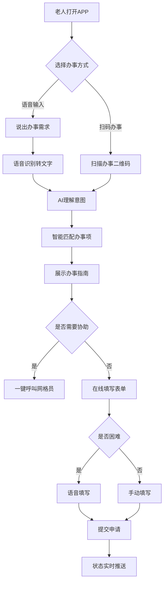
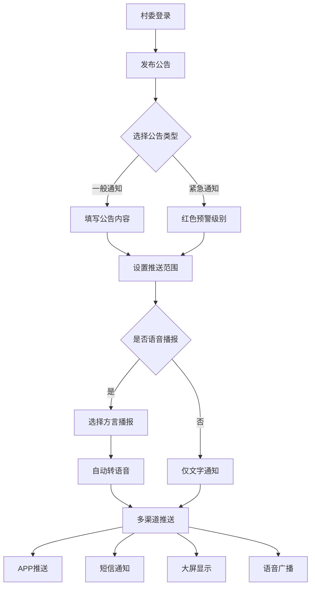
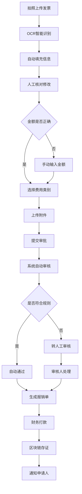
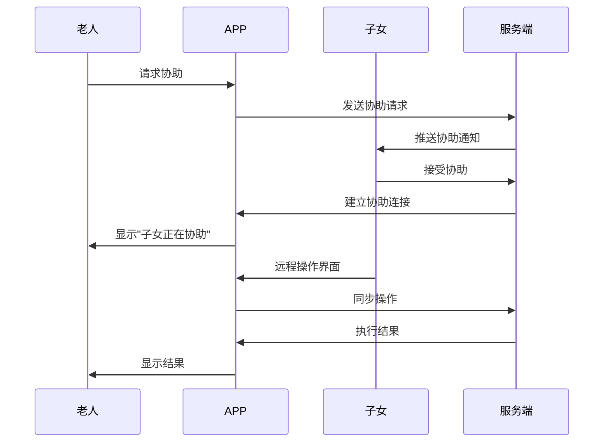
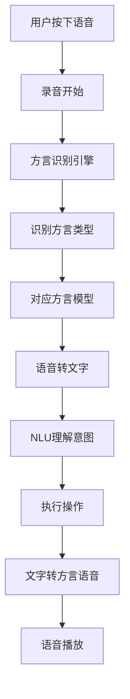

# 智慧乡村综合服务平台 - 用户体验设计

## 设计理念

### 核心原则
1. **适老化设计**：60岁以上用户友好，操作简单直观
2. **方言适配**：支持22种方言语音交互，降低数字鸿沟
3. **无障碍访问**：符合WCAG 2.1 AA级标准
4. **离线可用**：网络不稳定时保持核心功能
5. **渐进式引导**：分步骤教育用户使用数字化服务

### 设计风格
- **色彩**：温暖朴实的乡土色调（大地色、青绿色、丰收黄）
- **字体**：思源黑体 + 方言字体支持
- **图标**：具象化、易理解的图标设计
- **动效**：柔和自然，避免突兀的快速切换

---

## 用户角色与需求分析

### 1. 村民用户画像

#### 老年村民（65+岁）
**特征**：
- 数字技能基础较弱
- 多为留守老人，子女在外务工
- 健康需求突出，需要医疗协助
- 对补贴政策高度关注

**痛点**：
- 不会使用复杂APP
- 看不清小字体
- 听不清提示音
- 不会打字

**设计策略**：
- 超大字体模式（≥24px）
- 语音导航和语音输入
- 一键呼叫功能
- 亲属远程协助

#### 中年村民（40-65岁）
**特征**：
- 家庭主要劳动力
- 关注农业技术和市场信息
- 有一定数字技能
- 参与村务治理意愿强

**需求**：
- 农技学习
- 农产品销售
- 政策解读
- 村务参与

#### 青年村民（18-40岁）
**特征**：
- 熟练使用智能手机
- 外出务工比例高
- 关注家乡发展
- 希望远程参与村务

**需求**：
- 远程投票
- 实时村务动态
- 电商购物
- 亲友联系

### 2. 村委干部画像

#### 村支书/村主任
**职责**：
- 村务全面管理
- 政策传达落实
- 应急事件处理
- 群众工作

**工作场景**：
- 办公室办公
- 下村走访
- 上级会议
- 突发处理

**需求**：
- 快速发布通知
- 实时掌握民情
- 高效任务调度
- 数据统计报表

#### 村会计/文书
**职责**：
- 财务管理
- 档案整理
- 数据上报
- 便民服务

**需求**：
- 发票智能识别
- 财务自动对账
- 报表一键生成
- 历史数据查询

---

## 信息架构设计

### APP端信息架构

```
首页
├── 快捷功能
│   ├── 扫码办事
│   ├── 语音助手
│   ├── 紧急求助
│   └── 亲情通话
├── 村务信息
│   ├── 村务公开
│   ├── 政策通知
│   ├── 会议公告
│   └── 财务公示
├── 便民服务
│   ├── 证件办理
│   ├── 补贴申请
│   ├── 医疗服务
│   └── 农技指导
├── 生活圈
│   ├── 村友动态
│   ├── 互助平台
│   ├── 物品共享
│   └── 集市交易
├── 乡村电商
│   ├── 农产销售
│   ├── 农资购买
│   ├── 拼团购
│   └── 便民商城
└── 个人中心
    ├── 家庭档案
    ├── 我的服务
    ├── 积分商城
    └── 设置帮助
```

### Web管理后台架构

```
管理后台
├── 仪表盘
│   ├── 数据概览
│   ├── 实时动态
│   ├── 待办事项
│   └── 预警信息
├── 村民管理
│   ├── 基础档案
│   ├── 家庭关系
│   ├── 特殊群体
│   └── 统计分析
├── 村务治理
│   ├── 公告管理
│   ├── 会议管理
│   ├── 任务调度
│   └── 投票管理
├── 财务管理
│   ├── 收支管理
│   ├── 预算编制
│   ├── 报表生成
│   └── 审计日志
├── 应急管理
│   ├── 预案管理
│   ├── 资源管理
│   ├── 事件记录
│   └── 调度指挥
└── 系统设置
    ├── 权限管理
    ├── 系统配置
    ├── 日志管理
    └── 数据备份
```

---

## 核心用户流程设计

### 1. 老年村民办事流程



### 2. 村务管理流程



### 3. 财务报销流程



---

## 界面设计规范

### 1. 移动端设计系统

#### 色彩规范
```css
/* 主色调 */
--primary-green: #2E7D32;      /* 乡村绿 */
--secondary-yellow: #F9A825;   /* 丰收黄 */
--accent-orange: #E65100;      /* 暖阳橙 */

/* 功能色 */
--success: #4CAF50;            /* 成功 */
--warning: #FF9800;            /* 警告 */
--error: #F44336;              /* 错误 */
--info: #2196F3;               /* 信息 */

/* 中性色 */
--gray-50: #FAFAFA;
--gray-100: #F5F5F5;
--gray-500: #9E9E9E;
--gray-900: #212121;
```

#### 字体规范
```css
/* 基础字体 */
.font-base {
  font-family: "PingFang SC", "Microsoft YaHei", sans-serif;
}

/* 超大字体模式 */
.font-large {
  font-size: 24px;
  line-height: 1.5;
}

/* 标题层级 */
.text-h1 { font-size: 28px; font-weight: 600; }
.text-h2 { font-size: 24px; font-weight: 500; }
.text-h3 { font-size: 20px; font-weight: 500; }
.text-body { font-size: 16px; }
.text-caption { font-size: 14px; }
.text-small { font-size: 12px; }
```

#### 间距规范
```css
/* 8pt基础网格系统 */
.spacing-xs { margin: 4px; }
.spacing-sm { margin: 8px; }
.spacing-md { margin: 16px; }
.spacing-lg { margin: 24px; }
.spacing-xl { margin: 32px; }
.spacing-2xl { margin: 48px; }
```

### 2. 组件设计

#### 按钮组件
```css
/* 主要按钮 */
.btn-primary {
  min-height: 48px;          /* 最小触控区域 */
  border-radius: 8px;        /* 圆润边角 */
  padding: 12px 24px;
  font-size: 16px;
  font-weight: 500;
}

/* 老年模式按钮 */
.btn-elderly {
  min-height: 60px;          /* 更大触控区域 */
  font-size: 20px;
  box-shadow: 0 4px 12px rgba(0,0,0,0.15);
}

/* 语音按钮 */
.btn-voice {
  width: 64px;
  height: 64px;
  border-radius: 50%;
  position: relative;
  overflow: hidden;
}
```

#### 卡片组件
```css
.card {
  background: #FFFFFF;
  border-radius: 12px;
  padding: 16px;
  box-shadow: 0 2px 8px rgba(0,0,0,0.08);
}

.card-elderly {
  padding: 20px;
  border-radius: 16px;
  box-shadow: 0 4px 16px rgba(0,0,0,0.12);
}
```

#### 输入组件
```css
.input-field {
  height: 48px;
  padding: 0 16px;
  border: 2px solid #E0E0E0;
  border-radius: 8px;
  font-size: 16px;
}

.input-voice {
  position: relative;
}

.input-voice::after {
  content: "🎤";
  position: absolute;
  right: 12px;
  top: 50%;
  transform: translateY(-50%);
}
```

### 3. 交互动效

#### 过渡动画
```css
/* 页面切换 */
.page-transition {
  transition: all 0.3s cubic-bezier(0.4, 0, 0.2, 1);
}

/* 按钮反馈 */
.btn-feedback:active {
  transform: scale(0.95);
  transition: transform 0.1s;
}

/* 加载动画 */
.loading-spinner {
  animation: spin 1s linear infinite;
}

@keyframes spin {
  from { transform: rotate(0deg); }
  to { transform: rotate(360deg); }
}
```

---

## 适老化设计特性

### 1. 视觉辅助
- **超大字体模式**：一键切换，所有文字≥24px
- **高对比度**：文字与背景对比度≥7:1
- **色彩辅助**：重要功能使用强烈色彩标识
- **图标+文字**：双重信息传递

### 2. 交互简化
- **一键操作**：常用功能一键直达
- **语音导航**：全程语音提示操作步骤
- **手势简化**：仅支持点击、长按基础手势
- **防误触**：重要操作二次确认

### 3. 远程协助


---

## 方言语音设计

### 1. 支持的22种方言
```json
{
  "方言分类": {
    "北方方言": ["北京话", "东北话", "山东话", "河南话"],
    "吴方言": ["上海话", "苏州话", "杭州话", "宁波话"],
    "粤方言": ["粤语", "客家话", "潮汕话"],
    "闽方言": ["闽南话", "福州话", "莆田话"],
    "湘方言": ["长沙话", "湘潭话"],
    "赣方言": ["南昌话", "赣州话"],
    "西南官话": ["四川话", "重庆话", "云南话", "贵州话"]
  }
}
```

### 2. 语音交互流程


### 3. 语音UI设计
```css
/* 语音按钮状态 */
.voice-btn {
  width: 80px;
  height: 80px;
  border-radius: 50%;
  background: linear-gradient(135deg, #2E7D32, #4CAF50);
  box-shadow: 0 4px 20px rgba(46, 125, 50, 0.4);
}

.voice-btn.recording {
  animation: pulse 1.5s infinite;
}

@keyframes pulse {
  0% { box-shadow: 0 0 0 0 rgba(46, 125, 50, 0.7); }
  70% { box-shadow: 0 0 0 20px rgba(46, 125, 50, 0); }
  100% { box-shadow: 0 0 0 0 rgba(46, 125, 50, 0); }
}

/* 语音波形 */
.voice-wave {
  height: 40px;
  display: flex;
  align-items: center;
  justify-content: center;
  gap: 3px;
}

.voice-bar {
  width: 4px;
  background: #4CAF50;
  border-radius: 2px;
  animation: wave 0.5s ease-in-out infinite;
}

.voice-bar:nth-child(2) { animation-delay: 0.1s; }
.voice-bar:nth-child(3) { animation-delay: 0.2s; }
.voice-bar:nth-child(4) { animation-delay: 0.3s; }

@keyframes wave {
  0%, 100% { height: 10px; }
  50% { height: 30px; }
}
```

---

## 离线模式设计

### 1. 离线缓存策略
```javascript
// 核心数据离线缓存
const offlineData = {
  // 用户基本信息
  userProfile: true,

  // 常用表单模板
  formTemplates: true,

  // 政策公告（最近100条）
  announcements: true,

  // 应急联系方式
  emergencyContacts: true,

  // 医疗机构信息
  medicalInfo: true,

  // 农技知识库
  agriKnowledge: true
};
```

### 2. 离线功能清单
- ✅ 基础信息查询
- ✅ 紧急求助拨打
- ✅ 本地表单填写
- ✅ 离线消息编写
- ✅ 农技知识查阅
- ❌ 实时数据同步
- ❌ 视频通话
- ❌ 在线支付

### 3. 离线提示设计
```css
.offline-indicator {
  position: fixed;
  top: 0;
  left: 0;
  right: 0;
  height: 4px;
  background: #FF9800;
  z-index: 1000;
}

.offline-banner {
  position: fixed;
  top: 4px;
  left: 0;
  right: 0;
  padding: 8px 16px;
  background: #FFF3E0;
  color: #E65100;
  font-size: 14px;
  text-align: center;
}
```

---

## 无障碍设计

### 1. WCAG 2.1 AA级合规
- **感知性**：色彩不是唯一的信息传达方式
- **操作性**：全键盘可操作，没有时间限制
- **理解性**：文本清晰，输入辅助明确
- **健壮性**：兼容辅助技术

### 2. 读屏软件支持
```html
<!-- 语义化标签 -->
<header role="banner">
  <nav role="navigation" aria-label="主导航">
    <button aria-label="语音输入" aria-expanded="false">
      <span aria-hidden="true">🎤</span>
    </button>
  </nav>
</header>

<main role="main" aria-labelledby="page-title">
  <h1 id="page-title">村务公告</h1>
  <section aria-label="公告列表">
    <article aria-label="紧急通知：防汛演练">
      <h2>紧急通知：防汛演练</h2>
      <p>...</p>
    </article>
  </section>
</main>
```

### 3. 高对比度模式
```css
@media (prefers-contrast: high) {
  :root {
    --text-primary: #000000;
    --text-secondary: #333333;
    --bg-primary: #FFFFFF;
    --bg-secondary: #F5F5F5;
    --border-color: #666666;
  }
}
```

---

## 响应式设计

### 1. 断点设计
```css
/* 手机 */
@media (max-width: 767px) {
  .container { padding: 16px; }
  .grid { grid-template-columns: 1fr; }
}

/* 平板 */
@media (min-width: 768px) and (max-width: 1023px) {
  .container { padding: 24px; }
  .grid { grid-template-columns: repeat(2, 1fr); }
}

/* 桌面 */
@media (min-width: 1024px) {
  .container { max-width: 1200px; margin: 0 auto; }
  .grid { grid-template-columns: repeat(3, 1fr); }
}
```

### 2. 乡村大屏适配
```css
/* 43寸电视大屏 */
@media (min-width: 1920px) {
  :root {
    --font-scale: 1.5;
    --spacing-scale: 2;
  }

  .screen-header {
    height: 120px;
    font-size: 48px;
  }

  .data-card {
    min-height: 300px;
    padding: 40px;
    border-radius: 20px;
  }
}
```

---

## 原型设计要点

### 1. 核心页面原型

#### 首页设计
- 顶部：天气、日期、紧急通知
- 中部：6个核心功能入口（大图标+文字）
- 底部：消息通知、快捷工具

#### 办事页面
- 步骤引导：1.选择事项 2.填写表单 3.上传资料 4.提交审核
- 语音助手悬浮按钮
- 进度实时显示

#### 村务页面
- 公告卡片流
- 筛选分类（通知、政策、会议）
- 阅读标记
- 收藏功能

### 2. 关键交互原型

#### 语音交互
- 长按录音，松开发送
- 实时波形显示
- 方言自动识别
- 结果确认机制

#### 人脸登录
- 活体检测引导
- 多角度采集
- 识别反馈动画
- 登录成功动效

---

## 测试方案

### 1. 可用性测试
- **测试对象**：不同年龄段的村民代表
- **测试场景**：
  1. 老年人首次使用
  2. 中年人办事流程
  3. 村委日常操作
- **成功指标**：
  - 首次使用成功率 > 80%
  - 任务完成时间 < 5分钟
  - 满意度评分 > 4.5

### 2. 无障碍测试
- **工具测试**：WAVE、axe DevTools
- **真实测试**：邀请视障用户测试
- **测试内容**：
  - 键盘导航
  - 读屏软件兼容
  - 高对比度模式

### 3. 性能测试
- **加载时间**：首屏 < 3秒
- **响应时间**：操作反馈 < 500ms
- **离线测试**：核心功能可用
- **弱网测试**：2G网络下可用

---

## 总结

本UX设计方案充分考虑了智慧乡村平台的特殊性，针对老年用户、方言多样性、网络不稳定等挑战，提出了全面的解决方案。设计亮点：

1. **适老化设计**：全方位照顾老年用户需求
2. **方言支持**：22种方言语音交互，消除数字鸿沟
3. **离线优先**：网络不稳定时仍可使用核心功能
4. **无障碍友好**：符合WCAG标准，包容所有用户
5. **远程协助**：子女可远程帮助父母使用

设计将分阶段实施，先完成核心MVP功能，再逐步优化和扩展，确保用户体验持续改善。