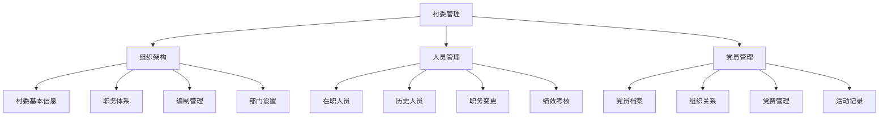
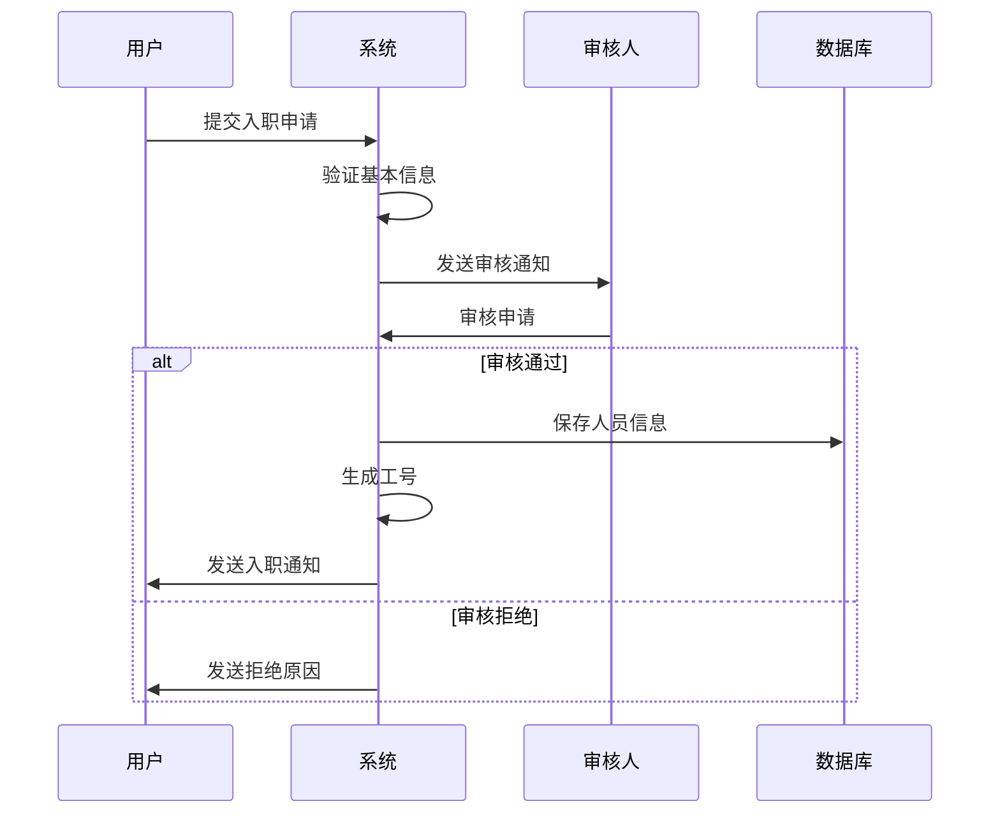
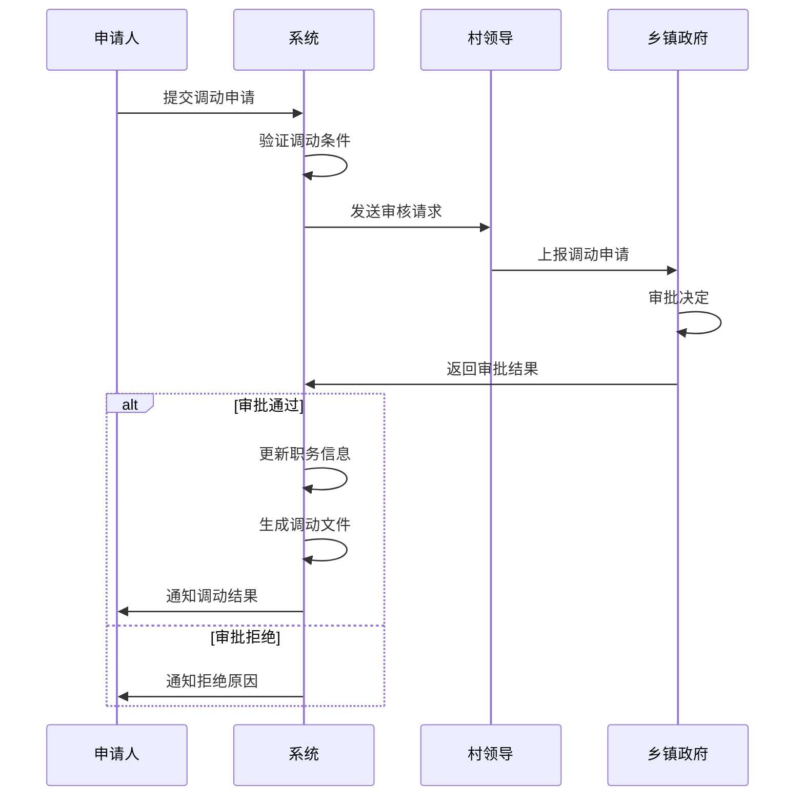

# 村委管理模块详细设计

## 模块概述

村委管理模块是智慧乡村平台的核心功能之一，负责管理村委组织架构、人员信息、工作职责和业务流程。该模块支持完整的村委干部生命周期管理，包括任职、调任、离职等流程，并提供党员信息管理功能。

## 功能架构

### 1. 组织架构管理


### 2. 数据模型设计

#### 村委基本信息 (Committee)
```javascript
{
  _id: ObjectId,
  villageId: String,           // 村庄ID
  villageName: String,         // 村庄名称
  villageCode: String,         // 行政村编码
  address: String,             // 地址
  phone: String,               // 联系电话
  email: String,               // 邮箱

  // 组织架构
  organization: {
    establishedDate: Date,     // 成立日期
    legalRepresentative: String, // 法定代表人
    organizationCode: String,  // 统一社会信用代码
    parentUnit: String,        // 上级主管单位
  },

  // 编制信息
  staffing: {
    totalPositions: Number,    // 编制总数
    currentPositions: Number,  // 在编人数
    vacantPositions: Number,   // 空缺职位
  },

  // 状态
  status: {
    isActive: Boolean,         // 是否激活
    lastUpdated: Date,         // 最后更新时间
    updatedBy: String,         // 更新人
  },

  createdAt: Date,
  updatedAt: Date
}
```

#### 村委人员 (CommitteeMember)
```javascript
{
  _id: ObjectId,
  committeeId: ObjectId,       // 村委ID
  villageId: String,           // 村庄ID

  // 基本信息
  personalInfo: {
    name: String,              // 姓名
    gender: String,            // 性别
    birthDate: Date,           // 出生日期
    idCard: String,            // 身份证号
    phone: String,             // 手机号
    email: String,             // 邮箱
    address: String,           // 家庭住址
    photo: String,             // 照片URL
    education: String,         // 学历
    profession: String,        // 专业
  },

  // 职务信息
  position: {
    current: {
      title: String,           // 当前职务
      level: String,           // 职务级别
      startDate: Date,         // 任职开始日期
      endDate: Date,           // 任职结束日期
      appointmentDoc: String,  // 任命文件
      appointmentNumber: String, // 任命文号
    },
    history: [{                // 历史职务记录
      title: String,
      level: String,
      startDate: Date,
      endDate: Date,
      reason: String,          // 变动原因
      appointmentDoc: String,
    }]
  },

  // 党员信息
  partyMember: {
    isMember: Boolean,         // 是否党员
    joinDate: Date,           // 入党日期
    partyPosition: String,     // 党内职务
    organization: String,      // 所属党组织
    memberStatus: String,      // 党员状态
  },

  // 工作信息
  work: {
    department: String,        // 所属部门
    responsibilities: [String], // 工作职责
    performance: {             // 绩效考核
      scores: [{
        period: String,        // 考核周期
        score: Number,         // 考核分数
        level: String,         // 考核等级
        evaluator: String,     // 考核人
        evaluateDate: Date,    // 考核日期
        comments: String,      // 评价意见
      }],
      averageScore: Number,    // 平均分数
    }
  },

  // 状态管理
  status: {
    isActive: Boolean,         // 是否在职
    workStatus: String,        // 工作状态
    lastWorkDate: Date,        // 最后工作日期
    leaveReason: String,       // 离职原因
    notes: String,             // 备注
  },

  // 联系信息（脱敏）
  contact: {
    phone: String,             // 联系电话（脱敏）
    emergencyContact: {        // 紧急联系人
      name: String,
      relationship: String,
      phone: String,
    }
  },

  createdAt: Date,
  updatedAt: Date,
  createdBy: String
}
```

### 3. API 接口设计

#### 组织架构接口
```javascript
// GET /api/v1/committee/info
// 获取村委基本信息
{
  villageId: String
}

// PUT /api/v1/committee/info
// 更新村委基本信息
{
  villageName: String,
  address: String,
  phone: String,
  email: String,
  organization: Object,
  staffing: Object
}

// GET /api/v1/committee/positions
// 获取职务体系
{
  villageId: String
}

// POST /api/v1/committee/positions
// 添加职务类型
{
  villageId: String,
  title: String,
  level: String,
  description: String,
  responsibilities: [String]
}
```

#### 人员管理接口
```javascript
// GET /api/v1/committee/members
// 获取村委人员列表
{
  villageId: String,
  status: String,      // active, inactive, all
  position: String,
  page: Number,
  limit: Number
}

// POST /api/v1/committee/members
// 添加村委人员
{
  villageId: String,
  personalInfo: Object,
  position: Object,
  partyMember: Object,
  work: Object
}

// PUT /api/v1/committee/members/:id
// 更新人员信息
{
  personalInfo: Object,
  position: Object,
  partyMember: Object,
  work: Object
}

// POST /api/v1/committee/members/:id/transfer
// 职务调动
{
  newPosition: {
    title: String,
    level: String,
    startDate: Date,
    reason: String,
    appointmentDoc: String
  }
}

// POST /api/v1/committee/members/:id/leave
// 人员离职
{
  leaveDate: Date,
  leaveReason: String,
  successor: String,
  handoverNotes: String
}
```

#### 党员管理接口
```javascript
// GET /api/v1/committee/party-members
// 获取党员列表
{
  villageId: String,
  organization: String,
  status: String
}

// POST /api/v1/committee/party-members
// 添加党员信息
{
  memberId: String,
  partyInfo: {
    joinDate: Date,
    partyPosition: String,
    organization: String
  }
}

// GET /api/v1/committee/party-activities
// 获取党建活动记录
{
  villageId: String,
  startDate: Date,
  endDate: Date,
  type: String
}

// POST /api/v1/committee/party-activities
// 添加党建活动
{
  villageId: String,
  title: String,
  type: String,
  date: Date,
  location: String,
  participants: [String],
  content: String,
  attachments: [String]
}
```

### 4. 业务流程设计

#### 人员入职流程


#### 职务调动流程


### 5. 权限控制设计

#### 角色权限矩阵
| 功能 | 普通村民 | 村委成员 | 村会计 | 村主任 | 村支书 | 系统管理员 |
|------|----------|----------|--------|--------|--------|------------|
| 查看村委信息 | ✓ | ✓ | ✓ | ✓ | ✓ | ✓ |
| 查看人员列表 | 脱敏 | 脱敏 | ✓ | ✓ | ✓ | ✓ |
| 添加人员 | ✗ | ✗ | ✗ | ✓ | ✓ | ✓ |
| 修改信息 | 个人 | 个人 | 财务 | ✓ | ✓ | ✓ |
| 职务调动 | ✗ | ✗ | ✗ | ✓ | ✓ | ✓ |
| 党员管理 | ✗ | 个人 | 个人 | ✓ | ✓ | ✓ |
| 绩效考核 | ✗ | 个人 | ✗ | ✓ | ✓ | ✓ |

#### 数据安全策略
1. **身份证号脱敏**: 110***********1234
2. **手机号脱敏**: 138****5678
3. **敏感操作记录**: 所有修改操作记入审计日志
4. **访问控制**: 基于角色的访问控制(RBAC)
5. **数据加密**: 敏感数据AES加密存储

### 6. 界面设计要点

#### 主要页面
1. **村委概览页**: 组织架构图、编制情况、重要通知
2. **人员管理页**: 人员列表、搜索筛选、批量操作
3. **人员详情页**: 完整档案、工作履历、考核记录
4. **党员管理页**: 党员名册、组织关系、活动记录
5. **职务管理页**: 职务体系、编制管理、调动记录

#### 交互设计
- 响应式设计，支持PC和移动端
- 表格支持排序、筛选、导出功能
- 重要操作需要二次确认
- 提供批量导入导出功能
- 支持文件上传（证件、任命文件等）

### 7. 技术实现要点

#### 前端技术
- Vue 3 + Element Plus UI组件
- Pinia状态管理
- Vue Router路由管理
- Axios HTTP客户端
- Vue I18n国际化

#### 后端技术
- Express.js RESTful API
- Mongoose ODM数据建模
- Multer文件上传
- JWT身份认证
- Winston日志记录

#### 数据库优化
- 合理设置索引提升查询性能
- 使用MongoDB聚合管道进行复杂查询
- 实现数据分页避免大结果集
- 定期备份数据保证数据安全

### 8. 测试策略

#### 单元测试
- 数据模型验证测试
- API接口功能测试
- 业务逻辑正确性测试

#### 集成测试
- 前后端接口联调测试
- 数据库操作测试
- 文件上传下载测试

#### 性能测试
- 大量数据查询性能测试
- 并发访问压力测试
- 文件处理性能测试

#### 安全测试
- 权限控制测试
- 数据脱敏验证
- SQL注入防护测试
- 文件上传安全测试

### 9. 部署和运维

#### 部署要求
- Node.js 20.17.0+
- MongoDB 6.0+
- Redis 7.0+
- 文件存储空间（用于证件、文档）

#### 监控指标
- API响应时间
- 数据库查询性能
- 文件上传成功率
- 用户操作日志

#### 备份策略
- 数据库每日自动备份
- 文件定期同步备份
- 操作日志长期保存

### 10. 未来扩展

#### 可能的功能扩展
1. **移动端APP**: 方便村委人员移动办公
2. **电子签章**: 在线签署任命文件
3. **人脸识别**: 考勤和身份验证
4. **智能分析**: 人员配置分析优化建议
5. **报表系统**: 自动生成各类统计报表

#### 技术升级方向
1. **微服务架构**: 拆分为更小的服务单元
2. **容器化部署**: Docker + Kubernetes
3. **缓存优化**: Redis集群提升性能
4. **CDN加速**: 文件访问速度优化
5. **大数据分析**: 人员数据深度挖掘

---

**文档版本**: v1.0
**创建日期**: 2025-12-15
**维护团队**: 智慧乡村平台开发组