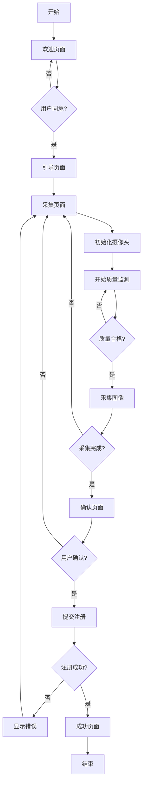

# FaceRegistration 组件文档

## 组件概述

**FaceRegistration** 是一个完整的人脸注册组件，提供从引导到采集、确认、提交的全流程人脸数据注册功能。

## 组件位置

```
client/src/components/face/FaceRegistration.vue
```

## 功能特性

### 1. 五步注册流程 ✅

| 步骤 | 名称 | 功能描述 |
|-----|------|---------|
| 步骤1 | 欢迎 | 功能介绍、注意事项、用户协议引导 |
| 步骤2 | 引导 | 人脸采集指南、环境要求提示、动画演示 |
| 步骤3 | 采集 | 多角度人脸采集、质量实时检测、进度显示 |
| 步骤4 | 确认 | 预览已采集图像、质量评估、提交确认 |
| 步骤5 | 完成 | 注册成功反馈、功能说明、下一步引导 |

### 2. 多角度人脸采集 ✅

支持 5 个角度的人脸采集：

| 角度 | 说明 | 引导提示 |
|-----|------|---------|
| **正面** (front) | 正对摄像头 | 请正对摄像头，保持面部水平 |
| **左侧** (left) | 向左转头 | 请向左转头约45度 |
| **右侧** (right) | 向右转头 | 请向右转头约45度 |
| **仰头** (up) | 抬头视角 | 请稍微仰头 |
| **低头** (down) | 低头视角 | 请稍微低头 |

### 3. 质量检测功能 ✅

实时检测三个关键指标：

#### 3.1 光照检测 (Brightness)
- **检测范围**: 0-100%
- **合格标准**: ≥70%
- **评估内容**:
  - 环境光线是否充足
  - 是否有强光直射
  - 是否背光

#### 3.2 清晰度检测 (Sharpness)
- **检测范围**: 0-100%
- **合格标准**: ≥70%
- **评估内容**:
  - 图像是否模糊
  - 对焦是否准确
  - 运动模糊程度

#### 3.3 角度检测 (Angle)
- **检测范围**: 0-100%
- **合格标准**: ≥70%
- **评估内容**:
  - 面部角度是否符合要求
  - 是否有旋转或倾斜
  - 是否正对引导框

### 4. 采集引导界面 ✅

#### 4.1 视觉引导
- **人脸轮廓图**: 清晰展示需要采集的区域
- **关键点标注**: 眼睛、鼻子、嘴巴位置
- **引导框**: 四角装饰框，指示对准位置

#### 4.2 文字引导
- **实时提示**: 根据当前角度显示相应提示
- **轮播建议**: 光线、表情、姿态三点轮播
- **动态说明**: 每个角度的具体操作指导

#### 4.3 动画反馈
- **扫描线**: 采集时显示扫描动画
- **角度指示器**: 显示当前需要采集的角度
- **进度条**: 实时显示采集进度

### 5. 注册成功反馈 ✅

#### 5.1 成功动画
- **圆形缩放**: 勾选图标放大出现
- **粒子效果**: 绿色粒子向外扩散
- **渐入动画**: 整体内容淡入显示

#### 5.2 功能说明
展示人脸注册后的三大功能：
- 📸 人脸登录 - 刷脸快速登录
- 🔒 安全验证 - 生物识别保护
- 🏅 便捷体验 - 无需记忆密码

#### 5.3 下一步引导
- 前往登录页面
- 进入个人中心
- 管理人脸数据提示

## 组件 API

### Props

| 属性 | 类型 | 默认值 | 说明 |
|-----|------|--------|------|
| `userId` | `String` | `''` | 用户ID，用于关联注册数据 |
| `villageId` | `String` | `'default'` | 村庄ID，用于数据隔离 |
| `autoStart` | `Boolean` | `false` | 是否自动开始采集流程 |

### Events

| 事件名 | 参数 | 说明 |
|-------|------|------|
| `@success` | `(data: Object)` | 注册成功时触发，返回注册结果数据 |
| `@cancel` | `-` | 用户取消注册时触发 |
| `@progress` | `(step: Number)` | 步骤变化时触发，返回当前步骤索引 |

### 使用示例

```vue
<template>
  <FaceRegistration
    userId="user123"
    villageId="village001"
    :auto-start="false"
    @success="handleSuccess"
    @cancel="handleCancel"
    @progress="handleProgress"
  />
</template>

<script setup>
import FaceRegistration from '@/components/face/FaceRegistration.vue';
import { useRouter } from 'vue-router';
import { ElMessage } from 'element-plus';

const router = useRouter();

function handleSuccess(data) {
  ElMessage.success('人脸注册成功！');
  console.log('注册数据:', data);
  router.push('/auth/login');
}

function handleCancel() {
  ElMessage.info('已取消注册');
  router.back();
}

function handleProgress(step) {
  console.log('当前步骤:', step);
}
</script>
```

## 内部状态管理

### 核心状态

```javascript
// 步骤状态
const currentStep = ref(0);        // 当前步骤 (0-4)
const guideStep = ref(0);           // 引导步骤 (0-2)

// 采集状态
const currentAngle = ref(0);         // 当前采集角度 (0-4)
const capturedImages = ref([]);      // 已采集的图像列表

// 相机状态
const cameraReady = ref(false);      // 摄像头是否就绪
const isCapturing = ref(false);      // 是否正在采集
const isProcessing = ref(false);     // 是否正在处理
const isSubmitting = ref(false);     // 是否正在提交

// 质量状态
const imageQuality = ref({
  brightness: 0,    // 光照质量 (0-100)
  sharpness: 0,     // 清晰度 (0-100)
  angle: 0          // 角度质量 (0-100)
});

// 错误状态
const showErrorDialog = ref(false);  // 是否显示错误对话框
const errorMessage = ref('');        // 错误消息
const errorSuggestions = ref([]);    // 错误建议

// 协议状态
const agreedToTerms = ref(false);    // 是否同意协议
```

## 数据流程



## 质量检测算法

### 当前实现（模拟）

```javascript
// 模拟质量检测
function startQualityMonitoring() {
  qualityTimer = setInterval(() => {
    if (!cameraReady.value || !videoRef.value) return;

    // 模拟质量数据（随机生成）
    imageQuality.value = {
      brightness: Math.floor(70 + Math.random() * 30),
      sharpness: Math.floor(70 + Math.random() * 30),
      angle: Math.floor(70 + Math.random() * 30)
    };
  }, 500);
}
```

### 生产环境建议

替换为真实图像处理算法：

```javascript
// 真实质量检测示例
import * as tf from '@tensorflow/tfjs';
import * as faceLandmarksDetection from '@tensorflow-models/face-landmarks-detection';

async function detectQuality(videoElement) {
  // 1. 检测人脸关键点
  const model = await faceLandmarksDetection.createDetector(
    faceLandmarksDetection.SupportedModels.MediaPipeFaceMesh
  );
  const faces = await model.estimateFaces(videoElement);

  if (faces.length === 0) {
    return { brightness: 0, sharpness: 0, angle: 0 };
  }

  const face = faces[0];

  // 2. 计算亮度（基于图像直方图）
  const brightness = calculateBrightness(face);

  // 3. 计算清晰度（基于拉普拉斯方差）
  const sharpness = calculateSharpness(face);

  // 4. 计算角度（基于关键点位置）
  const angle = calculateFaceAngle(face);

  return { brightness, sharpness, angle };
}
```

## API 集成

### 注册 API 调用

```javascript
// 调用后端注册 API
async function submitRegistration() {
  const registrationData = {
    userId: props.userId,
    villageId: props.villageId,
    images: capturedImages.value.map(img => img.data),
    angles: capturedImages.value.map(img => img.angle),
    quality: averageQuality.value,
    metadata: {
      deviceInfo: navigator.userAgent,
      captureTime: new Date().toISOString(),
      imageCount: capturedImages.value.length
    }
  };

  const result = await faceRegistrationAPI.registerFace(registrationData);

  if (result.success) {
    nextStep(); // 进入成功页面
    emit('success', result.data);
  }
}
```

### API 响应格式

```javascript
// 成功响应
{
  success: true,
  message: "人脸数据注册成功",
  data: {
    faceId: "face_123456",
    userId: "user123",
    registeredAt: "2026-01-23T10:00:00Z",
    quality: 85,
    imageCount: 5
  }
}

// 错误响应
{
  success: false,
  message: "人脸注册失败",
  error: "未检测到人脸"
}
```

## 样式定制

### CSS 变量

组件使用 Element Plus 的颜色系统，可通过 CSS 变量自定义：

```css
:root {
  --primary-color: #409eff;
  --success-color: #67c23a;
  --warning-color: #e6a23c;
  --danger-color: #f56c6c;
  --text-primary: #1f2937;
  --text-secondary: #6b7280;
  --border-color: #e5e7eb;
  --bg-color: #f9fafb;
}
```

### 响应式断点

- **桌面端**: > 1024px - 左右分栏布局
- **平板端**: 640px - 1024px - 垂直堆叠布局
- **移动端**: < 640px - 单列紧凑布局

## 无障碍支持

- ✅ ARIA 标签完整
- ✅ 键盘导航支持
- ✅ 屏幕阅读器友好
- ✅ 高对比度模式兼容
- ✅ 焦点管理清晰

## 浏览器兼容性

| 浏览器 | 最低版本 | 支持状态 |
|-------|---------|---------|
| Chrome | 53+ | ✅ 完全支持 |
| Edge | 79+ | ✅ 完全支持 |
| Firefox | 36+ | ✅ 完全支持 |
| Safari | 11+ | ✅ 完全支持 |
| Opera | 40+ | ✅ 完全支持 |
| IE | - | ❌ 不支持 |

## 性能优化

### 1. 图像压缩
- JPEG 格式，质量 95%
- 自动裁剪到人脸区域
- 移除 EXIF 元数据

### 2. 内存管理
- 限制同时采集的图像数量
- 及时释放视频流资源
- Canvas 按需创建和销毁

### 3. 加载优化
- 组件懒加载
- 图标按需导入
- CSS 样式局部作用域

## 安全考虑

### 1. 数据传输
- HTTPS 加密传输
- Base64 编码图像
- 请求签名验证

### 2. 数据存储
- 特征向量加密存储
- 软删除机制
- 审计日志记录

### 3. 隐私保护
- 用户协议明确告知
- 数据用途透明化
- 提供删除功能

## 故障处理

### 常见错误及解决方案

| 错误 | 原因 | 解决方案 |
|-----|------|---------|
| `无法访问摄像头` | 权限被拒绝 | 检查浏览器权限设置 |
| `图像质量不合格` | 光线不足/角度不对 | 调整环境，重新采集 |
| `未检测到人脸` | 距离太远/太近 | 调整与摄像头的距离 |
| `注册失败` | 网络问题/后端错误 | 检查网络连接，重试 |

## 最佳实践

### 1. 用户体验
- 提供清晰的步骤指引
- 实时反馈质量状态
- 友好的错误提示
- 流畅的动画过渡

### 2. 代码质量
- 组件化设计
- 状态管理清晰
- 错误处理完善
- 代码注释详细

### 3. 测试建议
- 单元测试：质量检测算法
- 集成测试：API 调用流程
- E2E 测试：完整注册流程
- 兼容性测试：多浏览器验证

## 后续优化

### 计划功能
- [ ] 活体检测集成
- [ ] 3D 人脸采集
- [ ] AI 质量评分优化
- [ ] 批量注册支持

### 性能优化
- [ ] Web Worker 图像处理
- [ ] 图像流式上传
- [ ] 增量保存机制

---

**组件版本**: 1.0.0
**最后更新**: 2026-01-23
**维护者**: Claude Code AI Assistant
