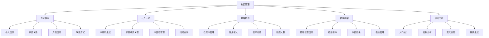

# 村民管理模块详细设计

## 模块概述

村民管理模块是智慧乡村平台的核心数据管理模块，负责建立完整的村民数字档案，实现村民信息的数字化管理。该模块支持村民基本信息管理、家庭关系维护、一户一码管理、特殊群体关怀等功能，并确保数据安全和隐私保护。

## 功能架构

### 1. 核心功能模块


### 2. 数据模型设计

#### 村民基本信息 (Resident)
```javascript
{
  _id: ObjectId,
  residentId: String,          // 村民唯一标识
  villageId: String,           // 所属村庄ID
  householdId: String,         // 户ID

  // 基本信息
  basicInfo: {
    name: String,              // 姓名
    gender: String,            // 性别：男/女
    birthDate: Date,           // 出生日期
    idCard: String,            // 身份证号（加密存储）
    ethnicity: String,         // 民族
    education: String,         // 文化程度
    occupation: String,        // 职业
    maritalStatus: String,     // 婚姻状况
    photo: String,             // 照片URL
  },

  // 户籍信息
  household: {
    householdType: String,     // 户别：农业户/非农业户
    householdNature: String,   // 户性质：一般户/低保户/五保户
    registrationDate: Date,    // 落户时间
    isLocal: Boolean,          // 是否本地户籍
    originalAddress: String,   // 户籍所在地
    currentAddress: String,    // 现住址
  },

  // 家庭关系
  family: {
    isHead: Boolean,           // 是否户主
    relationship: String,      // 与户主关系
    familyMembers: [{          // 家庭成员列表
      memberId: String,        // 成员ID
      name: String,            // 姓名
      relationship: String,    // 关系
      phone: String,           // 联系电话（脱敏）
    }],
  },

  // 联系方式
  contact: {
    phone: String,             // 手机号（加密存储）
    phoneMasked: String,       // 脱敏显示 138****5678
    email: String,             // 邮箱
    wechat: String,            // 微信号
    qq: String,                // QQ号
    emergencyContact: {        // 紧急联系人
      name: String,
      relationship: String,
      phone: String,
      address: String,
    }
  },

  // 健康信息
  health: {
    bloodType: String,         // 血型
    height: Number,            // 身高(cm)
    weight: Number,            // 体重(kg)
    medicalHistory: String,    // 病史
    allergies: String,         // 过敏史
    medications: String,       // 常用药物
    disability: {              // 残疾情况
      isDisabled: Boolean,
      level: String,           // 残疾等级
      type: String,            // 残疾类型
      certificateNo: String,   // 残疾证号
    },
    vaccination: [{            // 疫苗接种记录
      vaccineName: String,
      vaccinationDate: Date,
      batchNumber: String,
      manufacturer: String,
    }],
    physicalExams: [{          // 体检记录
      examDate: Date,
      hospital: String,
      results: String,
      doctor: String,
    }],
  },

  // 特殊标签
  tags: {
    isLowIncome: Boolean,      // 是否低保户
    isElderly: Boolean,        // 是否老年人(60+)
    isLivingAlone: Boolean,    // 是否独居
    isLeftBehindChild: Boolean, // 是否留守儿童
    isPregnant: Boolean,       // 是否孕妇
    isChronicDisease: Boolean, // 是否慢性病患者
    needsSpecialCare: Boolean, // 是否需要特殊关怀
    careLevel: String,         // 关怀等级
  },

  // 社保信息
  socialSecurity: {
    hasPension: Boolean,       // 是否有养老保险
    hasMedical: Boolean,       // 是否有医疗保险
    pensionType: String,       // 养老保险类型
    medicalType: String,       // 医疗保险类型
    insuranceNo: String,       // 社保号（加密）
  },

  // 就业信息
  employment: {
    isEmployed: Boolean,       // 是否就业
    employer: String,          // 工作单位
    position: String,          // 职位
    income: Number,            // 月收入
    employmentType: String,    // 就业类型
    workLocation: String,      // 工作地点
    skills: [String],          // 技能特长
  },

  // 教育信息（针对学生）
  education: {
    isStudent: Boolean,        // 是否在校学生
    school: String,            // 学校名称
    grade: String,             // 年级/班级
    studentId: String,         // 学号
    guardian: [{               // 监护人
      name: String,
      relationship: String,
      phone: String,
    }],
  },

  // 土地房产
  property: {
    farmlandArea: Number,      // 耕地面积(亩)
    houseArea: Number,         // 房屋面积(平方米)
    houseType: String,         // 房屋类型
    propertyRights: String,    // 产权性质
    landCertificate: String,   // 土地证号
    houseCertificate: String,  // 房产证号
  },

  // 权限控制
  permissions: {
    canEditBasicInfo: [String], // 可编辑基本信息的角色
    canViewSensitive: [String], // 可查看敏感信息的角色
    canExport: [String],        // 可导出信息的角色
  },

  // 系统字段
  status: {
    isActive: Boolean,         // 是否有效
    isDeleted: Boolean,        // 是否删除
    lastUpdated: Date,         // 最后更新时间
    updatedBy: String,         // 更新人
  },

  createdAt: Date,
  updatedAt: Date,
  createdBy: String
}
```

#### 户信息 (Household)
```javascript
{
  _id: ObjectId,
  householdId: String,        // 户唯一标识
  householdCode: String,       // 一户一码
  villageId: String,           // 所属村庄

  // 基本信息
  basicInfo: {
    headName: String,          // 户主姓名
    memberCount: Number,       // 家庭人口数
    address: String,           // 家庭住址
    phone: String,             // 联系电话
    qrCodeUrl: String,         // 二维码图片URL
  },

  // 成员信息
  members: [{
    residentId: String,        // 村民ID
    name: String,              // 姓名
    relationship: String,      // 与户主关系
    idCard: String,            // 身份证号（加密）
    birthDate: Date,           // 出生日期
    gender: String,            // 性别
    isHead: Boolean,           // 是否户主
  }],

  // 家庭类型
  householdType: {
    type: String,              // 家庭类型
    specialTags: [String],     // 特殊标签
    supportLevel: String,      // 扶助等级
  },

  // 收支情况
  finance: {
    annualIncome: Number,      // 年收入
    incomeSource: String,      // 主要收入来源
    expense: Number,           // 年支出
    debt: Number,              // 负债情况
  },

  // 政策帮扶
  policies: [{
    policyType: String,        // 政策类型
    policyName: String,        // 政策名称
    startDate: Date,           // 开始享受时间
    endDate: Date,             // 结束时间
    amount: Number,            // 补助金额
    status: String,            // 状态
  }],

  status: {
    isActive: Boolean,
    lastUpdated: Date,
    updatedBy: String,
  },

  createdAt: Date,
  updatedAt: Date
}
```

### 3. API 接口设计

#### 村民管理接口
```javascript
// GET /api/v1/residents
// 获取村民列表
{
  villageId: String,
  householdId: String,
  name: String,
  gender: String,
  ageRange: [Number, Number],
  tags: [String],
  page: Number,
  limit: Number
}

// POST /api/v1/residents
// 新增村民
{
  villageId: String,
  householdId: String,
  basicInfo: Object,
  household: Object,
  contact: Object,
  // ...其他字段
}

// PUT /api/v1/residents/:id
// 更新村民信息
{
  // 需要更新的字段
}

// GET /api/v1/residents/:id
// 获取村民详情（根据权限返回不同内容）

// DELETE /api/v1/residents/:id
// 删除村民（逻辑删除）

// POST /api/v1/residents/batch-import
// 批量导入村民信息
{
  villageId: String,
  data: File,                 // Excel文件
  options: {
    skipHeader: Boolean,
    overwrite: Boolean,
  }
}
```

#### 户管理接口
```javascript
// GET /api/v1/households
// 获取户列表
{
  villageId: String,
  headName: String,
  householdType: String,
  memberCountRange: [Number, Number],
  page: Number,
  limit: Number
}

// POST /api/v1/households
// 新建户信息
{
  villageId: String,
  basicInfo: Object,
  members: [Object],
}

// GET /api/v1/households/:code/qrcode
// 获取户二维码
{
  size: Number,               // 二维码尺寸
  format: String,             // 格式：png/jpg
}

// POST /api/v1/households/:code/scan
// 扫码查询户信息
{
  scanTime: Date,
  scannerInfo: {
    userId: String,
    role: String,
  }
}

// PUT /api/v1/households/:id/members
// 更新家庭成员
{
  action: String,             // add/remove/update
  member: Object,
}
```

#### 特殊群体管理接口
```javascript
// GET /api/v1/residents/special-groups
// 获取特殊群体列表
{
  villageId: String,
  groupType: String,          // elderly/low-income/disabled/etc
  careLevel: String,
  page: Number,
  limit: Number
}

// POST /api/v1/residents/:id/care-record
// 添加关怀记录
{
  careType: String,           // 关怀类型
  caregiver: String,          // 关怀人
  careDate: Date,
  content: String,            // 关怀内容
  followUp: String,           // 后续计划
  photos: [String],           // 照片
}

// GET /api/v1/residents/:id/care-records
// 获取关怀记录
{
  startDate: Date,
  endDate: Date,
  careType: String,
}
```

### 4. 数据安全和隐私保护

#### 数据脱敏策略
```javascript
const dataMasking = {
  idCard: (fullId) => {
    // 110***********1234
    return fullId.replace(/(\d{3})\d*(\d{4})/, '$1***********$2');
  },

  phone: (fullPhone) => {
    // 138****5678
    return fullPhone.replace(/(\d{3})\d*(\d{4})/, '$1****$2');
  },

  address: (fullAddress) => {
    // 只显示到乡镇级
    const parts = fullAddress.split(/省|市|县|区|镇|乡/);
    return parts.slice(0, 3).join('') + '******';
  }
};
```

#### 权限控制矩阵
| 操作 | 普通村民 | 村民本人 | 家庭成员 | 村干部 | 乡镇干部 | 系统管理员 |
|------|----------|----------|----------|--------|----------|------------|
| 查看基本信息 | 脱敏 | 完整 | 完整 | 完整 | 完整 | 完整 |
| 查看联系方式 | 脱敏 | 完整 | 完整 | 完整 | 完整 | 完整 |
| 查看健康信息 | ✗ | 完整 | ✗ | 脱敏 | 完整 | 完整 |
| 查看财务信息 | ✗ | 完整 | ✗ | 脱敏 | 完整 | 完整 |
| 修改个人信息 | ✗ | 本人 | ✗ | 授权 | 授权 | 完整 |
| 导出数据 | ✗ | ✗ | ✗ | 授权 | 授权 | 完整 |

#### 审计日志
```javascript
{
  _id: ObjectId,
  timestamp: Date,
  userId: String,
  userRole: String,
  action: String,             // view/edit/delete/export
  targetType: String,         // resident/household
  targetId: String,
  targetFields: [String],     // 操作的字段
  oldValue: Object,           // 修改前的值
  newValue: Object,           // 修改后的值
  ipAddress: String,
  userAgent: String,
  result: String,             // success/failure
  reason: String,             // 操作原因
}
```

### 5. 血缘关系自动绑定算法

```javascript
class BloodRelationshipService {
  // 根据身份证号自动判断血缘关系
  static detectRelationship(idCard1, idCard2, name1, name2) {
    // 1. 同户判断
    if (this.isSameHousehold(idCard1, idCard2)) {
      return this.analyzeHouseholdRelationship(idCard1, idCard2, name1, name2);
    }

    // 2. 年龄差判断
    const age1 = this.getAge(idCard1);
    const age2 = this.getAge(idCard2);
    const ageDiff = Math.abs(age1 - age2);

    // 3. 同地区判断
    if (this.isSameRegion(idCard1, idCard2)) {
      return this.analyzeRegionalRelationship(ageDiff, name1, name2);
    }

    return null;
  }

  // 分析户内关系
  static analyzeHouseholdRelationship(idCard1, idCard2, name1, name2) {
    const age1 = this.getAge(idCard1);
    const age2 = this.getAge(idCard2);

    // 年龄差25-45岁，且姓氏相同，很可能是父子/母子
    if (Math.abs(age1 - age2) >= 25 && Math.abs(age1 - age2) <= 45) {
      if (name1.charAt(0) === name2.charAt(0)) {
        return age1 > age2 ? '父子' : '母子';
      }
    }

    // 年龄差2-8岁，很可能是兄弟姐妹
    if (Math.abs(age1 - age2) >= 2 && Math.abs(age1 - age2) <= 8) {
      return '兄弟姐妹';
    }

    // 其他情况
    return age1 > age2 ? '长辈' : '晚辈';
  }
}
```

### 6. 前端界面设计要点

#### 主要页面组件
1. **村民列表页**
   - 高级搜索（姓名、年龄、性别、标签等）
   - 表格展示（支持排序、筛选）
   - 批量操作（导入、导出、标签管理）
   - 快速操作（查看、编辑、删除）

2. **村民详情页**
   - 基本信息卡片
   - 家庭关系图谱
   - 健康档案时间线
   - 政策帮扶记录
   - 操作历史日志

3. **户管理页**
   - 户信息概览
   - 家庭成员管理
   - 一户一码生成
   - 扫码查询界面

4. **特殊群体关怀**
   - 分群体管理页面
   - 关怀任务提醒
   - 关怀记录表单
   - 统计报表展示

#### 交互优化
- 支持人脸识别登录（可选）
- 语音输入查询（支持方言）
- 大字模式适配老年用户
- 离线功能支持（信号不好地区）
- 扫码快速查看户信息

### 7. 性能优化策略

#### 数据库优化
```javascript
// 索引设计
db.residents.createIndex({ "villageId": 1, "status.isActive": 1 });
db.residents.createIndex({ "householdId": 1 });
db.residents.createIndex({ "basicInfo.idCard": 1 }, { unique: true });
db.residents.createIndex({ "basicInfo.name": "text", "contact.phone": "text" });
db.residents.createIndex({ "tags.isLowIncome": 1, "tags.isElderly": 1 });

// 聚合查询优化
const pipeline = [
  { $match: { villageId: villageId, "status.isActive": true } },
  { $lookup: {
    from: "households",
    localField: "householdId",
    foreignField: "householdId",
    as: "household"
  }},
  { $project: {
    _id: 1,
    "basicInfo.name": 1,
    "basicInfo.gender": 1,
    "contact.phoneMasked": 1,
    "household.basicInfo.address": 1,
  }}
];
```

#### 缓存策略
- Redis缓存热点数据（如村委干部联系方式）
- 本地缓存常用字典数据（民族、学历等）
- 分页查询缓存，减少数据库压力

### 8. 测试策略

#### 单元测试
- 数据脱敏功能测试
- 血缘关系算法测试
- 权限控制逻辑测试

#### 集成测试
- 批量导入功能测试
- 数据同步一致性测试
- 跨服务接口调用测试

#### 安全测试
- 数据泄露检测
- 权限绕过测试
- SQL注入防护测试

### 9. 运营监控

#### 关键指标
- 数据完整率（必填字段完整度）
- 数据更新频率
- 查询响应时间
- 用户操作热力图

#### 预警机制
- 敏感操作自动告警
- 数据异常波动监控
- 系统性能阈值告警

---

**文档版本**: v1.0
**创建日期**: 2025-12-15
**维护团队**: 智慧乡村平台开发组