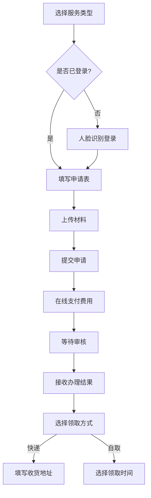

# 村民个人主页优化设计方案

## 一、设计概述

### 1.1 设计目标
创建一个**老年友好、信息清晰、功能便捷**的村民个人主页,满足不同年龄段村民的使用需求。

### 1.2 核心设计原则
- **老年友好**：大字模式、语音交互、简单操作
- **快速访问**：常用功能一键直达
- **层次清晰**：信息分组明确,视觉层次分明
- **乡土亲切**：符合乡村用户使用习惯的语言和视觉

---

## 二、页面布局设计

### 2.1 整体架构（三层结构）

```
┌─────────────────────────────────────────┐
│           顶部导航栏                      │
│    [头像] 欢迎,张三  [设置] [帮助]        │
└─────────────────────────────────────────┘

┌─────────────────────────────────────────┐
│         快捷功能卡片区 (Grid布局)         │
│  [一户一码] [我的证件] [办事大厅]        │
│  [补贴查询] [家庭档案] [医疗服务]        │
└─────────────────────────────────────────┘

┌─────────────────────┬───────────────────┐
│   个人信息卡片       │   待办事项卡片     │
│  ┌─────────┐        │  • 证明待领取      │
│  │  头像   │  姓名   │  • 补贴待申请      │
│  └─────────┘  年龄   │  • 体检待预约      │
│  [编辑资料] [大字模式]│  [查看全部→]      │
└─────────────────────┴───────────────────┘

┌─────────────────────────────────────────┐
│         服务大厅 (Tab切换)                │
│  [在线办事] [政策查询] [邻里互助]         │
└─────────────────────────────────────────┘

┌─────────────────────────────────────────┐
│         家庭信息                          │
│  家庭成员 | 一户一码 | 亲情账号           │
└─────────────────────────────────────────┘

┌─────────────────────────────────────────┐
│         健康档案                          │
│  体检记录 | 用药提醒 | 疫苗接种           │
└─────────────────────────────────────────┘
```

### 2.2 响应式布局断点

- **桌面端** (≥1024px)：三列布局
- **平板端** (768px-1023px)：两列布局
- **移动端** (<768px)：单列布局,底部导航

---

## 三、核心功能模块设计

### 3.1 快捷功能卡片区

#### 卡片列表
```javascript
const quickCards = [
  {
    id: 'qrcode',
    title: '一户一码',
    icon: 'QRCode',
    color: '#409eff',
    route: '/my-qrcode',
    description: '扫码查看家庭信息'
  },
  {
    id: 'documents',
    title: '我的证件',
    icon: 'Document',
    color: '#67c23a',
    route: '/my-documents',
    badge: '3' // 待领取数量
  },
  {
    id: 'services',
    title: '办事大厅',
    icon: 'Service',
    color: '#e6a23c',
    route: '/services'
  },
  {
    id: 'subsidy',
    title: '补贴查询',
    icon: 'Coin',
    color: '#f56c6c',
    route: '/subsidy',
    description: '本月可领 ¥320'
  },
  {
    id: 'family',
    title: '家庭档案',
    icon: 'Family',
    color: '#909399',
    route: '/family'
  },
  {
    id: 'medical',
    title: '医疗服务',
    icon: 'FirstAid',
    color: '#00bcd4',
    route: '/medical'
  }
]
```

#### 交互设计
- **点击**：跳转到对应功能页面
- **长按**：显示功能说明(移动端)
- **语音唤醒**：说出"打开[功能名]"直接进入

---

### 3.2 个人信息卡片优化

#### 当前问题
- 信息过于密集
- 缺少关键信息突出显示
- 操作入口不够明显

#### 优化方案

```vue
<el-card class="profile-card">
  <!-- 左侧头像区 -->
  <div class="avatar-section">
    <el-avatar :size="100" :src="profile.photo">
      <el-icon><User /></el-icon>
    </el-avatar>
    <el-button-group>
      <el-button size="small" icon="Camera">更换</el-button>
      <el-button size="small" icon="View">预览</el-button>
    </el-button-group>
  </div>

  <!-- 右侧信息区 -->
  <div class="info-section">
    <h2>{{ profile.name }}
      <el-tag v-if="profile.tags" size="small">
        {{ profile.tags[0] }}
      </el-tag>
    </h2>

    <!-- 关键信息突出显示 -->
    <div class="key-info">
      <div class="info-pill">
        <el-icon><Calendar /></el-icon>
        <span>{{ profile.age }}岁</span>
      </div>
      <div class="info-pill">
        <el-icon><Location /></el-icon>
        <span>{{ profile.village }}</span>
      </div>
      <div class="info-pill">
        <el-icon><Phone /></el-icon>
        <span>{{ profile.phone }}</span>
      </div>
    </div>

    <!-- 快速操作 -->
    <div class="quick-actions">
      <el-button type="primary" icon="Edit" @click="editProfile">
        编辑资料
      </el-button>
      <el-button icon="FontSize" @click="toggleLargeText">
        {{ isLargeText ? '正常' : '大字' }}模式
      </el-button>
      <el-button icon="Microphone" @click="voiceInput">
        语音输入
      </el-button>
    </div>
  </div>
</el-card>
```

---

### 3.3 在线办事模块

#### 功能分类

**1. 证件办理类**
- 身份证补办/换领
- 户口本办理
- 结婚证/离婚证
- 出生证明
- 死亡证明

**2. 福利申请类**
- 低保申请
- 残疾补贴
- 老年补贴
- 医疗救助
- 临时救助

**3. 证明开具类**
- 居住证明
- 收入证明
- 健康证明
- 无犯罪记录证明
- 其他证明

#### 交互流程



#### 表单设计原则
- **分步引导**：长表单拆分为多个步骤
- **智能填充**：自动填充已有信息
- **语音输入**：支持方言语音填写
- **拍照上传**：证件拍照自动OCR识别
- **进度提示**：显示当前步骤和剩余时间

---

### 3.4 一户一码功能

#### 功能特性

**1. 二维码展示**
- 家庭专属二维码
- 包含户主和成员信息
- 支持打印和分享

**2. 扫码功能**
- 扫码查看他人家庭信息(需授权)
- 扫码快速添加家庭成员
- 扫码签到村务活动

**3. 隐私设置**
- 三级隐私控制：
  - 公开：显示基本信息
  - 村民可见：显示详细信息
  - 仅家人可见：不对外展示

#### UI设计

```vue
<el-dialog v-model="showQRCode" title="一户一码" width="400px">
  <div class="qrcode-container">
    <vue-qrcode :value="familyQRCode" :size="250" />
    <p class="qrcode-tip">扫码查看我们家信息</p>

    <!-- 隐私设置 -->
    <el-divider>隐私设置</el-divider>
    <el-radio-group v-model="privacyLevel">
      <el-radio label="public">公开</el-radio>
      <el-radio label="village">村民可见</el-radio>
      <el-radio label="private">仅家人可见</el-radio>
    </el-radio-group>

    <!-- 操作按钮 -->
    <div class="qrcode-actions">
      <el-button icon="Download" @click="downloadQRCode">
        保存图片
      </el-button>
      <el-button icon="Printer" @click="printQRCode">
        打印张贴
      </el-button>
      <el-button icon="Share" @click="shareQRCode">
        分享家人
      </el-button>
    </div>
  </div>
</el-dialog>
```

---

### 3.5 待办事项提醒

#### 提醒类型

**1. 证件待领取**
- 显示证件名称
- 领取截止日期
- 一键导航到领取点
- 代领功能(需授权)

**2. 补贴待申请**
- 补贴类型和金额
- 申请截止日期
- 材料清单
- 一键申请

**3. 体检/疫苗接种**
- 预约时间
- 地点导航
- 注意事项
改约功能

#### UI设计

```vue
<el-card class="todo-card">
  <template #header>
    <div class="card-header">
      <span>待办事项</span>
      <el-badge :value="todoCount" class="badge" />
    </div>
  </template>

  <el-timeline>
    <el-timeline-item
      v-for="todo in todoList"
      :key="todo.id"
      :timestamp="todo.deadline"
      :color="getPriorityColor(todo.priority)"
    >
      <div class="todo-item">
        <el-icon :color="todo.typeIconColor">
          <component :is="todo.typeIcon" />
        </el-icon>
        <div class="todo-content">
          <h4>{{ todo.title }}</h4>
          <p>{{ todo.description }}</p>
          <div class="todo-actions">
            <el-button size="small" @click="handleTodo(todo)">
              立即处理
            </el-button>
            <el-button size="small" text @click="remindLater(todo)">
              稍后提醒
            </el-button>
          </div>
        </div>
      </div>
    </el-timeline-item>
  </el-timeline>
</el-card>
```

---

## 四、老年友好设计

### 4.1 大字模式

#### 实现方案

```javascript
// 响应式字体大小
const fontSizeMap = {
  normal: {
    base: '14px',
    title: '18px',
    large: '20px'
  },
  large: {
    base: '18px',   // 提升28.6%
    title: '24px',  // 提升33.3%
    large: '28px'   // 提升40%
  }
}

// CSS变量动态切换
:root {
  --font-size-base: var(--font-base, 14px);
  --font-size-title: var(--font-title, 18px);
  --font-size-large: var(--font-large, 20px);
}

// 大字模式类
.large-text-mode {
  --font-base: 18px;
  --font-title: 24px;
  --font-large: 28px;
}
```

#### 适配范围
- 所有文字内容
- 按钮和表单
- 卡片间距增加20%
- 触控区域最小44x44px

---

### 4.2 语音交互

#### 功能支持

**1. 语音输入**
- 方言识别(支持22种方言)
- 表单填写
- 搜索查询

**2. 语音朗读**
- 内容朗读(TTS)
- 方言播报
- 语速调节

**3. 语音唤醒**
- "打开[功能名]"
- "我要办[证件名]"
- "查询[补贴类型]"

#### 技术实现

```vue
<template>
  <el-button
    circle
    class="voice-btn"
    @click="startVoiceInput"
  >
    <el-icon><Microphone /></el-icon>
  </el-button>

  <!-- 语音识别状态提示 -->
  <el-dialog v-model="isListening" title="正在聆听..." width="300px">
    <div class="listening-state">
      <div class="wave-animation"></div>
      <p>请说出您要办理的业务</p>
      <p class="recognized-text">{{ recognizedText }}</p>
    </div>
  </el-dialog>
</template>

<script setup>
import { ref } from 'vue'
import { useSpeechRecognition } from '@/composables/useSpeech'

const { startListening, stopListening, recognizedText, isListening } = useSpeechRecognition()

const startVoiceInput = async () => {
  try {
    const result = await startListening({
      language: 'zh-CN', // 或方言: 'zh-cantonese', 'zh-hokkien'等
      continuous: false,
      interimResults: true
    })

    // 语音意图识别
    const intent = parseVoiceIntent(result)
    handleVoiceCommand(intent)
  } catch (error) {
    ElMessage.error('语音识别失败,请重试')
  }
}
</script>
```

---

### 4.3 操作简化

#### 设计原则

**1. 减少操作步骤**
- 一键完成常见操作
- 智能推荐下一步
- 批量处理功能

**2. 增加容错性**
- 操作前确认
- 支持撤销
- 误操作保护

**3. 提供帮助**
- 新手引导
- 操作提示
- 视频教程

#### 示例：补贴申请简化流程

```
原流程(7步)：
登录 → 找补贴 → 填表 → 上传材料 → 提交 → 审核 → 结果

优化后(3步)：
点击"补贴查询" → 选择补贴类型 → 确认提交
(系统自动填充、智能上传、自动审核)
```

---

## 五、视觉设计建议

### 5.1 色彩方案

#### 主色调
```css
/* 温暖亲切的乡土色调 */
--primary-color: #4CAF50;      /* 绿色 - 代表乡村生机 */
--secondary-color: #FF9800;    /* 橙色 - 温暖活力 */
--accent-color: #2196F3;       /* 蓝色 - 信任可靠 */
--success-color: #4CAF50;
--warning-color: #FF9800;
--danger-color: #F44336;
--info-color: #2196F3;

/* 中性色 */
--text-primary: #212121;
--text-secondary: #757575;
--text-disabled: #BDBDBD;
--bg-primary: #FFFFFF;
--bg-secondary: #F5F5F5;
--border-color: #E0E0E0;
```

#### 语义化色彩
- **健康**：绿色 (#4CAF50)
- **教育**：蓝色 (#2196F3)
- **福利**：橙色 (#FF9800)
- **紧急**：红色 (#F44336)
- **提示**：青色 (#00BCD4)

---

### 5.2 字体规范

```css
/* 字体栈 */
--font-family-base: "PingFang SC", "Microsoft YaHei", "Helvetica Neue", Arial, sans-serif;
--font-family-number: "DIN Alternate", "Roboto Mono", monospace;

/* 字号 */
--font-size-xs: 12px;    /* 辅助信息 */
--font-size-sm: 14px;    /* 正文 */
--font-size-base: 16px;  /* 标准 */
--font-size-lg: 18px;    /* 小标题 */
--font-size-xl: 20px;    /* 标题 */
--font-size-2xl: 24px;   /* 大标题 */

/* 字重 */
--font-weight-normal: 400;
--font-weight-medium: 500;
--font-weight-semibold: 600;
--font-weight-bold: 700;

/* 行高 */
--line-height-tight: 1.25;
--line-height-normal: 1.5;
--line-height-loose: 1.75;
```

---

### 5.3 间距系统

```css
/* 8px 基础间距单位 */
--spacing-xs: 4px;
--spacing-sm: 8px;
--spacing-md: 16px;
--spacing-lg: 24px;
--spacing-xl: 32px;
--spacing-2xl: 48px;

/* 组件内边距 */
--padding-card: 24px;
--padding-button: 12px 24px;
--padding-input: 10px 16px;
```

---

### 5.4 圆角和阴影

```css
/* 圆角 */
--border-radius-sm: 4px;
--border-radius-md: 8px;
--border-radius-lg: 12px;
--border-radius-full: 50%;

/* 阴影 */
--shadow-sm: 0 1px 2px rgba(0, 0, 0, 0.05);
--shadow-md: 0 4px 6px rgba(0, 0, 0, 0.07);
--shadow-lg: 0 10px 15px rgba(0, 0, 0, 0.1);
--shadow-xl: 0 20px 25px rgba(0, 0, 0, 0.15);
```

---

## 六、移动端适配方案

### 6.1 响应式断点

```scss
// 断点定义
$breakpoints: (
  'mobile': 0 767px,      // 手机
  'tablet': 768px 1023px, // 平板
  'desktop': 1024px,      // 桌面
  'wide': 1440px          // 大屏
);

// Mixin
@mixin respond-to($breakpoint) {
  @if map-has-key($breakpoints, $breakpoint) {
    @media (min-width: map-get($breakpoints, $breakpoint)) {
      @content;
    }
  }
}

// 使用
.container {
  padding: 16px;

  @include respond-to('tablet') {
    padding: 24px;
  }

  @include respond-to('desktop') {
    padding: 32px;
  }
}
```

---

### 6.2 移动端特殊优化

**1. 底部导航栏**

```vue
<template>
  <div class="mobile-layout">
    <!-- 内容区域 -->
    <div class="content">
      <router-view />
    </div>

    <!-- 底部导航 -->
    <van-tabbar v-model="activeTab" class="mobile-nav">
      <van-tabbar-item icon="home-o" to="/profile">首页</van-tabbar-item>
      <van-tabbar-item icon="apps-o" to="/services">服务</van-tabbar-item>
      <van-tabbar-item icon="chat-o" to="/community">社区</van-tabbar-item>
      <van-tabbar-item icon="user-o" to="/my">我的</van-tabbar-item>
    </van-tabbar>
  </div>
</template>
```

**2. 手势操作**
- 下拉刷新
- 上拉加载
- 左右滑动切换
- 长按显示菜单

**3. 性能优化**
- 图片懒加载
- 虚拟列表(长列表)
- 代码分割
- 离线缓存(PWA)

---

## 七、无障碍设计

### 7.1 WCAG 2.1 AA级标准

**1. 视觉**
- 色彩对比度 ≥ 4.5:1
- 文字可缩放200%
- 不依赖颜色传达信息

**2. 听觉**
- 提供字幕和文字稿
- 音频控制
- 闪光警告

**3. 认知**
- 一致导航
- 错误提示清晰
- 足够的操作时间

**4. 运动**
- 键盘可访问
- 无时间限制
- 避免闪烁内容

---

### 7.2 辅助技术支持

```html
<!-- ARIA标签 -->
<button
  aria-label="打开一户一码"
  aria-expanded="false"
  aria-controls="qrcode-dialog"
>
  <el-icon><QRCode /></el-icon>
  一户一码
</button>

<!-- 屏幕阅读器支持 -->
<div role="region" aria-label="个人信息">
  <h2>张三的个人档案</h2>
  <p>年龄: 65岁</p>
  <p>住址: XX村XX组</p>
</div>

<!-- 焦点管理 -->
<div
  tabindex="0"
  @keyup.enter="handleClick"
  @keyup.space="handleClick"
>
  可聚焦卡片
</div>
```

---

## 八、技术实现要点

### 8.1 组件架构

```javascript
// 页面组件结构
ResidentProfile/
├── index.vue                 // 主页面
├── components/
│   ├── ProfileCard.vue       // 个人信息卡片
│   ├── QuickActions.vue      // 快捷功能
│   ├── TodoList.vue          // 待办事项
│   ├── ServiceHall.vue       // 办事大厅
│   ├── FamilyCode.vue        // 一户一码
│   └── HealthRecord.vue      // 健康档案
├── composables/
│   ├── useProfile.js         // 个人信息Hook
│   ├── useVoiceInput.js      // 语音输入Hook
│   ├── useLargeText.js       // 大字模式Hook
│   └── useTodoList.js        // 待办事项Hook
└── utils/
    ├── privacy.js            // 隐私控制
    ├── voiceParser.js        // 语音解析
    └── accessibility.js      // 无障碍工具
```

---

### 8.2 状态管理

```javascript
// stores/residentProfile.js
import { defineStore } from 'pinia'
import { ref, computed } from 'vue'

export const useResidentProfileStore = defineStore('residentProfile', () => {
  // 状态
  const profile = ref(null)
  const todoList = ref([])
  const settings = ref({
    largeTextMode: false,
    voiceEnabled: true,
    language: 'zh-CN'
  })

  // 计算属性
  const hasTodo = computed(() => todoList.value.length > 0)
  const urgentTodos = computed(() =>
    todoList.value.filter(t => t.priority === 'urgent')
  )

  // 操作
  async function fetchProfile() {
    const res = await api.getMyProfile()
    profile.value = res.data
  }

  async function fetchTodos() {
    const res = await api.getTodoList()
    todoList.value = res.data
  }

  function toggleLargeText() {
    settings.value.largeTextMode = !settings.value.largeTextMode
    // 应用大字模式类
    document.body.classList.toggle('large-text-mode')
  }

  return {
    profile,
    todoList,
    settings,
    hasTodo,
    urgentTodos,
    fetchProfile,
    fetchTodos,
    toggleLargeText
  }
})
```

---

## 九、性能优化

### 9.1 加载优化

1. **首屏加载**
   - 路由懒加载
   - 组件异步加载
   - 图片懒加载
   - 骨架屏

2. **资源优化**
   - 代码分割
   - Tree Shaking
   - Gzip压缩
   - CDN加速

3. **缓存策略**
   - Service Worker
   - LocalStorage
   - IndexedDB
   - HTTP缓存

---

### 9.2 运行时优化

1. **虚拟滚动**
   - 长列表性能
   - 减少DOM节点

2. **防抖节流**
   - 搜索输入
   - 滚动事件
   - 窗口resize

3. **按需更新**
   - computed缓存
   - watch优化
   - 避免不必要的重渲染

---

## 十、实施计划

### 10.1 开发阶段

**Phase 1: 基础架构 (Week 1-2)**
- 页面框架搭建
- 路由配置
- 状态管理
- API对接

**Phase 2: 核心功能 (Week 3-4)**
- 个人信息卡片
- 快捷功能入口
- 在线办事模块
- 一户一码功能

**Phase 3: 特色功能 (Week 5-6)**
- 大字模式
- 语音交互
- 待办提醒
- 健康档案

**Phase 4: 优化测试 (Week 7-8)**
- 性能优化
- 兼容性测试
- 无障碍测试
- 用户测试

---

### 10.2 验收标准

**功能性**
- ✅ 所有核心功能正常运行
- ✅ API调用成功率100%
- ✅ 表单验证完整

**性能**
- ⚡ 首屏加载 < 2s
- ⚡ 页面切换 < 500ms
- ⚡ 图片加载 < 1s

**可访问性**
- ♿ WCAG 2.1 AA级
- ♿ 键盘完全可操作
- ♿ 屏幕阅读器兼容

**用户体验**
- 🎨 视觉一致性
- 📱 响应式完美
- 👴 老年用户友好

---

## 十一、设计交付物

1. **线框图** (Figma/Sketch)
2. **高保真原型** (交互式)
3. **设计规范** (组件库)
4. **切图资源** (SVG/PNG)
5. **设计说明文档**

---

## 附录：参考资料

- [WCAG 2.1 Guidelines](https://www.w3.org/WAI/WCAG21/quickref/)
- [Material Design Accessibility](https://material.io/design/usability/accessibility.html)
- [iOS Human Interface Guidelines](https://developer.apple.com/design/human-interface-guidelines/)
- [微信小程序设计指南](https://developers.weixin.qq.com/miniprogram/design/)
- [支付宝老年模式设计规范](https://www.alipay.com/

---

**设计版本**: v1.0
**最后更新**: 2025-01-05
**设计师**: Claude AI (UI/UX Designer Agent)
**审核状态**: 待用户确认
