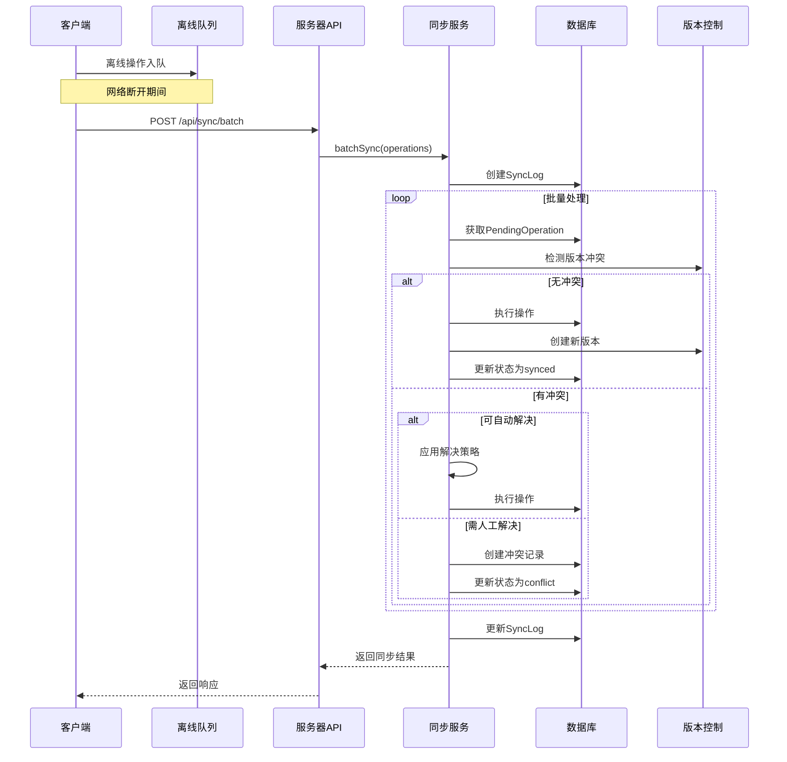

# 离线数据同步架构文档

## 项目概述

智慧乡村平台离线数据同步系统专为乡村弱网、断网场景设计，确保村民和村干部在离线状态下能够正常使用系统，并在网络恢复后自动同步数据。

### 核心特性

- **离线优先设计**：用户可在无网络环境下完成数据录入、表单提交等操作
- **智能冲突解决**：支持多种冲突检测和自动解决策略
- **版本控制**：类似Git的数据版本管理，支持回滚和历史追溯
- **批量同步优化**：针对弱网环境优化的批量传输机制
- **数据完整性保证**：事务一致性、幂等性保证、错误重试机制

## 架构设计

### 系统架构图

```
┌─────────────────────────────────────────────────────────────────┐
│                         客户端层                                 │
│  ┌──────────────┐  ┌──────────────┐  ┌──────────────┐          │
│  │  Vue3 前端   │  │ IndexedDB    │  │Service Worker│          │
│  │              │  │ 本地存储     │  │ 离线缓存     │          │
│  └──────────────┘  └──────────────┘  └──────────────┘          │
└─────────────────────────────────────────────────────────────────┘
                            ▼
┌─────────────────────────────────────────────────────────────────┐
│                         同步层                                   │
│  ┌──────────────────────────────────────────────────────────┐   │
│  │                 offlineService.js                        │   │
│  │  - 离线队列管理                                           │   │
│  │  - 数据冲突检测                                           │   │
│  │  - 自动重试机制                                           │   │
│  └──────────────────────────────────────────────────────────┘   │
└─────────────────────────────────────────────────────────────────┘
                            ▼
┌─────────────────────────────────────────────────────────────────┐
│                       API网关层                                  │
│  ┌──────────────────────────────────────────────────────────┐   │
│  │               Express.js 路由 (3001)                     │   │
│  │  POST /api/sync/batch                                     │   │
│  │  GET  /api/sync/status                                   │   │
│  │  GET  /api/sync/conflicts                                │   │
│  └──────────────────────────────────────────────────────────┘   │
└─────────────────────────────────────────────────────────────────┘
                            ▼
┌─────────────────────────────────────────────────────────────────┐
│                       服务层                                     │
│  ┌──────────────────────────────────────────────────────────┐   │
│  │                  syncService.js                          │   │
│  │  - 批量同步处理                                          │   │
│  │  - 冲突检测与解决                                        │   │
│  │  - 版本控制管理                                          │   │
│  │  - 数据校验与验证                                        │   │
│  └──────────────────────────────────────────────────────────┘   │
└─────────────────────────────────────────────────────────────────┘
                            ▼
┌─────────────────────────────────────────────────────────────────┐
│                       数据层                                     │
│  ┌──────────────┐  ┌──────────────┐  ┌──────────────┐          │
│  │PendingOperation│  │   SyncLog    │  │ DataVersion  │          │
│  │ 离线操作队列  │  │  同步日志    │  │  数据版本    │          │
│  └──────────────┘  └──────────────┘  └──────────────┘          │
│  ┌──────────────┐  ┌──────────────┐                           │
│  │DataConflict  │  │ MongoDB数据库 │                           │
│  │  冲突记录    │  │              │                           │
│  └──────────────┘  └──────────────┘                           │
└─────────────────────────────────────────────────────────────────┘
```

### 数据模型

#### 1. PendingOperation（离线操作队列）

存储客户端离线产生的操作，等待同步到服务器。

**关键字段：**
- `operationId`: 唯一操作标识（UUID）
- `operationType`: 操作类型（create/update/delete/batch_create/batch_update）
- `targetModel`: 目标数据模型
- `payload`: 操作数据（JSON序列化）
- `syncStatus`: 同步状态
- `clientVersion`: 客户端数据版本
- `priority`: 优先级（0-9）

**状态流转：**
```
pending → processing → synced
                  ↘ failed → pending (retry)
                  ↘ conflict → pending (resolved)
```

#### 2. SyncLog（同步日志）

记录每次同步会话的详细信息，用于审计和问题诊断。

**关键字段：**
- `syncSessionId`: 同步会话ID
- `syncType`: 同步类型（full/incremental/manual/auto）
- `statistics`: 同步统计（成功/失败/冲突数量）
- `timing`: 时间统计（开始/结束/持续时间）
- `operationDetails`: 每个操作的详细执行情况

#### 3. DataVersion（数据版本）

追踪数据变更历史，实现类似Git的版本控制。

**关键字段：**
- `targetModel/targetId`: 目标记录
- `version`: 版本号（递增）
- `changeType`: 变更类型
- `dataSnapshot`: 完整数据快照
- `changedFields`: 变更的字段（用于update）
- `parentVersionId`: 父版本ID

**版本链：**
```
Version 1 (create) → Version 2 (update) → Version 3 (update) → Version 4 (delete)
```

#### 4. DataConflict（冲突记录）

记录同步过程中的数据冲突及解决方案。

**关键字段：**
- `conflictType`: 冲突类型（version_mismatch/concurrent_update/delete_modify等）
- `clientData`: 客户端数据
- `serverData`: 服务器数据
- `resolution`: 解决方案（client_wins/server_wins/merge）

## 同步流程

### 1. 批量同步流程



### 2. 冲突检测流程

```
1. 版本检查
   ┌─────────────────────────────────────────┐
   │ 客户端版本 < 服务器最新版本?            │
   └─────────────────────────────────────────┘
                    │
          ┌─────────┴─────────┐
          │ Yes               │ No
          ▼                   ▼
   可能存在冲突          无版本冲突
          │
          ▼
┌─────────────────────────────────────────┐
│ 获取服务器最新数据快照                  │
└─────────────────────────────────────────┘
          │
          ▼
┌─────────────────────────────────────────┐
│ 比对字段变更                            │
│ - 客户端修改的字段                      │
│ - 服务器修改的字段                      │
└─────────────────────────────────────────┘
          │
    ┌─────┴─────┐
    │           │
    ▼           ▼
 有冲突字段   无冲突字段
    │           │
    ▼           ▼
┌───────┐  ┌──────────┐
│创建冲突│  │ 自动合并 │
│ 记录  │  │ 非冲突   │
└───────┘  │ 字段     │
           └──────────┘
```

### 3. 冲突解决策略

#### 3.1 服务器优先（server_wins）
- 适用场景：数据权威性要求高
- 策略：服务器数据覆盖客户端修改
- 优点：保证服务器数据完整性
- 缺点：客户端修改丢失

#### 3.2 客户端优先（client_wins）
- 适用场景：用户确认自己的修改是正确的
- 策略：客户端数据覆盖服务器
- 优点：保留用户最新操作
- 缺点：可能覆盖其他用户修改

#### 3.3 最新时间戳（latest_timestamp）
- 适用场景：以最后操作时间为准
- 策略：比较updatedAt，晚的覆盖早的
- 优点：基于时间，逻辑简单
- 缺点：可能丢失合法操作

#### 3.4 智能合并（merge）
- 适用场景：不同字段被不同用户修改
- 策略：合并非冲突字段
- 优点：最大化保留所有修改
- 缺点：复杂，可能产生不一致

**智能合并算法：**
```
对于每个字段：
  if 客户端修改 && 服务器未修改:
    使用客户端值
  else if 客户端未修改 && 服务器修改:
    使用服务器值
  else if 两者都修改:
    使用服务器值（服务器优先）
  else:
    保持原值
```

## API接口规范

### 批量同步

**端点：** `POST /api/sync/batch`

**请求体：**
```json
{
  "operations": [
    {
      "operationId": "uuid-1234",
      "operationType": "create",
      "targetModel": "Resident",
      "payload": {
        "name": "张三",
        "idCard": "123456789012345678",
        "phone": "13800138000"
      },
      "clientVersion": 1,
      "priority": 5,
      "deviceId": "device-001"
    }
  ],
  "villageId": "village-uuid",
  "deviceId": "device-001",
  "syncType": "manual"
}
```

**响应：**
```json
{
  "success": true,
  "data": {
    "syncSessionId": "sync_1234567890",
    "results": {
      "successful": [
        {
          "operationId": "uuid-1234",
          "targetId": "resident-uuid",
          "serverVersion": 2,
          "message": "创建成功"
        }
      ],
      "failed": [],
      "conflicts": []
    },
    "stats": {
      "total": 10,
      "successful": 8,
      "failed": 1,
      "conflicts": 1
    }
  }
}
```

### 获取同步状态

**端点：** `GET /api/sync/status/:userId/:deviceId`

**响应：**
```json
{
  "success": true,
  "data": {
    "pending": 15,
    "conflicts": 2,
    "failed": 1,
    "recentSyncs": [
      {
        "syncSessionId": "sync_xxx",
        "status": "completed",
        "statistics": {
          "totalOperations": 50,
          "successfulOperations": 48
        }
      }
    ]
  }
}
```

### 解决冲突

**端点：** `POST /api/sync/conflicts/:conflictId/resolve`

**请求体：**
```json
{
  "resolution": "client_wins",
  "note": "确认客户端数据正确"
}
```

**响应：**
```json
{
  "success": true,
  "data": {
    "conflictId": "conflict-xxx",
    "resolution": "client_wins",
    "status": "resolved"
  },
  "message": "冲突已解决"
}
```

### 版本回滚

**端点：** `POST /api/sync/versions/:targetModel/:targetId/rollback/:version`

**响应：**
```json
{
  "success": true,
  "data": {
    "targetId": "resident-xxx",
    "rolledBackTo": 3,
    "currentVersion": 4
  },
  "message": "已回滚到版本 3"
}
```

## 数据安全与完整性

### 1. 幂等性保证

每个操作都有唯一的`operationId`，服务器记录已同步的操作，避免重复执行。

```javascript
// 幂等性检查
const existingOp = await PendingOperation.operationExists(operation.operationId);
if (existingOp && existingOp.syncStatus === 'synced') {
  return { success: true, skipped: true };
}
```

### 2. 数据校验

- **客户端校验**：表单验证、数据格式检查
- **服务端校验**：Schema验证、业务规则检查
- **数据完整性**：事务保证、外键约束

### 3. 错误处理与重试

```javascript
// 错误分类
errors: [{
  code: 'VALIDATION_ERROR',      // 验证错误 - 不重试
  message: '身份证号格式错误',
  retryable: false
}, {
  code: 'NETWORK_ERROR',          // 网络错误 - 重试
  message: '连接超时',
  retryable: true
}]

// 重试策略
{
  maxAttempts: 5,
  backoffMultiplier: 2,
  initialDelay: 1000
}
```

### 4. 数据加密

敏感数据（身份证号、银行卡号）加密存储：
- 传输加密：HTTPS/TLS
- 存储加密：AES-256
- 字段级加密：敏感字段单独加密

## 性能优化

### 1. 批量处理

```javascript
// 配置
{
  batchSize: 50,           // 每批处理50条
  maxConcurrentBatches: 3  // 最多3批并发
}
```

### 2. 增量同步

只同步变更的数据：
- 时间戳过滤
- 版本号比对
- 变更字段追踪

### 3. 数据压缩

```javascript
// 启用响应压缩
app.use(compression({
  filter: (req, res) => {
    if (req.headers['x-no-compression']) {
      return false;
    }
    return compression.filter(req, res);
  },
  threshold: 1024 // 1KB以上才压缩
}));
```

### 4. 数据库索引

```javascript
// PendingOperation 索引
pendingOperationSchema.index({ userId: 1, syncStatus: 1, priority: -1 });
pendingOperationSchema.index({ operationId: 1 }, { unique: true });

// DataVersion 索引
dataVersionSchema.index({ targetModel: 1, targetId: 1, version: -1 });
```

## 弱网场景适配

### 1. 离线优先

```javascript
// 客户端策略
1. 优先使用本地数据
2. 离线操作记录到队列
3. 网络恢复自动同步
4. 同步失败保留本地数据
```

### 2. 断点续传

```javascript
// 大文件分块上传
{
  chunkSize: 256 * 1024,  // 256KB每块
  resumeSupport: true,
  chunkRetry: 3
}
```

### 3. 超时控制

```javascript
// 配置
{
  connectionTimeout: 10000,   // 10秒连接超时
  readTimeout: 30000,         // 30秒读取超时
  writeTimeout: 30000         // 30秒写入超时
}
```

### 4. 降级策略

```javascript
// 网络质量检测
if (networkQuality === 'poor') {
  // 降低图片质量
  imageQuality = 0.5;
  // 减小批量大小
  batchSize = 20;
  // 禁用非关键功能
  disableRealTimeUpdates();
}
```

## 监控与日志

### 1. 同步指标

```javascript
// 关键指标
{
  syncSuccessRate: 98.5,        // 同步成功率
  avgSyncDuration: 2500,        // 平均同步时长(ms)
  conflictRate: 2.3,            // 冲突率(%)
  dataSizePerSync: 1024000,     // 每次同步数据量(bytes)
  pendingQueueLength: 15        // 待同步队列长度
}
```

### 2. 日志记录

```javascript
// SyncLog 记录
{
  syncSessionId: "sync_xxx",
  statistics: {
    totalOperations: 100,
    successfulOperations: 95,
    failedOperations: 3,
    conflictOperations: 2
  },
  timing: {
    startTime: ISODate,
    endTime: ISODate,
    duration: 15000  // 15秒
  },
  errors: [...],
  warnings: [...]
}
```

### 3. 告警规则

```javascript
// 告警条件
if (syncFailureRate > 10%) {
  sendAlert('同步失败率过高');
}

if (pendingQueueLength > 1000) {
  sendAlert('待同步队列积压');
}

if (conflictRate > 5%) {
  sendAlert('冲突率异常');
}
```

## 部署建议

### 1. 服务器配置

```javascript
// 环境变量
NODE_ENV=production
MAX_SYNC_PAYLOAD_SIZE=10485760  // 10MB
SYNC_TIMEOUT=60000               // 60秒
BATCH_SIZE=50
MAX_CONCURRENT_SYNCS=10
```

### 2. 数据库配置

```javascript
// MongoDB 连接池
{
  poolSize: 20,
  minPoolSize: 5,
  maxIdleTimeMS: 60000,
  waitQueueTimeoutMS: 5000
}
```

### 3. 缓存配置

```javascript
// Redis 缓存
{
  host: 'localhost',
  port: 6379,
  ttl: 3600,        // 1小时
  maxSize: 1000000  // 1GB
}
```

## 故障处理

### 1. 常见问题

| 问题 | 原因 | 解决方案 |
|------|------|----------|
| 同步卡住 | 网络超时 | 增加超时时间，检查网络 |
| 冲突频繁 | 多设备同时编辑 | 实施字段级锁定 |
| 数据丢失 | 操作被覆盖 | 启用版本控制，可回滚 |
| 队列积压 | 同步速度慢 | 增加并发，批量优化 |

### 2. 恢复策略

```javascript
// 数据恢复流程
1. 检查SyncLog，找到失败同步
2. 查看DataVersion，获取历史版本
3. 回滚到冲突前的版本
4. 手动合并数据
5. 重新同步
```

## 最佳实践

### 1. 客户端

```javascript
// 1. 离线操作入队前验证
await validateData(payload);

// 2. 设置合理的优先级
priority = isEmergency ? 9 : 5;

// 3. 限制队列大小
if (queue.length > 100) {
  alert('待同步数据过多，请先同步');
}

// 4. 定期尝试同步
setInterval(() => {
  if (navigator.onLine) {
    syncQueue.process();
  }
}, 30000);  // 30秒
```

### 2. 服务端

```javascript
// 1. 批量操作使用事务
session = await mongoose.startSession();
await session.withTransaction(async () => {
  await Model.insertMany(docs, { session });
});

// 2. 异步处理长时操作
await syncJobQueue.add('batch-sync', { operations });

// 3. 定期清理旧数据
cron.schedule('0 0 * * *', async () => {
  await cleanupOldData({ days: 90 });
});
```

### 3. 监控

```javascript
// 1. 设置性能监控
const metrics = {
  syncDuration: histogram(),
  syncSuccess: counter(),
  conflictCount: gauge()
};

// 2. 定期检查健康状态
healthCheck: async () => {
  const pendingCount = await PendingOperation.countDocuments({ syncStatus: 'pending' });
  return {
    healthy: pendingCount < 1000,
    pendingCount
  };
}
```

## 未来优化方向

1. **增量同步**：基于时间戳的增量数据拉取
2. **P2P同步**：设备间直接数据交换（蓝牙、WiFi Direct）
3. **数据压缩**：更高效的压缩算法
4. **智能合并**：AI驱动的冲突解决
5. **边缘计算**：在本地设备处理部分数据

## 附录

### A. 权限定义

```javascript
// 同步相关权限
'sync:upload'      // 上传离线数据
'sync:view'        // 查看同步状态
'sync:resolve'     // 解决冲突
'sync:rollback'    // 版本回滚
'sync:retry'       // 重试失败操作
'sync:cancel'      // 取消同步
'sync:cleanup'     // 清理数据（管理员）
```

### B. 错误码

```javascript
const ErrorCodes = {
  SYNC_001: '网络连接失败',
  SYNC_002: '服务器响应超时',
  SYNC_003: '数据格式错误',
  SYNC_004: '版本冲突',
  SYNC_005: '权限不足',
  SYNC_006: '数据已存在',
  SYNC_007: '目标记录不存在',
  SYNC_008: '验证失败'
};
```

### C. 性能基准

```
批量同步（100条记录）：
- 网络良好（>1Mbps）: 3-5秒
- 网络一般（512Kbps-1Mbps）: 8-15秒
- 网络较差（<512Kbps）: 20-40秒

单条记录同步：
- 平均响应时间: 200-500ms
- 95分位响应时间: <1s
```

---

**文档版本**: 1.0.0
**最后更新**: 2025-12-29
**维护者**: Smart Village Team
