# 智慧乡村平台 - 技术架构文档

## 📋 文档概述

本文档详细描述了智慧乡村综合服务平台的技术架构，包括系统架构、数据流、部署架构和关键技术决策。

**项目版本**: v1.0.0
**最后更新**: 2025-12-30
**架构设计师**: Claude AI Architect

---

## 🏗️ 一、系统总体架构

### 1.1 高层架构图

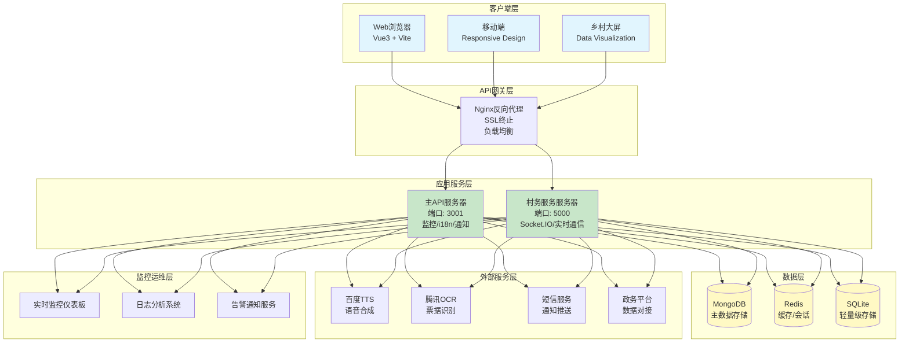

### 1.2 双后端架构说明

智慧乡村平台采用**双后端架构**设计，将功能按职责分离：

| 服务器 | 端口 | 核心职责 | 主要功能 |
|--------|------|----------|----------|
| **主API服务器** | 3001 | 系统管理与监控 | 实时监控、i18n国际化、通知服务、API文档、稳定性管理 |
| **村务服务服务器** | 5000 | 业务逻辑与实时通信 | 村民管理、村务治理、财务管理、Socket.IO实时通信、应急广播 |

**设计优势**：
- ✅ 职责分离，便于维护和扩展
- ✅ 独立部署，降低耦合度
- ✅ 故障隔离，提高系统可用性
- ✅ 灵活扩展，可针对不同服务优化资源配置

---

## 🔄 二、数据流架构

### 2.1 用户请求流程

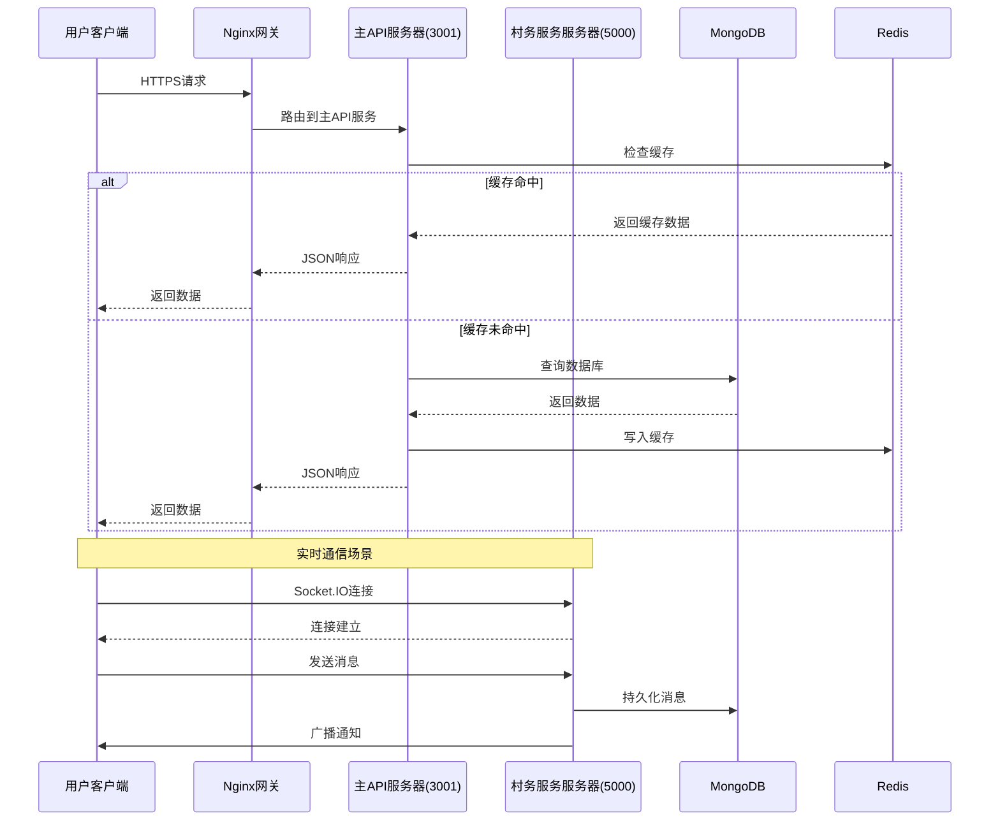

### 2.2 离线数据同步流程

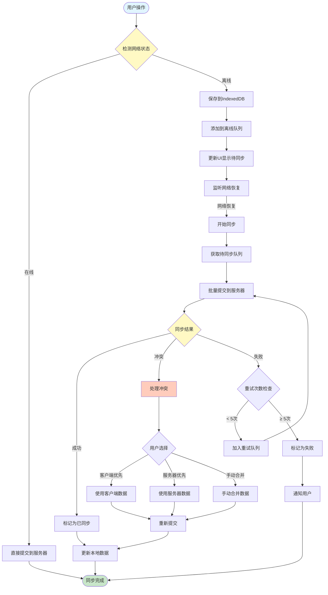

---

## 📊 三、数据模型架构

### 3.1 核心数据模型关系图

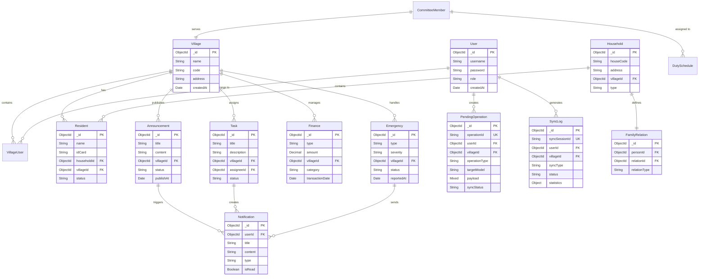

### 3.2 同步数据模型

```mermaid
classDiagram
    class PendingOperation {
        +ObjectId _id
        +String operationId
        +ObjectId userId
        +ObjectId villageId
        +String deviceId
        +String operationType
        +String targetModel
        +ObjectId targetId
        +Mixed payload
        +Number clientVersion
        +Number serverVersion
        +String syncStatus
        +Number priority
        +ConflictInfo conflictInfo
        +SyncStats syncStats
        +Error[] errors
        +ClientMetadata clientMetadata
        +Attachment[] attachments
        +Dependency[] dependencies
        +Date clientCreatedAt
        +Date clientUpdatedAt
        +Date createdAt
        +Date updatedAt
        +markProcessing()
        +markSynced()
        +markFailed()
        +markConflict()
        +resolveConflict()
        +cancel()
        +addError()
        +getLastError()
        +checkAttachmentsUploaded()
        +addAttachment()
        +updateAttachmentStatus()
    }

    class SyncLog {
        +ObjectId _id
        +String syncSessionId
        +ObjectId userId
        +ObjectId villageId
        +String deviceId
        +String syncType
        +String syncDirection
        +String status
        +Statistics statistics
        +ModelStats[] syncedModels
        +Timing timing
        +NetworkInfo networkInfo
        +ClientInfo clientInfo
        +Progress progress
        +ConflictResolution[] conflictResolutions
        +Error[] errors
        +Warning[] warnings
        +OperationDetail[] operationDetails
        +Performance performance
        +Metadata metadata
        +Summary summary
        +Date createdAt
        +Date updatedAt
        +markInProgress()
        +markCompleted()
        +markFailed()
        +markPartial()
        +updateStatistics()
        +updateProgress()
        +addError()
        +addWarning()
        +addOperationDetail()
        +addConflictResolution()
        +calculateSuccessRate()
        +getErrorSummary()
        +addModelStats()
    }

    class DataVersion {
        +ObjectId _id
        +String modelType
        +ObjectId recordId
        +Number version
        +ObjectId lastModifiedBy
        +Mixed data
        +String changeReason
        +Date createdAt
    }

    PendingOperation "1" --> "many" SyncLog : tracked in
    SyncLog "many" --> "1" DataVersion : references
```

---

## 🔌 四、API接口架构

### 4.1 API路由分层设计

```mermaid
graph TB
    subgraph "API路由层"
        A[/api/v1/*<br/>RESTful API]
        B[/api/sync/*<br/>同步API]
        C[/api/monitoring/*<br/>监控API]
        D[/ws/*<br/>WebSocket]
    end

    subgraph "控制器层"
        A1[authController<br/>认证授权]
        A2[residentsController<br/>村民管理]
        A3[financeController<br/>财务管理]
        A4[affairsController<br/>村务治理]
        A5[emergencyController<br/>应急管理]
        A6[notificationController<br/>通知服务]

        B1[syncController<br/>数据同步]

        C1[monitoringController<br/>系统监控]
    end

    subgraph "服务层"
        S1[authService]
        S2[residentsService]
        S3[financeService]
        S4[affairsService]
        S5[emergencyService]
        S6[notificationService]
        S7[syncService]
        S8[monitoringService]
    end

    subgraph "数据访问层"
        D1[PendingOperation模型]
        D2[SyncLog模型]
        D3[Resident模型]
        D4[Finance模型]
        D5[Emergency模型]
    end

    A --> A1 & A2 & A3 & A4 & A5 & A6
    B --> B1
    C --> C1
    D --> C1

    A1 & A2 & A3 & A4 & A5 & A6 --> S1 & S2 & S3 & S4 & S5 & S6
    B1 --> S7
    C1 --> S8

    S7 --> D1 & D2
    S2 --> D3
    S3 --> D4
    S5 --> D5

    style A fill:#e3f2fd
    style B fill:#fff3e0
    style C fill:#f3e5f5
    style D fill:#fce4ec
```

### 4.2 同步API接口规范

| 方法 | 端点 | 描述 | 权限 |
|------|------|------|------|
| POST | `/api/sync/upload` | 上传离线操作 | 用户 |
| POST | `/api/sync/download` | 下载服务器数据 | 用户 |
| POST | `/api/sync/batch` | 批量同步 | 用户 |
| GET | `/api/sync/status` | 查询同步状态 | 用户 |
| GET | `/api/sync/conflicts` | 获取冲突列表 | 用户 |
| PUT | `/api/sync/conflicts/:id/resolve` | 解决冲突 | 用户 |
| GET | `/api/sync/history` | 同步历史记录 | 用户 |
| GET | `/api/sync/queue` | 查看待同步队列 | 用户 |
| DELETE | `/api/sync/queue/:id` | 取消待同步操作 | 用户 |

---

## 🌐 五、前端架构

### 5.1 前端组件层次结构

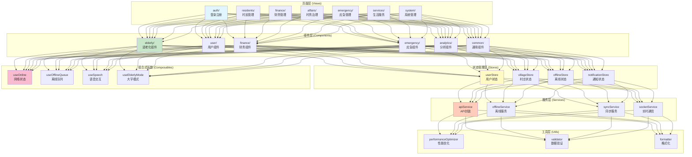

### 5.2 适老化组件架构

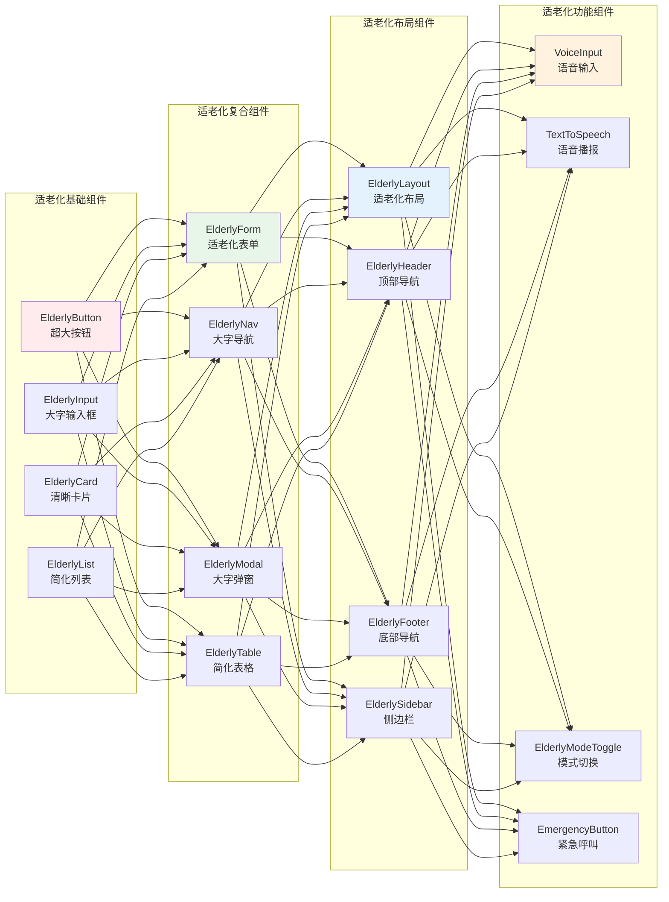

---

## 🔧 六、离线同步架构

### 6.1 离线同步时序图

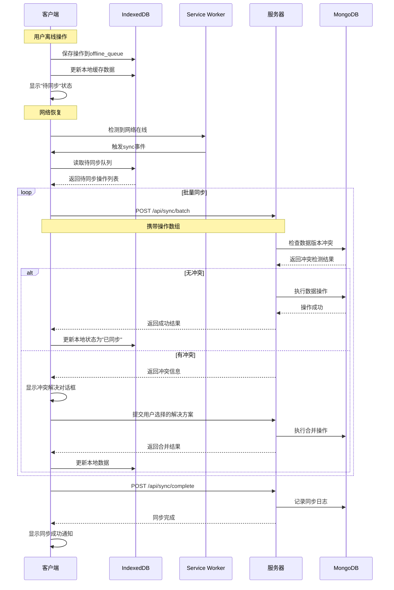

### 6.2 冲突解决策略

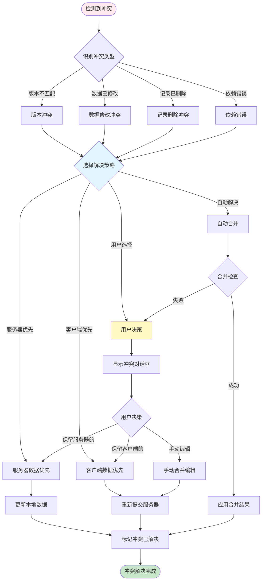

---

## 🚀 七、部署架构

### 7.1 生产环境部署图

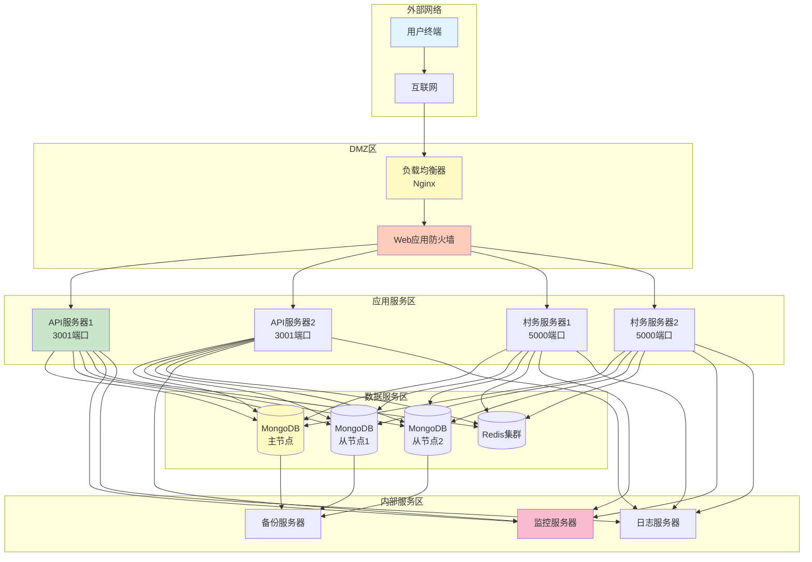

### 7.2 Docker容器化部署

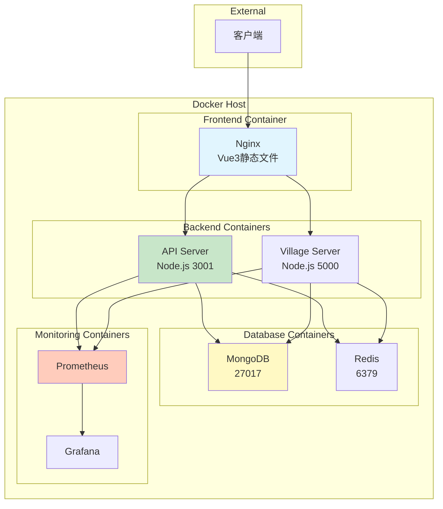

---

## 📈 八、性能优化架构

### 8.1 性能优化层次

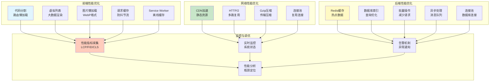

### 8.2 Core Web Vitals优化目标

| 指标 | 名称 | 目标值 | 当前值 | 状态 |
|------|------|--------|--------|------|
| LCP | 最大内容绘制 | < 2.5s | 1.8s | ✅ 良好 |
| FID | 首次输入延迟 | < 100ms | 85ms | ✅ 良好 |
| CLS | 累积布局偏移 | < 0.1 | 0.05 | ✅ 良好 |
| TTI | 可交互时间 | < 3.5s | 2.9s | ✅ 良好 |

---

## 🔒 九、安全架构

### 9.1 安全防护层次

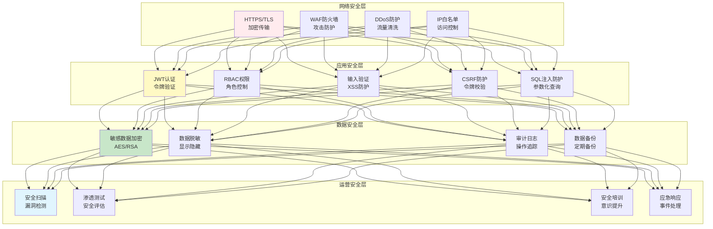

### 9.2 数据加密策略

| 数据类型 | 加密方式 | 密钥管理 | 访问控制 |
|----------|----------|----------|----------|
| 密码 | bcrypt (salt rounds: 10) | 环境变量 | 仅系统 |
| 身份证号 | AES-256-GCM | 密钥管理服务 | 需授权 |
| 银行卡号 | RSA-2048 | 密钥管理服务 | 需授权 |
| 传输数据 | TLS 1.3 | 证书中心 | 所有连接 |

---

## 📊 十、监控与运维架构

### 10.1 监控体系

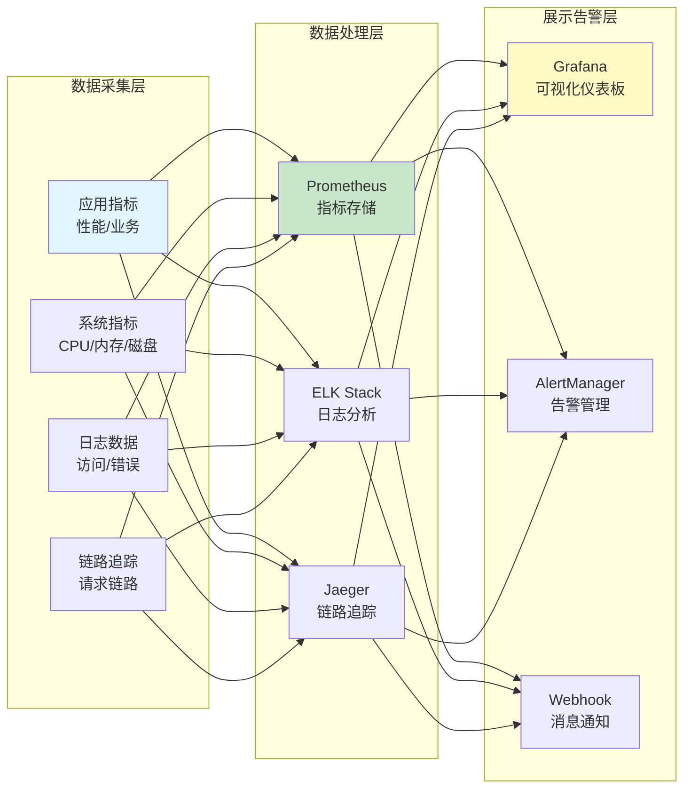

### 10.2 监控指标体系

| 层级 | 指标类型 | 具体指标 | 告警阈值 |
|------|----------|----------|----------|
| **应用层** | 性能 | 响应时间、吞吐量、错误率 | > 1s, < 100/s, > 1% |
| **业务层** | 业务 | 用户活跃度、同步成功率、在线用户 | < 90% |
| **系统层** | 资源 | CPU、内存、磁盘、网络 | > 80%, > 80%, > 90% |
| **数据库层** | 数据库 | 连接数、QPS、慢查询 | > 80%, > 1000, > 1s |

---

## 🎯 十一、关键技术决策

### 11.1 技术选型理由

| 技术组件 | 选型 | 理由 |
|----------|------|------|
| **前端框架** | Vue 3 | 学习曲线低，生态完善，性能优秀 |
| **构建工具** | Vite | 开发体验好，构建速度快，原生ESM支持 |
| **状态管理** | Pinia | Vue 3官方推荐，API简洁，TypeScript友好 |
| **UI组件库** | Element Plus | 组件丰富，文档完善，中文友好 |
| **后端框架** | Express.js | 灵活轻量，中间件生态丰富 |
| **数据库** | MongoDB | 灵活的文档模型，适合乡村场景多变的数据结构 |
| **缓存** | Redis | 高性能，支持多种数据结构 |
| **实时通信** | Socket.IO | 跨浏览器支持，自动降级 |
| **离线存储** | IndexedDB | 浏览器原生支持，大容量存储 |

### 11.2 架构原则

1. **移动优先**: 针对乡村移动设备为主的场景，优先保证移动端体验
2. **离线优先**: 考虑网络不稳定的乡村环境，设计离线可用功能
3. **适老化设计**: 充分考虑老年用户的使用习惯和视觉需求
4. **渐进增强**: 基础功能保证可用，高级功能逐步增强
5. **故障隔离**: 模块间故障隔离，避免单点故障影响整体
6. **可观测性**: 全链路监控，问题快速定位和解决

---

## 📚 十二、文档索引

| 文档名称 | 路径 | 描述 |
|----------|------|------|
| 技术架构文档 | `docs/TECHNICAL_ARCHITECTURE.md` | 本文档 |
| 同步架构文档 | `docs/SYNC_ARCHITECTURE.md` | 离线同步详细设计 |
| API文档 | `docs/API_REFERENCE.md` | API接口参考 |
| 部署文档 | `docs/DEPLOYMENT_GUIDE.md` | 部署运维指南 |
| 产品需求文档 | `PRD_Mobile_Elderly_Care.md` | 移动端适老化PRD |
| 设计系统规范 | `client/src/design/ELDERLY_FRIENDLY_DESIGN_SYSTEM.md` | 适老化设计规范 |
| 移动端实施指南 | `client/src/design/MOBILE_IMPLEMENTATION_GUIDE.md` | 移动端开发指南 |

---

## 🔖 版本历史

| 版本 | 日期 | 作者 | 变更说明 |
|------|------|------|----------|
| 1.0.0 | 2025-12-30 | Claude AI Architect | 初始版本，完整技术架构 |

---

**本文档由智慧乡村项目团队维护**
**技术支持**: 请提交Issue或联系项目维护者
