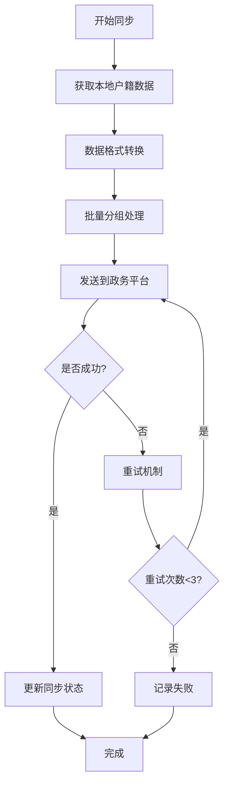
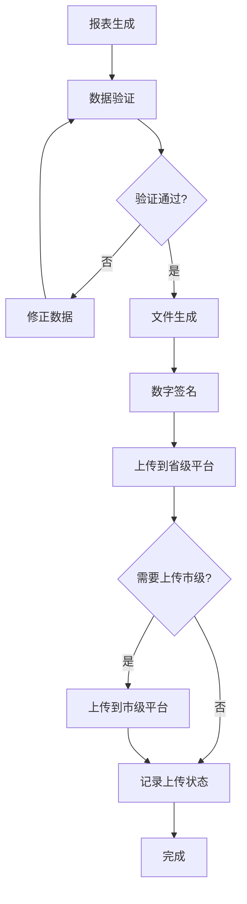

# 政务系统集成指南

## 📋 概述

政务系统集成模块为智慧村庄综合服务平台提供与省级和市级政务平台的连接能力，实现户籍数据同步、社保信息查询、统计报表上报和便民服务申请等功能。

## 🏗️ 系统架构

### 政务平台连接架构

```
┌─────────────────────────────────────────────────────────────┐
│                    智慧村庄平台                                │
│  ┌─────────────────┬─────────────────┬─────────────────┐     │
│  │   数据同步服务    │   便民服务模块    │   统计报表模块    │     │
│  │                 │                 │                 │     │
│  │ • 户籍数据同步   │ • 服务查询       │ • 报表生成       │     │
│  │ • 社保数据同步   │ • 在线申请       │ • 自动上报       │     │
│  │ • 实时状态监控   │ • 进度跟踪       │ • 历史记录       │     │
│  └─────────────────┴─────────────────┴─────────────────┘     │
└─────────────────────────────────────────────────────────────┘
                              │
                              ▼
┌─────────────────────────────────────────────────────────────┐
│                    政务平台接口层                             │
│  ┌─────────────────┬─────────────────┬─────────────────┐     │
│  │   省级政务平台    │   市级政务平台    │   县级政务平台    │     │
│  │                 │                 │                 │     │
│  │ • 户籍管理API   │ • 社保查询API    │ • 统计报表API    │     │
│  │ • 数据验证接口   │ • 待遇申领接口   │ • 政策通知API    │     │
│  │ • 安全认证体系   │ • 业务协同接口   │ • 监督审计API    │     │
│  └─────────────────┴─────────────────┴─────────────────┘     │
└─────────────────────────────────────────────────────────────┘
```

### 核心组件

1. **governmentIntegrationService.js** - 政务平台集成核心服务
2. **governmentIntegrationController.js** - 政务集成控制器
3. **governmentIntegration.js** - 路由配置
4. **数据模型** - 同步历史、申请记录、上传历史
5. **前端组件** - 政务集成管理界面

## 🔧 功能特性

### 1. 数据同步功能

#### 户籍数据同步
- ✅ **双向同步**: 本地 → 政务平台
- ✅ **批量处理**: 支持大批量数据同步
- ✅ **增量同步**: 只同步变更数据
- ✅ **数据验证**: 自动验证数据完整性
- ✅ **错误重试**: 失败自动重试机制
- ✅ **进度监控**: 实时同步进度展示

#### 社保数据同步
- ✅ **数据查询**: 从政务平台查询社保信息
- ✅ **自动更新**: 更新本地村民社保信息
- ✅ **信息对比**: 数据差异分析和处理
- ✅ **隐私保护**: 敏感信息脱敏处理

### 2. 统计报表功能

#### 报表生成
- ✅ **多类型报表**: 人口、经济、社会、农业等
- ✅ **自动计算**: 基于基础数据自动生成统计
- ✅ **模板支持**: 可配置报表模板
- ✅ **数据校验**: 自动校验报表数据完整性

#### 报表上报
- ✅ **多级上报**: 省、市、县三级平台
- ✅ **格式转换**: 支持JSON、XML、Excel格式
- ✅ **数字签名**: 报表数字签名确保完整性
- ✅ **状态跟踪**: 实时跟踪上报状态

### 3. 便民服务功能

#### 服务查询
- ✅ **分类查询**: 按服务类型、区域、关键词查询
- ✅ **服务详情**: 详细的服务信息和申请要求
- ✅ **智能推荐**: 基于用户需求推荐服务
- ✅ **政策解读**: 相关政策解读和指导

#### 在线申请
- ✅ **一键申请**: 简化申请流程
- ✅ **材料上传**: 支持多种格式材料上传
- ✅ **进度跟踪**: 实时查询申请进度
- ✅ **结果通知**: 申请结果自动通知

## 🚀 快速部署

### 环境要求

- **Node.js**: >= 18.0.0
- **MongoDB**: >= 4.4
- **网络**: 能够访问政务平台API

### 配置说明

#### 环境变量配置

```bash
# 政务平台配置
PROVINCIAL_PLATFORM_URL=https://api.province.gov.cn
PROVINCIAL_PLATFORM_APP_ID=your_provincial_app_id
PROVINCIAL_PLATFORM_APP_SECRET=your_provincial_app_secret

MUNICIPAL_PLATFORM_URL=https://api.city.gov.cn
MUNICIPAL_PLATFORM_APP_ID=your_municipal_app_id
MUNICIPAL_PLATFORM_APP_SECRET=your_municipal_app_secret

# 同步配置
AUTO_SYNC_ENABLED=true
SYNC_INTERVAL_HOURS=1
BATCH_SIZE=100
RETRY_ATTEMPTS=3

# 安全配置
DATA_ENCRYPTION_ENABLED=true
API_REQUEST_TIMEOUT=30000
```

#### 数据库表初始化

```bash
# 运行数据库初始化脚本
node scripts/init-government-db.js

# 创建必要的索引
node scripts/create-indexes.js
```

### 安装部署

```bash
# 1. 安装依赖
npm install

# 2. 配置环境变量
cp .env.example .env
# 编辑 .env 文件

# 3. 初始化数据库
npm run init-db

# 4. 启动服务
npm run dev

# 5. 访问政务集成界面
http://localhost:3001/government
```

## 📚 API文档

### 1. 连接状态检查

```http
GET /api/v1/government/connection-status
```

**响应示例：**
```json
{
  "success": true,
  "data": {
    "provincial": {
      "connected": true,
      "lastCheck": "2024-01-15T10:30:00Z",
      "error": null
    },
    "municipal": {
      "connected": true,
      "lastCheck": "2024-01-15T10:30:00Z",
      "error": null
    }
  }
}
```

### 2. 户籍数据同步

```http
POST /api/v1/government/sync/household
Content-Type: application/json

{
  "villageId": "507f1f77bcf86cd799439011",
  "options": {
    "batchSize": 100,
    "enableRetry": true
  }
}
```

**响应示例：**
```json
{
  "success": true,
  "data": {
    "villageId": "507f1f77bcf86cd799439011",
    "totalRecords": 1250,
    "processedRecords": 1248,
    "failedRecords": 2,
    "duration": 15420,
    "errors": [
      {
        "batch": 13,
        "error": "网络连接超时",
        "records": 100
      }
    ]
  }
}
```

### 3. 便民服务查询

```http
GET /api/v1/government/services/query?serviceType=social_security&keyword=养老保险&page=1&pageSize=20
```

**响应示例：**
```json
{
  "success": true,
  "data": {
    "services": [
      {
        "id": "service_001",
        "name": "城乡居民养老保险待遇申领",
        "type": "social_security",
        "category": "民生保障",
        "description": "为符合条件的城乡居民提供养老保险待遇申领服务",
        "requirements": ["年满60周岁", "累计缴费满15年"],
        "process": "在线申请 → 资格审核 → 待遇核定 → 发放待遇",
        "documents": ["身份证", "户口本", "社保卡"],
        "timeline": "30个工作日",
        "onlineApply": true
      }
    ],
    "total": 156,
    "page": 1,
    "pageSize": 20
  }
}
```

### 4. 在线服务申请

```http
POST /api/v1/government/services/apply
Content-Type: application/json

{
  "serviceId": "service_001",
  "applicantData": {
    "name": "张三",
    "idCard": "110101199001011234",
    "phone": "13800138000",
    "address": "北京市朝阳区某某街道",
    "villageId": "507f1f77bcf86cd799439011",
    "formData": {
      "birthDate": "1990-01-01",
      "gender": "男",
      "education": "高中"
    },
    "attachments": [
      {
        "fileName": "身份证.jpg",
        "fileUrl": "/uploads/attachments/id_001.jpg",
        "fileSize": 102400
      }
    ]
  }
}
```

**响应示例：**
```json
{
  "success": true,
  "data": {
    "applicationId": "APP202401150001",
    "status": "submitted",
    "expectedProcessingTime": "30个工作日"
  }
}
```

## 🎨 前端使用

### 1. 组件引入

```vue
<template>
  <div>
    <government-integration />
  </div>
</template>

<script setup>
import GovernmentIntegration from '@/views/government/GovernmentIntegration.vue'
</script>
```

### 2. 路由配置

```javascript
// router/index.js
{
  path: '/government',
  component: () => import('@/views/government/GovernmentIntegration.vue'),
  meta: {
    requiresAuth: true,
    requiresRole: ['admin', 'village_admin', 'government_liaison']
  }
}
```

### 3. 权限配置

```javascript
// 用户权限映射
const permissions = {
  'admin': ['all'], // 全部权限
  'village_admin': ['sync', 'reports', 'services'],
  'government_liaison': ['sync', 'reports', 'services'],
  'resident': ['services']
}
```

## 🔄 数据同步流程

### 户籍数据同步流程



### 统计报表上报流程



## 🔒 安全机制

### 1. API安全

- **数字签名**: 所有API请求都进行数字签名验证
- **时间戳**: 防止重放攻击
- **数据加密**: 敏感数据传输加密
- **访问控制**: 基于角色的权限控制

### 2. 数据安全

- **数据脱敏**: 敏感信息自动脱敏
- **传输加密**: HTTPS/TLS加密传输
- **存储加密**: 本地数据库加密存储
- **审计日志**: 完整的操作审计日志

### 3. 隐私保护

- **最小权限**: 只访问必要的数据
- **数据最小化**: 只同步必要字段
- **同意管理**: 用户数据使用同意管理
- **合规审计**: 符合GDPR等隐私法规

## 📊 监控指标

### 1. 连接状态监控

- **平台连通性**: 省级、市级平台连接状态
- **API响应时间**: 接口调用响应时间
- **错误率**: API调用失败率
- **可用性**: 服务可用性统计

### 2. 数据同步监控

- **同步成功率**: 数据同步成功率
- **数据量统计**: 同步数据量统计
- **处理时间**: 数据处理耗时
- **错误分布**: 错误类型分布

### 3. 服务使用监控

- **申请量统计**: 服务申请量统计
- **处理时长**: 服务处理时长
- **用户满意度**: 服务满意度评分
- **热门服务**: 热门服务排行

## 🛠️ 故障排除

### 常见问题

#### 1. 政务平台连接失败

**问题**: 无法连接到政务平台API

**解决方案**:
```bash
# 检查网络连通性
curl -I https://api.province.gov.cn

# 检查API密钥配置
echo $PROVINCIAL_PLATFORM_APP_ID
echo $PROVINCIAL_PLATFORM_APP_SECRET

# 检查签名算法
node scripts/test-signature.js
```

#### 2. 数据同步失败

**问题**: 数据同步过程中出现错误

**解决方案**:
```bash
# 检查数据格式
node scripts/validate-data.js

# 检查数据库连接
node scripts/test-db-connection.js

# 查看同步日志
tail -f logs/sync.log
```

#### 3. 报表生成错误

**问题**: 统计报表生成失败

**解决方案**:
```bash
# 检查数据完整性
node scripts/validate-report-data.js

# 重新生成报表
npm run generate-report -- --type=population --date=2024-01-01

# 检查报表模板
ls config/report-templates/
```

### 性能优化

#### 1. 数据库优化

```javascript
// 创建必要的索引
db.syncHistory.createIndex({ villageId: 1, syncType: 1, syncTime: -1 })
db.applicationHistory.createIndex({ applicantId: 1, applyTime: -1 })
db.uploadHistory.createIndex({ reportType: 1, status: 1, uploadTime: -1 })
```

#### 2. 缓存优化

```javascript
// Redis缓存配置
const cacheConfig = {
  userSession: { ttl: 3600 },      // 1小时
  serviceInfo: { ttl: 1800 },     // 30分钟
  syncStatus: { ttl: 300 },       // 5分钟
  platformStatus: { ttl: 600 }    // 10分钟
}
```

## 📈 扩展开发

### 1. 新增政务平台

```javascript
// config/platforms.js
const platforms = {
  county: {
    baseUrl: process.env.COUNTY_PLATFORM_URL,
    appId: process.env.COUNTY_PLATFORM_APP_ID,
    appSecret: process.env.COUNTY_PLATFORM_APP_SECRET,
    version: 'v1.0'
  }
}

// service中添加新的平台调用
async callCountyPlatform(endpoint, data) {
  return await this.makeRequest('countyPlatform', 'POST', endpoint, data);
}
```

### 2. 新增数据类型

```javascript
// 扩展数据映射
const dataMapping = {
  // 新增土地数据映射
  land: {
    id: 'landId',
    area: 'landArea',
    type: 'landType',
    ownership: 'ownership',
    usage: 'landUsage'
  }
}
```

### 3. 新增服务类型

```javascript
// 服务类型配置
const serviceTypes = [
  {
    code: 'environmental',
    name: '环保服务',
    description: '环保许可、污染举报等',
    icon: 'environmental',
    category: '环境保护'
  }
]
```

## 📞 技术支持

### 联系方式

- **技术支持**: tech-support@smartvillage.com
- **政务对接**: gov-integration@smartvillage.com
- **问题反馈**: https://github.com/smartvillage/issues

### 文档资源

- **API文档**: https://docs.smartvillage.com/government-api
- **开发指南**: https://docs.smartvillage.com/development-guide
- **部署手册**: https://docs.smartvillage.com/deployment-guide

### 版本更新

- **当前版本**: v1.0.0
- **更新日志**: CHANGELOG.md
- **升级指南**: UPGRADE.md

---

**注意事项：**

1. **数据安全**: 严格按照政务平台要求处理敏感数据
2. **合规要求**: 确保所有操作符合相关法律法规
3. **性能考虑**: 避免在高峰期进行大数据量同步
4. **监控告警**: 建立完善的监控和告警机制
5. **备份恢复**: 定期备份重要数据，确保数据安全