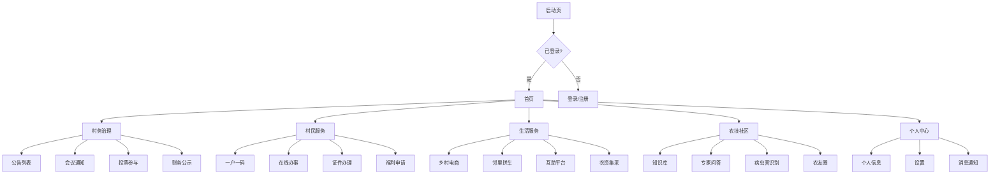

# 智慧乡村移动端 UI/UX 设计规范

## 一、设计概述

### 1.1 设计原则

智慧乡村移动端遵循以下核心设计原则：

| 原则 | 说明 | 应用场景 |
|------|------|----------|
| **简单直观** | 3步内完成核心操作，减少认知负担 | 老年用户操作、紧急功能 |
| **高对比度** | 确保视力不佳用户清晰可见 | 所有页面、文字内容 |
| **大触控区域** | 最小触控区域 44x44px，避免误触 | 按钮、链接、表单输入 |
| **语音优先** | 支持语音输入/输出，减少打字依赖 | 搜索、表单填写、内容浏览 |
| **容错机制** | 可撤销操作，二次确认关键操作 | 删除、提交、支付 |

### 1.2 目标用户特征

```
┌─────────────────────────────────────────────────────────┐
│  用户画像分析                                            │
├─────────────────────────────────────────────────────────┤
│  老年村民 (60%)                                          │
│  - 年龄: 60-75岁                                         │
│  - 数字技能: 低，不会拼音输入                             │
│  - 视力: 老花眼、白内障常见                               │
│  - 需求: 大字、语音、简化操作                             │
├─────────────────────────────────────────────────────────┤
│  中青年村民 (35%)                                        │
│  - 年龄: 30-59岁                                         │
│  - 数字技能: 中等，会用微信                              │
│  - 需求: 功能完整、信息全面                               │
├─────────────────────────────────────────────────────────┤
│  特殊群体 (5%)                                           │
│  - 视障、听障用户                                         │
│  - 需求: 读屏、震动反馈                                   │
└─────────────────────────────────────────────────────────┘
```

---

## 二、视觉设计系统

### 2.1 色彩规范

#### 主色系
```css
/* 乡村绿 - 代表生机与希望 */
--color-primary: #2F855A;        /* 主色 */
--color-primary-light: #38A169;  /* 浅色态 */
--color-primary-dark: #276749;   /* 深色态 */
--color-primary-bg: #F0FFF4;     /* 背景色 */

/* 功能色 */
--color-success: #48BB78;        /* 成功 */
--color-warning: #ECC94B;        /* 警告 */
--color-danger: #F56565;         /* 危险/删除 */
--color-info: #4299E1;           /* 信息 */
```

#### 中性色
```css
/* 文字颜色 - 符合 WCAG AA 标准 (对比度 >= 4.5:1) */
--color-text-primary: #1A202C;   /* 主要文字 */
--color-text-secondary: #4A5568; /* 次要文字 */
--color-text-tertiary: #718096;  /* 辅助文字 */
--color-text-disabled: #CBD5E0;  /* 禁用文字 */

/* 背景颜色 */
--color-bg-page: #FFFFFF;        /* 页面背景 */
--color-bg-card: #F7FAFC;        /* 卡片背景 */
--color-bg-hover: #EDF2F7;       /* 悬停背景 */
--color-bg-active: #E2E8F0;      /* 激活背景 */
```

#### 适老化高对比模式
```css
/* 高对比模式 - 对比度 >= 7:1 (WCAG AAA) */
--contrast-mode-primary: #000000;
--contrast-mode-bg: #FFFFFF;
--contrast-mode-accent: #E53E3E;
--contrast-mode-border: #000000;
```

### 2.2 字体系统

#### 字号规范（三种模式）

| 元素 | 标准版 | 大字版 | 超级大字 |
|------|--------|--------|----------|
| 页面标题 | 20px | 24px | 32px |
| 卡片标题 | 18px | 22px | 28px |
| 正文内容 | 16px | 18px | 24px |
| 辅助文字 | 14px | 16px | 20px |
| 按钮/标签 | 16px | 18px | 22px |
| 最小字号 | 12px | 14px | 16px |

#### 字重与行高
```css
/* 字重 */
--font-weight-normal: 400;   /* 正文 */
--font-weight-medium: 500;   /* 次级标题 */
--font-weight-semibold: 600; /* 强调 */
--font-weight-bold: 700;     /* 主标题 */

/* 行高 - 适老化调整 */
--line-height-tight: 1.4;    /* 标题 */
--line-height-normal: 1.6;   /* 正文 */
--line-height-relaxed: 1.8;  /* 长文 */
--line-height-loose: 2.0;    /* 超大字模式 */
```

#### 字体栈
```css
/* 基础字体栈 - 优先使用系统默认字体 */
--font-family-base: -apple-system, BlinkMacSystemFont, "Segoe UI",
                   "PingFang SC", "Hiragino Sans GB", "Microsoft YaHei",
                   "Helvetica Neue", Helvetica, Arial, sans-serif;

/* 等宽字体 - 用于数字、代码 */
--font-family-mono: "SF Mono", Monaco, Consolas,
                   "Liberation Mono", "Courier New", monospace;
```

### 2.3 间距与布局

#### 间距系统（8px 基准）
```css
--spacing-xs: 4px;     /* 0.25rem */
--spacing-sm: 8px;     /* 0.5rem */
--spacing-md: 16px;    /* 1rem */
--spacing-lg: 24px;    /* 1.5rem */
--spacing-xl: 32px;    /* 2rem */
--spacing-2xl: 48px;   /* 3rem */
--spacing-3xl: 64px;   /* 4rem */
```

#### 触控区域规范
```css
/* 最小触控尺寸 - 符合 WCAG 2.5.5 */
--touch-target-min: 44px;  /* iOS/Android 标准 */
--touch-target-comfortable: 48px;  /* 舒适触控 */
--touch-target-large: 56px;  /* 大字模式 */
```

#### 页面边距
```css
/* 标准版 */
--page-padding-x: 16px;
--page-padding-y: 20px;

/* 大字版 */
--page-padding-x-large: 20px;
--page-padding-y-large: 24px;

/* 超级大字版 */
--page-padding-x-xl: 24px;
--page-padding-y-xl: 32px;
```

### 2.4 圆角与阴影

#### 圆角规范
```css
--radius-sm: 4px;    /* 小圆角 - 标签、徽章 */
--radius-md: 8px;    /* 中圆角 - 按钮、输入框 */
--radius-lg: 12px;   /* 大圆角 - 卡片 */
--radius-xl: 16px;   /* 超大圆角 - 弹窗 */
--radius-full: 9999px;  /* 完整圆形 - 头像、徽章 */
```

#### 阴影规范
```css
/* 层级阴影 */
--shadow-sm: 0 1px 2px rgba(0, 0, 0, 0.05);
--shadow-md: 0 4px 6px rgba(0, 0, 0, 0.07);
--shadow-lg: 0 10px 15px rgba(0, 0, 0, 0.1);
--shadow-xl: 0 20px 25px rgba(0, 0, 0, 0.15);

/* 按钮按下反馈 */
--shadow-button-active: inset 0 2px 4px rgba(0, 0, 0, 0.1);
```

---

## 三、交互设计规范

### 3.1 导航设计

#### 底部主导航
```
┌──────────────────────────────────────────────────────┐
│                                                      │
│                     内容区域                          │
│                                                      │
├──────────────────────────────────────────────────────┤
│  🏣 村务   │  📋 服务   │  🌾 生活   │  👤 我的       │
│   18px     │   18px     │   18px    │   18px         │
│  (图标+文字) │  (图标+文字) │  (图标+文字) │  (图标+文字) │
└──────────────────────────────────────────────────────┘
```

**规范：**
- 4个主入口，对应核心功能模块
- 图标 + 文字标签，双重提示
- 激活态：绿色图标 + 深色文字
- 触控区域：高度 56px（大字模式 64px）

#### 顶部辅助导航
```css
/* 导航栏高度 */
--navbar-height-standard: 44px;
--navbar-height-large: 52px;
--navbar-height-xl: 60px;

/* 返回按钮尺寸 */
--navbar-back-btn: 44x44px;

/* 标题字号 */
--navbar-title-font: 18px (标准) / 22px (大字) / 26px (超大字)
```

### 3.2 语音交互设计

#### 语音输入入口

**位置 A：悬浮按钮（全局）**
```
┌─────────────────────────────────────┐
│                                     │
│                                     │
│                                     │
│                    ┌─────────┐     │
│                    │  🎤    │     │
│                    │ 语音输入 │     │
│                    └─────────┘     │
└─────────────────────────────────────┘
```

**位置 B：输入框内按钮（表单）**
```
┌─────────────────────────────────────┐
│  请输入或按住说话  [🎤]              │
└─────────────────────────────────────┘
```

#### 语音识别反馈

**状态 1：正在聆听**
```
┌─────────────────────────────────────┐
│         🎙️ 正在聆听...               │
│                                     │
│         ▂▃▅▇█▇▅▃▂                   │
│         音频波形动画                 │
└─────────────────────────────────────┘
```

**状态 2：识别中**
```
┌─────────────────────────────────────┐
│  "我想要查询社保缴纳情况"            │
│                                     │
│  ⏳ 正在识别...                     │
└─────────────────────────────────────┘
```

**状态 3：识别完成**
```
┌─────────────────────────────────────┐
│  "我想要查询社保缴纳情况"            │
│                                     │
│  ✅ 识别成功                        │
│  [查看结果] [重新输入]              │
└─────────────────────────────────────┘
```

### 3.3 适老化模式切换

#### 模式切换入口

**方式 A：个人中心设置**
```
个人中心 > 显示设置 > 字体大小
  ○ 标准版
  ● 大字版
  ○ 超级大字版
```

**方式 B：全局手势（三指上滑）**
```
在任何页面三指上滑 → 快速切换大字模式
```

#### 切换动画规范
```css
/* 平滑过渡，避免视觉突变 */
.elderly-mode-transition {
  transition: all 0.3s cubic-bezier(0.4, 0, 0.2, 1);
}
```

### 3.4 表单交互规范

#### 输入框设计

**标准版：**
```
┌─────────────────────────────────────┐
│  姓名                               │
│  ┌───────────────────────────────┐  │
│  │ 请输入您的姓名                  │  │
│  └───────────────────────────────┘  │
└─────────────────────────────────────┘
```

**大字版：**
```
┌─────────────────────────────────────────┐
│  姓名                                   │
│  ┌─────────────────────────────────┐    │
│  │ 请输入您的姓名                    │    │
│  │          [🎤] 语音输入           │    │
│  └─────────────────────────────────┘    │
└─────────────────────────────────────────┘
```

#### 表单验证反馈

**实时验证：**
- ✅ 输入框右侧绿色勾号（格式正确）
- ❌ 输入框下方红色提示（格式错误）

**提交验证：**
- 震动反馈 + 错误提示
- 自动定位到第一个错误字段

### 3.5 反馈机制

#### 操作反馈

| 操作类型 | 反馈方式 | 示例 |
|---------|---------|------|
| 按钮点击 | 视觉（按下态）+ 震动 | 轻触震动 10ms |
| 提交成功 | 提示框 + 成功音效 | "提交成功" |
| 提交失败 | 提示框 + 错误音效 | "提交失败，请重试" |
| 删除操作 | 二次确认弹窗 | "确定要删除吗？" |
| 加载中 | Loading 动画 + 进度文字 | "加载中 50%" |

#### 网络状态反馈

**离线状态指示器：**
```
┌────────────────────────────────────────┐
│  ⚠️  网络已断开，部分功能可能受影响      │
└────────────────────────────────────────┘
```

**数据同步提示：**
```
✅ 数据已同步 (3条离线操作)
```

---

## 四、页面原型设计

### 4.1 核心页面流程图



### 4.2 首页设计

#### 首页布局（大字模式）

```
┌────────────────────────────────────────┐
│  🏠 智慧乡村                    [🔔 3] │ 顶部导航
├────────────────────────────────────────┤
│                                        │
│  👋 李大妈，下午好                     │ 欢迎语
│  今天是 2024年12月30日                 │
│                                        │
├────────────────────────────────────────┤
│  📢 最新公告                           │ 快捷入口
│  ┌──────────────────────────────────┐ │
│  │ 关于2024年度村财务公示的通知        │ │
│  │ 2024-12-28  10:30                 │
│  └──────────────────────────────────┘ │
│                                        │
├────────────────────────────────────────┤
│  🔥 热门服务                           │
│  ┌──────┐  ┌──────┐  ┌──────┐         │
│  │ 📋   │  │ 🏥   │  │ 💰   │         │
│  │在线办事│  │医保  │  │补贴  │         │
│  └──────┘  └──────┘  └──────┘         │
│  ┌──────┐  ┌──────┐  ┌──────┐         │
│  │ 🎤   │  │ 🛒   │  │ 🚗   │         │
│  │语音助手│  │电商  │  │拼车  │         │
│  └──────┘  └──────┘  └──────┘         │
│                                        │
├────────────────────────────────────────┤
│  🌾 农技资讯                           │
│  ┌──────────────────────────────────┐ │
│  │ [图] 小麦病虫害防治要点             │
│  │ 春季小麦需重点防治蚜虫...           │
│  └──────────────────────────────────┘ │
│                                        │
├────────────────────────────────────────┤
│  🏣 村务  │  📋 服务  │  🌾 生活  │  👤 我的  │
└────────────────────────────────────────┘
```

### 4.3 村务治理页面

```
┌────────────────────────────────────────┐
│  < 返回    村务治理              [🔔]  │
├────────────────────────────────────────┤
│                                        │
│  ┌──────────────────────────────────┐ │
│  │ 📢 村务公告                      │ │
│  │    全村公告 128 条                │ │
│  └──────────────────────────────────┘ │
│                                        │
│  ┌──────────────────────────────────┐ │
│  │ 📅 会议通知                      │ │
│  │    即将召开 3 场                 │ │
│  └──────────────────────────────────┘ │
│                                        │
│  ┌──────────────────────────────────┐ │
│  │ 🗳️ 在线投票                      │ │
│  │    进行中 2 项                   │ │
│  └──────────────────────────────────┘ │
│                                        │
│  ┌──────────────────────────────────┐ │
│  │ 💰 财务公开                      │ │
│  │    本月收支公示                  │ │
│  └──────────────────────────────────┘ │
│                                        │
│  ┌──────────────────────────────────┐ │
│  │ 💬 村民议事                      │ │
│  │    大家在讨论 15 条新消息          │ │
│  └──────────────────────────────────┘ │
│                                        │
└────────────────────────────────────────┘
```

### 4.4 个人中心页面

```
┌────────────────────────────────────────┐
│  我的                                  │
├────────────────────────────────────────┤
│                                        │
│  ┌────┐  李大妈                      │
│  │头像│  138****1234                  │
│  └────┘  东村 第3组                   │
│                                        │
├────────────────────────────────────────┤
│  👤 个人信息                          │
│  🏠 我的家庭（一户一码）               │
│  📜 我的办事记录                       │
│  💼 我的积分 (126分)                   │
│                                        │
├────────────────────────────────────────┤
│  ⚙️ 显示设置                          │
│  🔔 通知设置                          │
│  🔒 隐私与安全                         │
│  🎤 语音设置                          │
│  ❓ 帮助中心                          │
│                                        │
├────────────────────────────────────────┤
│  [🚪 退出登录]                         │
│                                        │
├────────────────────────────────────────┤
│  🏣 村务  │  📋 服务  │  🌾 生活  │  👤 我的  │
└────────────────────────────────────────┘
```

### 4.5 适老化设置页面

```
┌────────────────────────────────────────┐
│  < 返回    显示设置                     │
├────────────────────────────────────────┤
│                                        │
│  字体大小                              │
│  ┌──────────────────────────────────┐ │
│  │  ○ 标准版                        │ │
│  │  ● 大字版                        │ │
│  │  ○ 超级大字版                    │ │
│  └──────────────────────────────────┘ │
│                                        │
│  高对比度                              │
│  ┌──────┐  ┌──────┐                   │
│  │ 关闭 │  │ 开启 │                   │
│  └──────┘  └──────┘                   │
│                                        │
│  语音朗读                              │
│  ┌──────┐  ┌──────┐                   │
│  │ 关闭 │  │ 开启 │                   │
│  └──────┘  └──────┘                   │
│                                        │
│  触觉反馈（震动）                       │
│  ┌──────┐  ┌──────┐                   │
│  │ 关闭 │  │ 开启 │                   │
│  └──────┘  └──────┘                   │
│                                        │
└────────────────────────────────────────┘
```

### 4.6 语音输入界面

```
┌────────────────────────────────────────┐
│  < 返回    语音助手                     │
├────────────────────────────────────────┤
│                                        │
│          🎤                             │
│         [按住说话]                      │
│                                        │
│  ━━━━━━━━━━━━━━━━━━━━━━━━━━━━━━      │
│         音量波形                        │
│                                        │
├────────────────────────────────────────┤
│  你可以说：                             │
│                                        │
│  • "我要查询社保"                       │
│  • "我要申请补贴"                       │
│  • "我要看村务公告"                     │
│  • "我要找农技专家"                     │
│                                        │
└────────────────────────────────────────┘
```

---

## 五、无障碍设计规范

### 5.1 WCAG 2.1 合规性

本项目符合 **WCAG 2.1 AA 级别** 标准，部分功能达到 AAA 级别。

#### 可感知性 (Perceivable)

| 准则 | 实现方式 | 验证方法 |
|------|---------|---------|
| 文字替代 | 所有图片添加 alt 属性 | 代码审查 |
| 时基媒体 | 视频提供字幕/文字稿 | 测试验证 |
| 适应性 | 支持横竖屏、不同分辨率 | 设备测试 |
| 可辨别性 | 对比度 >= 4.5:1 | 自动检测工具 |

#### 可操作性 (Operable)

| 准则 | 实现方式 | 验证方法 |
|------|---------|---------|
| 键盘可访问 | 所有功能支持键盘操作 | 键盘测试 |
| 充足时间 | 超时前提示并可延长 | 功能测试 |
| 癫痫预防 | 无闪烁内容（每秒<3次） | 设计审查 |
| 可导航性 | 清晰的页面结构和焦点指示 | 用户测试 |

#### 可理解性 (Understandable)

| 准则 | 实现方式 | 验证方法 |
|------|---------|---------|
| 可读性 | 简化语言、专业术语解释 | 专家评审 |
| 可预测性 | 一致的交互模式 | 用户测试 |
| 输入协助 | 表单验证、错误提示 | 功能测试 |

#### 健壮性 (Robust)

| 准则 | 实现方式 | 验证方法 |
|------|---------|---------|
| 兼容性 | 支持 AssistiveTouch、读屏软件 | 设备测试 |

### 5.2 读屏软件支持

#### ARIA 标签使用示例

```html
<!-- 导航栏 -->
<nav role="navigation" aria-label="主导航">
  <button aria-label="村务治理" aria-current="page">
    🏣 村务
  </button>
  <button aria-label="村民服务">
    📋 服务
  </button>
</nav>

<!-- 模态框 -->
<div role="dialog" aria-modal="true" aria-labelledby="dialog-title">
  <h2 id="dialog-title">确认删除</h2>
  <p>确定要删除这条记录吗？</p>
  <button aria-label="取消删除">取消</button>
  <button aria-label="确认删除">删除</button>
</div>

<!-- 加载状态 -->
<div role="status" aria-live="polite" aria-busy="true">
  正在加载...
</div>
```

### 5.3 震动反馈规范

```javascript
// 震动强度定义（Haptics API）
const HapticFeedback = {
  LIGHT: { duration: 10 },    // 轻触反馈
  MEDIUM: { duration: 20 },   // 确认反馈
  HEAVY: { duration: 30 },    // 警告反馈
  SUCCESS: [10, 50, 10],      // 成功模式
  ERROR: [20, 30, 20, 30, 40] // 错误模式
};
```

---

## 六、组件设计规范

### 6.1 按钮组件

#### 主要按钮
```css
/* 标准版 */
.btn-primary {
  min-height: 44px;
  padding: 12px 24px;
  font-size: 16px;
  border-radius: 8px;
}

/* 大字版 */
.btn-primary.large {
  min-height: 56px;
  padding: 16px 32px;
  font-size: 18px;
  border-radius: 12px;
}

/* 超级大字版 */
.btn-primary.xl {
  min-height: 64px;
  padding: 20px 40px;
  font-size: 22px;
  border-radius: 16px;
}
```

#### 次要按钮 / 文字按钮
```
标准版:  [取消]  确认
大字版:   [取消]    确认
超大字版:  [取消]     确认
```

### 6.2 卡片组件

```
┌──────────────────────────────────────┐
│  [图标]  标题                  >      │  卡片头部
├──────────────────────────────────────┤
│                                       │
│  内容区域...                          │  卡片内容
│                                       │
│  [次要按钮]  [主要按钮]               │  操作区域
└──────────────────────────────────────┘
```

### 6.3 列表组件

#### 标准列表项
```
┌────────────────────────────────────────┐
│  [图标]  标题文字               >      │
│          辅助说明文字                    │
└────────────────────────────────────────┘
```

#### 卡片列表项（大字模式）
```
┌────────────────────────────────────────┐
│  [大图标]                              │
│  标题文字（大字号）                     │
│  辅助说明文字                          │
│                            >           │
└────────────────────────────────────────┘
```

### 6.4 表单组件

#### 输入框
```
标准版:
┌────────────────────────────────────┐
│  🏷️  标签                          │
│  ┌────────────────────────────────┐ │
│  │  占位符文字              [🎤] │ │
│  └────────────────────────────────┘ │
│  💡 辅助说明文字                      │
└────────────────────────────────────┘

大字版:
┌────────────────────────────────────────┐
│  🏷️  标签（大字号）                     │
│  ┌──────────────────────────────────┐  │
│  │  占位符文字（大字号）      [🎤] │  │
│  └──────────────────────────────────┘  │
│  💡 辅助说明文字（大字号）               │
└────────────────────────────────────────┘
```

#### 开关组件
```
关闭态:  ○────────○
开启态:  ●────────○
```

#### 选择器
```
单选框:
○ 选项一
● 选项二
○ 选项三

多选框:
☑ 选项一
☐ 选项二
☑ 选项三
```

---

## 七、动画与过渡规范

### 7.1 动画时长

| 动画类型 | 标准版 | 大字版 | 说明 |
|---------|--------|--------|------|
| 微交互 | 200ms | 250ms | 按钮点击、状态切换 |
| 页面切换 | 300ms | 400ms | 路由跳转 |
| 弹窗 | 250ms | 300ms | 模态框显隐 |
| 列表加载 | 300ms | 350ms | 数据加载 |

### 7.2 缓动函数

```css
/* 标准缓动 - 适合大多数场景 */
--ease-standard: cubic-bezier(0.4, 0, 0.2, 1);

/* 减速缓动 - 进入动画 */
--ease-decelerate: cubic-bezier(0, 0, 0.2, 1);

/* 加速缓动 - 退出动画 */
--ease-accelerate: cubic-bezier(0.4, 0, 1, 1);

/* 弹跳缓动 - 强调效果（慎用） */
--ease-bounce: cubic-bezier(0.68, -0.55, 0.265, 1.55);
```

### 7.3 动画原则

1. **目的性**：每个动画都应有明确目的（引导、反馈、愉悦）
2. **适度性**：避免过度动画，避免分散注意力
3. **可中断**：复杂动画应可被用户操作中断
4. **性能优先**：优先使用 transform 和 opacity

---

## 八、响应式设计

### 8.1 断点定义

```css
/* 小屏手机 */
@media (max-width: 374px) { /* iPhone SE */ }

/* 标准手机 */
@media (375px <= width <= 428px) { /* iPhone 12/13/14 */ }

/* 大屏手机 */
@media (429px <= width <= 767px) { /* iPhone Pro Max */ }

/* 平板 */
@media (min-width: 768px) { /* iPad */ }
```

### 8.2 适配策略

- **字体大小**：使用 rem 单位，基准随断点调整
- **间距**：使用百分比或自适应间距
- **触控区域**：大屏设备增大触控区域
- **布局**：平板采用双栏布局

---

## 九、设计交付物

### 9.1 设计资源

| 资源类型 | 格式 | 用途 |
|---------|------|------|
| 设计稿 | Figma / Sketch | 视觉参考 |
| 图标 | SVG / PNG | 开发实现 |
| 切图 | @2x, @3x PNG | 多倍屏适配 |
| 样式规范 | CSS / SCSS | 样式代码 |
| 原型 | 可交互原型 | 演示验证 |

### 9.2 设计标注

- **尺寸标注**：px 单位，标注相对关系
- **颜色标注**：HEX + RGBA
- **字体标注**：字号、行高、字重
- **间距标注**：使用间距系统规范值
- **状态标注**：默认、悬停、激活、禁用态

---

## 十、设计验证清单

### 10.1 适老化验证

- [ ] 所有文字可读（对比度 >= 4.5:1）
- [ ] 触控区域 >= 44x44px
- [ ] 三种字体模式可正常切换
- [ ] 语音交互功能正常
- [ ] 操作可撤销或二次确认

### 10.2 无障碍验证

- [ ] 通过读屏软件测试
- [ ] 键盘可访问所有功能
- [ ] 焦点指示清晰
- [ ] 表单验证提示明确

### 10.3 性能验证

- [ ] 页面加载时间 < 2秒
- [ ] 动画流畅（60fps）
- [ ] 图片懒加载正常
- [ ] 离线功能可用

---

## 附录

### A. 设计工具推荐

- **协作设计**：Figma
- **原型工具**：Figma / ProtoPie
- **图标库**：iconfont / IconPark
- **色彩工具**：Coolors / Adobe Color
- **无障碍检测**：axe DevTools / WAVE

### B. 参考标准

- **WCAG 2.1**：Web Content Accessibility Guidelines
- **GB/T 37668-2019**：中国适老化设计标准
- **微信小程序无障碍指南**
- **iOS Human Interface Guidelines**
- **Material Design Accessibility**

### C. 设计评审流程

```
1. 设计师完成设计稿
2. 内部设计评审
3. 产品经理确认
4. 开发技术评审
5. 无障碍专家评审
6. 用户测试验证
7. 设计定稿交付
```

---

**文档版本**：v1.0
**最后更新**：2024-12-30
**维护者**：UX设计团队
